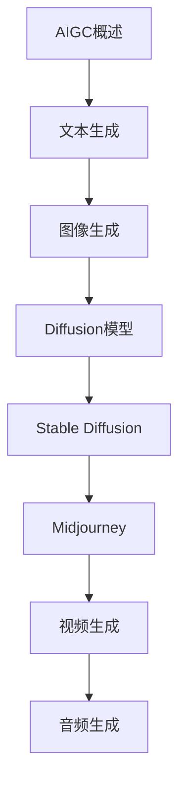

# AIGC 学习指南

> **分类**：AI与算法 ｜ **章节总数**：100 ｜ **技术栈**：AIGC

## 领域概述

AIGC是AI与算法领域的重要技术方向，本系列从基础到高级逐步深入，涵盖15个核心模块：AIGC概述、文本生成、图像生成、Diffusion模型、Stable Diffusion等。每个知识点作为独立章节，包含原理讲解、实现要点、常见陷阱和最佳实践，配合源码分析和架构图，帮助读者建立完整的AIGC知识体系。

本教程基于 **通用** 与 **AIGC** 生态编写，涵盖 行业标准工具链 等主流工具与框架。每章独立成篇，文字精炼、逻辑清晰，适合系统学习与按需查阅。

## 你将学到什么

完成本系列后，你将能够：

- 系统理解 **AIGC** 的核心概念与模块划分。
- 按难度递进掌握从入门到实战的完整知识路径。
- 在工程实践中做出合理的技术判断与问题排查。
- 通过章节索引快速定位所需知识点。

## 前置知识

- 编程基础
- 数据结构
- 计算机基础
- AI与算法基础概念

## 推荐学习路径

1. **AIGC概述**
2. **文本生成**
3. **图像生成**
4. **Diffusion模型**
5. **Stable Diffusion**
6. **Midjourney**
7. **视频生成**
8. **音频生成**

## 模块体系

本领域按以下模块组织，难度由浅入深：

- **AIGC概述**
- **文本生成**
- **图像生成**
- **Diffusion模型**
- **Stable Diffusion**
- **Midjourney**
- **视频生成**
- **音频生成**
- **3D生成**
- **多模态生成**
- **生成模型评估**
- **AIGC应用**
- **AIGC工具**
- **AIGC安全**
- **AIGC最佳实践**

## 难度分布

| 难度 | 章节数 | 占比 |
|------|--------|------|
| 入门 | 21 | 21% |
| 实战 | 18 | 18% |
| 进阶 | 28 | 28% |
| 高级 | 33 | 33% |

## 章节索引

点击章节标题进入对应教程：

### AIGC概述

- [AIGC概述核心概念与原理](chapters/001-AIGC概述核心概念与原理.md) ｜ 入门
- [AIGC概述的实现机制详解](chapters/002-AIGC概述的实现机制详解.md) ｜ 入门
- [AIGC概述的关键技术点](chapters/003-AIGC概述的关键技术点.md) ｜ 入门
- [AIGC概述的源码级分析](chapters/004-AIGC概述的源码级分析.md) ｜ 入门
- [AIGC概述的配置与使用](chapters/005-AIGC概述的配置与使用.md) ｜ 入门
- [AIGC概述的常见问题与解决方案](chapters/006-AIGC概述的常见问题与解决方案.md) ｜ 入门
- [AIGC概述的性能优化技巧](chapters/007-AIGC概述的性能优化技巧.md) ｜ 入门

### 文本生成

- [文本生成核心概念与原理](chapters/008-文本生成核心概念与原理.md) ｜ 入门
- [文本生成的实现机制详解](chapters/009-文本生成的实现机制详解.md) ｜ 入门
- [文本生成的关键技术点](chapters/010-文本生成的关键技术点.md) ｜ 入门
- [文本生成的源码级分析](chapters/011-文本生成的源码级分析.md) ｜ 入门
- [文本生成的配置与使用](chapters/012-文本生成的配置与使用.md) ｜ 入门
- [文本生成的常见问题与解决方案](chapters/013-文本生成的常见问题与解决方案.md) ｜ 入门
- [文本生成的性能优化技巧](chapters/014-文本生成的性能优化技巧.md) ｜ 入门

### 图像生成

- [图像生成核心概念与原理](chapters/015-图像生成核心概念与原理.md) ｜ 入门
- [图像生成的实现机制详解](chapters/016-图像生成的实现机制详解.md) ｜ 入门
- [图像生成的关键技术点](chapters/017-图像生成的关键技术点.md) ｜ 入门
- [图像生成的源码级分析](chapters/018-图像生成的源码级分析.md) ｜ 入门
- [图像生成的配置与使用](chapters/019-图像生成的配置与使用.md) ｜ 入门
- [图像生成的常见问题与解决方案](chapters/020-图像生成的常见问题与解决方案.md) ｜ 入门
- [图像生成的性能优化技巧](chapters/021-图像生成的性能优化技巧.md) ｜ 入门

### Diffusion模型

- [Diffusion模型核心概念与原理](chapters/022-Diffusion模型核心概念与原理.md) ｜ 进阶
- [Diffusion模型的实现机制详解](chapters/023-Diffusion模型的实现机制详解.md) ｜ 进阶
- [Diffusion模型的关键技术点](chapters/024-Diffusion模型的关键技术点.md) ｜ 进阶
- [Diffusion模型的源码级分析](chapters/025-Diffusion模型的源码级分析.md) ｜ 进阶
- [Diffusion模型的配置与使用](chapters/026-Diffusion模型的配置与使用.md) ｜ 进阶
- [Diffusion模型的常见问题与解决方案](chapters/027-Diffusion模型的常见问题与解决方案.md) ｜ 进阶
- [Diffusion模型的性能优化技巧](chapters/028-Diffusion模型的性能优化技巧.md) ｜ 进阶

### Stable Diffusion

- [Stable Diffusion核心概念与原理](chapters/029-Stable-Diffusion核心概念与原理.md) ｜ 进阶
- [Stable Diffusion的实现机制详解](chapters/030-Stable-Diffusion的实现机制详解.md) ｜ 进阶
- [Stable Diffusion的关键技术点](chapters/031-Stable-Diffusion的关键技术点.md) ｜ 进阶
- [Stable Diffusion的源码级分析](chapters/032-Stable-Diffusion的源码级分析.md) ｜ 进阶
- [Stable Diffusion的配置与使用](chapters/033-Stable-Diffusion的配置与使用.md) ｜ 进阶
- [Stable Diffusion的常见问题与解决方案](chapters/034-Stable-Diffusion的常见问题与解决方案.md) ｜ 进阶
- [Stable Diffusion的性能优化技巧](chapters/035-Stable-Diffusion的性能优化技巧.md) ｜ 进阶

### Midjourney

- [Midjourney核心概念与原理](chapters/036-Midjourney核心概念与原理.md) ｜ 进阶
- [Midjourney的实现机制详解](chapters/037-Midjourney的实现机制详解.md) ｜ 进阶
- [Midjourney的关键技术点](chapters/038-Midjourney的关键技术点.md) ｜ 进阶
- [Midjourney的源码级分析](chapters/039-Midjourney的源码级分析.md) ｜ 进阶
- [Midjourney的配置与使用](chapters/040-Midjourney的配置与使用.md) ｜ 进阶
- [Midjourney的常见问题与解决方案](chapters/041-Midjourney的常见问题与解决方案.md) ｜ 进阶
- [Midjourney的性能优化技巧](chapters/042-Midjourney的性能优化技巧.md) ｜ 进阶

### 视频生成

- [视频生成核心概念与原理](chapters/043-视频生成核心概念与原理.md) ｜ 进阶
- [视频生成的实现机制详解](chapters/044-视频生成的实现机制详解.md) ｜ 进阶
- [视频生成的关键技术点](chapters/045-视频生成的关键技术点.md) ｜ 进阶
- [视频生成的源码级分析](chapters/046-视频生成的源码级分析.md) ｜ 进阶
- [视频生成的配置与使用](chapters/047-视频生成的配置与使用.md) ｜ 进阶
- [视频生成的常见问题与解决方案](chapters/048-视频生成的常见问题与解决方案.md) ｜ 进阶
- [视频生成的性能优化技巧](chapters/049-视频生成的性能优化技巧.md) ｜ 进阶

### 音频生成

- [音频生成核心概念与原理](chapters/050-音频生成核心概念与原理.md) ｜ 高级
- [音频生成的实现机制详解](chapters/051-音频生成的实现机制详解.md) ｜ 高级
- [音频生成的关键技术点](chapters/052-音频生成的关键技术点.md) ｜ 高级
- [音频生成的源码级分析](chapters/053-音频生成的源码级分析.md) ｜ 高级
- [音频生成的配置与使用](chapters/054-音频生成的配置与使用.md) ｜ 高级
- [音频生成的常见问题与解决方案](chapters/055-音频生成的常见问题与解决方案.md) ｜ 高级
- [音频生成的性能优化技巧](chapters/056-音频生成的性能优化技巧.md) ｜ 高级

### 3D生成

- [3D生成核心概念与原理](chapters/057-3D生成核心概念与原理.md) ｜ 高级
- [3D生成的实现机制详解](chapters/058-3D生成的实现机制详解.md) ｜ 高级
- [3D生成的关键技术点](chapters/059-3D生成的关键技术点.md) ｜ 高级
- [3D生成的源码级分析](chapters/060-3D生成的源码级分析.md) ｜ 高级
- [3D生成的配置与使用](chapters/061-3D生成的配置与使用.md) ｜ 高级
- [3D生成的常见问题与解决方案](chapters/062-3D生成的常见问题与解决方案.md) ｜ 高级
- [3D生成的性能优化技巧](chapters/063-3D生成的性能优化技巧.md) ｜ 高级

### 多模态生成

- [多模态生成核心概念与原理](chapters/064-多模态生成核心概念与原理.md) ｜ 高级
- [多模态生成的实现机制详解](chapters/065-多模态生成的实现机制详解.md) ｜ 高级
- [多模态生成的关键技术点](chapters/066-多模态生成的关键技术点.md) ｜ 高级
- [多模态生成的源码级分析](chapters/067-多模态生成的源码级分析.md) ｜ 高级
- [多模态生成的配置与使用](chapters/068-多模态生成的配置与使用.md) ｜ 高级
- [多模态生成的常见问题与解决方案](chapters/069-多模态生成的常见问题与解决方案.md) ｜ 高级
- [多模态生成的性能优化技巧](chapters/070-多模态生成的性能优化技巧.md) ｜ 高级

### 生成模型评估

- [生成模型评估核心概念与原理](chapters/071-生成模型评估核心概念与原理.md) ｜ 高级
- [生成模型评估的实现机制详解](chapters/072-生成模型评估的实现机制详解.md) ｜ 高级
- [生成模型评估的关键技术点](chapters/073-生成模型评估的关键技术点.md) ｜ 高级
- [生成模型评估的源码级分析](chapters/074-生成模型评估的源码级分析.md) ｜ 高级
- [生成模型评估的配置与使用](chapters/075-生成模型评估的配置与使用.md) ｜ 高级
- [生成模型评估的常见问题与解决方案](chapters/076-生成模型评估的常见问题与解决方案.md) ｜ 高级

### AIGC应用

- [AIGC应用核心概念与原理](chapters/077-AIGC应用核心概念与原理.md) ｜ 高级
- [AIGC应用的实现机制详解](chapters/078-AIGC应用的实现机制详解.md) ｜ 高级
- [AIGC应用的关键技术点](chapters/079-AIGC应用的关键技术点.md) ｜ 高级
- [AIGC应用的源码级分析](chapters/080-AIGC应用的源码级分析.md) ｜ 高级
- [AIGC应用的配置与使用](chapters/081-AIGC应用的配置与使用.md) ｜ 高级
- [AIGC应用的常见问题与解决方案](chapters/082-AIGC应用的常见问题与解决方案.md) ｜ 高级

### AIGC工具

- [AIGC工具核心概念与原理](chapters/083-AIGC工具核心概念与原理.md) ｜ 实战
- [AIGC工具的实现机制详解](chapters/084-AIGC工具的实现机制详解.md) ｜ 实战
- [AIGC工具的关键技术点](chapters/085-AIGC工具的关键技术点.md) ｜ 实战
- [AIGC工具的源码级分析](chapters/086-AIGC工具的源码级分析.md) ｜ 实战
- [AIGC工具的配置与使用](chapters/087-AIGC工具的配置与使用.md) ｜ 实战
- [AIGC工具的常见问题与解决方案](chapters/088-AIGC工具的常见问题与解决方案.md) ｜ 实战

### AIGC安全

- [AIGC安全核心概念与原理](chapters/089-AIGC安全核心概念与原理.md) ｜ 实战
- [AIGC安全的实现机制详解](chapters/090-AIGC安全的实现机制详解.md) ｜ 实战
- [AIGC安全的关键技术点](chapters/091-AIGC安全的关键技术点.md) ｜ 实战
- [AIGC安全的源码级分析](chapters/092-AIGC安全的源码级分析.md) ｜ 实战
- [AIGC安全的配置与使用](chapters/093-AIGC安全的配置与使用.md) ｜ 实战
- [AIGC安全的常见问题与解决方案](chapters/094-AIGC安全的常见问题与解决方案.md) ｜ 实战

### AIGC最佳实践

- [AIGC最佳实践核心概念与原理](chapters/095-AIGC最佳实践核心概念与原理.md) ｜ 实战
- [AIGC最佳实践的实现机制详解](chapters/096-AIGC最佳实践的实现机制详解.md) ｜ 实战
- [AIGC最佳实践的关键技术点](chapters/097-AIGC最佳实践的关键技术点.md) ｜ 实战
- [AIGC最佳实践的源码级分析](chapters/098-AIGC最佳实践的源码级分析.md) ｜ 实战
- [AIGC最佳实践的配置与使用](chapters/099-AIGC最佳实践的配置与使用.md) ｜ 实战
- [AIGC最佳实践的常见问题与解决方案](chapters/100-AIGC最佳实践的常见问题与解决方案.md) ｜ 实战

## 学习方法建议

1. **先读概述再读章节**：用本指南建立全局地图，避免迷失在细节中。
2. **按模块递进**：同一模块内章节有前后关联，顺序阅读效果更好。
3. **主动复述**：每章读完后，用三五句话概括「是什么、为什么、怎么用」。
4. **关联阅读**：利用章节底部的「延伸学习」在同模块内构建知识网络。
5. **对照官方文档**：本教程提供结构化视角，细节以官方文档为准。

---
*领域: AIGC ｜ 版本: 2.0 ｜ 共 100 章*