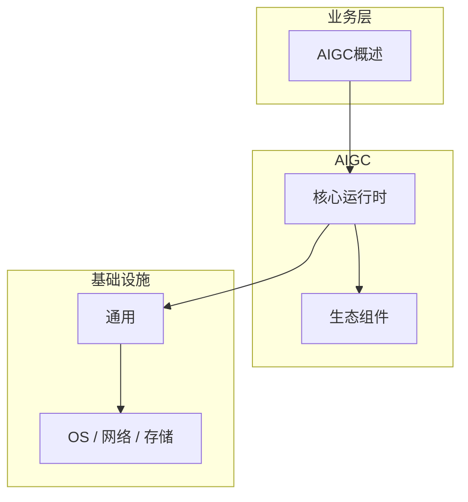

# AIGC概述的性能优化技巧

> **领域**：AIGC ｜ **模块**：AIGC概述 ｜ **难度**：入门 ｜ **类型**：性能优化

## 导读

本章系统讲解 **AIGC** 中 **AIGC概述** 的相关知识（性能优化）。本章从度量指标、瓶颈定位与优化手段三方面讲解 **AIGC概述** 的性能议题。内容基于主流框架与工程实践撰写，不依赖过时概念堆砌。

## 核心知识

**AIGC概述** 是 AIGC 领域的核心主题。AIGC 技术概览。本模块从原理与工程实践出发，帮助读者建立系统理解。

### 核心知识

**1. 范围**

文本/图像/视频/音频/3D 内容 AI 生成。

**2. 技术**

GPT、Diffusion、GAN、NeRF。

**3. 应用**

设计、营销、娱乐、教育。

## 架构与流程

## 技术详解

### 性能优化

选择模态 → 选模型 → 设计 Prompt/参数 → 生成 → 后处理。

## 原理与实现

### 工作机制

选择模态 → 选模型 → 设计 Prompt/参数 → 生成 → 后处理。

### 内部实现

AIGC概述 的底层实现依赖 AIGC 生态中的标准组件与协议，建议阅读官方规范文档。

## 操作流程与实践

### 操作流程

1. 理解 AIGC概述 概念 → 2. 学习标准用法 → 3. 动手实验 → 4. 分析案例 → 5. 总结最佳实践。

### 配置要点

配置 AIGC概述 时遵循官方推荐默认值，仅在理解影响后调整参数。

## 性能、安全与排查

### 性能优化

评估 AIGC概述 性能时建立基准测试，关注时间/空间复杂度或系统吞吐延迟指标。

### 安全注意

在 AIGC 场景下注意输入校验、权限控制与敏感数据保护。

### 调试排错

排查 AIGC概述 问题时，结合日志、监控与最小复现用例逐步定位根因。

## 案例与选型

### 案例复盘

在典型 AIGC 项目中，正确应用 AIGC概述 可显著提升系统质量与可维护性。

### 方案对比

选择 AIGC概述 方案时需对比多种替代方案的适用场景、性能与生态支持。

## 本章聚焦

针对 **AIGC概述**，性能工作应「先度量后优化」：明确 P50/P95/P99 与资源占用基线，用 profiler/trace 定位热点，优先处理 I/O、锁竞争与算法复杂度问题，避免无数据支撑的微调。

### 常见误区与纠正

**概念理解偏差**

对 AIGC概述 理解不全面导致误用，应回到官方文档重新梳理。

**忽视边界条件**

AIGC概述 在极端输入或高并发下行为可能不同，需充分测试。

**缺少监控**

未对 AIGC概述 关键指标监控，问题只能被动发现。

### 最佳实践

1. 遵循 AIGC 领域 AIGC概述 的官方推荐实践
2. 为 AIGC概述 相关功能编写自动化测试
3. 关键配置纳入版本管理与变更审计
4. 生产部署前在接近真实环境验证

## 巩固建议

建议结合 **AIGC** 官方文档与小型实验，亲手验证 **AIGC概述** 的默认行为与边界条件；将本章要点整理为检查清单或 ADR，便于评审与团队 onboarding。

### 本章小结

学完本章，你应能独立说明 **AIGC概述** 在 AIGC 中的角色，理解其核心机制，规避常见误区，并在项目中正确运用。

## 延伸学习

- AIGC概述核心概念与原理
- AIGC概述的实现机制详解
- AIGC概述的关键技术点
- AIGC概述的源码级分析
- AIGC概述的配置与使用

### 延伸阅读

- AIGC 官方文档 - AIGC概述
- OWASP / NIST 相关指南（如适用）
- 权威书籍与 RFC 标准文档

---
*章节 ID: 007 ｜ 领域: AIGC*