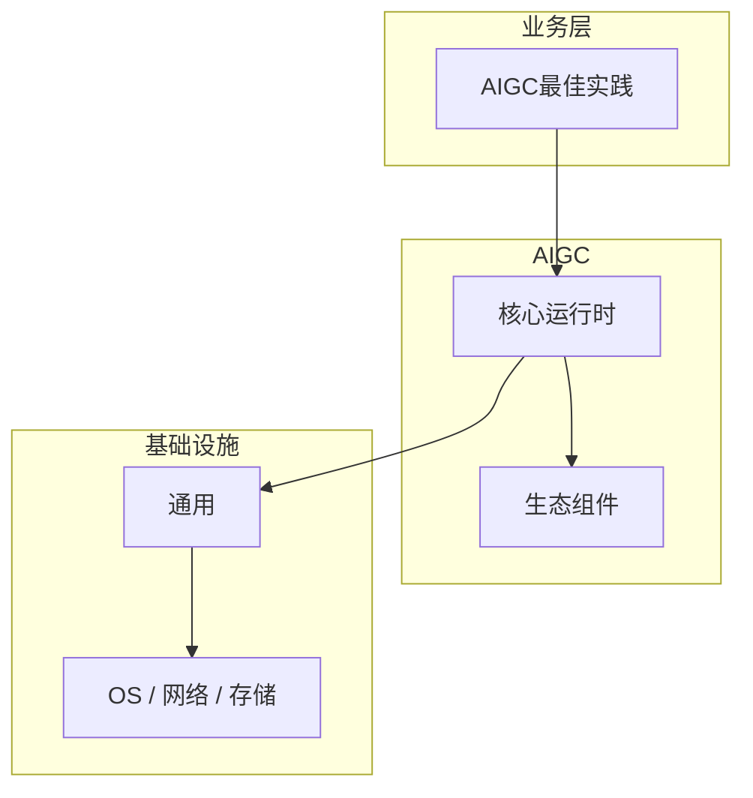

# AIGC最佳实践的配置与使用

> **领域**：AIGC ｜ **模块**：AIGC最佳实践 ｜ **难度**：实战 ｜ **类型**：配置实践

## 导读

本章系统讲解 **AIGC** 中 **AIGC最佳实践** 的相关知识（配置实践）。本章讲解 **AIGC最佳实践** 的配置项含义、环境差异与验证方法，强调可重复部署。内容基于主流框架与工程实践撰写，不依赖过时概念堆砌。

## 核心知识

**AIGC最佳实践** 是 AIGC 领域的核心主题。AIGC 最佳实践。本模块从原理与工程实践出发，帮助读者建立系统理解。

### 核心知识

**1. AIGC最佳实践的定义**

AIGC最佳实践 解决 AIGC 中特定场景的核心问题。AIGC最佳实践 是 AI 内容生成的关键技术。

**2. AIGC最佳实践的核心原理**

理解 AIGC最佳实践 的底层机制是正确应用的前提，需结合 AIGC 典型架构学习。

**3. 在AIGC中的位置**

AIGC最佳实践 与 AIGC 其他模块协作，形成完整的技术链路。

**4. 典型应用场景**

在 AIGC 实际项目中，AIGC最佳实践 常用于解决性能、可靠性或功能扩展问题。

## 架构与流程

## 技术详解

### 配置实践

AIGC最佳实践 的工作流程：输入 → 处理 → 输出，各阶段需关注正确性与安全性。

## 原理与实现

### 工作机制

AIGC最佳实践 的工作流程：输入 → 处理 → 输出，各阶段需关注正确性与安全性。

### 内部实现

AIGC最佳实践 的底层实现依赖 AIGC 生态中的标准组件与协议，建议阅读官方规范文档。

## 操作流程与实践

### 操作流程

1. 理解 AIGC最佳实践 概念 → 2. 学习标准用法 → 3. 动手实验 → 4. 分析案例 → 5. 总结最佳实践。

### 配置要点

配置 AIGC最佳实践 时遵循官方推荐默认值，仅在理解影响后调整参数。

## 性能、安全与排查

### 性能优化

评估 AIGC最佳实践 性能时建立基准测试，关注时间/空间复杂度或系统吞吐延迟指标。

### 安全注意

在 AIGC 场景下注意输入校验、权限控制与敏感数据保护。

### 调试排错

排查 AIGC最佳实践 问题时，结合日志、监控与最小复现用例逐步定位根因。

## 案例与选型

### 案例复盘

在典型 AIGC 项目中，正确应用 AIGC最佳实践 可显著提升系统质量与可维护性。

### 方案对比

选择 AIGC最佳实践 方案时需对比多种替代方案的适用场景、性能与生态支持。

## 本章聚焦

**AIGC最佳实践** 配置应外部化并分环境管理；关键项在文档中注明默认值、取值范围与生产推荐值，纳入 Code Review。

### 常见误区与纠正

**概念理解偏差**

对 AIGC最佳实践 理解不全面导致误用，应回到官方文档重新梳理。

**忽视边界条件**

AIGC最佳实践 在极端输入或高并发下行为可能不同，需充分测试。

**缺少监控**

未对 AIGC最佳实践 关键指标监控，问题只能被动发现。

### 最佳实践

1. 明确版权与合规边界
2. 人工审核关键输出
3. Prompt 工程提升质量
4. 建立品牌风格一致性
5. 关注内容安全与伦理

## 巩固建议

建议结合 **AIGC** 官方文档与小型实验，亲手验证 **AIGC最佳实践** 的默认行为与边界条件；将本章要点整理为检查清单或 ADR，便于评审与团队 onboarding。

### 本章小结

学完本章，你应能独立说明 **AIGC最佳实践** 在 AIGC 中的角色，理解其核心机制，规避常见误区，并在项目中正确运用。

## 延伸学习

- AIGC最佳实践核心概念与原理
- AIGC最佳实践的实现机制详解
- AIGC最佳实践的关键技术点
- AIGC最佳实践的源码级分析
- AIGC最佳实践的常见问题与解决方案

### 延伸阅读

- AIGC 官方文档 - AIGC最佳实践
- OWASP / NIST 相关指南（如适用）
- 权威书籍与 RFC 标准文档

---
*章节 ID: 099 ｜ 领域: AIGC*