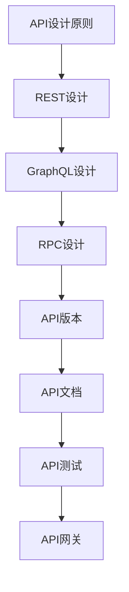

# API设计 学习指南

> **分类**：后端开发 ｜ **技术生态**：OpenAPI、GraphQL Schema、Buf、Kong、Apigee

## 领域定位

API 设计是内外部系统协作的契约工程，涵盖 REST、GraphQL、gRPC 等风格，以及版本、文档、测试与治理全生命周期。

强调一致性、错误模型、幂等性与开发者体验（DX），适用于平台团队与 API 产品经理。

本领域常用技术栈与工具包括：OpenAPI、GraphQL Schema、Buf、Kong、Apigee。

## 学习目标

- 能制定组织级 API 设计规范
- 能设计版本与弃用策略
- 能建立 Mock 与契约测试流水线
- 能评估网关与 API 市场方案

## 前置知识

- HTTP
- 至少一种 API 风格经验

## 学习路径

1. **API设计原则**
2. **REST设计**
3. **GraphQL设计**
4. **RPC设计**
5. **API版本**
6. **API文档**
7. **API测试**
8. **API网关**

## 模块体系

- **API设计原则**
- **REST设计**
- **GraphQL设计**
- **RPC设计**
- **API版本**
- **API文档**
- **API测试**
- **API网关**
- **API安全**
- **API性能**
- **API生命周期**
- **API治理**
- **API市场**
- **API设计模式**
- **API最佳实践**

## 难度分布

| 入门 | 18 | 22% |
| 实战 | 15 | 18% |
| 进阶 | 22 | 27% |
| 高级 | 25 | 31% |

## 章节索引

### API设计原则

- [API设计原则核心概念与原理](chapters/001-API设计原则核心概念与原理.md) ｜ 入门
- [API设计原则的实现机制详解](chapters/002-API设计原则的实现机制详解.md) ｜ 入门
- [API设计原则的关键技术点](chapters/003-API设计原则的关键技术点.md) ｜ 入门
- [API设计原则的源码级分析](chapters/004-API设计原则的源码级分析.md) ｜ 入门
- [API设计原则的配置与使用](chapters/005-API设计原则的配置与使用.md) ｜ 入门
- [API设计原则的常见问题与解决方案](chapters/006-API设计原则的常见问题与解决方案.md) ｜ 入门

### REST设计

- [REST设计核心概念与原理](chapters/007-REST设计核心概念与原理.md) ｜ 入门
- [REST设计的实现机制详解](chapters/008-REST设计的实现机制详解.md) ｜ 入门
- [REST设计的关键技术点](chapters/009-REST设计的关键技术点.md) ｜ 入门
- [REST设计的源码级分析](chapters/010-REST设计的源码级分析.md) ｜ 入门
- [REST设计的配置与使用](chapters/011-REST设计的配置与使用.md) ｜ 入门
- [REST设计的常见问题与解决方案](chapters/012-REST设计的常见问题与解决方案.md) ｜ 入门

### GraphQL设计

- [GraphQL设计核心概念与原理](chapters/013-GraphQL设计核心概念与原理.md) ｜ 入门
- [GraphQL设计的实现机制详解](chapters/014-GraphQL设计的实现机制详解.md) ｜ 入门
- [GraphQL设计的关键技术点](chapters/015-GraphQL设计的关键技术点.md) ｜ 入门
- [GraphQL设计的源码级分析](chapters/016-GraphQL设计的源码级分析.md) ｜ 入门
- [GraphQL设计的配置与使用](chapters/017-GraphQL设计的配置与使用.md) ｜ 入门
- [GraphQL设计的常见问题与解决方案](chapters/018-GraphQL设计的常见问题与解决方案.md) ｜ 入门

### RPC设计

- [RPC设计核心概念与原理](chapters/019-RPC设计核心概念与原理.md) ｜ 进阶
- [RPC设计的实现机制详解](chapters/020-RPC设计的实现机制详解.md) ｜ 进阶
- [RPC设计的关键技术点](chapters/021-RPC设计的关键技术点.md) ｜ 进阶
- [RPC设计的源码级分析](chapters/022-RPC设计的源码级分析.md) ｜ 进阶
- [RPC设计的配置与使用](chapters/023-RPC设计的配置与使用.md) ｜ 进阶
- [RPC设计的常见问题与解决方案](chapters/024-RPC设计的常见问题与解决方案.md) ｜ 进阶

### API版本

- [API版本核心概念与原理](chapters/025-API版本核心概念与原理.md) ｜ 进阶
- [API版本的实现机制详解](chapters/026-API版本的实现机制详解.md) ｜ 进阶
- [API版本的关键技术点](chapters/027-API版本的关键技术点.md) ｜ 进阶
- [API版本的源码级分析](chapters/028-API版本的源码级分析.md) ｜ 进阶
- [API版本的配置与使用](chapters/029-API版本的配置与使用.md) ｜ 进阶
- [API版本的常见问题与解决方案](chapters/030-API版本的常见问题与解决方案.md) ｜ 进阶

### API文档

- [API文档核心概念与原理](chapters/031-API文档核心概念与原理.md) ｜ 进阶
- [API文档的实现机制详解](chapters/032-API文档的实现机制详解.md) ｜ 进阶
- [API文档的关键技术点](chapters/033-API文档的关键技术点.md) ｜ 进阶
- [API文档的源码级分析](chapters/034-API文档的源码级分析.md) ｜ 进阶
- [API文档的配置与使用](chapters/035-API文档的配置与使用.md) ｜ 进阶

### API测试

- [API测试核心概念与原理](chapters/036-API测试核心概念与原理.md) ｜ 进阶
- [API测试的实现机制详解](chapters/037-API测试的实现机制详解.md) ｜ 进阶
- [API测试的关键技术点](chapters/038-API测试的关键技术点.md) ｜ 进阶
- [API测试的源码级分析](chapters/039-API测试的源码级分析.md) ｜ 进阶
- [API测试的配置与使用](chapters/040-API测试的配置与使用.md) ｜ 进阶

### API网关

- [API网关核心概念与原理](chapters/041-API网关核心概念与原理.md) ｜ 高级
- [API网关的实现机制详解](chapters/042-API网关的实现机制详解.md) ｜ 高级
- [API网关的关键技术点](chapters/043-API网关的关键技术点.md) ｜ 高级
- [API网关的源码级分析](chapters/044-API网关的源码级分析.md) ｜ 高级
- [API网关的配置与使用](chapters/045-API网关的配置与使用.md) ｜ 高级

### API安全

- [API安全核心概念与原理](chapters/046-API安全核心概念与原理.md) ｜ 高级
- [API安全的实现机制详解](chapters/047-API安全的实现机制详解.md) ｜ 高级
- [API安全的关键技术点](chapters/048-API安全的关键技术点.md) ｜ 高级
- [API安全的源码级分析](chapters/049-API安全的源码级分析.md) ｜ 高级
- [API安全的配置与使用](chapters/050-API安全的配置与使用.md) ｜ 高级

### API性能

- [API性能核心概念与原理](chapters/051-API性能核心概念与原理.md) ｜ 高级
- [API性能的实现机制详解](chapters/052-API性能的实现机制详解.md) ｜ 高级
- [API性能的关键技术点](chapters/053-API性能的关键技术点.md) ｜ 高级
- [API性能的源码级分析](chapters/054-API性能的源码级分析.md) ｜ 高级
- [API性能的配置与使用](chapters/055-API性能的配置与使用.md) ｜ 高级

### API生命周期

- [API生命周期核心概念与原理](chapters/056-API生命周期核心概念与原理.md) ｜ 高级
- [API生命周期的实现机制详解](chapters/057-API生命周期的实现机制详解.md) ｜ 高级
- [API生命周期的关键技术点](chapters/058-API生命周期的关键技术点.md) ｜ 高级
- [API生命周期的源码级分析](chapters/059-API生命周期的源码级分析.md) ｜ 高级
- [API生命周期的配置与使用](chapters/060-API生命周期的配置与使用.md) ｜ 高级

### API治理

- [API治理核心概念与原理](chapters/061-API治理核心概念与原理.md) ｜ 高级
- [API治理的实现机制详解](chapters/062-API治理的实现机制详解.md) ｜ 高级
- [API治理的关键技术点](chapters/063-API治理的关键技术点.md) ｜ 高级
- [API治理的源码级分析](chapters/064-API治理的源码级分析.md) ｜ 高级
- [API治理的配置与使用](chapters/065-API治理的配置与使用.md) ｜ 高级

### API市场

- [API市场核心概念与原理](chapters/066-API市场核心概念与原理.md) ｜ 实战
- [API市场的实现机制详解](chapters/067-API市场的实现机制详解.md) ｜ 实战
- [API市场的关键技术点](chapters/068-API市场的关键技术点.md) ｜ 实战
- [API市场的源码级分析](chapters/069-API市场的源码级分析.md) ｜ 实战
- [API市场的配置与使用](chapters/070-API市场的配置与使用.md) ｜ 实战

### API设计模式

- [API设计模式核心概念与原理](chapters/071-API设计模式核心概念与原理.md) ｜ 实战
- [API设计模式的实现机制详解](chapters/072-API设计模式的实现机制详解.md) ｜ 实战
- [API设计模式的关键技术点](chapters/073-API设计模式的关键技术点.md) ｜ 实战
- [API设计模式的源码级分析](chapters/074-API设计模式的源码级分析.md) ｜ 实战
- [API设计模式的配置与使用](chapters/075-API设计模式的配置与使用.md) ｜ 实战

### API最佳实践

- [API最佳实践核心概念与原理](chapters/076-API最佳实践核心概念与原理.md) ｜ 实战
- [API最佳实践的实现机制详解](chapters/077-API最佳实践的实现机制详解.md) ｜ 实战
- [API最佳实践的关键技术点](chapters/078-API最佳实践的关键技术点.md) ｜ 实战
- [API最佳实践的源码级分析](chapters/079-API最佳实践的源码级分析.md) ｜ 实战
- [API最佳实践的配置与使用](chapters/080-API最佳实践的配置与使用.md) ｜ 实战

---
*领域: API设计*