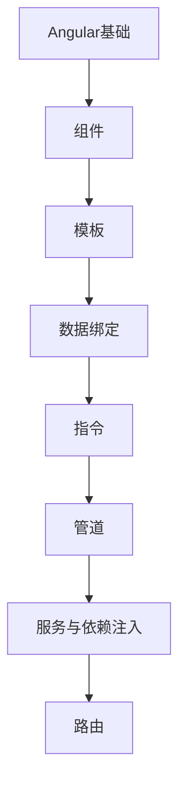

# Angular 学习指南

> **分类**：前端开发 ｜ **章节总数**：80 ｜ **技术栈**：Angular 17+

## 领域概述

Angular是前端开发领域的重要技术方向，本系列从基础到高级逐步深入，涵盖15个核心模块：Angular基础、组件、模板、数据绑定、指令等。每个知识点作为独立章节，包含原理讲解、实现要点、常见陷阱和最佳实践，配合源码分析和架构图，帮助读者建立完整的Angular知识体系。

本教程基于 **TypeScript** 与 **Angular 17+** 生态编写，涵盖 RxJS, NgRx 等主流工具与框架。每章独立成篇，文字精炼、逻辑清晰，适合系统学习与按需查阅。

## 你将学到什么

完成本系列后，你将能够：

- 系统理解 **Angular** 的核心概念与模块划分。
- 按难度递进掌握从入门到实战的完整知识路径。
- 在工程实践中做出合理的技术判断与问题排查。
- 通过章节索引快速定位所需知识点。

## 前置知识

- 编程基础
- 数据结构
- 计算机基础
- 前端开发基础概念

## 推荐学习路径

1. **Angular基础**
2. **组件**
3. **模板**
4. **数据绑定**
5. **指令**
6. **管道**
7. **服务与依赖注入**
8. **路由**

## 模块体系

本领域按以下模块组织，难度由浅入深：

- **Angular基础**
- **组件**
- **模板**
- **数据绑定**
- **指令**
- **管道**
- **服务与依赖注入**
- **路由**
- **表单**
- **HTTP客户端**
- **RxJS**
- **状态管理**
- **测试**
- **性能优化**
- **Angular最佳实践**

## 难度分布

| 难度 | 章节数 | 占比 |
|------|--------|------|
| 入门 | 18 | 22% |
| 实战 | 15 | 18% |
| 进阶 | 22 | 27% |
| 高级 | 25 | 31% |

## 章节索引

点击章节标题进入对应教程：

### Angular基础

- [Angular基础核心概念与原理](chapters/001-Angular基础核心概念与原理.md) ｜ 入门
- [Angular基础的实现机制详解](chapters/002-Angular基础的实现机制详解.md) ｜ 入门
- [Angular基础的关键技术点](chapters/003-Angular基础的关键技术点.md) ｜ 入门
- [Angular基础的源码级分析](chapters/004-Angular基础的源码级分析.md) ｜ 入门
- [Angular基础的配置与使用](chapters/005-Angular基础的配置与使用.md) ｜ 入门
- [Angular基础的常见问题与解决方案](chapters/006-Angular基础的常见问题与解决方案.md) ｜ 入门

### 组件

- [组件核心概念与原理](chapters/007-组件核心概念与原理.md) ｜ 入门
- [组件的实现机制详解](chapters/008-组件的实现机制详解.md) ｜ 入门
- [组件的关键技术点](chapters/009-组件的关键技术点.md) ｜ 入门
- [组件的源码级分析](chapters/010-组件的源码级分析.md) ｜ 入门
- [组件的配置与使用](chapters/011-组件的配置与使用.md) ｜ 入门
- [组件的常见问题与解决方案](chapters/012-组件的常见问题与解决方案.md) ｜ 入门

### 模板

- [模板核心概念与原理](chapters/013-模板核心概念与原理.md) ｜ 入门
- [模板的实现机制详解](chapters/014-模板的实现机制详解.md) ｜ 入门
- [模板的关键技术点](chapters/015-模板的关键技术点.md) ｜ 入门
- [模板的源码级分析](chapters/016-模板的源码级分析.md) ｜ 入门
- [模板的配置与使用](chapters/017-模板的配置与使用.md) ｜ 入门
- [模板的常见问题与解决方案](chapters/018-模板的常见问题与解决方案.md) ｜ 入门

### 数据绑定

- [数据绑定核心概念与原理](chapters/019-数据绑定核心概念与原理.md) ｜ 进阶
- [数据绑定的实现机制详解](chapters/020-数据绑定的实现机制详解.md) ｜ 进阶
- [数据绑定的关键技术点](chapters/021-数据绑定的关键技术点.md) ｜ 进阶
- [数据绑定的源码级分析](chapters/022-数据绑定的源码级分析.md) ｜ 进阶
- [数据绑定的配置与使用](chapters/023-数据绑定的配置与使用.md) ｜ 进阶
- [数据绑定的常见问题与解决方案](chapters/024-数据绑定的常见问题与解决方案.md) ｜ 进阶

### 指令

- [指令核心概念与原理](chapters/025-指令核心概念与原理.md) ｜ 进阶
- [指令的实现机制详解](chapters/026-指令的实现机制详解.md) ｜ 进阶
- [指令的关键技术点](chapters/027-指令的关键技术点.md) ｜ 进阶
- [指令的源码级分析](chapters/028-指令的源码级分析.md) ｜ 进阶
- [指令的配置与使用](chapters/029-指令的配置与使用.md) ｜ 进阶
- [指令的常见问题与解决方案](chapters/030-指令的常见问题与解决方案.md) ｜ 进阶

### 管道

- [管道核心概念与原理](chapters/031-管道核心概念与原理.md) ｜ 进阶
- [管道的实现机制详解](chapters/032-管道的实现机制详解.md) ｜ 进阶
- [管道的关键技术点](chapters/033-管道的关键技术点.md) ｜ 进阶
- [管道的源码级分析](chapters/034-管道的源码级分析.md) ｜ 进阶
- [管道的配置与使用](chapters/035-管道的配置与使用.md) ｜ 进阶

### 服务与依赖注入

- [服务与依赖注入核心概念与原理](chapters/036-服务与依赖注入核心概念与原理.md) ｜ 进阶
- [服务与依赖注入的实现机制详解](chapters/037-服务与依赖注入的实现机制详解.md) ｜ 进阶
- [服务与依赖注入的关键技术点](chapters/038-服务与依赖注入的关键技术点.md) ｜ 进阶
- [服务与依赖注入的源码级分析](chapters/039-服务与依赖注入的源码级分析.md) ｜ 进阶
- [服务与依赖注入的配置与使用](chapters/040-服务与依赖注入的配置与使用.md) ｜ 进阶

### 路由

- [路由核心概念与原理](chapters/041-路由核心概念与原理.md) ｜ 高级
- [路由的实现机制详解](chapters/042-路由的实现机制详解.md) ｜ 高级
- [路由的关键技术点](chapters/043-路由的关键技术点.md) ｜ 高级
- [路由的源码级分析](chapters/044-路由的源码级分析.md) ｜ 高级
- [路由的配置与使用](chapters/045-路由的配置与使用.md) ｜ 高级

### 表单

- [表单核心概念与原理](chapters/046-表单核心概念与原理.md) ｜ 高级
- [表单的实现机制详解](chapters/047-表单的实现机制详解.md) ｜ 高级
- [表单的关键技术点](chapters/048-表单的关键技术点.md) ｜ 高级
- [表单的源码级分析](chapters/049-表单的源码级分析.md) ｜ 高级
- [表单的配置与使用](chapters/050-表单的配置与使用.md) ｜ 高级

### HTTP客户端

- [HTTP客户端核心概念与原理](chapters/051-HTTP客户端核心概念与原理.md) ｜ 高级
- [HTTP客户端的实现机制详解](chapters/052-HTTP客户端的实现机制详解.md) ｜ 高级
- [HTTP客户端的关键技术点](chapters/053-HTTP客户端的关键技术点.md) ｜ 高级
- [HTTP客户端的源码级分析](chapters/054-HTTP客户端的源码级分析.md) ｜ 高级
- [HTTP客户端的配置与使用](chapters/055-HTTP客户端的配置与使用.md) ｜ 高级

### RxJS

- [RxJS核心概念与原理](chapters/056-RxJS核心概念与原理.md) ｜ 高级
- [RxJS的实现机制详解](chapters/057-RxJS的实现机制详解.md) ｜ 高级
- [RxJS的关键技术点](chapters/058-RxJS的关键技术点.md) ｜ 高级
- [RxJS的源码级分析](chapters/059-RxJS的源码级分析.md) ｜ 高级
- [RxJS的配置与使用](chapters/060-RxJS的配置与使用.md) ｜ 高级

### 状态管理

- [状态管理核心概念与原理](chapters/061-状态管理核心概念与原理.md) ｜ 高级
- [状态管理的实现机制详解](chapters/062-状态管理的实现机制详解.md) ｜ 高级
- [状态管理的关键技术点](chapters/063-状态管理的关键技术点.md) ｜ 高级
- [状态管理的源码级分析](chapters/064-状态管理的源码级分析.md) ｜ 高级
- [状态管理的配置与使用](chapters/065-状态管理的配置与使用.md) ｜ 高级

### 测试

- [测试核心概念与原理](chapters/066-测试核心概念与原理.md) ｜ 实战
- [测试的实现机制详解](chapters/067-测试的实现机制详解.md) ｜ 实战
- [测试的关键技术点](chapters/068-测试的关键技术点.md) ｜ 实战
- [测试的源码级分析](chapters/069-测试的源码级分析.md) ｜ 实战
- [测试的配置与使用](chapters/070-测试的配置与使用.md) ｜ 实战

### 性能优化

- [性能优化核心概念与原理](chapters/071-性能优化核心概念与原理.md) ｜ 实战
- [性能优化的实现机制详解](chapters/072-性能优化的实现机制详解.md) ｜ 实战
- [性能优化的关键技术点](chapters/073-性能优化的关键技术点.md) ｜ 实战
- [性能优化的源码级分析](chapters/074-性能优化的源码级分析.md) ｜ 实战
- [性能优化的配置与使用](chapters/075-性能优化的配置与使用.md) ｜ 实战

### Angular最佳实践

- [Angular最佳实践核心概念与原理](chapters/076-Angular最佳实践核心概念与原理.md) ｜ 实战
- [Angular最佳实践的实现机制详解](chapters/077-Angular最佳实践的实现机制详解.md) ｜ 实战
- [Angular最佳实践的关键技术点](chapters/078-Angular最佳实践的关键技术点.md) ｜ 实战
- [Angular最佳实践的源码级分析](chapters/079-Angular最佳实践的源码级分析.md) ｜ 实战
- [Angular最佳实践的配置与使用](chapters/080-Angular最佳实践的配置与使用.md) ｜ 实战

## 学习方法建议

1. **先读概述再读章节**：用本指南建立全局地图，避免迷失在细节中。
2. **按模块递进**：同一模块内章节有前后关联，顺序阅读效果更好。
3. **主动复述**：每章读完后，用三五句话概括「是什么、为什么、怎么用」。
4. **关联阅读**：利用章节底部的「延伸学习」在同模块内构建知识网络。
5. **对照官方文档**：本教程提供结构化视角，细节以官方文档为准。

---
*领域: Angular ｜ 版本: 2.0 ｜ 共 80 章*