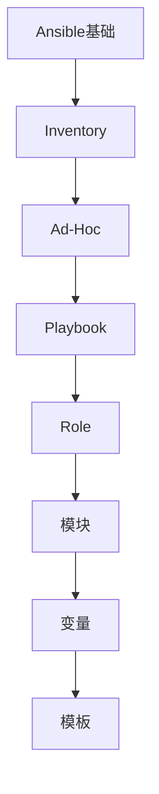

# Ansible 学习指南

> **分类**：DevOps ｜ **章节总数**：60 ｜ **技术栈**：Ansible

## 领域概述

Ansible是DevOps领域的重要技术方向，本系列从基础到高级逐步深入，涵盖12个核心模块：Ansible基础、Inventory、Ad-Hoc、Playbook、Role等。每个知识点作为独立章节，包含原理讲解、实现要点、常见陷阱和最佳实践，配合源码分析和架构图，帮助读者建立完整的Ansible知识体系。

本教程基于 **通用** 与 **Ansible** 生态编写，涵盖 行业标准工具链 等主流工具与框架。每章独立成篇，文字精炼、逻辑清晰，适合系统学习与按需查阅。

## 你将学到什么

完成本系列后，你将能够：

- 系统理解 **Ansible** 的核心概念与模块划分。
- 按难度递进掌握从入门到实战的完整知识路径。
- 在工程实践中做出合理的技术判断与问题排查。
- 通过章节索引快速定位所需知识点。

## 前置知识

- 编程基础
- 数据结构
- 计算机基础
- DevOps基础概念

## 推荐学习路径

1. **Ansible基础**
2. **Inventory**
3. **Ad-Hoc**
4. **Playbook**
5. **Role**
6. **模块**
7. **变量**
8. **模板**

## 模块体系

本领域按以下模块组织，难度由浅入深：

- **Ansible基础**
- **Inventory**
- **Ad-Hoc**
- **Playbook**
- **Role**
- **模块**
- **变量**
- **模板**
- **条件循环**
- **标签**
- **Vault**
- **最佳实践**

## 难度分布

| 难度 | 章节数 | 占比 |
|------|--------|------|
| 入门 | 15 | 25% |
| 实战 | 15 | 25% |
| 进阶 | 15 | 25% |
| 高级 | 15 | 25% |

## 章节索引

点击章节标题进入对应教程：

### Ansible基础

- [Ansible基础核心概念与原理](chapters/001-Ansible基础核心概念与原理.md) ｜ 入门
- [Ansible基础的实现机制详解](chapters/002-Ansible基础的实现机制详解.md) ｜ 入门
- [Ansible基础的关键技术点](chapters/003-Ansible基础的关键技术点.md) ｜ 入门
- [Ansible基础的源码级分析](chapters/004-Ansible基础的源码级分析.md) ｜ 入门
- [Ansible基础的配置与使用](chapters/005-Ansible基础的配置与使用.md) ｜ 入门

### Inventory

- [Inventory核心概念与原理](chapters/006-Inventory核心概念与原理.md) ｜ 入门
- [Inventory的实现机制详解](chapters/007-Inventory的实现机制详解.md) ｜ 入门
- [Inventory的关键技术点](chapters/008-Inventory的关键技术点.md) ｜ 入门
- [Inventory的源码级分析](chapters/009-Inventory的源码级分析.md) ｜ 入门
- [Inventory的配置与使用](chapters/010-Inventory的配置与使用.md) ｜ 入门

### Ad-Hoc

- [Ad-Hoc核心概念与原理](chapters/011-Ad-Hoc核心概念与原理.md) ｜ 入门
- [Ad-Hoc的实现机制详解](chapters/012-Ad-Hoc的实现机制详解.md) ｜ 入门
- [Ad-Hoc的关键技术点](chapters/013-Ad-Hoc的关键技术点.md) ｜ 入门
- [Ad-Hoc的源码级分析](chapters/014-Ad-Hoc的源码级分析.md) ｜ 入门
- [Ad-Hoc的配置与使用](chapters/015-Ad-Hoc的配置与使用.md) ｜ 入门

### Playbook

- [Playbook核心概念与原理](chapters/016-Playbook核心概念与原理.md) ｜ 进阶
- [Playbook的实现机制详解](chapters/017-Playbook的实现机制详解.md) ｜ 进阶
- [Playbook的关键技术点](chapters/018-Playbook的关键技术点.md) ｜ 进阶
- [Playbook的源码级分析](chapters/019-Playbook的源码级分析.md) ｜ 进阶
- [Playbook的配置与使用](chapters/020-Playbook的配置与使用.md) ｜ 进阶

### Role

- [Role核心概念与原理](chapters/021-Role核心概念与原理.md) ｜ 进阶
- [Role的实现机制详解](chapters/022-Role的实现机制详解.md) ｜ 进阶
- [Role的关键技术点](chapters/023-Role的关键技术点.md) ｜ 进阶
- [Role的源码级分析](chapters/024-Role的源码级分析.md) ｜ 进阶
- [Role的配置与使用](chapters/025-Role的配置与使用.md) ｜ 进阶

### 模块

- [模块核心概念与原理](chapters/026-模块核心概念与原理.md) ｜ 进阶
- [模块的实现机制详解](chapters/027-模块的实现机制详解.md) ｜ 进阶
- [模块的关键技术点](chapters/028-模块的关键技术点.md) ｜ 进阶
- [模块的源码级分析](chapters/029-模块的源码级分析.md) ｜ 进阶
- [模块的配置与使用](chapters/030-模块的配置与使用.md) ｜ 进阶

### 变量

- [变量核心概念与原理](chapters/031-变量核心概念与原理.md) ｜ 高级
- [变量的实现机制详解](chapters/032-变量的实现机制详解.md) ｜ 高级
- [变量的关键技术点](chapters/033-变量的关键技术点.md) ｜ 高级
- [变量的源码级分析](chapters/034-变量的源码级分析.md) ｜ 高级
- [变量的配置与使用](chapters/035-变量的配置与使用.md) ｜ 高级

### 模板

- [模板核心概念与原理](chapters/036-模板核心概念与原理.md) ｜ 高级
- [模板的实现机制详解](chapters/037-模板的实现机制详解.md) ｜ 高级
- [模板的关键技术点](chapters/038-模板的关键技术点.md) ｜ 高级
- [模板的源码级分析](chapters/039-模板的源码级分析.md) ｜ 高级
- [模板的配置与使用](chapters/040-模板的配置与使用.md) ｜ 高级

### 条件循环

- [条件循环核心概念与原理](chapters/041-条件循环核心概念与原理.md) ｜ 高级
- [条件循环的实现机制详解](chapters/042-条件循环的实现机制详解.md) ｜ 高级
- [条件循环的关键技术点](chapters/043-条件循环的关键技术点.md) ｜ 高级
- [条件循环的源码级分析](chapters/044-条件循环的源码级分析.md) ｜ 高级
- [条件循环的配置与使用](chapters/045-条件循环的配置与使用.md) ｜ 高级

### 标签

- [标签核心概念与原理](chapters/046-标签核心概念与原理.md) ｜ 实战
- [标签的实现机制详解](chapters/047-标签的实现机制详解.md) ｜ 实战
- [标签的关键技术点](chapters/048-标签的关键技术点.md) ｜ 实战
- [标签的源码级分析](chapters/049-标签的源码级分析.md) ｜ 实战
- [标签的配置与使用](chapters/050-标签的配置与使用.md) ｜ 实战

### Vault

- [Vault核心概念与原理](chapters/051-Vault核心概念与原理.md) ｜ 实战
- [Vault的实现机制详解](chapters/052-Vault的实现机制详解.md) ｜ 实战
- [Vault的关键技术点](chapters/053-Vault的关键技术点.md) ｜ 实战
- [Vault的源码级分析](chapters/054-Vault的源码级分析.md) ｜ 实战
- [Vault的配置与使用](chapters/055-Vault的配置与使用.md) ｜ 实战

### 最佳实践

- [最佳实践核心概念与原理](chapters/056-最佳实践核心概念与原理.md) ｜ 实战
- [最佳实践的实现机制详解](chapters/057-最佳实践的实现机制详解.md) ｜ 实战
- [最佳实践的关键技术点](chapters/058-最佳实践的关键技术点.md) ｜ 实战
- [最佳实践的源码级分析](chapters/059-最佳实践的源码级分析.md) ｜ 实战
- [最佳实践的配置与使用](chapters/060-最佳实践的配置与使用.md) ｜ 实战

## 学习方法建议

1. **先读概述再读章节**：用本指南建立全局地图，避免迷失在细节中。
2. **按模块递进**：同一模块内章节有前后关联，顺序阅读效果更好。
3. **主动复述**：每章读完后，用三五句话概括「是什么、为什么、怎么用」。
4. **关联阅读**：利用章节底部的「延伸学习」在同模块内构建知识网络。
5. **对照官方文档**：本教程提供结构化视角，细节以官方文档为准。

---
*领域: Ansible ｜ 版本: 2.0 ｜ 共 60 章*