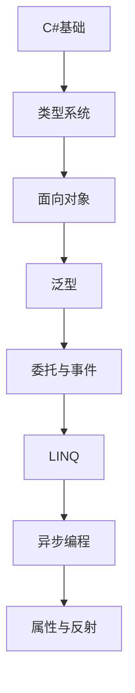

# C# 学习指南

> **分类**：编程语言 ｜ **章节总数**：100 ｜ **技术栈**：.NET 8

## 领域概述

C#是编程语言领域的重要技术方向，本系列从基础到高级逐步深入，涵盖15个核心模块：C#基础、类型系统、面向对象、泛型、委托与事件等。每个知识点作为独立章节，包含原理讲解、实现要点、常见陷阱和最佳实践，配合源码分析和架构图，帮助读者建立完整的C#知识体系。

本教程基于 **C#** 与 **.NET 8** 生态编写，涵盖 ASP.NET Core, LINQ 等主流工具与框架。每章独立成篇，文字精炼、逻辑清晰，适合系统学习与按需查阅。

## 你将学到什么

完成本系列后，你将能够：

- 系统理解 **C#** 的核心概念与模块划分。
- 按难度递进掌握从入门到实战的完整知识路径。
- 在工程实践中做出合理的技术判断与问题排查。
- 通过章节索引快速定位所需知识点。

## 前置知识

- 编程基础
- 数据结构
- 计算机基础
- 编程语言基础概念

## 推荐学习路径

1. **C#基础**
2. **类型系统**
3. **面向对象**
4. **泛型**
5. **委托与事件**
6. **LINQ**
7. **异步编程**
8. **属性与反射**

## 模块体系

本领域按以下模块组织，难度由浅入深：

- **C#基础**
- **类型系统**
- **面向对象**
- **泛型**
- **委托与事件**
- **LINQ**
- **异步编程**
- **属性与反射**
- **异常处理**
- **集合**
- **.NET平台**
- **ASP.NET基础**
- **依赖注入**
- **性能优化**
- **C#最佳实践**

## 难度分布

| 难度 | 章节数 | 占比 |
|------|--------|------|
| 入门 | 21 | 21% |
| 实战 | 18 | 18% |
| 进阶 | 28 | 28% |
| 高级 | 33 | 33% |

## 章节索引

点击章节标题进入对应教程：

### C#基础

- [C#基础核心概念与原理](chapters/001-C#基础核心概念与原理.md) ｜ 入门
- [C#基础的实现机制详解](chapters/002-C#基础的实现机制详解.md) ｜ 入门
- [C#基础的关键技术点](chapters/003-C#基础的关键技术点.md) ｜ 入门
- [C#基础的源码级分析](chapters/004-C#基础的源码级分析.md) ｜ 入门
- [C#基础的配置与使用](chapters/005-C#基础的配置与使用.md) ｜ 入门
- [C#基础的常见问题与解决方案](chapters/006-C#基础的常见问题与解决方案.md) ｜ 入门
- [C#基础的性能优化技巧](chapters/007-C#基础的性能优化技巧.md) ｜ 入门

### 类型系统

- [类型系统核心概念与原理](chapters/008-类型系统核心概念与原理.md) ｜ 入门
- [类型系统的实现机制详解](chapters/009-类型系统的实现机制详解.md) ｜ 入门
- [类型系统的关键技术点](chapters/010-类型系统的关键技术点.md) ｜ 入门
- [类型系统的源码级分析](chapters/011-类型系统的源码级分析.md) ｜ 入门
- [类型系统的配置与使用](chapters/012-类型系统的配置与使用.md) ｜ 入门
- [类型系统的常见问题与解决方案](chapters/013-类型系统的常见问题与解决方案.md) ｜ 入门
- [类型系统的性能优化技巧](chapters/014-类型系统的性能优化技巧.md) ｜ 入门

### 面向对象

- [面向对象核心概念与原理](chapters/015-面向对象核心概念与原理.md) ｜ 入门
- [面向对象的实现机制详解](chapters/016-面向对象的实现机制详解.md) ｜ 入门
- [面向对象的关键技术点](chapters/017-面向对象的关键技术点.md) ｜ 入门
- [面向对象的源码级分析](chapters/018-面向对象的源码级分析.md) ｜ 入门
- [面向对象的配置与使用](chapters/019-面向对象的配置与使用.md) ｜ 入门
- [面向对象的常见问题与解决方案](chapters/020-面向对象的常见问题与解决方案.md) ｜ 入门
- [面向对象的性能优化技巧](chapters/021-面向对象的性能优化技巧.md) ｜ 入门

### 泛型

- [泛型核心概念与原理](chapters/022-泛型核心概念与原理.md) ｜ 进阶
- [泛型的实现机制详解](chapters/023-泛型的实现机制详解.md) ｜ 进阶
- [泛型的关键技术点](chapters/024-泛型的关键技术点.md) ｜ 进阶
- [泛型的源码级分析](chapters/025-泛型的源码级分析.md) ｜ 进阶
- [泛型的配置与使用](chapters/026-泛型的配置与使用.md) ｜ 进阶
- [泛型的常见问题与解决方案](chapters/027-泛型的常见问题与解决方案.md) ｜ 进阶
- [泛型的性能优化技巧](chapters/028-泛型的性能优化技巧.md) ｜ 进阶

### 委托与事件

- [委托与事件核心概念与原理](chapters/029-委托与事件核心概念与原理.md) ｜ 进阶
- [委托与事件的实现机制详解](chapters/030-委托与事件的实现机制详解.md) ｜ 进阶
- [委托与事件的关键技术点](chapters/031-委托与事件的关键技术点.md) ｜ 进阶
- [委托与事件的源码级分析](chapters/032-委托与事件的源码级分析.md) ｜ 进阶
- [委托与事件的配置与使用](chapters/033-委托与事件的配置与使用.md) ｜ 进阶
- [委托与事件的常见问题与解决方案](chapters/034-委托与事件的常见问题与解决方案.md) ｜ 进阶
- [委托与事件的性能优化技巧](chapters/035-委托与事件的性能优化技巧.md) ｜ 进阶

### LINQ

- [LINQ核心概念与原理](chapters/036-LINQ核心概念与原理.md) ｜ 进阶
- [LINQ的实现机制详解](chapters/037-LINQ的实现机制详解.md) ｜ 进阶
- [LINQ的关键技术点](chapters/038-LINQ的关键技术点.md) ｜ 进阶
- [LINQ的源码级分析](chapters/039-LINQ的源码级分析.md) ｜ 进阶
- [LINQ的配置与使用](chapters/040-LINQ的配置与使用.md) ｜ 进阶
- [LINQ的常见问题与解决方案](chapters/041-LINQ的常见问题与解决方案.md) ｜ 进阶
- [LINQ的性能优化技巧](chapters/042-LINQ的性能优化技巧.md) ｜ 进阶

### 异步编程

- [异步编程核心概念与原理](chapters/043-异步编程核心概念与原理.md) ｜ 进阶
- [异步编程的实现机制详解](chapters/044-异步编程的实现机制详解.md) ｜ 进阶
- [异步编程的关键技术点](chapters/045-异步编程的关键技术点.md) ｜ 进阶
- [异步编程的源码级分析](chapters/046-异步编程的源码级分析.md) ｜ 进阶
- [异步编程的配置与使用](chapters/047-异步编程的配置与使用.md) ｜ 进阶
- [异步编程的常见问题与解决方案](chapters/048-异步编程的常见问题与解决方案.md) ｜ 进阶
- [异步编程的性能优化技巧](chapters/049-异步编程的性能优化技巧.md) ｜ 进阶

### 属性与反射

- [属性与反射核心概念与原理](chapters/050-属性与反射核心概念与原理.md) ｜ 高级
- [属性与反射的实现机制详解](chapters/051-属性与反射的实现机制详解.md) ｜ 高级
- [属性与反射的关键技术点](chapters/052-属性与反射的关键技术点.md) ｜ 高级
- [属性与反射的源码级分析](chapters/053-属性与反射的源码级分析.md) ｜ 高级
- [属性与反射的配置与使用](chapters/054-属性与反射的配置与使用.md) ｜ 高级
- [属性与反射的常见问题与解决方案](chapters/055-属性与反射的常见问题与解决方案.md) ｜ 高级
- [属性与反射的性能优化技巧](chapters/056-属性与反射的性能优化技巧.md) ｜ 高级

### 异常处理

- [异常处理核心概念与原理](chapters/057-异常处理核心概念与原理.md) ｜ 高级
- [异常处理的实现机制详解](chapters/058-异常处理的实现机制详解.md) ｜ 高级
- [异常处理的关键技术点](chapters/059-异常处理的关键技术点.md) ｜ 高级
- [异常处理的源码级分析](chapters/060-异常处理的源码级分析.md) ｜ 高级
- [异常处理的配置与使用](chapters/061-异常处理的配置与使用.md) ｜ 高级
- [异常处理的常见问题与解决方案](chapters/062-异常处理的常见问题与解决方案.md) ｜ 高级
- [异常处理的性能优化技巧](chapters/063-异常处理的性能优化技巧.md) ｜ 高级

### 集合

- [集合核心概念与原理](chapters/064-集合核心概念与原理.md) ｜ 高级
- [集合的实现机制详解](chapters/065-集合的实现机制详解.md) ｜ 高级
- [集合的关键技术点](chapters/066-集合的关键技术点.md) ｜ 高级
- [集合的源码级分析](chapters/067-集合的源码级分析.md) ｜ 高级
- [集合的配置与使用](chapters/068-集合的配置与使用.md) ｜ 高级
- [集合的常见问题与解决方案](chapters/069-集合的常见问题与解决方案.md) ｜ 高级
- [集合的性能优化技巧](chapters/070-集合的性能优化技巧.md) ｜ 高级

### .NET平台

- [.NET平台核心概念与原理](chapters/071-.NET平台核心概念与原理.md) ｜ 高级
- [.NET平台的实现机制详解](chapters/072-.NET平台的实现机制详解.md) ｜ 高级
- [.NET平台的关键技术点](chapters/073-.NET平台的关键技术点.md) ｜ 高级
- [.NET平台的源码级分析](chapters/074-.NET平台的源码级分析.md) ｜ 高级
- [.NET平台的配置与使用](chapters/075-.NET平台的配置与使用.md) ｜ 高级
- [.NET平台的常见问题与解决方案](chapters/076-.NET平台的常见问题与解决方案.md) ｜ 高级

### ASP.NET基础

- [ASP.NET基础核心概念与原理](chapters/077-ASP.NET基础核心概念与原理.md) ｜ 高级
- [ASP.NET基础的实现机制详解](chapters/078-ASP.NET基础的实现机制详解.md) ｜ 高级
- [ASP.NET基础的关键技术点](chapters/079-ASP.NET基础的关键技术点.md) ｜ 高级
- [ASP.NET基础的源码级分析](chapters/080-ASP.NET基础的源码级分析.md) ｜ 高级
- [ASP.NET基础的配置与使用](chapters/081-ASP.NET基础的配置与使用.md) ｜ 高级
- [ASP.NET基础的常见问题与解决方案](chapters/082-ASP.NET基础的常见问题与解决方案.md) ｜ 高级

### 依赖注入

- [依赖注入核心概念与原理](chapters/083-依赖注入核心概念与原理.md) ｜ 实战
- [依赖注入的实现机制详解](chapters/084-依赖注入的实现机制详解.md) ｜ 实战
- [依赖注入的关键技术点](chapters/085-依赖注入的关键技术点.md) ｜ 实战
- [依赖注入的源码级分析](chapters/086-依赖注入的源码级分析.md) ｜ 实战
- [依赖注入的配置与使用](chapters/087-依赖注入的配置与使用.md) ｜ 实战
- [依赖注入的常见问题与解决方案](chapters/088-依赖注入的常见问题与解决方案.md) ｜ 实战

### 性能优化

- [性能优化核心概念与原理](chapters/089-性能优化核心概念与原理.md) ｜ 实战
- [性能优化的实现机制详解](chapters/090-性能优化的实现机制详解.md) ｜ 实战
- [性能优化的关键技术点](chapters/091-性能优化的关键技术点.md) ｜ 实战
- [性能优化的源码级分析](chapters/092-性能优化的源码级分析.md) ｜ 实战
- [性能优化的配置与使用](chapters/093-性能优化的配置与使用.md) ｜ 实战
- [性能优化的常见问题与解决方案](chapters/094-性能优化的常见问题与解决方案.md) ｜ 实战

### C#最佳实践

- [C#最佳实践核心概念与原理](chapters/095-C#最佳实践核心概念与原理.md) ｜ 实战
- [C#最佳实践的实现机制详解](chapters/096-C#最佳实践的实现机制详解.md) ｜ 实战
- [C#最佳实践的关键技术点](chapters/097-C#最佳实践的关键技术点.md) ｜ 实战
- [C#最佳实践的源码级分析](chapters/098-C#最佳实践的源码级分析.md) ｜ 实战
- [C#最佳实践的配置与使用](chapters/099-C#最佳实践的配置与使用.md) ｜ 实战
- [C#最佳实践的常见问题与解决方案](chapters/100-C#最佳实践的常见问题与解决方案.md) ｜ 实战

## 学习方法建议

1. **先读概述再读章节**：用本指南建立全局地图，避免迷失在细节中。
2. **按模块递进**：同一模块内章节有前后关联，顺序阅读效果更好。
3. **主动复述**：每章读完后，用三五句话概括「是什么、为什么、怎么用」。
4. **关联阅读**：利用章节底部的「延伸学习」在同模块内构建知识网络。
5. **对照官方文档**：本教程提供结构化视角，细节以官方文档为准。

---
*领域: C# ｜ 版本: 2.0 ｜ 共 100 章*