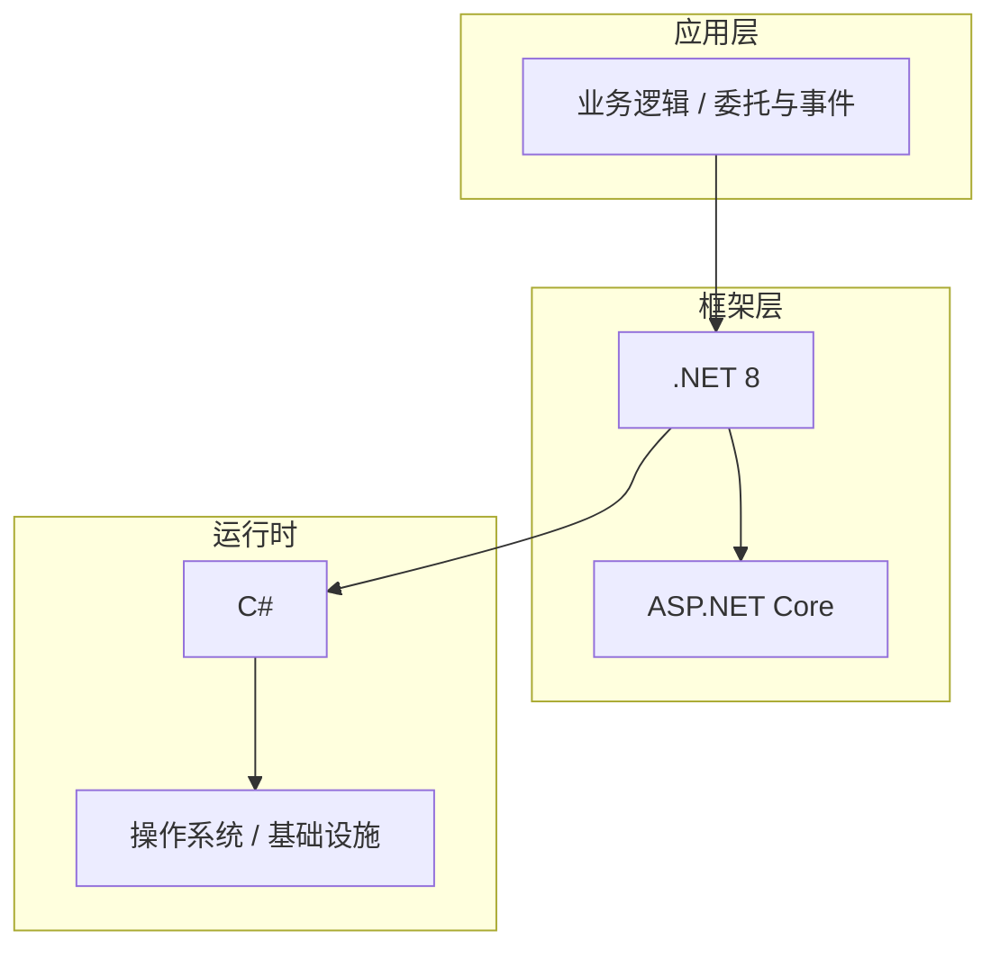

# 委托与事件的关键技术点

> **领域**：C# ｜ **模块**：委托与事件 ｜ **难度**：进阶 ｜ **类型**：关键技术

## 导读

本章属于 **C#** 教程的 **委托与事件** 模块，难度为 **进阶**。阅读重点在于建立清晰的概念模型与工程判断能力，而非死记细节。

## 核心概念

C# 是当前技术生态中的重要方向，系统学习需兼顾概念、原理与工程实践。

在 **C#** 体系中，**委托与事件** 与上下游模块形成协作。技术栈以 **.NET 8** 为核心（C#），生态包括 ASP.NET Core, LINQ。

「委托与事件」是该领域的核心知识模块，理解其原理与边界是工程实践的基础。

### 概念精讲

**委托与事件的基本概念与定义**

从度量出发：如何评估它是否工作正常、性能是否达标。 在 委托与事件 语境下，这一点直接影响设计决策与故障排查思路。

**委托与事件在C#中的作用与地位**

从定义出发：它解决什么问题、不解决什么问题，边界在哪里。 在 委托与事件 语境下，这一点直接影响设计决策与故障排查思路。

**委托与事件的核心数据结构**

从结构出发：核心组成部分是什么，彼此如何协作。 在 委托与事件 语境下，这一点直接影响设计决策与故障排查思路。

**委托与事件的关键算法与流程**

从流程出发：一次完整调用或生命周期经历哪些阶段。 在 委托与事件 语境下，这一点直接影响设计决策与故障排查思路。

**委托与事件与其他模块的关系**

从数据出发：输入输出是什么格式，状态如何变迁。 在 委托与事件 语境下，这一点直接影响设计决策与故障排查思路。

## 架构与流程

以下框图帮助你在宏观层面把握模块协作关系与处理流向：

## 深度讲解

### 技能链

1. 概念建模 — 准确术语描述问题与方案。
2. 接口运用 — API 能力边界与副作用。
3. 错误处理 — 分类与恢复策略。
4. 测试验证 — 可重复用例。
5. 集成协作 — 数据契约。

### 深化路径

每完成项目里程碑，复盘 委托与事件 相关决策，结构化反思比单纯阅读更有效。

### 落地检查清单

- **掌握委托与事件的常见问题与排查方法**：落地时需明确验收标准与回滚方案。
- **理解委托与事件的安全注意事项**：落地时需明确验收标准与回滚方案。
- **掌握委托与事件的调优技巧与最佳实践**：落地时需明确验收标准与回滚方案。
- **了解委托与事件在实际项目中的应用案例**：落地时需明确验收标准与回滚方案。

### 常见误区与应对

**误区：对委托与事件的概念理解不深入导致误用**

**应对**：回到官方定义画一张概念图，与同事讲解一遍，确保能用自己的话复述。

**误区：忽略委托与事件的性能边界与限制条件**

**应对**：用 Profiler 或压测建立基线，对比优化前后数据，避免凭感觉优化。

**误区：委托与事件配置不当引发的问题**

**应对**：核对环境变量、配置文件与部署清单是否一致，使用配置 diff 工具排查。

**误区：缺乏对委托与事件底层原理的理解**

**应对**：阅读官方文档与一篇深度文章，结合小实验验证理解。

**误区：委托与事件与其他模块集成时的兼容性问题**

**应对**：列出依赖版本矩阵，在 CI 中跑集成测试覆盖主要组合。

### 最佳实践

1. **遵循委托与事件的官方推荐用法与规范** — 落地方式：写入团队 Wiki 并纳入 Code Review 检查项。

2. **在理解原理的基础上合理使用委托与事件** — 落地方式：配置静态检查或 CI 规则自动拦截违规写法。

3. **建立完善的委托与事件监控与告警机制** — 落地方式：在新人 onboarding 中作为必修内容讲解。

4. **编写充分的测试用例覆盖委托与事件的各种场景** — 落地方式：每季度回顾一次，对照社区最佳实践更新。

5. **持续关注委托与事件的版本更新与最佳实践演进** — 落地方式：用真实项目案例演示正确与错误对比。

### 本章小结

学完本章，你应能：

- 说清 **委托与事件的关键技术点** 在 C#/委托与事件 中的定位。
- 描述核心流程与关键概念，能用自己的话复述。
- 识别常见误区并采取预防与排查手段。
- 在项目中做出与场景匹配的工程决策。

类型：**关键技术**。建议完成小练习或复盘笔记，将阅读转化为能力。

## 延伸学习

建议结合以下同模块章节继续阅读，构建完整知识链：

- 委托与事件核心概念与原理
- 委托与事件的实现机制详解
- 委托与事件的源码级分析
- 委托与事件的配置与使用

### 参考资料

- C#官方文档 - 委托与事件章节
- 《C#权威指南》相关章节
- 委托与事件源码实现与注释
- C#社区最佳实践文章
- 委托与事件相关技术博客与教程

---
*章节 ID: 031 ｜ 领域: C# ｜ 版本: 2.0*