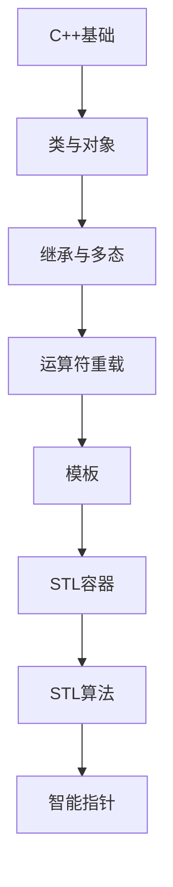

# C++ 学习指南

> **分类**：编程语言 ｜ **章节总数**：200 ｜ **技术栈**：C++20

## 领域概述

C++是编程语言领域的重要技术方向，本系列从基础到高级逐步深入，涵盖15个核心模块：C++基础、类与对象、继承与多态、运算符重载、模板等。每个知识点作为独立章节，包含原理讲解、实现要点、常见陷阱和最佳实践，配合源码分析和架构图，帮助读者建立完整的C++知识体系。

本教程基于 **C++** 与 **C++20** 生态编写，涵盖 STL, CMake, clang 等主流工具与框架。每章独立成篇，文字精炼、逻辑清晰，适合系统学习与按需查阅。

## 你将学到什么

完成本系列后，你将能够：

- 系统理解 **C++** 的核心概念与模块划分。
- 按难度递进掌握从入门到实战的完整知识路径。
- 在工程实践中做出合理的技术判断与问题排查。
- 通过章节索引快速定位所需知识点。

## 前置知识

- 编程基础
- 数据结构
- 计算机基础
- 编程语言基础概念

## 推荐学习路径

1. **C++基础**
2. **类与对象**
3. **继承与多态**
4. **运算符重载**
5. **模板**
6. **STL容器**
7. **STL算法**
8. **智能指针**

## 模块体系

本领域按以下模块组织，难度由浅入深：

- **C++基础**
- **类与对象**
- **继承与多态**
- **运算符重载**
- **模板**
- **STL容器**
- **STL算法**
- **智能指针**
- **异常处理**
- **RTTI与类型转换**
- **Lambda与函数对象**
- **并发编程**
- **C++11/14/17/20新特性**
- **设计模式**
- **性能优化**

## 难度分布

| 难度 | 章节数 | 占比 |
|------|--------|------|
| 入门 | 42 | 21% |
| 实战 | 39 | 19% |
| 进阶 | 54 | 27% |
| 高级 | 65 | 32% |

## 章节索引

点击章节标题进入对应教程：

### C++基础

- [C++基础核心概念与原理](chapters/001-C++基础核心概念与原理.md) ｜ 入门
- [C++基础的实现机制详解](chapters/002-C++基础的实现机制详解.md) ｜ 入门
- [C++基础的关键技术点](chapters/003-C++基础的关键技术点.md) ｜ 入门
- [C++基础的源码级分析](chapters/004-C++基础的源码级分析.md) ｜ 入门
- [C++基础的配置与使用](chapters/005-C++基础的配置与使用.md) ｜ 入门
- [C++基础的常见问题与解决方案](chapters/006-C++基础的常见问题与解决方案.md) ｜ 入门
- [C++基础的性能优化技巧](chapters/007-C++基础的性能优化技巧.md) ｜ 入门
- [C++基础的最佳实践指南](chapters/008-C++基础的最佳实践指南.md) ｜ 入门
- [C++基础的高级应用场景](chapters/009-C++基础的高级应用场景.md) ｜ 入门
- [C++基础的实战案例分析](chapters/010-C++基础的实战案例分析.md) ｜ 入门
- [C++基础的设计思想与演进](chapters/011-C++基础的设计思想与演进.md) ｜ 入门
- [C++基础的底层原理剖析](chapters/012-C++基础的底层原理剖析.md) ｜ 入门
- [C++基础的调试与排错](chapters/013-C++基础的调试与排错.md) ｜ 入门
- [C++基础的安全注意事项](chapters/014-C++基础的安全注意事项.md) ｜ 入门

### 类与对象

- [类与对象核心概念与原理](chapters/015-类与对象核心概念与原理.md) ｜ 入门
- [类与对象的实现机制详解](chapters/016-类与对象的实现机制详解.md) ｜ 入门
- [类与对象的关键技术点](chapters/017-类与对象的关键技术点.md) ｜ 入门
- [类与对象的源码级分析](chapters/018-类与对象的源码级分析.md) ｜ 入门
- [类与对象的配置与使用](chapters/019-类与对象的配置与使用.md) ｜ 入门
- [类与对象的常见问题与解决方案](chapters/020-类与对象的常见问题与解决方案.md) ｜ 入门
- [类与对象的性能优化技巧](chapters/021-类与对象的性能优化技巧.md) ｜ 入门
- [类与对象的最佳实践指南](chapters/022-类与对象的最佳实践指南.md) ｜ 入门
- [类与对象的高级应用场景](chapters/023-类与对象的高级应用场景.md) ｜ 入门
- [类与对象的实战案例分析](chapters/024-类与对象的实战案例分析.md) ｜ 入门
- [类与对象的设计思想与演进](chapters/025-类与对象的设计思想与演进.md) ｜ 入门
- [类与对象的底层原理剖析](chapters/026-类与对象的底层原理剖析.md) ｜ 入门
- [类与对象的调试与排错](chapters/027-类与对象的调试与排错.md) ｜ 入门
- [类与对象的安全注意事项](chapters/028-类与对象的安全注意事项.md) ｜ 入门

### 继承与多态

- [继承与多态核心概念与原理](chapters/029-继承与多态核心概念与原理.md) ｜ 入门
- [继承与多态的实现机制详解](chapters/030-继承与多态的实现机制详解.md) ｜ 入门
- [继承与多态的关键技术点](chapters/031-继承与多态的关键技术点.md) ｜ 入门
- [继承与多态的源码级分析](chapters/032-继承与多态的源码级分析.md) ｜ 入门
- [继承与多态的配置与使用](chapters/033-继承与多态的配置与使用.md) ｜ 入门
- [继承与多态的常见问题与解决方案](chapters/034-继承与多态的常见问题与解决方案.md) ｜ 入门
- [继承与多态的性能优化技巧](chapters/035-继承与多态的性能优化技巧.md) ｜ 入门
- [继承与多态的最佳实践指南](chapters/036-继承与多态的最佳实践指南.md) ｜ 入门
- [继承与多态的高级应用场景](chapters/037-继承与多态的高级应用场景.md) ｜ 入门
- [继承与多态的实战案例分析](chapters/038-继承与多态的实战案例分析.md) ｜ 入门
- [继承与多态的设计思想与演进](chapters/039-继承与多态的设计思想与演进.md) ｜ 入门
- [继承与多态的底层原理剖析](chapters/040-继承与多态的底层原理剖析.md) ｜ 入门
- [继承与多态的调试与排错](chapters/041-继承与多态的调试与排错.md) ｜ 入门
- [继承与多态的安全注意事项](chapters/042-继承与多态的安全注意事项.md) ｜ 入门

### 运算符重载

- [运算符重载核心概念与原理](chapters/043-运算符重载核心概念与原理.md) ｜ 进阶
- [运算符重载的实现机制详解](chapters/044-运算符重载的实现机制详解.md) ｜ 进阶
- [运算符重载的关键技术点](chapters/045-运算符重载的关键技术点.md) ｜ 进阶
- [运算符重载的源码级分析](chapters/046-运算符重载的源码级分析.md) ｜ 进阶
- [运算符重载的配置与使用](chapters/047-运算符重载的配置与使用.md) ｜ 进阶
- [运算符重载的常见问题与解决方案](chapters/048-运算符重载的常见问题与解决方案.md) ｜ 进阶
- [运算符重载的性能优化技巧](chapters/049-运算符重载的性能优化技巧.md) ｜ 进阶
- [运算符重载的最佳实践指南](chapters/050-运算符重载的最佳实践指南.md) ｜ 进阶
- [运算符重载的高级应用场景](chapters/051-运算符重载的高级应用场景.md) ｜ 进阶
- [运算符重载的实战案例分析](chapters/052-运算符重载的实战案例分析.md) ｜ 进阶
- [运算符重载的设计思想与演进](chapters/053-运算符重载的设计思想与演进.md) ｜ 进阶
- [运算符重载的底层原理剖析](chapters/054-运算符重载的底层原理剖析.md) ｜ 进阶
- [运算符重载的调试与排错](chapters/055-运算符重载的调试与排错.md) ｜ 进阶
- [运算符重载的安全注意事项](chapters/056-运算符重载的安全注意事项.md) ｜ 进阶

### 模板

- [模板核心概念与原理](chapters/057-模板核心概念与原理.md) ｜ 进阶
- [模板的实现机制详解](chapters/058-模板的实现机制详解.md) ｜ 进阶
- [模板的关键技术点](chapters/059-模板的关键技术点.md) ｜ 进阶
- [模板的源码级分析](chapters/060-模板的源码级分析.md) ｜ 进阶
- [模板的配置与使用](chapters/061-模板的配置与使用.md) ｜ 进阶
- [模板的常见问题与解决方案](chapters/062-模板的常见问题与解决方案.md) ｜ 进阶
- [模板的性能优化技巧](chapters/063-模板的性能优化技巧.md) ｜ 进阶
- [模板的最佳实践指南](chapters/064-模板的最佳实践指南.md) ｜ 进阶
- [模板的高级应用场景](chapters/065-模板的高级应用场景.md) ｜ 进阶
- [模板的实战案例分析](chapters/066-模板的实战案例分析.md) ｜ 进阶
- [模板的设计思想与演进](chapters/067-模板的设计思想与演进.md) ｜ 进阶
- [模板的底层原理剖析](chapters/068-模板的底层原理剖析.md) ｜ 进阶
- [模板的调试与排错](chapters/069-模板的调试与排错.md) ｜ 进阶
- [模板的安全注意事项](chapters/070-模板的安全注意事项.md) ｜ 进阶

### STL容器

- [STL容器核心概念与原理](chapters/071-STL容器核心概念与原理.md) ｜ 进阶
- [STL容器的实现机制详解](chapters/072-STL容器的实现机制详解.md) ｜ 进阶
- [STL容器的关键技术点](chapters/073-STL容器的关键技术点.md) ｜ 进阶
- [STL容器的源码级分析](chapters/074-STL容器的源码级分析.md) ｜ 进阶
- [STL容器的配置与使用](chapters/075-STL容器的配置与使用.md) ｜ 进阶
- [STL容器的常见问题与解决方案](chapters/076-STL容器的常见问题与解决方案.md) ｜ 进阶
- [STL容器的性能优化技巧](chapters/077-STL容器的性能优化技巧.md) ｜ 进阶
- [STL容器的最佳实践指南](chapters/078-STL容器的最佳实践指南.md) ｜ 进阶
- [STL容器的高级应用场景](chapters/079-STL容器的高级应用场景.md) ｜ 进阶
- [STL容器的实战案例分析](chapters/080-STL容器的实战案例分析.md) ｜ 进阶
- [STL容器的设计思想与演进](chapters/081-STL容器的设计思想与演进.md) ｜ 进阶
- [STL容器的底层原理剖析](chapters/082-STL容器的底层原理剖析.md) ｜ 进阶
- [STL容器的调试与排错](chapters/083-STL容器的调试与排错.md) ｜ 进阶

### STL算法

- [STL算法核心概念与原理](chapters/084-STL算法核心概念与原理.md) ｜ 进阶
- [STL算法的实现机制详解](chapters/085-STL算法的实现机制详解.md) ｜ 进阶
- [STL算法的关键技术点](chapters/086-STL算法的关键技术点.md) ｜ 进阶
- [STL算法的源码级分析](chapters/087-STL算法的源码级分析.md) ｜ 进阶
- [STL算法的配置与使用](chapters/088-STL算法的配置与使用.md) ｜ 进阶
- [STL算法的常见问题与解决方案](chapters/089-STL算法的常见问题与解决方案.md) ｜ 进阶
- [STL算法的性能优化技巧](chapters/090-STL算法的性能优化技巧.md) ｜ 进阶
- [STL算法的最佳实践指南](chapters/091-STL算法的最佳实践指南.md) ｜ 进阶
- [STL算法的高级应用场景](chapters/092-STL算法的高级应用场景.md) ｜ 进阶
- [STL算法的实战案例分析](chapters/093-STL算法的实战案例分析.md) ｜ 进阶
- [STL算法的设计思想与演进](chapters/094-STL算法的设计思想与演进.md) ｜ 进阶
- [STL算法的底层原理剖析](chapters/095-STL算法的底层原理剖析.md) ｜ 进阶
- [STL算法的调试与排错](chapters/096-STL算法的调试与排错.md) ｜ 进阶

### 智能指针

- [智能指针核心概念与原理](chapters/097-智能指针核心概念与原理.md) ｜ 高级
- [智能指针的实现机制详解](chapters/098-智能指针的实现机制详解.md) ｜ 高级
- [智能指针的关键技术点](chapters/099-智能指针的关键技术点.md) ｜ 高级
- [智能指针的源码级分析](chapters/100-智能指针的源码级分析.md) ｜ 高级
- [智能指针的配置与使用](chapters/101-智能指针的配置与使用.md) ｜ 高级
- [智能指针的常见问题与解决方案](chapters/102-智能指针的常见问题与解决方案.md) ｜ 高级
- [智能指针的性能优化技巧](chapters/103-智能指针的性能优化技巧.md) ｜ 高级
- [智能指针的最佳实践指南](chapters/104-智能指针的最佳实践指南.md) ｜ 高级
- [智能指针的高级应用场景](chapters/105-智能指针的高级应用场景.md) ｜ 高级
- [智能指针的实战案例分析](chapters/106-智能指针的实战案例分析.md) ｜ 高级
- [智能指针的设计思想与演进](chapters/107-智能指针的设计思想与演进.md) ｜ 高级
- [智能指针的底层原理剖析](chapters/108-智能指针的底层原理剖析.md) ｜ 高级
- [智能指针的调试与排错](chapters/109-智能指针的调试与排错.md) ｜ 高级

### 异常处理

- [异常处理核心概念与原理](chapters/110-异常处理核心概念与原理.md) ｜ 高级
- [异常处理的实现机制详解](chapters/111-异常处理的实现机制详解.md) ｜ 高级
- [异常处理的关键技术点](chapters/112-异常处理的关键技术点.md) ｜ 高级
- [异常处理的源码级分析](chapters/113-异常处理的源码级分析.md) ｜ 高级
- [异常处理的配置与使用](chapters/114-异常处理的配置与使用.md) ｜ 高级
- [异常处理的常见问题与解决方案](chapters/115-异常处理的常见问题与解决方案.md) ｜ 高级
- [异常处理的性能优化技巧](chapters/116-异常处理的性能优化技巧.md) ｜ 高级
- [异常处理的最佳实践指南](chapters/117-异常处理的最佳实践指南.md) ｜ 高级
- [异常处理的高级应用场景](chapters/118-异常处理的高级应用场景.md) ｜ 高级
- [异常处理的实战案例分析](chapters/119-异常处理的实战案例分析.md) ｜ 高级
- [异常处理的设计思想与演进](chapters/120-异常处理的设计思想与演进.md) ｜ 高级
- [异常处理的底层原理剖析](chapters/121-异常处理的底层原理剖析.md) ｜ 高级
- [异常处理的调试与排错](chapters/122-异常处理的调试与排错.md) ｜ 高级

### RTTI与类型转换

- [RTTI与类型转换核心概念与原理](chapters/123-RTTI与类型转换核心概念与原理.md) ｜ 高级
- [RTTI与类型转换的实现机制详解](chapters/124-RTTI与类型转换的实现机制详解.md) ｜ 高级
- [RTTI与类型转换的关键技术点](chapters/125-RTTI与类型转换的关键技术点.md) ｜ 高级
- [RTTI与类型转换的源码级分析](chapters/126-RTTI与类型转换的源码级分析.md) ｜ 高级
- [RTTI与类型转换的配置与使用](chapters/127-RTTI与类型转换的配置与使用.md) ｜ 高级
- [RTTI与类型转换的常见问题与解决方案](chapters/128-RTTI与类型转换的常见问题与解决方案.md) ｜ 高级
- [RTTI与类型转换的性能优化技巧](chapters/129-RTTI与类型转换的性能优化技巧.md) ｜ 高级
- [RTTI与类型转换的最佳实践指南](chapters/130-RTTI与类型转换的最佳实践指南.md) ｜ 高级
- [RTTI与类型转换的高级应用场景](chapters/131-RTTI与类型转换的高级应用场景.md) ｜ 高级
- [RTTI与类型转换的实战案例分析](chapters/132-RTTI与类型转换的实战案例分析.md) ｜ 高级
- [RTTI与类型转换的设计思想与演进](chapters/133-RTTI与类型转换的设计思想与演进.md) ｜ 高级
- [RTTI与类型转换的底层原理剖析](chapters/134-RTTI与类型转换的底层原理剖析.md) ｜ 高级
- [RTTI与类型转换的调试与排错](chapters/135-RTTI与类型转换的调试与排错.md) ｜ 高级

### Lambda与函数对象

- [Lambda与函数对象核心概念与原理](chapters/136-Lambda与函数对象核心概念与原理.md) ｜ 高级
- [Lambda与函数对象的实现机制详解](chapters/137-Lambda与函数对象的实现机制详解.md) ｜ 高级
- [Lambda与函数对象的关键技术点](chapters/138-Lambda与函数对象的关键技术点.md) ｜ 高级
- [Lambda与函数对象的源码级分析](chapters/139-Lambda与函数对象的源码级分析.md) ｜ 高级
- [Lambda与函数对象的配置与使用](chapters/140-Lambda与函数对象的配置与使用.md) ｜ 高级
- [Lambda与函数对象的常见问题与解决方案](chapters/141-Lambda与函数对象的常见问题与解决方案.md) ｜ 高级
- [Lambda与函数对象的性能优化技巧](chapters/142-Lambda与函数对象的性能优化技巧.md) ｜ 高级
- [Lambda与函数对象的最佳实践指南](chapters/143-Lambda与函数对象的最佳实践指南.md) ｜ 高级
- [Lambda与函数对象的高级应用场景](chapters/144-Lambda与函数对象的高级应用场景.md) ｜ 高级
- [Lambda与函数对象的实战案例分析](chapters/145-Lambda与函数对象的实战案例分析.md) ｜ 高级
- [Lambda与函数对象的设计思想与演进](chapters/146-Lambda与函数对象的设计思想与演进.md) ｜ 高级
- [Lambda与函数对象的底层原理剖析](chapters/147-Lambda与函数对象的底层原理剖析.md) ｜ 高级
- [Lambda与函数对象的调试与排错](chapters/148-Lambda与函数对象的调试与排错.md) ｜ 高级

### 并发编程

- [并发编程核心概念与原理](chapters/149-并发编程核心概念与原理.md) ｜ 高级
- [并发编程的实现机制详解](chapters/150-并发编程的实现机制详解.md) ｜ 高级
- [并发编程的关键技术点](chapters/151-并发编程的关键技术点.md) ｜ 高级
- [并发编程的源码级分析](chapters/152-并发编程的源码级分析.md) ｜ 高级
- [并发编程的配置与使用](chapters/153-并发编程的配置与使用.md) ｜ 高级
- [并发编程的常见问题与解决方案](chapters/154-并发编程的常见问题与解决方案.md) ｜ 高级
- [并发编程的性能优化技巧](chapters/155-并发编程的性能优化技巧.md) ｜ 高级
- [并发编程的最佳实践指南](chapters/156-并发编程的最佳实践指南.md) ｜ 高级
- [并发编程的高级应用场景](chapters/157-并发编程的高级应用场景.md) ｜ 高级
- [并发编程的实战案例分析](chapters/158-并发编程的实战案例分析.md) ｜ 高级
- [并发编程的设计思想与演进](chapters/159-并发编程的设计思想与演进.md) ｜ 高级
- [并发编程的底层原理剖析](chapters/160-并发编程的底层原理剖析.md) ｜ 高级
- [并发编程的调试与排错](chapters/161-并发编程的调试与排错.md) ｜ 高级

### C++11/14/17/20新特性

- [C++11/14/17/20新特性核心概念与原理](chapters/162-C++11141720新特性核心概念与原理.md) ｜ 实战
- [C++11/14/17/20新特性的实现机制详解](chapters/163-C++11141720新特性的实现机制详解.md) ｜ 实战
- [C++11/14/17/20新特性的关键技术点](chapters/164-C++11141720新特性的关键技术点.md) ｜ 实战
- [C++11/14/17/20新特性的源码级分析](chapters/165-C++11141720新特性的源码级分析.md) ｜ 实战
- [C++11/14/17/20新特性的配置与使用](chapters/166-C++11141720新特性的配置与使用.md) ｜ 实战
- [C++11/14/17/20新特性的常见问题与解决方案](chapters/167-C++11141720新特性的常见问题与解决方案.md) ｜ 实战
- [C++11/14/17/20新特性的性能优化技巧](chapters/168-C++11141720新特性的性能优化技巧.md) ｜ 实战
- [C++11/14/17/20新特性的最佳实践指南](chapters/169-C++11141720新特性的最佳实践指南.md) ｜ 实战
- [C++11/14/17/20新特性的高级应用场景](chapters/170-C++11141720新特性的高级应用场景.md) ｜ 实战
- [C++11/14/17/20新特性的实战案例分析](chapters/171-C++11141720新特性的实战案例分析.md) ｜ 实战
- [C++11/14/17/20新特性的设计思想与演进](chapters/172-C++11141720新特性的设计思想与演进.md) ｜ 实战
- [C++11/14/17/20新特性的底层原理剖析](chapters/173-C++11141720新特性的底层原理剖析.md) ｜ 实战
- [C++11/14/17/20新特性的调试与排错](chapters/174-C++11141720新特性的调试与排错.md) ｜ 实战

### 设计模式

- [设计模式核心概念与原理](chapters/175-设计模式核心概念与原理.md) ｜ 实战
- [设计模式的实现机制详解](chapters/176-设计模式的实现机制详解.md) ｜ 实战
- [设计模式的关键技术点](chapters/177-设计模式的关键技术点.md) ｜ 实战
- [设计模式的源码级分析](chapters/178-设计模式的源码级分析.md) ｜ 实战
- [设计模式的配置与使用](chapters/179-设计模式的配置与使用.md) ｜ 实战
- [设计模式的常见问题与解决方案](chapters/180-设计模式的常见问题与解决方案.md) ｜ 实战
- [设计模式的性能优化技巧](chapters/181-设计模式的性能优化技巧.md) ｜ 实战
- [设计模式的最佳实践指南](chapters/182-设计模式的最佳实践指南.md) ｜ 实战
- [设计模式的高级应用场景](chapters/183-设计模式的高级应用场景.md) ｜ 实战
- [设计模式的实战案例分析](chapters/184-设计模式的实战案例分析.md) ｜ 实战
- [设计模式的设计思想与演进](chapters/185-设计模式的设计思想与演进.md) ｜ 实战
- [设计模式的底层原理剖析](chapters/186-设计模式的底层原理剖析.md) ｜ 实战
- [设计模式的调试与排错](chapters/187-设计模式的调试与排错.md) ｜ 实战

### 性能优化

- [性能优化核心概念与原理](chapters/188-性能优化核心概念与原理.md) ｜ 实战
- [性能优化的实现机制详解](chapters/189-性能优化的实现机制详解.md) ｜ 实战
- [性能优化的关键技术点](chapters/190-性能优化的关键技术点.md) ｜ 实战
- [性能优化的源码级分析](chapters/191-性能优化的源码级分析.md) ｜ 实战
- [性能优化的配置与使用](chapters/192-性能优化的配置与使用.md) ｜ 实战
- [性能优化的常见问题与解决方案](chapters/193-性能优化的常见问题与解决方案.md) ｜ 实战
- [性能优化的性能优化技巧](chapters/194-性能优化的性能优化技巧.md) ｜ 实战
- [性能优化的最佳实践指南](chapters/195-性能优化的最佳实践指南.md) ｜ 实战
- [性能优化的高级应用场景](chapters/196-性能优化的高级应用场景.md) ｜ 实战
- [性能优化的实战案例分析](chapters/197-性能优化的实战案例分析.md) ｜ 实战
- [性能优化的设计思想与演进](chapters/198-性能优化的设计思想与演进.md) ｜ 实战
- [性能优化的底层原理剖析](chapters/199-性能优化的底层原理剖析.md) ｜ 实战
- [性能优化的调试与排错](chapters/200-性能优化的调试与排错.md) ｜ 实战

## 学习方法建议

1. **先读概述再读章节**：用本指南建立全局地图，避免迷失在细节中。
2. **按模块递进**：同一模块内章节有前后关联，顺序阅读效果更好。
3. **主动复述**：每章读完后，用三五句话概括「是什么、为什么、怎么用」。
4. **关联阅读**：利用章节底部的「延伸学习」在同模块内构建知识网络。
5. **对照官方文档**：本教程提供结构化视角，细节以官方文档为准。

---
*领域: C++ ｜ 版本: 2.0 ｜ 共 200 章*