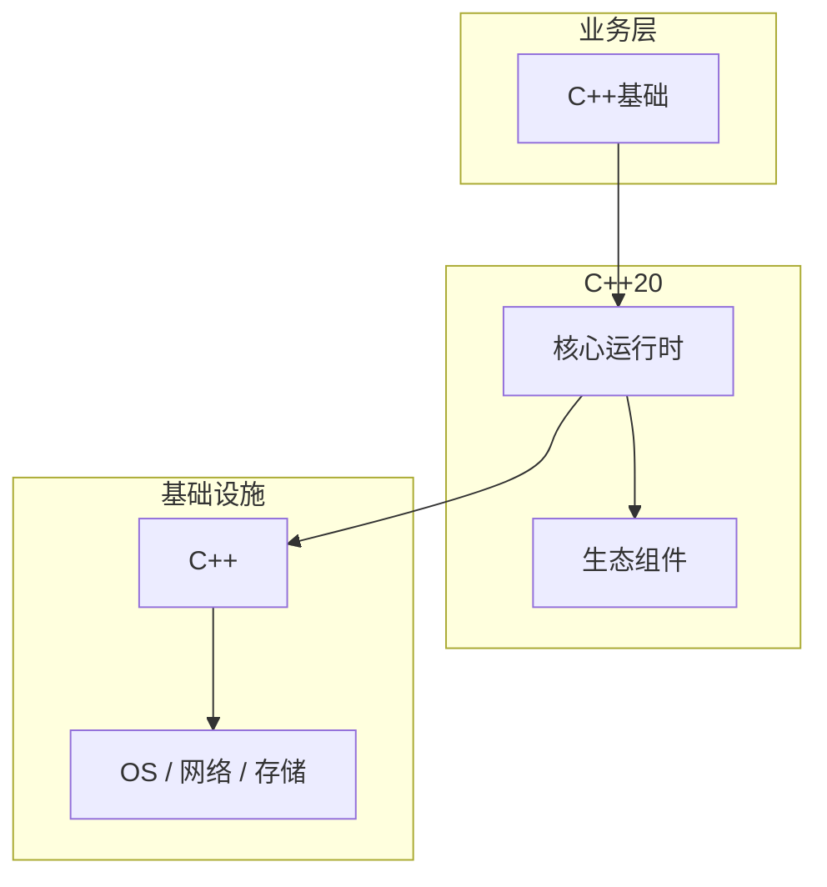

# C++基础的最佳实践指南

> **领域**：C++ ｜ **模块**：C++基础 ｜ **难度**：入门 ｜ **类型**：最佳实践

## 导读

本章系统讲解 **C++** 中 **C++基础** 的相关知识（最佳实践）。本章总结 **C++基础** 在团队工程化中的约定、检查项与落地方式。内容基于主流框架与工程实践撰写，不依赖过时概念堆砌。

## 核心知识

C++ 在 C 上扩展类、命名空间、引用与函数重载；编译经预处理、翻译单元、名称修饰（name mangling）与链接。

### 核心知识

**1. 命名空间**

namespace 隔离符号；匿名 namespace 内部链接。

**2. 引用**

T& 必须绑定对象；const T& 绑定临时量延长生命。

**3. 重载**

参数列表区分；不参与重载：返回类型。

**4. 头文件**

#pragma once / include guard。

## 架构与流程

## 技术详解

### 工程实践

每个 .cpp 独立编译；链接器解析 mangled 符号；ODR 要求 inline 函数与模板定义可见。

## 原理与实现

### 工作机制

每个 .cpp 独立编译；链接器解析 mangled 符号；ODR 要求 inline 函数与模板定义可见。

### 内部实现

Clang AST → LLVM IR → 优化 → 机器码；Itanium ABI 规定 vtable 布局与 RTTI。

## 操作流程与实践

### 操作流程

源文件组织：.h 声明、.cpp 定义；namespace 防污染；using 声明谨慎。

### 配置要点

CMake 管理标准：set(CMAKE_CXX_STANDARD 17)。

## 性能、安全与排查

### 性能优化

RAII 绑定资源生命周期；值语义默认拷贝，C++11 起移动语义减少分配。

### 安全注意

启用 -Wall -Wextra；智能指针替代裸 new/delete。

### 调试排错

gdb/lldb 调试；sanitizer 家族 -fsanitize=address,undefined。

## 案例与选型

### 案例复盘

构造函数显式 explicit 防隐式转换；Rule of Zero/Five 管理特殊成员。

### 方案对比

相对 C：类型安全与抽象更强；相对 Rust：无编译期 borrow 检查。

### 常见误区与纠正

**using namespace std 在头文件**

污染全局。

**缺少 virtual 析构**

多态基类泄漏。

**成员初始化顺序**

按声明非初始化列表顺序。

### 最佳实践

1. 遵循 Core Guidelines
2. 优先 std 容器
3. 显式 explicit
4. CI 跑 clang-tidy

## 巩固建议

建议结合 **C++** 官方文档与小型实验，亲手验证 **C++基础** 的默认行为与边界条件；将本章要点整理为检查清单或 ADR，便于评审与团队 onboarding。

### 本章小结

学完本章，你应能独立说明 **C++基础** 在 C++ 中的角色，理解其核心机制，规避常见误区，并在项目中正确运用。

## 延伸学习

- C++基础核心概念与原理
- C++基础的实现机制详解
- C++基础的关键技术点
- C++基础的源码级分析
- C++基础的配置与使用

### 延伸阅读

- cppreference.com — C++ 基础
- C++ 官方文档
- C++基础 相关技术规范与社区指南

---
*章节 ID: 008 ｜ 领域: C++*