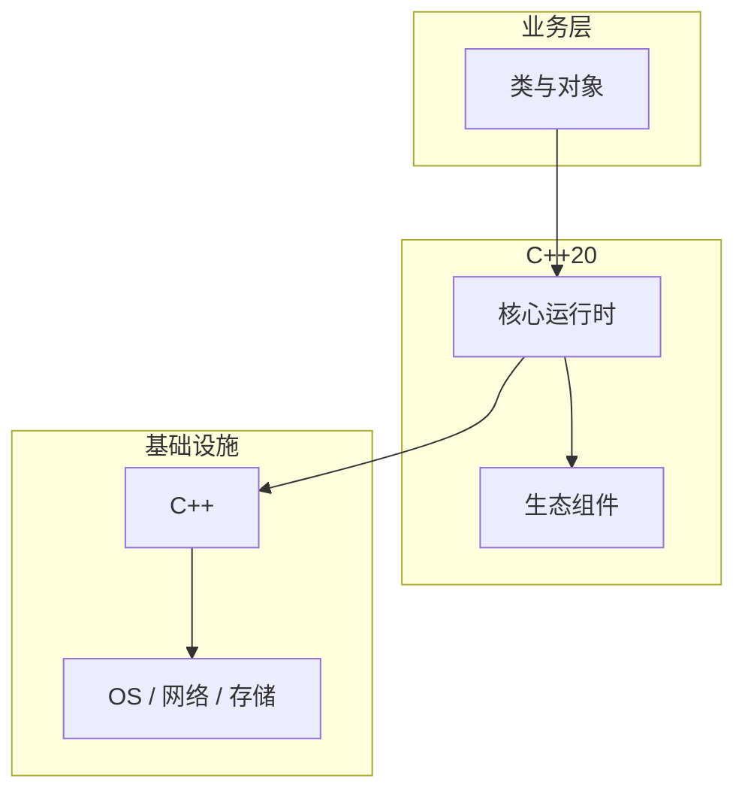

# 类与对象的配置与使用

> **领域**：C++ ｜ **模块**：类与对象 ｜ **难度**：入门 ｜ **类型**：配置实践

## 导读

本章系统讲解 **C++** 中 **类与对象** 的相关知识（配置实践）。本章讲解 **类与对象** 的配置项含义、环境差异与验证方法，强调可重复部署。内容基于主流框架与工程实践撰写，不依赖过时概念堆砌。

## 核心知识

类将数据与操作封装；访问控制 public/protected/private；this 指针指向当前对象。

### 核心知识

**1. 构造与初始化**

初始化列表先于函数体；成员按声明顺序初始化。

**2. const 正确性**

const 方法不能改非 mutable 成员。

**3. static 成员**

类外定义存储；单例需注意线程安全。

**4. 友元**

打破封装，谨慎使用。

## 架构与流程

## 技术详解

### 配置实践

编译器为每个类生成默认构造/拷贝/移动/析构（Rule of Five）；成员函数 implicit inline。

## 原理与实现

### 工作机制

编译器为每个类生成默认构造/拷贝/移动/析构（Rule of Five）；成员函数 implicit inline。

### 内部实现

对象内存：非虚类连续布局；vptr 在有多态虚函数时位于对象首部（实现定义）。

## 操作流程与实践

### 操作流程

定义类 → 实现 ctor/dtor → 成员函数 .cpp → 单元测试构造/赋值/析构路径。

### 配置要点

=default/=delete 控制特殊成员生成。

## 性能、安全与排查

### 性能优化

小对象值传递；大对象 const T&；移动构造转移资源所有权。

### 安全注意

成员 public 暴露 invariant 破坏面；const 成员函数保证逻辑 const。

### 调试排错

观察 ctor/dtor 顺序；AddressSanitizer 查 UAF。

## 案例与选型

### 案例复盘

Pimpl idiom 隐藏实现细节，减编译依赖。

### 方案对比

vs C struct：方法绑定类型；vs Java class：多继承与值语义。

## 本章聚焦

**类与对象** 配置应外部化并分环境管理；关键项在文档中注明默认值、取值范围与生产推荐值，纳入 Code Review。

### 常见误区与纠正

**浅拷贝资源类**

双删；需 Rule of Five。

**在 ctor 调 virtual**

派生未构造。

**slice 对象**

值切掉派生部分。

### 最佳实践

1. Pimpl 减编译时间
2. const 方法默认
3. 资源类 Rule of Five
4. 单例用 Meyers

## 巩固建议

建议结合 **C++** 官方文档与小型实验，亲手验证 **类与对象** 的默认行为与边界条件；将本章要点整理为检查清单或 ADR，便于评审与团队 onboarding。

### 本章小结

学完本章，你应能独立说明 **类与对象** 在 C++ 中的角色，理解其核心机制，规避常见误区，并在项目中正确运用。

## 延伸学习

- 类与对象核心概念与原理
- 类与对象的实现机制详解
- 类与对象的关键技术点
- 类与对象的源码级分析
- 类与对象的常见问题与解决方案

### 延伸阅读

- 《Effective C++》Item 4-12
- C++ 官方文档
- 类与对象 相关技术规范与社区指南

---
*章节 ID: 019 ｜ 领域: C++*