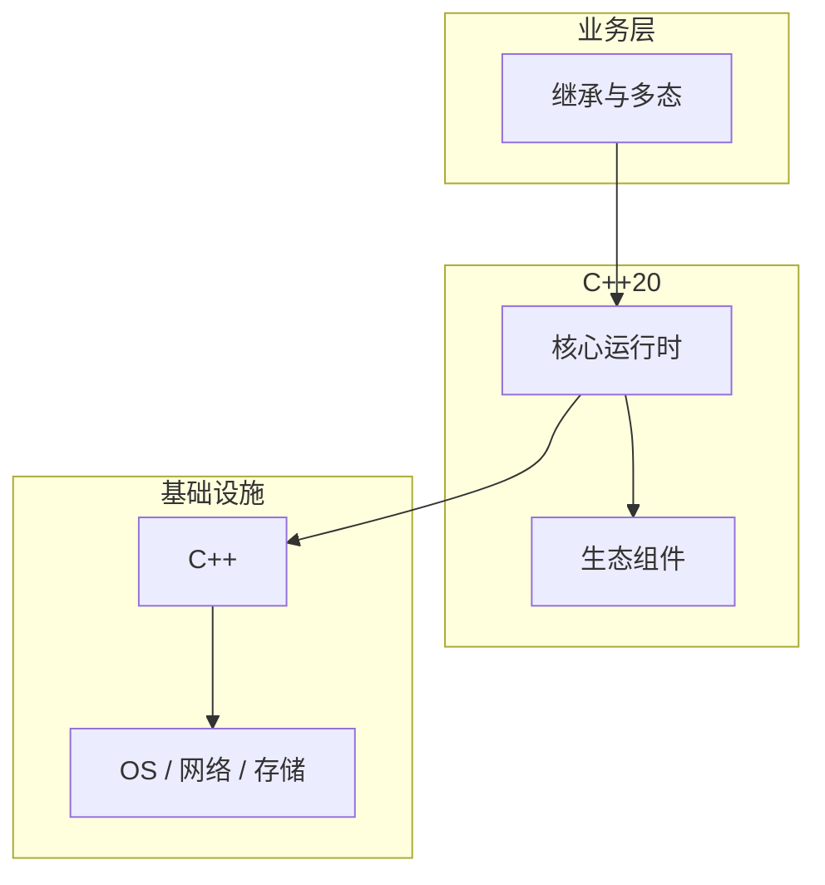

# 继承与多态的常见问题与解决方案

> **领域**：C++ ｜ **模块**：继承与多态 ｜ **难度**：入门 ｜ **类型**：问题排查

## 导读

本章系统讲解 **C++** 中 **继承与多态** 的相关知识（问题排查）。本章围绕 **继承与多态** 的典型故障现象、根因定位与修复步骤组织内容。内容基于主流框架与工程实践撰写，不依赖过时概念堆砌。

## 核心知识

public 继承表示 is-a；虚函数实现动态绑定；纯虚函数定义接口（抽象类）。

### 核心知识

**1. 虚函数表**

每多态类一 vtable；每对象一 vptr。

**2. override**

显式标记重写；签名必须匹配。

**3. 抽象类**

含纯虚=0；不可实例化。

**4. 虚继承**

shared base 唯一子对象。

## 架构与流程

## 技术详解

### 问题排查

vtable 存函数指针；对象含 vptr；虚调用经 vptr 间接跳转，有缓存友好性成本。

## 原理与实现

### 工作机制

vtable 存函数指针；对象含 vptr；虚调用经 vptr 间接跳转，有缓存友好性成本。

### 内部实现

多重继承：多个 vptr；虚继承解决菱形共享基类子对象。

## 操作流程与实践

### 操作流程

接口用纯虚抽象类；实现 override/final；多态基类 virtual ~T()。

### 配置要点

override/final 关键字 C++11；编译器检查签名。

## 性能、安全与排查

### 性能优化

虚函数有 indirection 成本；devirtualization 优化；final 助去虚化。

### 安全注意

切片赋值丢失派生信息；dynamic_cast 需 RTTI。

### 调试排错

typeid/dynamic_cast 调试类型；UBSan 查 undefined downcast。

## 案例与选型

### 案例复盘

策略模式：多态替换 if-else；工厂返回 unique_ptr<Base>。

### 方案对比

vs 组合：继承耦合高；Effective C++ 优先 composition。

## 本章聚焦

排障 **继承与多态** 时建议固定顺序：复现 → 收集日志/metrics/trace → 对比最近变更与配置 diff → 最小化隔离实验 → 记录根因与回归用例。

### 常见误区与纠正

**非 virtual 析构基类**

delete 派生经 Base* 泄漏。

**隐藏 overload**

派生同名函数隐藏基类重载。

**过深继承树**

难测试。

### 最佳实践

1. 多态基类 virtual dtor
2. 优先 override
3. 接口 minimal
4. 组合替代继承

## 巩固建议

建议结合 **C++** 官方文档与小型实验，亲手验证 **继承与多态** 的默认行为与边界条件；将本章要点整理为检查清单或 ADR，便于评审与团队 onboarding。

### 本章小结

学完本章，你应能独立说明 **继承与多态** 在 C++ 中的角色，理解其核心机制，规避常见误区，并在项目中正确运用。

## 延伸学习

- 继承与多态核心概念与原理
- 继承与多态的实现机制详解
- 继承与多态的关键技术点
- 继承与多态的源码级分析
- 继承与多态的配置与使用

### 延伸阅读

- C++ FAQ — Virtual Functions
- C++ 官方文档
- 继承与多态 相关技术规范与社区指南

---
*章节 ID: 034 ｜ 领域: C++*