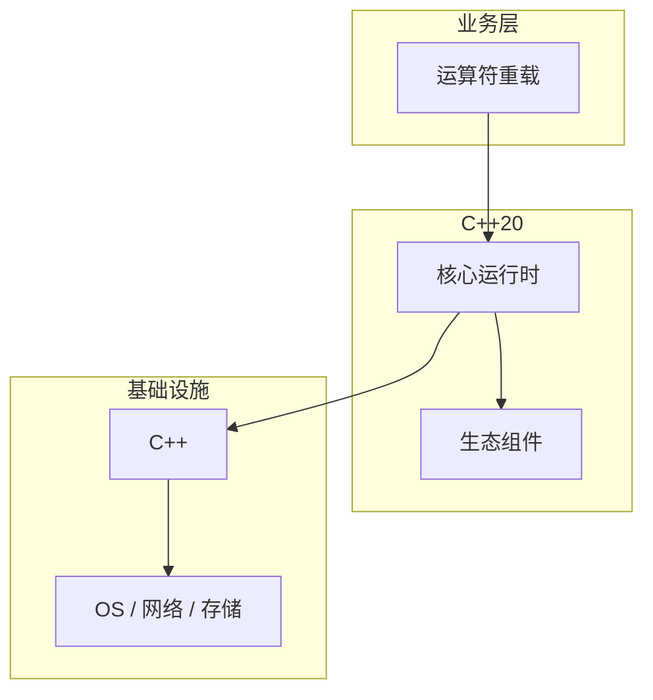

# 运算符重载的调试与排错

> **领域**：C++ ｜ **模块**：运算符重载 ｜ **难度**：进阶 ｜ **类型**：调试排错

## 导读

本章系统讲解 **C++** 中 **运算符重载** 的相关知识（调试排错）。本章提供 **运算符重载** 的调试工具链、日志/trace 解读与最小复现方法。内容基于主流框架与工程实践撰写，不依赖过时概念堆砌。

## 核心知识

可重载多数运算符为成员或非成员函数；不可重载 :: .* . ?: sizeof 等。

### 核心知识

**1. 成员 vs 非成员**

+= 成员；+ 常非成员。

**2. 转换运算符**

explicit 防 silent cast。

**3. 三路比较 <=>**

C++20 自动生成比较。

**4. 空间ship**

默认 <=> 需 =default。

## 架构与流程

## 技术详解

### 调试排错

二元算术常非成员以支持对称性；复合赋值返回 *this；下标[] 通常成员。

## 原理与实现

### 工作机制

二元算术常非成员以支持对称性；复合赋值返回 *this；下标[] 通常成员。

### 内部实现

operator+ 可能返回 prvalue；RVO/NRVO 消除拷贝。

## 操作流程与实践

### 操作流程

声明 operator；遵循直觉语义；IO 用友元非成员 << >>。

### 配置要点

=default operator= 生成正确移动/拷贝。

## 性能、安全与排查

### 性能优化

避免返回 dangling reference；大对象 operator+ 考虑移动。

### 安全注意

operator bool 显式防 implicit conversion 到 int。

### 调试排错

单步调试观察 operator 调用链。

## 案例与选型

### 案例复盘

复数、矩阵库重载 +*；迭代器 operator* operator++。

### 方案对比

vs Python dunder：C++ 更贴近性能，无 GIL。

### 常见误区与纠正

**operator, 滥用**

难读。

**返回 const T**

阻止移动。

**不对称 +**

应非成员。

### 最佳实践

1. 非成员 + 对称
2. explicit 转换
3. C++20 <=>
4. IO 友元

## 巩固建议

建议结合 **C++** 官方文档与小型实验，亲手验证 **运算符重载** 的默认行为与边界条件；将本章要点整理为检查清单或 ADR，便于评审与团队 onboarding。

### 本章小结

学完本章，你应能独立说明 **运算符重载** 在 C++ 中的角色，理解其核心机制，规避常见误区，并在项目中正确运用。

## 延伸学习

- 运算符重载核心概念与原理
- 运算符重载的实现机制详解
- 运算符重载的关键技术点
- 运算符重载的源码级分析
- 运算符重载的配置与使用

### 延伸阅读

- cppreference — Operator overloading
- C++ 官方文档
- 运算符重载 相关技术规范与社区指南

---
*章节 ID: 055 ｜ 领域: C++*