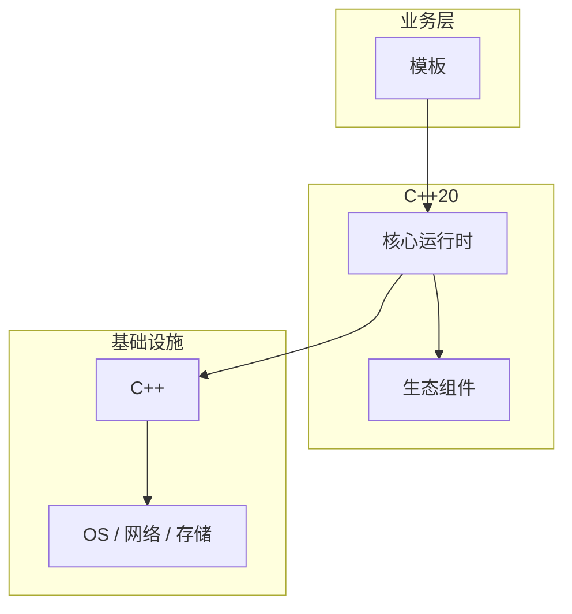

# 模板的设计思想与演进

> **领域**：C++ ｜ **模块**：模板 ｜ **难度**：进阶 ｜ **类型**：设计演进

## 导读

本章系统讲解 **C++** 中 **模板** 的相关知识（设计演进）。本章回顾 **模板** 的设计动机、版本演进与当前生态中的位置。内容基于主流框架与工程实践撰写，不依赖过时概念堆砌。

## 核心知识

模板是编译期泛型：函数模板与类模板在实例化时生成特化代码；SFINAE 过滤重载。

### 核心知识

**1. 特化**

全特化/偏特化改变实现。

**2. 实例化**

使用点隐式实例化；显式 template class Foo<int>。

**3. SFINAE**

替换失败非错误；enable_if。

**4. 概念**

template<typename T> requires Copyable<T>。

## 架构与流程

## 技术详解

### 设计演进

两阶段名字查找：模板定义期 + 实例化期；ADL 参与 unqualified 调用。

## 原理与实现

### 工作机制

两阶段名字查找：模板定义期 + 实例化期；ADL 参与 unqualified 调用。

### 内部实现

实例化产生 mangled 符号；显式实例化 extern template 控制编译时间与 ODR。

## 操作流程与实践

### 操作流程

template<typename T> 定义常放头文件；概念 C++20 constrains 模板参数。

### 配置要点

concepts requires 子句；-fconcepts-diagnostics-depth。

## 性能、安全与排查

### 性能优化

每个 T 实例化一份代码，二进制膨胀；type erasure 减实例化数量。

### 安全注意

模板注入：特化顺序影响；避免未定义特化。

### 调试排错

模板错误信息冗长；static_assert 约束 T。

## 案例与选型

### 案例复盘

std::vector<T>、std::sort 比较器模板；CRTP 静态多态。

### 方案对比

vs Java 泛型擦除：C++ 单态化零运行时开销。

### 常见误区与纠正

**模板定义放 .cpp**

链接 undefined。

**递归模板深度**

编译器 limit。

**typename 省略**

依赖名解析错。

### 最佳实践

1. 模板放头文件
2. C++20 concepts
3. extern template 减编译
4. type erasure 减膨胀

## 巩固建议

建议结合 **C++** 官方文档与小型实验，亲手验证 **模板** 的默认行为与边界条件；将本章要点整理为检查清单或 ADR，便于评审与团队 onboarding。

### 本章小结

学完本章，你应能独立说明 **模板** 在 C++ 中的角色，理解其核心机制，规避常见误区，并在项目中正确运用。

## 延伸学习

- 模板核心概念与原理
- 模板的实现机制详解
- 模板的关键技术点
- 模板的源码级分析
- 模板的配置与使用

### 延伸阅读

- 《C++ Templates》Vandevoorde
- C++ 官方文档
- 模板 相关技术规范与社区指南

---
*章节 ID: 067 ｜ 领域: C++*