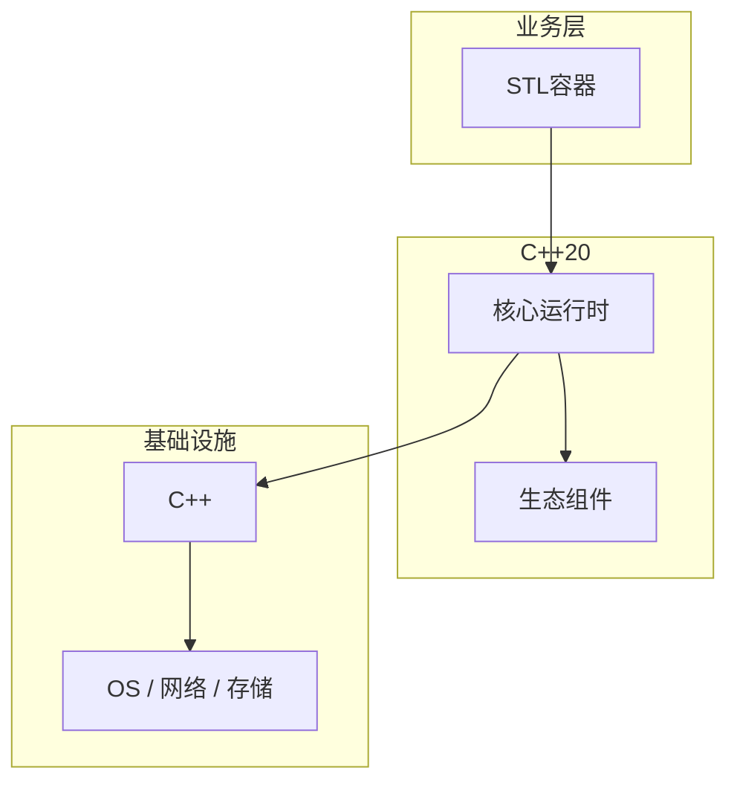

# STL容器的常见问题与解决方案

> **领域**：C++ ｜ **模块**：STL容器 ｜ **难度**：进阶 ｜ **类型**：问题排查

## 导读

本章系统讲解 **C++** 中 **STL容器** 的相关知识（问题排查）。本章围绕 **STL容器** 的典型故障现象、根因定位与修复步骤组织内容。内容基于主流框架与工程实践撰写，不依赖过时概念堆砌。

## 核心知识

STL 容器 sequence（vector/deque/list）、associative（set/map）、unordered（hash）与 container adapters。

### 核心知识

**1. vector**

capacity/size；扩容 factor 通常 2。

**2. map vs unordered_map**

有序 vs 哈希；hash 需 good hash。

**3. 迭代器失效**

vector insert 使之后迭代器全失效。

**4. emplace**

转发参数原地构造。

## 架构与流程

## 技术详解

### 问题排查

vector 连续内存 amortized O(1) push_back；map 红黑树 O(log n)；unordered_map 桶+链表均摊 O(1)。

## 原理与实现

### 工作机制

vector 连续内存 amortized O(1) push_back；map 红黑树 O(log n)；unordered_map 桶+链表均摊 O(1)。

### 内部实现

Allocator 控制内存；C++17 PMR 多态资源；迭代器 invalidation 规则因容器而异。

## 操作流程与实践

### 操作流程

选容器：随机访问→vector；有序键→map；高频查找→unordered_map；中间插入→list。

### 配置要点

自定义 Allocator C++11；_GLIBCXX_DEBUG 调试模式。

## 性能、安全与排查

### 性能优化

vector reserve 预分配；emplace_back 原地构造；shrink_to_fit 非强制。

### 安全注意

迭代器失效导致 UAF；跨线程需外部锁或 concurrent 容器。

## 案例与选型

### 案例复盘

日志缓冲 vector<char>；索引 inverted index unordered_map。

### 方案对比

vs Java Collection：C++ 值语义，无 GC。

## 本章聚焦

排障 **STL容器** 时建议固定顺序：复现 → 收集日志/metrics/trace → 对比最近变更与配置 diff → 最小化隔离实验 → 记录根因与回归用例。

### 常见误区与纠正

**vector 中间 insert 频繁**

应 list 或标记删除。

**end()-begin() 当索引**

应用 size。

**map[] 插入默认**

查用 find。

### 最佳实践

1. 默认 vector
2. reserve 已知大小
3. emplace 优先
4. 查 invalidation 表

## 巩固建议

建议结合 **C++** 官方文档与小型实验，亲手验证 **STL容器** 的默认行为与边界条件；将本章要点整理为检查清单或 ADR，便于评审与团队 onboarding。

### 本章小结

学完本章，你应能独立说明 **STL容器** 在 C++ 中的角色，理解其核心机制，规避常见误区，并在项目中正确运用。

## 延伸学习

- STL容器核心概念与原理
- STL容器的实现机制详解
- STL容器的关键技术点
- STL容器的源码级分析
- STL容器的配置与使用

### 延伸阅读

- cppreference — Containers library
- C++ 官方文档
- STL容器 相关技术规范与社区指南

---
*章节 ID: 076 ｜ 领域: C++*