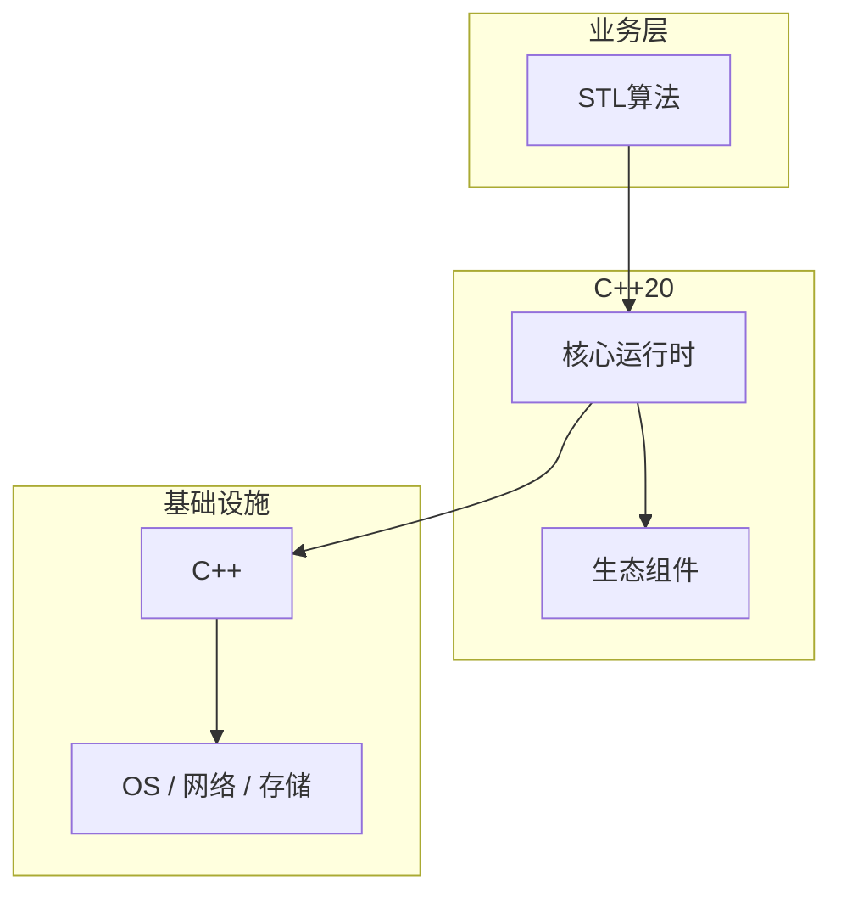

# STL算法的性能优化技巧

> **领域**：C++ ｜ **模块**：STL算法 ｜ **难度**：进阶 ｜ **类型**：性能优化

## 导读

本章系统讲解 **C++** 中 **STL算法** 的相关知识（性能优化）。本章从度量指标、瓶颈定位与优化手段三方面讲解 **STL算法** 的性能议题。内容基于主流框架与工程实践撰写，不依赖过时概念堆砌。

## 核心知识

<algorithm> 提供 sort、find、transform、accumulate 等；操作迭代器范围 [first,last)。

### 核心知识

**1. 迭代器类别**

随机访问算法需 RandomAccessIterator。

**2. 比较器**

strict weak ordering。

**3. ranges**

views::filter | views::transform 惰性。

**4. 并行算法**

par_unseq 向量化要求。

## 架构与流程

## 技术详解

### 性能优化

sort  introsort O(n log n)；stable_sort 归并；nth_element 部分排序。

## 原理与实现

### 工作机制

sort  introsort O(n log n)；stable_sort 归并；nth_element 部分排序。

### 内部实现

算法不拥有容器；需保证迭代器有效；Execution Policy C++17 并行算法。

## 操作流程与实践

### 操作流程

include 头文件 → 选算法 → 传迭代器 → 必要时自定义 comparator/lambda。

### 配置要点

#include <execution> 链接 TBB。

## 性能、安全与排查

### 性能优化

并行 std::execution::par 需无数据竞争；小范围并行反而慢。

### 安全注意

未初始化内存用 uninitialized_*；避免对失效迭代器算法。

### 调试排错

观察 comparator 严格弱序；UBSan 查 invalid compare。

## 案例与选型

### 案例复盘

pipeline transform+filter 用 ranges C++20；top_k nth_element。

## 本章聚焦

针对 **STL算法**，性能工作应「先度量后优化」：明确 P50/P95/P99 与资源占用基线，用 profiler/trace 定位热点，优先处理 I/O、锁竞争与算法复杂度问题，避免无数据支撑的微调。

### 常见误区与纠正

**对 list sort**

无 member sort 用 ::sort 需 random access。

**比较器非严格弱序**

sort 未定义。

**并行修改共享**

数据竞争。

### 最佳实践

1. 优先 std 算法
2. ranges 减样板
3. 并行测基准
4. lambda 明确捕获

## 巩固建议

建议结合 **C++** 官方文档与小型实验，亲手验证 **STL算法** 的默认行为与边界条件；将本章要点整理为检查清单或 ADR，便于评审与团队 onboarding。

### 本章小结

学完本章，你应能独立说明 **STL算法** 在 C++ 中的角色，理解其核心机制，规避常见误区，并在项目中正确运用。

## 延伸学习

- STL算法核心概念与原理
- STL算法的实现机制详解
- STL算法的关键技术点
- STL算法的源码级分析
- STL算法的配置与使用

### 延伸阅读

- cppreference — Algorithms library
- C++ 官方文档
- STL算法 相关技术规范与社区指南

---
*章节 ID: 090 ｜ 领域: C++*