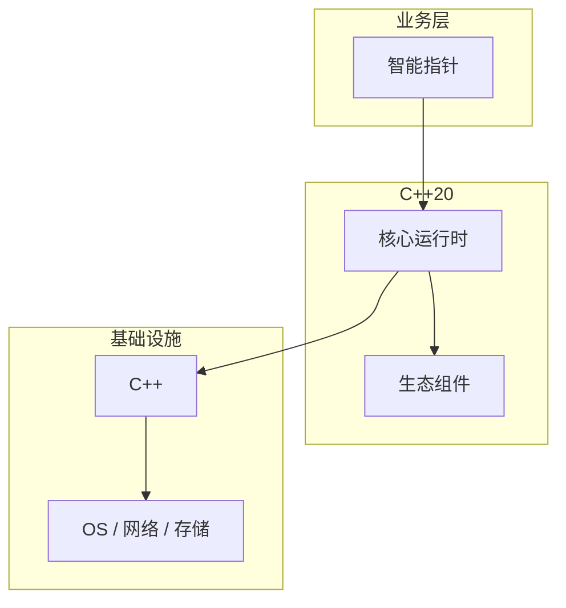

# 智能指针的常见问题与解决方案

> **领域**：C++ ｜ **模块**：智能指针 ｜ **难度**：高级 ｜ **类型**：问题排查

## 导读

本章系统讲解 **C++** 中 **智能指针** 的相关知识（问题排查）。本章围绕 **智能指针** 的典型故障现象、根因定位与修复步骤组织内容。内容基于主流框架与工程实践撰写，不依赖过时概念堆砌。

## 核心知识

unique_ptr 独占所有权；shared_ptr 引用计数；weak_ptr 打破 shared 循环引用。

### 核心知识

**1. unique_ptr**

不可拷贝可移动；default deleter delete。

**2. shared_ptr**

拷贝增 strong count。

**3. weak_ptr**

不增 strong；lock 得 shared。

**4. make_unique/make_shared**

异常安全与分配优化。

## 架构与流程

## 技术详解

### 问题排查

shared_ptr 控制块存强/弱计数；make_shared 一次分配对象+控制块。

## 原理与实现

### 工作机制

shared_ptr 控制块存强/弱计数；make_shared 一次分配对象+控制块。

### 内部实现

自定义 deleter 类型擦除在 unique_ptr；shared_ptr aliasing constructor。

## 操作流程与实践

### 操作流程

工厂返回 unique_ptr<Base>；共享用 make_shared；观察循环用 weak_ptr::lock。

### 配置要点

std::enable_shared_from_this 异步回调延长生命。

## 性能、安全与排查

### 性能优化

atomic ref count 有开销；unique_ptr 零开销等同裸指针。

### 安全注意

shared_ptr 非线程安全指向同一对象的并发读写；get() 裸指针不延长生命。

### 调试排错

跟踪 ref count；weak_ptr expired()。

## 案例与选型

### 案例复盘

资源管理 FILE* unique_ptr 自定义 deleter fclose。

### 方案对比

vs GC：确定性析构；vs Rust Box：运行时计数。

## 本章聚焦

排障 **智能指针** 时建议固定顺序：复现 → 收集日志/metrics/trace → 对比最近变更与配置 diff → 最小化隔离实验 → 记录根因与回归用例。

### 常见误区与纠正

**shared_ptr 循环引用**

内存泄漏。

**从 this 构造 shared**

双控制块。

**混用 new[]/delete**

指定 deleter。

### 最佳实践

1. make_shared 优先
2. unique 默认
3. weak 破循环
4. 禁裸 new

## 巩固建议

建议结合 **C++** 官方文档与小型实验，亲手验证 **智能指针** 的默认行为与边界条件；将本章要点整理为检查清单或 ADR，便于评审与团队 onboarding。

### 本章小结

学完本章，你应能独立说明 **智能指针** 在 C++ 中的角色，理解其核心机制，规避常见误区，并在项目中正确运用。

## 延伸学习

- 智能指针核心概念与原理
- 智能指针的实现机制详解
- 智能指针的关键技术点
- 智能指针的源码级分析
- 智能指针的配置与使用

### 延伸阅读

- 《Effective Modern C++》智能指针章节
- C++ 官方文档
- 智能指针 相关技术规范与社区指南

---
*章节 ID: 102 ｜ 领域: C++*