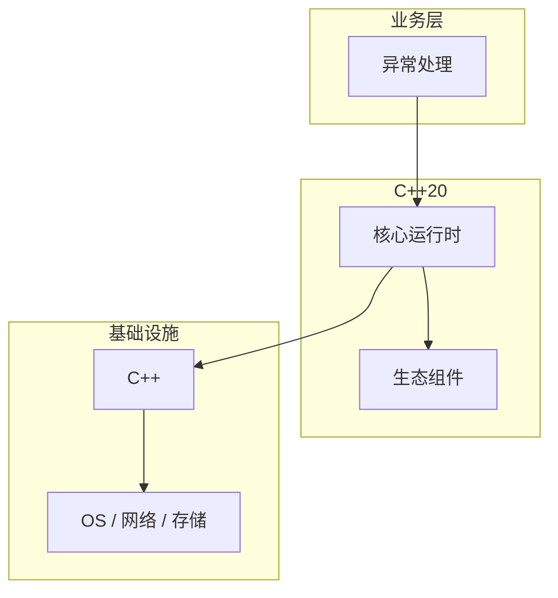

# 异常处理的实现机制详解

> **领域**：C++ ｜ **模块**：异常处理 ｜ **难度**：高级 ｜ **类型**：实现机制

## 导读

本章系统讲解 **C++** 中 **异常处理** 的相关知识（实现机制）。本章聚焦 **异常处理** 的内部实现路径与关键数据结构，帮助从 API 用法深入到机制层。内容基于主流框架与工程实践撰写，不依赖过时概念堆砌。

## 核心知识

try/catch/throw 栈展开调用析构；异常类型按 catch 顺序匹配；noexcept 承诺不抛。

### 核心知识

**1. RAII**

栈展开自动析构。

**2. 异常保证**

基本/强/无抛。

**3. std::exception**

what() 消息。

**4. expected**

C++23 显式错误值。

## 架构与流程

## 技术详解

### 实现机制

table-driven unwinding：Itanium ABI __cxa_throw/_Unwind_RaiseException。

## 原理与实现

### 工作机制

table-driven unwinding：Itanium ABI __cxa_throw/_Unwind_RaiseException。

### 内部实现

析构函数默认 noexcept；移动操作应 noexcept 助 vector 强异常保证。

## 操作流程与实践

### 操作流程

异常仅用于 exceptional；错误码用于 expected 路径；RAII 清理资源。

### 配置要点

-fno-exceptions 嵌入式禁用；Windows /EHsc。

## 性能、安全与排查

### 性能优化

异常路径零成本直到 throw；热路径 noexcept 避免 unwinding 表。

### 安全注意

catch(...) 吞异常泄露信息； noexcept 违反 terminate。

### 调试排错

gdb catch throw；std::current_exception 存异常 ptr。

## 案例与选型

### 案例复盘

网络库：连接失败 throw 或 expected<T,E> C++23。

### 方案对比

vs 错误码：异常跨层传播；Go 无异常用 error。

## 本章聚焦

阅读 **异常处理** 实现时，建议对照调用栈画出数据流：入口 API → 核心数据结构 → 系统调用或 I/O 边界，标注锁与共享状态位置。

### 常见误区与纠正

**析构 throw**

terminate。

**异常作控制流**

性能差。

**catch 值非引用**

切片。

### 最佳实践

1. RAII 必用
2. noexcept 移动
3. expected 新代码
4. 不 catch 空 swallow

## 巩固建议

建议结合 **C++** 官方文档与小型实验，亲手验证 **异常处理** 的默认行为与边界条件；将本章要点整理为检查清单或 ADR，便于评审与团队 onboarding。

### 本章小结

学完本章，你应能独立说明 **异常处理** 在 C++ 中的角色，理解其核心机制，规避常见误区，并在项目中正确运用。

## 延伸学习

- 异常处理核心概念与原理
- 异常处理的关键技术点
- 异常处理的源码级分析
- 异常处理的配置与使用
- 异常处理的常见问题与解决方案

### 延伸阅读

- 《Exceptional C++》
- C++ 官方文档
- 异常处理 相关技术规范与社区指南

---
*章节 ID: 111 ｜ 领域: C++*