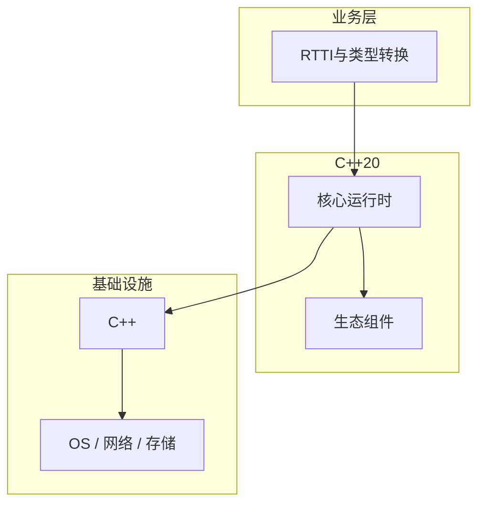

# RTTI与类型转换的配置与使用

> **领域**：C++ ｜ **模块**：RTTI与类型转换 ｜ **难度**：高级 ｜ **类型**：配置实践

## 导读

本章系统讲解 **C++** 中 **RTTI与类型转换** 的相关知识（配置实践）。本章讲解 **RTTI与类型转换** 的配置项含义、环境差异与验证方法，强调可重复部署。内容基于主流框架与工程实践撰写，不依赖过时概念堆砌。

## 核心知识

RTTI 提供 typeid、dynamic_cast；需多态类（虚函数）才能 dynamic_cast 引用。

### 核心知识

**1. dynamic_cast**

安全向下；失败指针 null 引用 bad_cast。

**2. static_cast**

相关类型转换。

**3. typeid**

运行时类型标识。

**4. 禁用 RTTI**

-fno-rtti 无 dynamic_cast。

## 架构与流程

## 技术详解

### 配置实践

type_info 比较 name()；编译器生成 typeinfo 符号。

## 原理与实现

### 工作机制

type_info 比较 name()；编译器生成 typeinfo 符号。

### 内部实现

static_cast 编译期；reinterpret_cast 低层比特；const_cast 去 const。

## 操作流程与实践

### 操作流程

层次向下用 dynamic_cast 检失败 nullptr；避免 C 风格 (T*)p。

## 性能、安全与排查

### 性能优化

dynamic_cast 运行时成本；devirtualization 不可用。

### 安全注意

reinterpret_cast 可 alias 违规；strict aliasing 仍适用。

### 调试排错

typeid 打印调试；failed dynamic_cast 查继承。

## 案例与选型

### 案例复盘

插件系统 factory + dynamic_cast；Visitor 替代 RTTI 开关。

### 方案对比

vs Rust Any/downcast：类似运行期类型。

## 本章聚焦

**RTTI与类型转换** 配置应外部化并分环境管理；关键项在文档中注明默认值、取值范围与生产推荐值，纳入 Code Review。

### 常见误区与纠正

**对非多态 dynamic_cast**

编译错或 UB。

**C 风格 cast**

四 cast 更安全。

**RTTI 滥用**

应用 Visitor。

### 最佳实践

1. 优先 static_cast
2. dynamic 检失败
3. 禁 C cast
4. Visitor 替 RTTI

## 巩固建议

建议结合 **C++** 官方文档与小型实验，亲手验证 **RTTI与类型转换** 的默认行为与边界条件；将本章要点整理为检查清单或 ADR，便于评审与团队 onboarding。

### 本章小结

学完本章，你应能独立说明 **RTTI与类型转换** 在 C++ 中的角色，理解其核心机制，规避常见误区，并在项目中正确运用。

## 延伸学习

- RTTI与类型转换核心概念与原理
- RTTI与类型转换的实现机制详解
- RTTI与类型转换的关键技术点
- RTTI与类型转换的源码级分析
- RTTI与类型转换的常见问题与解决方案

### 延伸阅读

- cppreference — RTTI
- C++ 官方文档
- RTTI与类型转换 相关技术规范与社区指南

---
*章节 ID: 127 ｜ 领域: C++*