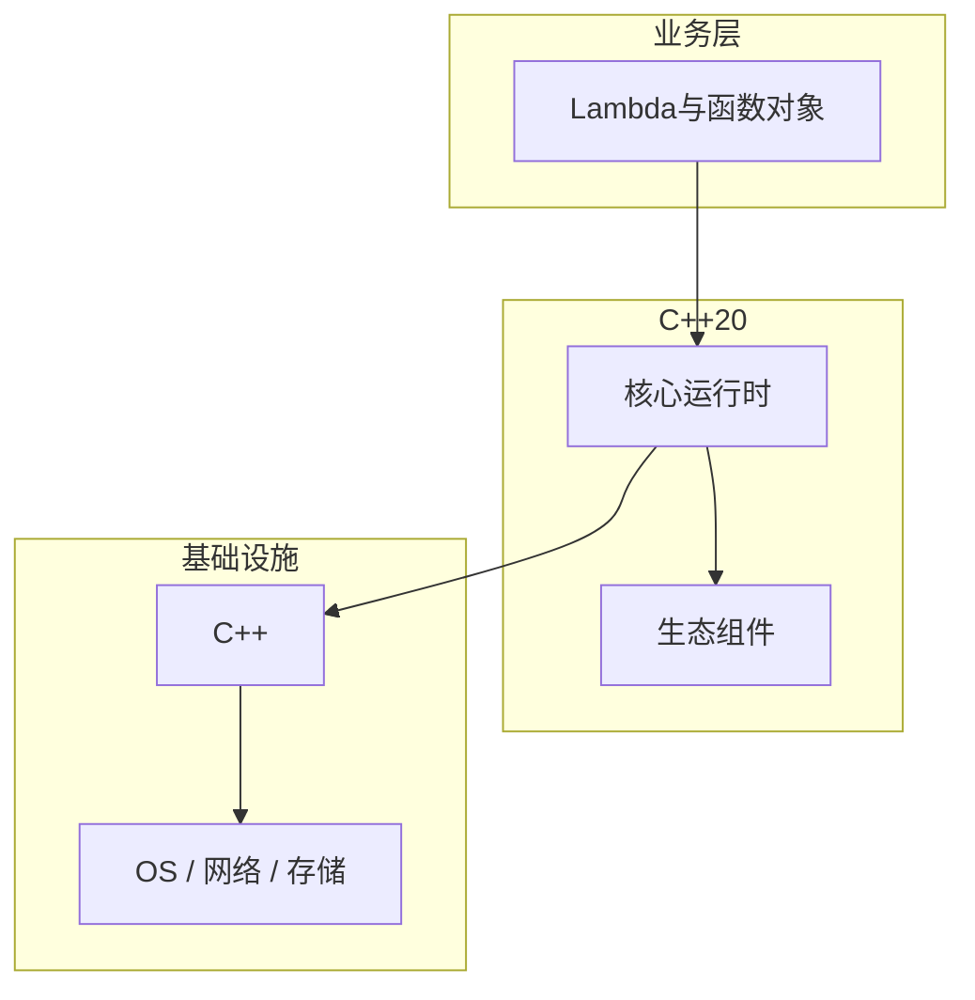

# Lambda与函数对象的调试与排错

> **领域**：C++ ｜ **模块**：Lambda与函数对象 ｜ **难度**：高级 ｜ **类型**：调试排错

## 导读

本章系统讲解 **C++** 中 **Lambda与函数对象** 的相关知识（调试排错）。本章提供 **Lambda与函数对象** 的调试工具链、日志/trace 解读与最小复现方法。内容基于主流框架与工程实践撰写，不依赖过时概念堆砌。

## 核心知识

Lambda [capture](params){ body } 生成闭包类；operator() 可模板化。

### 核心知识

**1. 捕获列表**

mutable 改值捕获副本。

**2. 泛型 lambda**

auto 参数模板 operator()。

**3. std::function**

拷贝 Callable；空抛 bad_function_call。

**4. 立即调用**

([]{})(); IIFE。

## 架构与流程

## 技术详解

### 调试排错

捕获 default/copy：[=] [&] [x,&y]；init capture C++14 [ptr=make_unique<T>()]。

## 原理与实现

### 工作机制

捕获 default/copy：[=] [&] [x,&y]；init capture C++14 [ptr=make_unique<T>()]。

### 内部实现

闭包大小取决于捕获；无捕获 lambda 可转函数指针。

## 操作流程与实践

### 操作流程

STL 算法传 lambda；std::function 类型擦除存任意可调用对象。

### 配置要点

generic lambda auto 参数 C++14。

## 性能、安全与排查

### 性能优化

std::function 可能堆分配；小 lambda 用 auto 或 template 参数。

### 安全注意

捕获 dangling reference 若对象已销毁。

### 调试排错

gdb 显示 operator() 闭包字段。

## 案例与选型

### 案例复盘

回调注册 std::function<void(int)>；线程 pool 任务 lambda。

### 方案对比

vs 函数指针：捕获状态；vs std::bind 已过时。

### 常见误区与纠正

**[&] 捕获局部引用异步**

UAF。

**recursive std::function**

需 wrapper。

**过大 function**

SBO 外分配。

### 最佳实践

1. init capture 移动
2. 算法用 lambda
3. 小对象 template
4. 慎 [=] 异步

## 巩固建议

建议结合 **C++** 官方文档与小型实验，亲手验证 **Lambda与函数对象** 的默认行为与边界条件；将本章要点整理为检查清单或 ADR，便于评审与团队 onboarding。

### 本章小结

学完本章，你应能独立说明 **Lambda与函数对象** 在 C++ 中的角色，理解其核心机制，规避常见误区，并在项目中正确运用。

## 延伸学习

- Lambda与函数对象核心概念与原理
- Lambda与函数对象的实现机制详解
- Lambda与函数对象的关键技术点
- Lambda与函数对象的源码级分析
- Lambda与函数对象的配置与使用

### 延伸阅读

- cppreference — Lambda expressions
- C++ 官方文档
- Lambda与函数对象 相关技术规范与社区指南

---
*章节 ID: 148 ｜ 领域: C++*