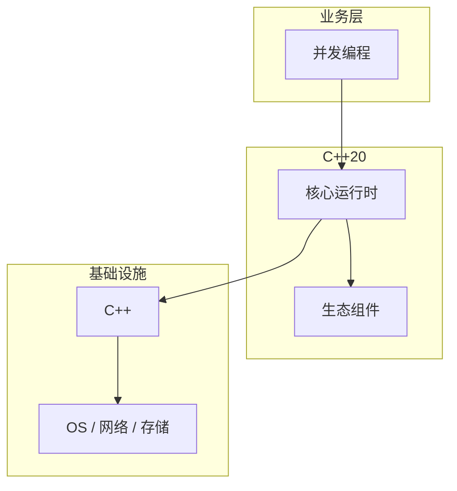

# 并发编程的性能优化技巧

> **领域**：C++ ｜ **模块**：并发编程 ｜ **难度**：高级 ｜ **类型**：性能优化

## 导读

本章系统讲解 **C++** 中 **并发编程** 的相关知识（性能优化）。本章从度量指标、瓶颈定位与优化手段三方面讲解 **并发编程** 的性能议题。内容基于主流框架与工程实践撰写，不依赖过时概念堆砌。

## 核心知识

std::thread、mutex、condition_variable、atomic；C++20 jthread 自动 join。

### 核心知识

**1. thread**

join/detach；detach 后不可 join。

**2. atomic**

compare_exchange 无锁结构基础。

**3. condition_variable**

wait 释放锁；notify_one/all。

**4. jthread**

stop_token 协作取消。

## 架构与流程

## 技术详解

### 性能优化

mutex 非递归默认；lock_guard/unique_lock RAII；死锁用 std::lock 多锁。

## 原理与实现

### 工作机制

mutex 非递归默认；lock_guard/unique_lock RAII；死锁用 std::lock 多锁。

### 内部实现

memory_order 控制 atomic 可见性；seq_cst 默认最强。

## 操作流程与实践

### 操作流程

共享数据 mutex 保护；条件变量 wait 防虚假唤醒用谓词；线程池 work queue。

### 配置要点

线程数 hardware_concurrency；线程本地 storage thread_local。

## 性能、安全与排查

### 性能优化

细粒度锁减争用；读多写少 shared_mutex C++17。

### 调试排错

TSan/Helgrind；gdb info threads。

## 案例与选型

### 案例复盘

生产者消费者 queue+condvar；并行 for std::execution::par。

### 方案对比

vs Java j.u.c：类似抽象；vs Go：共享内存需显式 sync。

## 本章聚焦

针对 **并发编程**，性能工作应「先度量后优化」：明确 P50/P95/P99 与资源占用基线，用 profiler/trace 定位热点，优先处理 I/O、锁竞争与算法复杂度问题，避免无数据支撑的微调。

### 常见误区与纠正

**detach 后 UAF**

对象已销毁线程仍跑。

**忘记 lock**

数据竞争。

**condvar 无谓词**

虚假唤醒 bug。

### 最佳实践

1. RAII 锁
2. TSan CI
3. 最小锁粒度
4. jthread 管理生命周期

## 巩固建议

建议结合 **C++** 官方文档与小型实验，亲手验证 **并发编程** 的默认行为与边界条件；将本章要点整理为检查清单或 ADR，便于评审与团队 onboarding。

### 本章小结

学完本章，你应能独立说明 **并发编程** 在 C++ 中的角色，理解其核心机制，规避常见误区，并在项目中正确运用。

## 延伸学习

- 并发编程核心概念与原理
- 并发编程的实现机制详解
- 并发编程的关键技术点
- 并发编程的源码级分析
- 并发编程的配置与使用

### 延伸阅读

- 《C++ Concurrency in Action》
- C++ 官方文档
- 并发编程 相关技术规范与社区指南

---
*章节 ID: 155 ｜ 领域: C++*