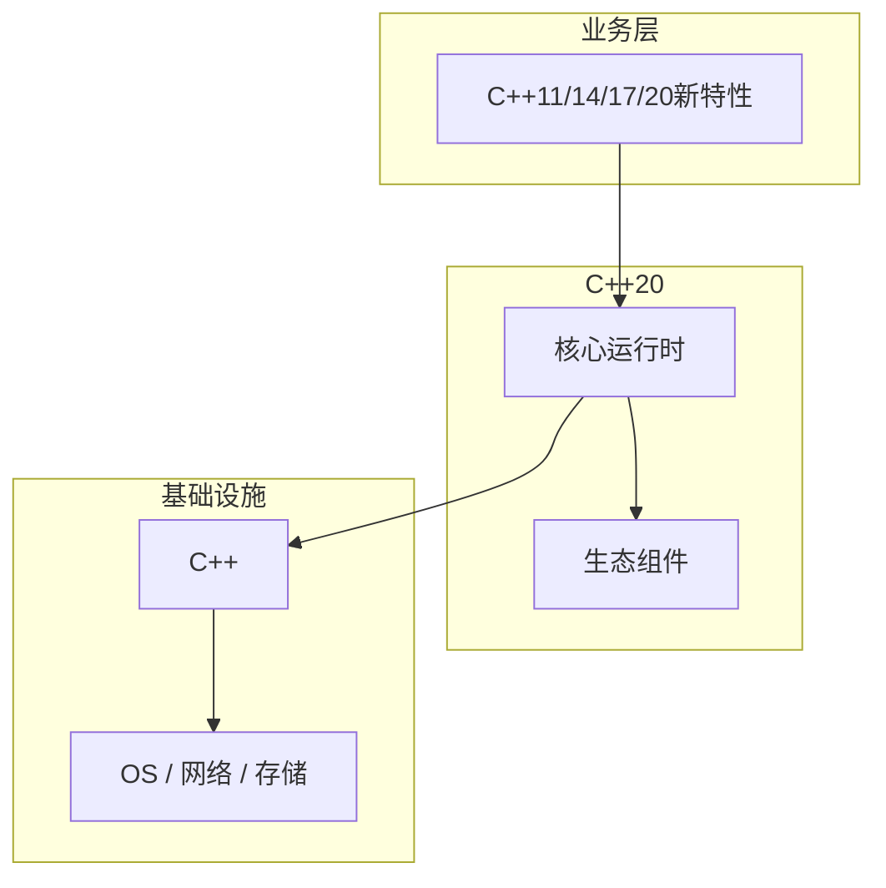

# C++11/14/17/20新特性核心概念与原理

> **领域**：C++ ｜ **模块**：C++11/14/17/20新特性 ｜ **难度**：实战 ｜ **类型**：基础概念

## 导读

本章系统讲解 **C++** 中 **C++11/14/17/20新特性** 的相关知识（基础概念）。本章建立 **C++11/14/17/20新特性** 的概念模型与工作原理，是后续专题章节的基础。内容基于主流框架与工程实践撰写，不依赖过时概念堆砌。

## 核心知识

现代 C++ 引入 auto、范围 for、移动语义、constexpr、概念、模块、协程等，改变惯用法。

### 核心知识

**1. 移动语义**

五特殊成员自动生成规则变化。

**2. constexpr**

C++20 图灵完备子集。

**3. 概念**

替代 SFINAE 约束。

**4. 协程**

promise_type 定制。

## 架构与流程

## 技术详解

### 基础理解

现代 C++ 引入 auto、范围 for、移动语义、constexpr、概念、模块、协程等，改变惯用法。

逐步启用标准：-std=c++20；迁移 nullptr、override、constexpr if。

## 原理与实现

### 工作机制

移动 std::move 转 xvalue；完美转发 std::forward<T>；右值引用 T&&。

### 内部实现

模块 C++20 import 减编译；coroutine co_await 状态机变换。

## 操作流程与实践

### 操作流程

逐步启用标准：-std=c++20；迁移 nullptr、override、constexpr if。

### 配置要点

modules CMake CXX_MODULE；/std:c++latest MSVC。

## 性能、安全与排查

### 性能优化

移动避免深拷贝；constexpr 编译期计算减运行时。

### 安全注意

coroutine 帧堆分配；模块宏污染减。

### 调试排错

概念错误更短；模块依赖 scanner。

## 案例与选型

### 案例复盘

ranges + views 管道式数据处理；span 安全数组视图。

### 方案对比

vs 旧 C++03：更安全表达力；持续演进 TS。

### 常见误区与纠正

**std::move 后使用**

moved-from 状态。

**auto 过度**

类型不明。

**模块混 include**

过渡混乱。

### 最佳实践

1. 目标 C++17 最低
2. 移动优先
3. concepts 新模板
4. 渐进 modules

## 巩固建议

建议结合 **C++** 官方文档与小型实验，亲手验证 **C++11/14/17/20新特性** 的默认行为与边界条件；将本章要点整理为检查清单或 ADR，便于评审与团队 onboarding。

### 本章小结

学完本章，你应能独立说明 **C++11/14/17/20新特性** 在 C++ 中的角色，理解其核心机制，规避常见误区，并在项目中正确运用。

## 延伸学习

- C++11/14/17/20新特性的实现机制详解
- C++11/14/17/20新特性的关键技术点
- C++11/14/17/20新特性的源码级分析
- C++11/14/17/20新特性的配置与使用
- C++11/14/17/20新特性的常见问题与解决方案

### 延伸阅读

- cppreference — C++20
- C++ 官方文档
- C++11/14/17/20新特性 相关技术规范与社区指南

---
*章节 ID: 162 ｜ 领域: C++*