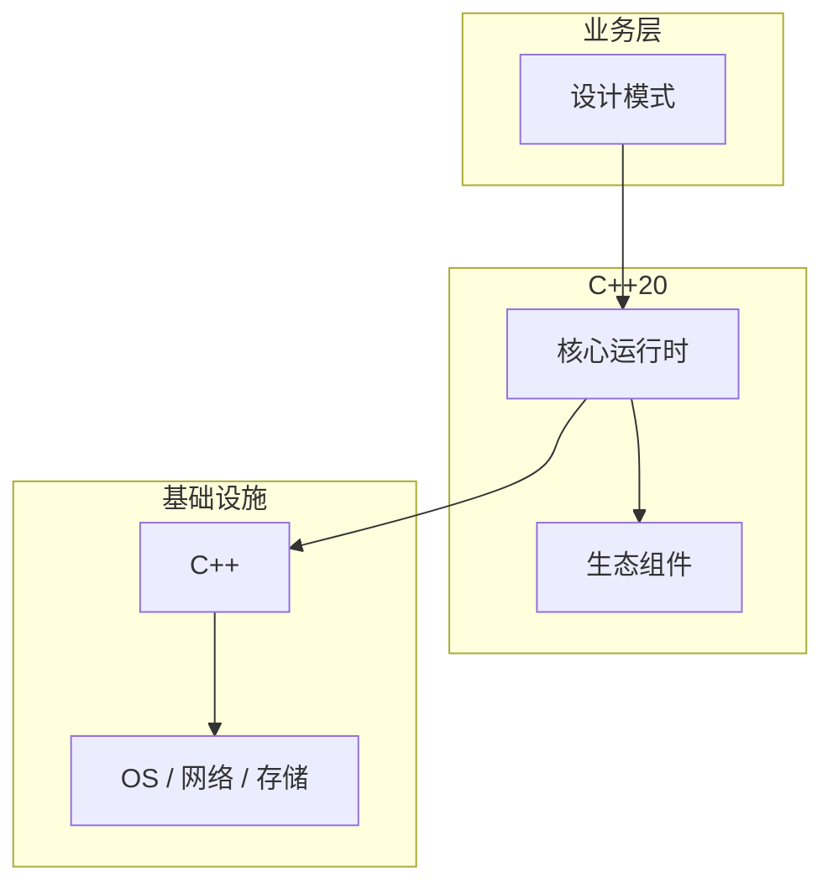

# 设计模式的实战案例分析

> **领域**：C++ ｜ **模块**：设计模式 ｜ **难度**：实战 ｜ **类型**：实战案例

## 导读

本章系统讲解 **C++** 中 **设计模式** 的相关知识（实战案例）。本章以真实工程案例串联 **设计模式** 的选型、实现与复盘要点。内容基于主流框架与工程实践撰写，不依赖过时概念堆砌。

## 核心知识

GoF 23 模式在 C++ 中通过虚函数、模板、RAII 实现；Modern C++ 偏 value semantics 与 type erasure。

### 核心知识

**1. Type erasure**

small buffer optimization。

**2. RAII**

资源获取即初始化替代部分 Factory。

**3. Strategy**

std::function 运行时替换。

**4. Observer**

回调列表；注意 lifetime。

## 架构与流程

## 技术详解

### 实战案例

单例 Meyers static local；工厂 method/abstract factory；Observer 信号槽。

## 原理与实现

### 工作机制

单例 Meyers static local；工厂 method/abstract factory；Observer 信号槽。

### 内部实现

CRTP 静态多态；Policy-based design 模板组合；type erasure 如 std::function。

## 操作流程与实践

### 操作流程

识别变化点 → 选模式 → 最小实现 → 测试扩展点。

## 性能、安全与排查

### 性能优化

过度模式增加间接层；C++ 可用 compile-time 策略减运行时。

### 安全注意

Singleton 全局状态测试难；双重检查锁需 memory_order。

### 调试排错

接口 mock 测 Strategy/Observer。

## 案例与选型

### 案例复盘

Pimpl 编译防火墙；Strategy std::function 注入。

### 方案对比

vs Java 模式：C++ 值语义+模板替代部分继承模式。

### 常见误区与纠正

**Singleton 滥用**

隐藏依赖。

**继承爆炸**

应用组合。

**线程不安全单例**

C++11 后 static 安全。

### 最佳实践

1. 组合优于继承
2. Pimpl 隐藏
3. function 策略
4. 模式服务需求

## 巩固建议

建议结合 **C++** 官方文档与小型实验，亲手验证 **设计模式** 的默认行为与边界条件；将本章要点整理为检查清单或 ADR，便于评审与团队 onboarding。

### 本章小结

学完本章，你应能独立说明 **设计模式** 在 C++ 中的角色，理解其核心机制，规避常见误区，并在项目中正确运用。

## 延伸学习

- 设计模式核心概念与原理
- 设计模式的实现机制详解
- 设计模式的关键技术点
- 设计模式的源码级分析
- 设计模式的配置与使用

### 延伸阅读

- 《Design Patterns》GoF + Modern C++ 解读
- C++ 官方文档
- 设计模式 相关技术规范与社区指南

---
*章节 ID: 184 ｜ 领域: C++*