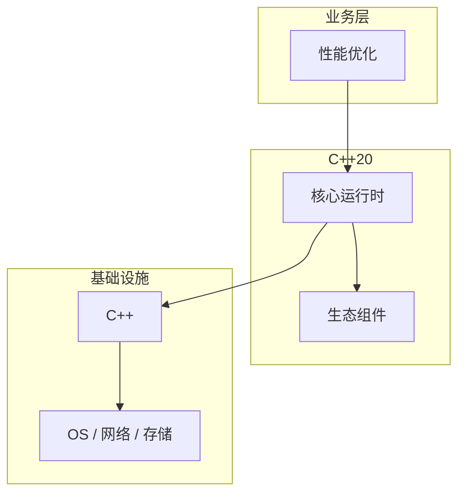

# 性能优化的常见问题与解决方案

> **领域**：C++ ｜ **模块**：性能优化 ｜ **难度**：实战 ｜ **类型**：问题排查

## 导读

本章系统讲解 **C++** 中 **性能优化** 的相关知识（问题排查）。本章围绕 **性能优化** 的典型故障现象、根因定位与修复步骤组织内容。内容基于主流框架与工程实践撰写，不依赖过时概念堆砌。

## 核心知识

C++ 零开销抽象：测量后优化；CPU cache、分支预测、内存分配与算法复杂度是主战场。

### 核心知识

**1. CPU cache**

行大小 64B； locality。

**2. 分支预测**

likely 宏；有序数据。

**3. RVO/NRVO**

命名返回值优化。

**4. Small Buffer**

string/function 栈上。

## 架构与流程

## 技术详解

### 问题排查

perf/VTune 采样；PGO 训练热点；LTO 跨单元内联。

## 原理与实现

### 工作机制

perf/VTune 采样；PGO 训练热点；LTO 跨单元内联。

### 内部实现

false sharing cache line；alignas 避免；NUMA first-touch。

## 操作流程与实践

### 操作流程

baseline benchmark → profile → 改热点 → 回归测试。

### 配置要点

-march=native -flto；jemalloc。

## 性能、安全与排查

### 性能优化

小对象 SSO string；池化 allocator；避免 iostream 热路径。

### 安全注意

微优化牺牲可读需注释；volatile 非线程同步。

### 调试排错

perf record/report；Cachegrind。

## 案例与选型

### 案例复盘

游戏引擎 ECS 数据导向；HFT 无锁队列。

### 方案对比

vs 过早优化：Knuth 名言；数据驱动。

## 本章聚焦

排障 **性能优化** 时建议固定顺序：复现 → 收集日志/metrics/trace → 对比最近变更与配置 diff → 最小化隔离实验 → 记录根因与回归用例。

### 常见误区与纠正

**无 profile 乱优化**

浪费时间。

**牺牲 API 换速度**

维护债。

**多线程 false sharing**

性能骤降。

### 最佳实践

1. 先测后优
2. LTO/PGO 发布
3. DOD 布局
4. 文档化假设

## 巩固建议

建议结合 **C++** 官方文档与小型实验，亲手验证 **性能优化** 的默认行为与边界条件；将本章要点整理为检查清单或 ADR，便于评审与团队 onboarding。

### 本章小结

学完本章，你应能独立说明 **性能优化** 在 C++ 中的角色，理解其核心机制，规避常见误区，并在项目中正确运用。

## 延伸学习

- 性能优化核心概念与原理
- 性能优化的实现机制详解
- 性能优化的关键技术点
- 性能优化的源码级分析
- 性能优化的配置与使用

### 延伸阅读

- Agner Fog optimization manuals
- C++ 官方文档
- 性能优化 相关技术规范与社区指南

---
*章节 ID: 193 ｜ 领域: C++*