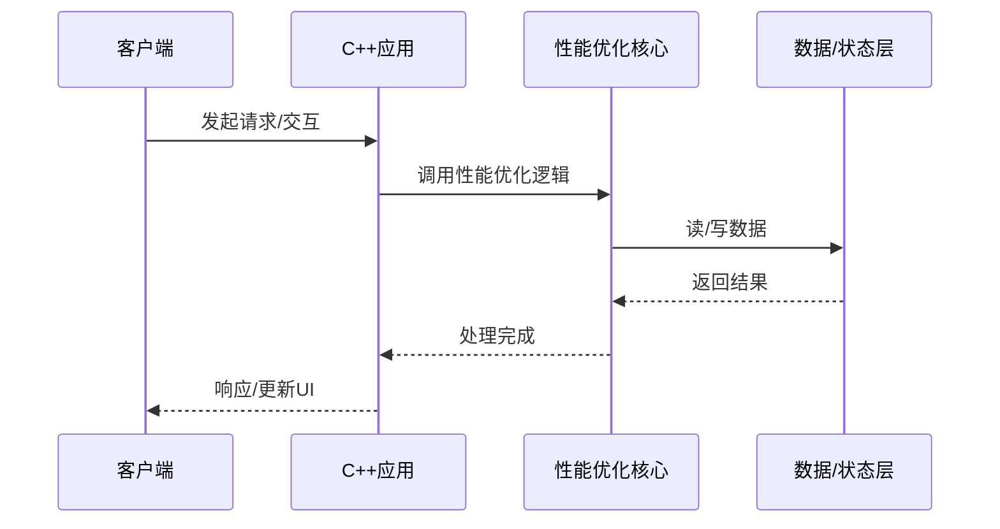

# 性能优化的底层原理剖析

> **领域**：C++ ｜ **模块**：性能优化 ｜ **难度**：实战 ｜ **类型**：底层原理

## 导读

本章属于 **C++** 教程的 **性能优化** 模块，难度为 **实战**。阅读重点在于建立清晰的概念模型与工程判断能力，而非死记细节。

## 核心概念

C++ 是当前技术生态中的重要方向，系统学习需兼顾概念、原理与工程实践。

在 **C++** 体系中，**性能优化** 与上下游模块形成协作。技术栈以 **C++20** 为核心（C++），生态包括 STL, CMake, clang。

「性能优化」是该领域的核心知识模块，理解其原理与边界是工程实践的基础。

### 概念精讲

**性能优化的基本概念与定义**

从度量出发：如何评估它是否工作正常、性能是否达标。 在 性能优化 语境下，这一点直接影响设计决策与故障排查思路。

**性能优化在C++中的作用与地位**

从定义出发：它解决什么问题、不解决什么问题，边界在哪里。 在 性能优化 语境下，这一点直接影响设计决策与故障排查思路。

**性能优化的核心数据结构**

从结构出发：核心组成部分是什么，彼此如何协作。 在 性能优化 语境下，这一点直接影响设计决策与故障排查思路。

**性能优化的关键算法与流程**

从流程出发：一次完整调用或生命周期经历哪些阶段。 在 性能优化 语境下，这一点直接影响设计决策与故障排查思路。

**性能优化与其他模块的关系**

从数据出发：输入输出是什么格式，状态如何变迁。 在 性能优化 语境下，这一点直接影响设计决策与故障排查思路。

## 架构与流程

以下框图帮助你在宏观层面把握模块协作关系与处理流向：

## 深度讲解

### 底层视角

性能优化 最终转化为内存读写、系统调用、网络 I/O、线程调度。页大小、锁粒度、网络 RTT 等约束依然存在。

### 内存与资源

关注分配模式、对象池、临时对象风暴、大对象存储。资源泄漏缓慢累积，看趋势而非瞬时值。

### 硬件协同

缓存友好性、NUMA、顺序读 vs 随机读，影响极限负载表现。

### 落地检查清单

- **掌握性能优化的调优技巧与最佳实践**：落地时需明确验收标准与回滚方案。
- **了解性能优化在实际项目中的应用案例**：落地时需明确验收标准与回滚方案。
- **理解性能优化的设计思想与适用场景**：落地时需明确验收标准与回滚方案。
- **掌握性能优化的核心API与配置项**：落地时需明确验收标准与回滚方案。

### 常见误区与应对

**误区：对性能优化的概念理解不深入导致误用**

**应对**：回到官方定义画一张概念图，与同事讲解一遍，确保能用自己的话复述。

**误区：忽略性能优化的性能边界与限制条件**

**应对**：用 Profiler 或压测建立基线，对比优化前后数据，避免凭感觉优化。

**误区：性能优化配置不当引发的问题**

**应对**：用 Profiler 或压测建立基线，对比优化前后数据，避免凭感觉优化。

**误区：缺乏对性能优化底层原理的理解**

**应对**：用 Profiler 或压测建立基线，对比优化前后数据，避免凭感觉优化。

**误区：性能优化与其他模块集成时的兼容性问题**

**应对**：用 Profiler 或压测建立基线，对比优化前后数据，避免凭感觉优化。

### 最佳实践

1. **遵循性能优化的官方推荐用法与规范** — 落地方式：写入团队 Wiki 并纳入 Code Review 检查项。

2. **在理解原理的基础上合理使用性能优化** — 落地方式：配置静态检查或 CI 规则自动拦截违规写法。

3. **建立完善的性能优化监控与告警机制** — 落地方式：在新人 onboarding 中作为必修内容讲解。

4. **编写充分的测试用例覆盖性能优化的各种场景** — 落地方式：每季度回顾一次，对照社区最佳实践更新。

5. **持续关注性能优化的版本更新与最佳实践演进** — 落地方式：用真实项目案例演示正确与错误对比。

### 本章小结

学完本章，你应能：

- 说清 **性能优化的底层原理剖析** 在 C++/性能优化 中的定位。
- 描述核心流程与关键概念，能用自己的话复述。
- 识别常见误区并采取预防与排查手段。
- 在项目中做出与场景匹配的工程决策。

类型：**底层原理**。建议完成小练习或复盘笔记，将阅读转化为能力。

## 延伸学习

建议结合以下同模块章节继续阅读，构建完整知识链：

- 性能优化的实战案例分析
- 性能优化的设计思想与演进
- 性能优化的调试与排错

### 参考资料

- C++官方文档 - 性能优化章节
- 《C++权威指南》相关章节
- 性能优化源码实现与注释
- C++社区最佳实践文章
- 性能优化相关技术博客与教程

---
*章节 ID: 199 ｜ 领域: C++ ｜ 版本: 2.0*