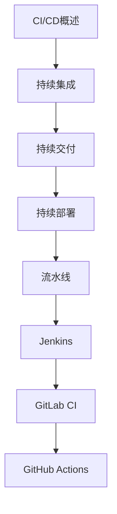

# CI与CD 学习指南

> **分类**：DevOps ｜ **技术生态**：GitHub Actions、GitLab CI、Jenkins、ArgoCD、Harbor

## 领域定位

CI 持续集成自动构建测试，CD 持续交付/部署将制品晋级至生产。流水线即代码，与 Git 分支策略和制品库紧密配合。

覆盖 Jenkins、GitHub Actions、GitLab CI、ArgoCD 与蓝绿/金丝雀部署。

本领域常用技术栈与工具包括：GitHub Actions、GitLab CI、Jenkins、ArgoCD、Harbor。

## 学习目标

- 能编写流水线 YAML
- 能集成单元测试与镜像构建
- 能设计部署策略与回滚
- 能管理密钥与制品版本

## 前置知识

- Git
- Docker
- 自动化测试基础

## 学习路径

1. **CI/CD概述**
2. **持续集成**
3. **持续交付**
4. **持续部署**
5. **流水线**
6. **Jenkins**
7. **GitLab CI**
8. **GitHub Actions**

## 模块体系

- **CI/CD概述**
- **持续集成**
- **持续交付**
- **持续部署**
- **流水线**
- **Jenkins**
- **GitLab CI**
- **GitHub Actions**
- **ArgoCD**
- **制品管理**
- **自动化测试**
- **部署策略**
- **回滚**
- **安全**
- **CI/CD最佳实践**

## 难度分布

| 入门 | 18 | 22% |
| 实战 | 15 | 18% |
| 进阶 | 22 | 27% |
| 高级 | 25 | 31% |

## 章节索引

### CI/CD概述

- [CI/CD概述核心概念与原理](chapters/001-CICD概述核心概念与原理.md) ｜ 入门
- [CI/CD概述的实现机制详解](chapters/002-CICD概述的实现机制详解.md) ｜ 入门
- [CI/CD概述的关键技术点](chapters/003-CICD概述的关键技术点.md) ｜ 入门
- [CI/CD概述的源码级分析](chapters/004-CICD概述的源码级分析.md) ｜ 入门
- [CI/CD概述的配置与使用](chapters/005-CICD概述的配置与使用.md) ｜ 入门
- [CI/CD概述的常见问题与解决方案](chapters/006-CICD概述的常见问题与解决方案.md) ｜ 入门

### 持续集成

- [持续集成核心概念与原理](chapters/007-持续集成核心概念与原理.md) ｜ 入门
- [持续集成的实现机制详解](chapters/008-持续集成的实现机制详解.md) ｜ 入门
- [持续集成的关键技术点](chapters/009-持续集成的关键技术点.md) ｜ 入门
- [持续集成的源码级分析](chapters/010-持续集成的源码级分析.md) ｜ 入门
- [持续集成的配置与使用](chapters/011-持续集成的配置与使用.md) ｜ 入门
- [持续集成的常见问题与解决方案](chapters/012-持续集成的常见问题与解决方案.md) ｜ 入门

### 持续交付

- [持续交付核心概念与原理](chapters/013-持续交付核心概念与原理.md) ｜ 入门
- [持续交付的实现机制详解](chapters/014-持续交付的实现机制详解.md) ｜ 入门
- [持续交付的关键技术点](chapters/015-持续交付的关键技术点.md) ｜ 入门
- [持续交付的源码级分析](chapters/016-持续交付的源码级分析.md) ｜ 入门
- [持续交付的配置与使用](chapters/017-持续交付的配置与使用.md) ｜ 入门
- [持续交付的常见问题与解决方案](chapters/018-持续交付的常见问题与解决方案.md) ｜ 入门

### 持续部署

- [持续部署核心概念与原理](chapters/019-持续部署核心概念与原理.md) ｜ 进阶
- [持续部署的实现机制详解](chapters/020-持续部署的实现机制详解.md) ｜ 进阶
- [持续部署的关键技术点](chapters/021-持续部署的关键技术点.md) ｜ 进阶
- [持续部署的源码级分析](chapters/022-持续部署的源码级分析.md) ｜ 进阶
- [持续部署的配置与使用](chapters/023-持续部署的配置与使用.md) ｜ 进阶
- [持续部署的常见问题与解决方案](chapters/024-持续部署的常见问题与解决方案.md) ｜ 进阶

### 流水线

- [流水线核心概念与原理](chapters/025-流水线核心概念与原理.md) ｜ 进阶
- [流水线的实现机制详解](chapters/026-流水线的实现机制详解.md) ｜ 进阶
- [流水线的关键技术点](chapters/027-流水线的关键技术点.md) ｜ 进阶
- [流水线的源码级分析](chapters/028-流水线的源码级分析.md) ｜ 进阶
- [流水线的配置与使用](chapters/029-流水线的配置与使用.md) ｜ 进阶
- [流水线的常见问题与解决方案](chapters/030-流水线的常见问题与解决方案.md) ｜ 进阶

### Jenkins

- [Jenkins核心概念与原理](chapters/031-Jenkins核心概念与原理.md) ｜ 进阶
- [Jenkins的实现机制详解](chapters/032-Jenkins的实现机制详解.md) ｜ 进阶
- [Jenkins的关键技术点](chapters/033-Jenkins的关键技术点.md) ｜ 进阶
- [Jenkins的源码级分析](chapters/034-Jenkins的源码级分析.md) ｜ 进阶
- [Jenkins的配置与使用](chapters/035-Jenkins的配置与使用.md) ｜ 进阶

### GitLab CI

- [GitLab CI核心概念与原理](chapters/036-GitLab-CI核心概念与原理.md) ｜ 进阶
- [GitLab CI的实现机制详解](chapters/037-GitLab-CI的实现机制详解.md) ｜ 进阶
- [GitLab CI的关键技术点](chapters/038-GitLab-CI的关键技术点.md) ｜ 进阶
- [GitLab CI的源码级分析](chapters/039-GitLab-CI的源码级分析.md) ｜ 进阶
- [GitLab CI的配置与使用](chapters/040-GitLab-CI的配置与使用.md) ｜ 进阶

### GitHub Actions

- [GitHub Actions核心概念与原理](chapters/041-GitHub-Actions核心概念与原理.md) ｜ 高级
- [GitHub Actions的实现机制详解](chapters/042-GitHub-Actions的实现机制详解.md) ｜ 高级
- [GitHub Actions的关键技术点](chapters/043-GitHub-Actions的关键技术点.md) ｜ 高级
- [GitHub Actions的源码级分析](chapters/044-GitHub-Actions的源码级分析.md) ｜ 高级
- [GitHub Actions的配置与使用](chapters/045-GitHub-Actions的配置与使用.md) ｜ 高级

### ArgoCD

- [ArgoCD核心概念与原理](chapters/046-ArgoCD核心概念与原理.md) ｜ 高级
- [ArgoCD的实现机制详解](chapters/047-ArgoCD的实现机制详解.md) ｜ 高级
- [ArgoCD的关键技术点](chapters/048-ArgoCD的关键技术点.md) ｜ 高级
- [ArgoCD的源码级分析](chapters/049-ArgoCD的源码级分析.md) ｜ 高级
- [ArgoCD的配置与使用](chapters/050-ArgoCD的配置与使用.md) ｜ 高级

### 制品管理

- [制品管理核心概念与原理](chapters/051-制品管理核心概念与原理.md) ｜ 高级
- [制品管理的实现机制详解](chapters/052-制品管理的实现机制详解.md) ｜ 高级
- [制品管理的关键技术点](chapters/053-制品管理的关键技术点.md) ｜ 高级
- [制品管理的源码级分析](chapters/054-制品管理的源码级分析.md) ｜ 高级
- [制品管理的配置与使用](chapters/055-制品管理的配置与使用.md) ｜ 高级

### 自动化测试

- [自动化测试核心概念与原理](chapters/056-自动化测试核心概念与原理.md) ｜ 高级
- [自动化测试的实现机制详解](chapters/057-自动化测试的实现机制详解.md) ｜ 高级
- [自动化测试的关键技术点](chapters/058-自动化测试的关键技术点.md) ｜ 高级
- [自动化测试的源码级分析](chapters/059-自动化测试的源码级分析.md) ｜ 高级
- [自动化测试的配置与使用](chapters/060-自动化测试的配置与使用.md) ｜ 高级

### 部署策略

- [部署策略核心概念与原理](chapters/061-部署策略核心概念与原理.md) ｜ 高级
- [部署策略的实现机制详解](chapters/062-部署策略的实现机制详解.md) ｜ 高级
- [部署策略的关键技术点](chapters/063-部署策略的关键技术点.md) ｜ 高级
- [部署策略的源码级分析](chapters/064-部署策略的源码级分析.md) ｜ 高级
- [部署策略的配置与使用](chapters/065-部署策略的配置与使用.md) ｜ 高级

### 回滚

- [回滚核心概念与原理](chapters/066-回滚核心概念与原理.md) ｜ 实战
- [回滚的实现机制详解](chapters/067-回滚的实现机制详解.md) ｜ 实战
- [回滚的关键技术点](chapters/068-回滚的关键技术点.md) ｜ 实战
- [回滚的源码级分析](chapters/069-回滚的源码级分析.md) ｜ 实战
- [回滚的配置与使用](chapters/070-回滚的配置与使用.md) ｜ 实战

### 安全

- [安全核心概念与原理](chapters/071-安全核心概念与原理.md) ｜ 实战
- [安全的实现机制详解](chapters/072-安全的实现机制详解.md) ｜ 实战
- [安全的关键技术点](chapters/073-安全的关键技术点.md) ｜ 实战
- [安全的源码级分析](chapters/074-安全的源码级分析.md) ｜ 实战
- [安全的配置与使用](chapters/075-安全的配置与使用.md) ｜ 实战

### CI/CD最佳实践

- [CI/CD最佳实践核心概念与原理](chapters/076-CICD最佳实践核心概念与原理.md) ｜ 实战
- [CI/CD最佳实践的实现机制详解](chapters/077-CICD最佳实践的实现机制详解.md) ｜ 实战
- [CI/CD最佳实践的关键技术点](chapters/078-CICD最佳实践的关键技术点.md) ｜ 实战
- [CI/CD最佳实践的源码级分析](chapters/079-CICD最佳实践的源码级分析.md) ｜ 实战
- [CI/CD最佳实践的配置与使用](chapters/080-CICD最佳实践的配置与使用.md) ｜ 实战

---
*领域: CI与CD*