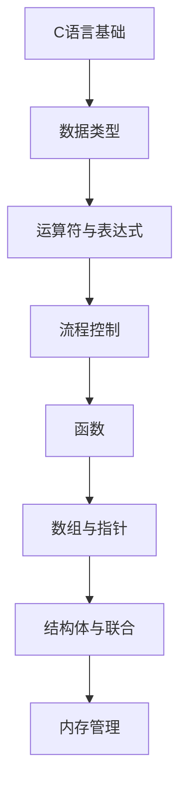

# C语言 学习指南

> **分类**：编程语言 ｜ **章节总数**：120 ｜ **技术栈**：C11/C17

## 领域概述

C语言是编程语言领域的重要技术方向，本系列从基础到高级逐步深入，涵盖13个核心模块：C语言基础、数据类型、运算符与表达式、流程控制、函数等。每个知识点作为独立章节，包含原理讲解、实现要点、常见陷阱和最佳实践，配合源码分析和架构图，帮助读者建立完整的C语言知识体系。

本教程基于 **C** 与 **C11/C17** 生态编写，涵盖 gcc, clang, make 等主流工具与框架。每章独立成篇，文字精炼、逻辑清晰，适合系统学习与按需查阅。

## 你将学到什么

完成本系列后，你将能够：

- 系统理解 **C语言** 的核心概念与模块划分。
- 按难度递进掌握从入门到实战的完整知识路径。
- 在工程实践中做出合理的技术判断与问题排查。
- 通过章节索引快速定位所需知识点。

## 前置知识

- 编程基础
- 数据结构
- 计算机基础
- 编程语言基础概念

## 推荐学习路径

1. **C语言基础**
2. **数据类型**
3. **运算符与表达式**
4. **流程控制**
5. **函数**
6. **数组与指针**
7. **结构体与联合**
8. **内存管理**

## 模块体系

本领域按以下模块组织，难度由浅入深：

- **C语言基础**
- **数据类型**
- **运算符与表达式**
- **流程控制**
- **函数**
- **数组与指针**
- **结构体与联合**
- **内存管理**
- **文件IO**
- **预处理**
- **高级特性**
- **C标准库**
- **C语言最佳实践**

## 难度分布

| 难度 | 章节数 | 占比 |
|------|--------|------|
| 入门 | 30 | 25% |
| 实战 | 27 | 22% |
| 进阶 | 27 | 22% |
| 高级 | 36 | 30% |

## 章节索引

点击章节标题进入对应教程：

### C语言基础

- [C语言基础核心概念与原理](chapters/001-C语言基础核心概念与原理.md) ｜ 入门
- [C语言基础的实现机制详解](chapters/002-C语言基础的实现机制详解.md) ｜ 入门
- [C语言基础的关键技术点](chapters/003-C语言基础的关键技术点.md) ｜ 入门
- [C语言基础的源码级分析](chapters/004-C语言基础的源码级分析.md) ｜ 入门
- [C语言基础的配置与使用](chapters/005-C语言基础的配置与使用.md) ｜ 入门
- [C语言基础的常见问题与解决方案](chapters/006-C语言基础的常见问题与解决方案.md) ｜ 入门
- [C语言基础的性能优化技巧](chapters/007-C语言基础的性能优化技巧.md) ｜ 入门
- [C语言基础的最佳实践指南](chapters/008-C语言基础的最佳实践指南.md) ｜ 入门
- [C语言基础的高级应用场景](chapters/009-C语言基础的高级应用场景.md) ｜ 入门
- [C语言基础的实战案例分析](chapters/010-C语言基础的实战案例分析.md) ｜ 入门

### 数据类型

- [数据类型核心概念与原理](chapters/011-数据类型核心概念与原理.md) ｜ 入门
- [数据类型的实现机制详解](chapters/012-数据类型的实现机制详解.md) ｜ 入门
- [数据类型的关键技术点](chapters/013-数据类型的关键技术点.md) ｜ 入门
- [数据类型的源码级分析](chapters/014-数据类型的源码级分析.md) ｜ 入门
- [数据类型的配置与使用](chapters/015-数据类型的配置与使用.md) ｜ 入门
- [数据类型的常见问题与解决方案](chapters/016-数据类型的常见问题与解决方案.md) ｜ 入门
- [数据类型的性能优化技巧](chapters/017-数据类型的性能优化技巧.md) ｜ 入门
- [数据类型的最佳实践指南](chapters/018-数据类型的最佳实践指南.md) ｜ 入门
- [数据类型的高级应用场景](chapters/019-数据类型的高级应用场景.md) ｜ 入门
- [数据类型的实战案例分析](chapters/020-数据类型的实战案例分析.md) ｜ 入门

### 运算符与表达式

- [运算符与表达式核心概念与原理](chapters/021-运算符与表达式核心概念与原理.md) ｜ 入门
- [运算符与表达式的实现机制详解](chapters/022-运算符与表达式的实现机制详解.md) ｜ 入门
- [运算符与表达式的关键技术点](chapters/023-运算符与表达式的关键技术点.md) ｜ 入门
- [运算符与表达式的源码级分析](chapters/024-运算符与表达式的源码级分析.md) ｜ 入门
- [运算符与表达式的配置与使用](chapters/025-运算符与表达式的配置与使用.md) ｜ 入门
- [运算符与表达式的常见问题与解决方案](chapters/026-运算符与表达式的常见问题与解决方案.md) ｜ 入门
- [运算符与表达式的性能优化技巧](chapters/027-运算符与表达式的性能优化技巧.md) ｜ 入门
- [运算符与表达式的最佳实践指南](chapters/028-运算符与表达式的最佳实践指南.md) ｜ 入门
- [运算符与表达式的高级应用场景](chapters/029-运算符与表达式的高级应用场景.md) ｜ 入门
- [运算符与表达式的实战案例分析](chapters/030-运算符与表达式的实战案例分析.md) ｜ 入门

### 流程控制

- [流程控制核心概念与原理](chapters/031-流程控制核心概念与原理.md) ｜ 进阶
- [流程控制的实现机制详解](chapters/032-流程控制的实现机制详解.md) ｜ 进阶
- [流程控制的关键技术点](chapters/033-流程控制的关键技术点.md) ｜ 进阶
- [流程控制的源码级分析](chapters/034-流程控制的源码级分析.md) ｜ 进阶
- [流程控制的配置与使用](chapters/035-流程控制的配置与使用.md) ｜ 进阶
- [流程控制的常见问题与解决方案](chapters/036-流程控制的常见问题与解决方案.md) ｜ 进阶
- [流程控制的性能优化技巧](chapters/037-流程控制的性能优化技巧.md) ｜ 进阶
- [流程控制的最佳实践指南](chapters/038-流程控制的最佳实践指南.md) ｜ 进阶
- [流程控制的高级应用场景](chapters/039-流程控制的高级应用场景.md) ｜ 进阶

### 函数

- [函数核心概念与原理](chapters/040-函数核心概念与原理.md) ｜ 进阶
- [函数的实现机制详解](chapters/041-函数的实现机制详解.md) ｜ 进阶
- [函数的关键技术点](chapters/042-函数的关键技术点.md) ｜ 进阶
- [函数的源码级分析](chapters/043-函数的源码级分析.md) ｜ 进阶
- [函数的配置与使用](chapters/044-函数的配置与使用.md) ｜ 进阶
- [函数的常见问题与解决方案](chapters/045-函数的常见问题与解决方案.md) ｜ 进阶
- [函数的性能优化技巧](chapters/046-函数的性能优化技巧.md) ｜ 进阶
- [函数的最佳实践指南](chapters/047-函数的最佳实践指南.md) ｜ 进阶
- [函数的高级应用场景](chapters/048-函数的高级应用场景.md) ｜ 进阶

### 数组与指针

- [数组与指针核心概念与原理](chapters/049-数组与指针核心概念与原理.md) ｜ 进阶
- [数组与指针的实现机制详解](chapters/050-数组与指针的实现机制详解.md) ｜ 进阶
- [数组与指针的关键技术点](chapters/051-数组与指针的关键技术点.md) ｜ 进阶
- [数组与指针的源码级分析](chapters/052-数组与指针的源码级分析.md) ｜ 进阶
- [数组与指针的配置与使用](chapters/053-数组与指针的配置与使用.md) ｜ 进阶
- [数组与指针的常见问题与解决方案](chapters/054-数组与指针的常见问题与解决方案.md) ｜ 进阶
- [数组与指针的性能优化技巧](chapters/055-数组与指针的性能优化技巧.md) ｜ 进阶
- [数组与指针的最佳实践指南](chapters/056-数组与指针的最佳实践指南.md) ｜ 进阶
- [数组与指针的高级应用场景](chapters/057-数组与指针的高级应用场景.md) ｜ 进阶

### 结构体与联合

- [结构体与联合核心概念与原理](chapters/058-结构体与联合核心概念与原理.md) ｜ 高级
- [结构体与联合的实现机制详解](chapters/059-结构体与联合的实现机制详解.md) ｜ 高级
- [结构体与联合的关键技术点](chapters/060-结构体与联合的关键技术点.md) ｜ 高级
- [结构体与联合的源码级分析](chapters/061-结构体与联合的源码级分析.md) ｜ 高级
- [结构体与联合的配置与使用](chapters/062-结构体与联合的配置与使用.md) ｜ 高级
- [结构体与联合的常见问题与解决方案](chapters/063-结构体与联合的常见问题与解决方案.md) ｜ 高级
- [结构体与联合的性能优化技巧](chapters/064-结构体与联合的性能优化技巧.md) ｜ 高级
- [结构体与联合的最佳实践指南](chapters/065-结构体与联合的最佳实践指南.md) ｜ 高级
- [结构体与联合的高级应用场景](chapters/066-结构体与联合的高级应用场景.md) ｜ 高级

### 内存管理

- [内存管理核心概念与原理](chapters/067-内存管理核心概念与原理.md) ｜ 高级
- [内存管理的实现机制详解](chapters/068-内存管理的实现机制详解.md) ｜ 高级
- [内存管理的关键技术点](chapters/069-内存管理的关键技术点.md) ｜ 高级
- [内存管理的源码级分析](chapters/070-内存管理的源码级分析.md) ｜ 高级
- [内存管理的配置与使用](chapters/071-内存管理的配置与使用.md) ｜ 高级
- [内存管理的常见问题与解决方案](chapters/072-内存管理的常见问题与解决方案.md) ｜ 高级
- [内存管理的性能优化技巧](chapters/073-内存管理的性能优化技巧.md) ｜ 高级
- [内存管理的最佳实践指南](chapters/074-内存管理的最佳实践指南.md) ｜ 高级
- [内存管理的高级应用场景](chapters/075-内存管理的高级应用场景.md) ｜ 高级

### 文件IO

- [文件IO核心概念与原理](chapters/076-文件IO核心概念与原理.md) ｜ 高级
- [文件IO的实现机制详解](chapters/077-文件IO的实现机制详解.md) ｜ 高级
- [文件IO的关键技术点](chapters/078-文件IO的关键技术点.md) ｜ 高级
- [文件IO的源码级分析](chapters/079-文件IO的源码级分析.md) ｜ 高级
- [文件IO的配置与使用](chapters/080-文件IO的配置与使用.md) ｜ 高级
- [文件IO的常见问题与解决方案](chapters/081-文件IO的常见问题与解决方案.md) ｜ 高级
- [文件IO的性能优化技巧](chapters/082-文件IO的性能优化技巧.md) ｜ 高级
- [文件IO的最佳实践指南](chapters/083-文件IO的最佳实践指南.md) ｜ 高级
- [文件IO的高级应用场景](chapters/084-文件IO的高级应用场景.md) ｜ 高级

### 预处理

- [预处理核心概念与原理](chapters/085-预处理核心概念与原理.md) ｜ 高级
- [预处理的实现机制详解](chapters/086-预处理的实现机制详解.md) ｜ 高级
- [预处理的关键技术点](chapters/087-预处理的关键技术点.md) ｜ 高级
- [预处理的源码级分析](chapters/088-预处理的源码级分析.md) ｜ 高级
- [预处理的配置与使用](chapters/089-预处理的配置与使用.md) ｜ 高级
- [预处理的常见问题与解决方案](chapters/090-预处理的常见问题与解决方案.md) ｜ 高级
- [预处理的性能优化技巧](chapters/091-预处理的性能优化技巧.md) ｜ 高级
- [预处理的最佳实践指南](chapters/092-预处理的最佳实践指南.md) ｜ 高级
- [预处理的高级应用场景](chapters/093-预处理的高级应用场景.md) ｜ 高级

### 高级特性

- [高级特性核心概念与原理](chapters/094-高级特性核心概念与原理.md) ｜ 实战
- [高级特性的实现机制详解](chapters/095-高级特性的实现机制详解.md) ｜ 实战
- [高级特性的关键技术点](chapters/096-高级特性的关键技术点.md) ｜ 实战
- [高级特性的源码级分析](chapters/097-高级特性的源码级分析.md) ｜ 实战
- [高级特性的配置与使用](chapters/098-高级特性的配置与使用.md) ｜ 实战
- [高级特性的常见问题与解决方案](chapters/099-高级特性的常见问题与解决方案.md) ｜ 实战
- [高级特性的性能优化技巧](chapters/100-高级特性的性能优化技巧.md) ｜ 实战
- [高级特性的最佳实践指南](chapters/101-高级特性的最佳实践指南.md) ｜ 实战
- [高级特性的高级应用场景](chapters/102-高级特性的高级应用场景.md) ｜ 实战

### C标准库

- [C标准库核心概念与原理](chapters/103-C标准库核心概念与原理.md) ｜ 实战
- [C标准库的实现机制详解](chapters/104-C标准库的实现机制详解.md) ｜ 实战
- [C标准库的关键技术点](chapters/105-C标准库的关键技术点.md) ｜ 实战
- [C标准库的源码级分析](chapters/106-C标准库的源码级分析.md) ｜ 实战
- [C标准库的配置与使用](chapters/107-C标准库的配置与使用.md) ｜ 实战
- [C标准库的常见问题与解决方案](chapters/108-C标准库的常见问题与解决方案.md) ｜ 实战
- [C标准库的性能优化技巧](chapters/109-C标准库的性能优化技巧.md) ｜ 实战
- [C标准库的最佳实践指南](chapters/110-C标准库的最佳实践指南.md) ｜ 实战
- [C标准库的高级应用场景](chapters/111-C标准库的高级应用场景.md) ｜ 实战

### C语言最佳实践

- [C语言最佳实践核心概念与原理](chapters/112-C语言最佳实践核心概念与原理.md) ｜ 实战
- [C语言最佳实践的实现机制详解](chapters/113-C语言最佳实践的实现机制详解.md) ｜ 实战
- [C语言最佳实践的关键技术点](chapters/114-C语言最佳实践的关键技术点.md) ｜ 实战
- [C语言最佳实践的源码级分析](chapters/115-C语言最佳实践的源码级分析.md) ｜ 实战
- [C语言最佳实践的配置与使用](chapters/116-C语言最佳实践的配置与使用.md) ｜ 实战
- [C语言最佳实践的常见问题与解决方案](chapters/117-C语言最佳实践的常见问题与解决方案.md) ｜ 实战
- [C语言最佳实践的性能优化技巧](chapters/118-C语言最佳实践的性能优化技巧.md) ｜ 实战
- [C语言最佳实践的最佳实践指南](chapters/119-C语言最佳实践的最佳实践指南.md) ｜ 实战
- [C语言最佳实践的高级应用场景](chapters/120-C语言最佳实践的高级应用场景.md) ｜ 实战

## 学习方法建议

1. **先读概述再读章节**：用本指南建立全局地图，避免迷失在细节中。
2. **按模块递进**：同一模块内章节有前后关联，顺序阅读效果更好。
3. **主动复述**：每章读完后，用三五句话概括「是什么、为什么、怎么用」。
4. **关联阅读**：利用章节底部的「延伸学习」在同模块内构建知识网络。
5. **对照官方文档**：本教程提供结构化视角，细节以官方文档为准。

---
*领域: C语言 ｜ 版本: 2.0 ｜ 共 120 章*