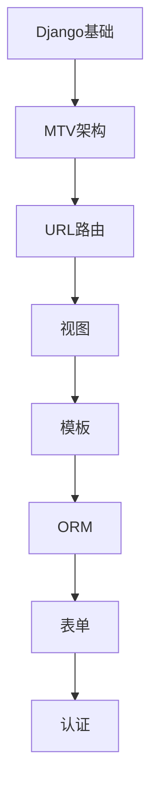

# Django 学习指南

> **分类**：后端开发 ｜ **章节总数**：80 ｜ **技术栈**：Django 5

## 领域概述

Django是后端开发领域的重要技术方向，本系列从基础到高级逐步深入，涵盖15个核心模块：Django基础、MTV架构、URL路由、视图、模板等。每个知识点作为独立章节，包含原理讲解、实现要点、常见陷阱和最佳实践，配合源码分析和架构图，帮助读者建立完整的Django知识体系。

本教程基于 **Python** 与 **Django 5** 生态编写，涵盖 DRF, Celery, Django ORM 等主流工具与框架。每章独立成篇，文字精炼、逻辑清晰，适合系统学习与按需查阅。

## 你将学到什么

完成本系列后，你将能够：

- 系统理解 **Django** 的核心概念与模块划分。
- 按难度递进掌握从入门到实战的完整知识路径。
- 在工程实践中做出合理的技术判断与问题排查。
- 通过章节索引快速定位所需知识点。

## 前置知识

- 编程基础
- 数据结构
- 计算机基础
- 后端开发基础概念

## 推荐学习路径

1. **Django基础**
2. **MTV架构**
3. **URL路由**
4. **视图**
5. **模板**
6. **ORM**
7. **表单**
8. **认证**

## 模块体系

本领域按以下模块组织，难度由浅入深：

- **Django基础**
- **MTV架构**
- **URL路由**
- **视图**
- **模板**
- **ORM**
- **表单**
- **认证**
- **Admin**
- **中间件**
- **缓存**
- **信号**
- **REST Framework**
- **性能优化**
- **Django最佳实践**

## 难度分布

| 难度 | 章节数 | 占比 |
|------|--------|------|
| 入门 | 18 | 22% |
| 实战 | 15 | 18% |
| 进阶 | 22 | 27% |
| 高级 | 25 | 31% |

## 章节索引

点击章节标题进入对应教程：

### Django基础

- [Django基础核心概念与原理](chapters/001-Django基础核心概念与原理.md) ｜ 入门
- [Django基础的实现机制详解](chapters/002-Django基础的实现机制详解.md) ｜ 入门
- [Django基础的关键技术点](chapters/003-Django基础的关键技术点.md) ｜ 入门
- [Django基础的源码级分析](chapters/004-Django基础的源码级分析.md) ｜ 入门
- [Django基础的配置与使用](chapters/005-Django基础的配置与使用.md) ｜ 入门
- [Django基础的常见问题与解决方案](chapters/006-Django基础的常见问题与解决方案.md) ｜ 入门

### MTV架构

- [MTV架构核心概念与原理](chapters/007-MTV架构核心概念与原理.md) ｜ 入门
- [MTV架构的实现机制详解](chapters/008-MTV架构的实现机制详解.md) ｜ 入门
- [MTV架构的关键技术点](chapters/009-MTV架构的关键技术点.md) ｜ 入门
- [MTV架构的源码级分析](chapters/010-MTV架构的源码级分析.md) ｜ 入门
- [MTV架构的配置与使用](chapters/011-MTV架构的配置与使用.md) ｜ 入门
- [MTV架构的常见问题与解决方案](chapters/012-MTV架构的常见问题与解决方案.md) ｜ 入门

### URL路由

- [URL路由核心概念与原理](chapters/013-URL路由核心概念与原理.md) ｜ 入门
- [URL路由的实现机制详解](chapters/014-URL路由的实现机制详解.md) ｜ 入门
- [URL路由的关键技术点](chapters/015-URL路由的关键技术点.md) ｜ 入门
- [URL路由的源码级分析](chapters/016-URL路由的源码级分析.md) ｜ 入门
- [URL路由的配置与使用](chapters/017-URL路由的配置与使用.md) ｜ 入门
- [URL路由的常见问题与解决方案](chapters/018-URL路由的常见问题与解决方案.md) ｜ 入门

### 视图

- [视图核心概念与原理](chapters/019-视图核心概念与原理.md) ｜ 进阶
- [视图的实现机制详解](chapters/020-视图的实现机制详解.md) ｜ 进阶
- [视图的关键技术点](chapters/021-视图的关键技术点.md) ｜ 进阶
- [视图的源码级分析](chapters/022-视图的源码级分析.md) ｜ 进阶
- [视图的配置与使用](chapters/023-视图的配置与使用.md) ｜ 进阶
- [视图的常见问题与解决方案](chapters/024-视图的常见问题与解决方案.md) ｜ 进阶

### 模板

- [模板核心概念与原理](chapters/025-模板核心概念与原理.md) ｜ 进阶
- [模板的实现机制详解](chapters/026-模板的实现机制详解.md) ｜ 进阶
- [模板的关键技术点](chapters/027-模板的关键技术点.md) ｜ 进阶
- [模板的源码级分析](chapters/028-模板的源码级分析.md) ｜ 进阶
- [模板的配置与使用](chapters/029-模板的配置与使用.md) ｜ 进阶
- [模板的常见问题与解决方案](chapters/030-模板的常见问题与解决方案.md) ｜ 进阶

### ORM

- [ORM核心概念与原理](chapters/031-ORM核心概念与原理.md) ｜ 进阶
- [ORM的实现机制详解](chapters/032-ORM的实现机制详解.md) ｜ 进阶
- [ORM的关键技术点](chapters/033-ORM的关键技术点.md) ｜ 进阶
- [ORM的源码级分析](chapters/034-ORM的源码级分析.md) ｜ 进阶
- [ORM的配置与使用](chapters/035-ORM的配置与使用.md) ｜ 进阶

### 表单

- [表单核心概念与原理](chapters/036-表单核心概念与原理.md) ｜ 进阶
- [表单的实现机制详解](chapters/037-表单的实现机制详解.md) ｜ 进阶
- [表单的关键技术点](chapters/038-表单的关键技术点.md) ｜ 进阶
- [表单的源码级分析](chapters/039-表单的源码级分析.md) ｜ 进阶
- [表单的配置与使用](chapters/040-表单的配置与使用.md) ｜ 进阶

### 认证

- [认证核心概念与原理](chapters/041-认证核心概念与原理.md) ｜ 高级
- [认证的实现机制详解](chapters/042-认证的实现机制详解.md) ｜ 高级
- [认证的关键技术点](chapters/043-认证的关键技术点.md) ｜ 高级
- [认证的源码级分析](chapters/044-认证的源码级分析.md) ｜ 高级
- [认证的配置与使用](chapters/045-认证的配置与使用.md) ｜ 高级

### Admin

- [Admin核心概念与原理](chapters/046-Admin核心概念与原理.md) ｜ 高级
- [Admin的实现机制详解](chapters/047-Admin的实现机制详解.md) ｜ 高级
- [Admin的关键技术点](chapters/048-Admin的关键技术点.md) ｜ 高级
- [Admin的源码级分析](chapters/049-Admin的源码级分析.md) ｜ 高级
- [Admin的配置与使用](chapters/050-Admin的配置与使用.md) ｜ 高级

### 中间件

- [中间件核心概念与原理](chapters/051-中间件核心概念与原理.md) ｜ 高级
- [中间件的实现机制详解](chapters/052-中间件的实现机制详解.md) ｜ 高级
- [中间件的关键技术点](chapters/053-中间件的关键技术点.md) ｜ 高级
- [中间件的源码级分析](chapters/054-中间件的源码级分析.md) ｜ 高级
- [中间件的配置与使用](chapters/055-中间件的配置与使用.md) ｜ 高级

### 缓存

- [缓存核心概念与原理](chapters/056-缓存核心概念与原理.md) ｜ 高级
- [缓存的实现机制详解](chapters/057-缓存的实现机制详解.md) ｜ 高级
- [缓存的关键技术点](chapters/058-缓存的关键技术点.md) ｜ 高级
- [缓存的源码级分析](chapters/059-缓存的源码级分析.md) ｜ 高级
- [缓存的配置与使用](chapters/060-缓存的配置与使用.md) ｜ 高级

### 信号

- [信号核心概念与原理](chapters/061-信号核心概念与原理.md) ｜ 高级
- [信号的实现机制详解](chapters/062-信号的实现机制详解.md) ｜ 高级
- [信号的关键技术点](chapters/063-信号的关键技术点.md) ｜ 高级
- [信号的源码级分析](chapters/064-信号的源码级分析.md) ｜ 高级
- [信号的配置与使用](chapters/065-信号的配置与使用.md) ｜ 高级

### REST Framework

- [REST Framework核心概念与原理](chapters/066-REST-Framework核心概念与原理.md) ｜ 实战
- [REST Framework的实现机制详解](chapters/067-REST-Framework的实现机制详解.md) ｜ 实战
- [REST Framework的关键技术点](chapters/068-REST-Framework的关键技术点.md) ｜ 实战
- [REST Framework的源码级分析](chapters/069-REST-Framework的源码级分析.md) ｜ 实战
- [REST Framework的配置与使用](chapters/070-REST-Framework的配置与使用.md) ｜ 实战

### 性能优化

- [性能优化核心概念与原理](chapters/071-性能优化核心概念与原理.md) ｜ 实战
- [性能优化的实现机制详解](chapters/072-性能优化的实现机制详解.md) ｜ 实战
- [性能优化的关键技术点](chapters/073-性能优化的关键技术点.md) ｜ 实战
- [性能优化的源码级分析](chapters/074-性能优化的源码级分析.md) ｜ 实战
- [性能优化的配置与使用](chapters/075-性能优化的配置与使用.md) ｜ 实战

### Django最佳实践

- [Django最佳实践核心概念与原理](chapters/076-Django最佳实践核心概念与原理.md) ｜ 实战
- [Django最佳实践的实现机制详解](chapters/077-Django最佳实践的实现机制详解.md) ｜ 实战
- [Django最佳实践的关键技术点](chapters/078-Django最佳实践的关键技术点.md) ｜ 实战
- [Django最佳实践的源码级分析](chapters/079-Django最佳实践的源码级分析.md) ｜ 实战
- [Django最佳实践的配置与使用](chapters/080-Django最佳实践的配置与使用.md) ｜ 实战

## 学习方法建议

1. **先读概述再读章节**：用本指南建立全局地图，避免迷失在细节中。
2. **按模块递进**：同一模块内章节有前后关联，顺序阅读效果更好。
3. **主动复述**：每章读完后，用三五句话概括「是什么、为什么、怎么用」。
4. **关联阅读**：利用章节底部的「延伸学习」在同模块内构建知识网络。
5. **对照官方文档**：本教程提供结构化视角，细节以官方文档为准。

---
*领域: Django ｜ 版本: 2.0 ｜ 共 80 章*