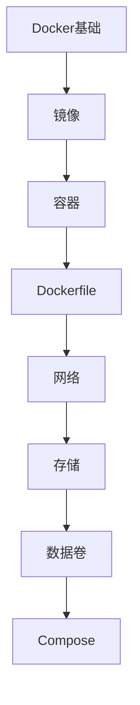

# Docker 学习指南

> **分类**：DevOps ｜ **技术生态**：containerd、BuildKit、Harbor、Docker Compose

## 领域定位

Docker 将应用与依赖打包为镜像，基于 Linux Namespace 与 Cgroups 实现容器隔离，Compose 编排多容器开发环境。

从 Dockerfile、镜像分层、网络存储到安全与 CI 集成，是 K8s 与云原生的基础。

本领域常用技术栈与工具包括：containerd、BuildKit、Harbor、Docker Compose。

## 学习目标

- 能编写多阶段 Dockerfile
- 能使用 docker compose
- 理解 overlay2 与 volume
- 能扫描镜像漏洞并非 root 运行

## 前置知识

- Linux 命令行
- 网络端口概念

## 学习路径

1. **Docker基础**
2. **镜像**
3. **容器**
4. **Dockerfile**
5. **网络**
6. **存储**
7. **数据卷**
8. **Compose**

## 模块体系

- **Docker基础**
- **镜像**
- **容器**
- **Dockerfile**
- **网络**
- **存储**
- **数据卷**
- **Compose**
- **Registry**
- **多阶段构建**
- **安全**
- **性能优化**
- **日志**
- **监控**
- **最佳实践**

## 难度分布

| 入门 | 21 | 21% |
| 实战 | 18 | 18% |
| 进阶 | 28 | 28% |
| 高级 | 33 | 33% |

## 章节索引

### Docker基础

- [Docker基础核心概念与原理](chapters/001-Docker基础核心概念与原理.md) ｜ 入门
- [Docker基础的实现机制详解](chapters/002-Docker基础的实现机制详解.md) ｜ 入门
- [Docker基础的关键技术点](chapters/003-Docker基础的关键技术点.md) ｜ 入门
- [Docker基础的源码级分析](chapters/004-Docker基础的源码级分析.md) ｜ 入门
- [Docker基础的配置与使用](chapters/005-Docker基础的配置与使用.md) ｜ 入门
- [Docker基础的常见问题与解决方案](chapters/006-Docker基础的常见问题与解决方案.md) ｜ 入门
- [Docker基础的性能优化技巧](chapters/007-Docker基础的性能优化技巧.md) ｜ 入门

### 镜像

- [镜像核心概念与原理](chapters/008-镜像核心概念与原理.md) ｜ 入门
- [镜像的实现机制详解](chapters/009-镜像的实现机制详解.md) ｜ 入门
- [镜像的关键技术点](chapters/010-镜像的关键技术点.md) ｜ 入门
- [镜像的源码级分析](chapters/011-镜像的源码级分析.md) ｜ 入门
- [镜像的配置与使用](chapters/012-镜像的配置与使用.md) ｜ 入门
- [镜像的常见问题与解决方案](chapters/013-镜像的常见问题与解决方案.md) ｜ 入门
- [镜像的性能优化技巧](chapters/014-镜像的性能优化技巧.md) ｜ 入门

### 容器

- [容器核心概念与原理](chapters/015-容器核心概念与原理.md) ｜ 入门
- [容器的实现机制详解](chapters/016-容器的实现机制详解.md) ｜ 入门
- [容器的关键技术点](chapters/017-容器的关键技术点.md) ｜ 入门
- [容器的源码级分析](chapters/018-容器的源码级分析.md) ｜ 入门
- [容器的配置与使用](chapters/019-容器的配置与使用.md) ｜ 入门
- [容器的常见问题与解决方案](chapters/020-容器的常见问题与解决方案.md) ｜ 入门
- [容器的性能优化技巧](chapters/021-容器的性能优化技巧.md) ｜ 入门

### Dockerfile

- [Dockerfile核心概念与原理](chapters/022-Dockerfile核心概念与原理.md) ｜ 进阶
- [Dockerfile的实现机制详解](chapters/023-Dockerfile的实现机制详解.md) ｜ 进阶
- [Dockerfile的关键技术点](chapters/024-Dockerfile的关键技术点.md) ｜ 进阶
- [Dockerfile的源码级分析](chapters/025-Dockerfile的源码级分析.md) ｜ 进阶
- [Dockerfile的配置与使用](chapters/026-Dockerfile的配置与使用.md) ｜ 进阶
- [Dockerfile的常见问题与解决方案](chapters/027-Dockerfile的常见问题与解决方案.md) ｜ 进阶
- [Dockerfile的性能优化技巧](chapters/028-Dockerfile的性能优化技巧.md) ｜ 进阶

### 网络

- [网络核心概念与原理](chapters/029-网络核心概念与原理.md) ｜ 进阶
- [网络的实现机制详解](chapters/030-网络的实现机制详解.md) ｜ 进阶
- [网络的关键技术点](chapters/031-网络的关键技术点.md) ｜ 进阶
- [网络的源码级分析](chapters/032-网络的源码级分析.md) ｜ 进阶
- [网络的配置与使用](chapters/033-网络的配置与使用.md) ｜ 进阶
- [网络的常见问题与解决方案](chapters/034-网络的常见问题与解决方案.md) ｜ 进阶
- [网络的性能优化技巧](chapters/035-网络的性能优化技巧.md) ｜ 进阶

### 存储

- [存储核心概念与原理](chapters/036-存储核心概念与原理.md) ｜ 进阶
- [存储的实现机制详解](chapters/037-存储的实现机制详解.md) ｜ 进阶
- [存储的关键技术点](chapters/038-存储的关键技术点.md) ｜ 进阶
- [存储的源码级分析](chapters/039-存储的源码级分析.md) ｜ 进阶
- [存储的配置与使用](chapters/040-存储的配置与使用.md) ｜ 进阶
- [存储的常见问题与解决方案](chapters/041-存储的常见问题与解决方案.md) ｜ 进阶
- [存储的性能优化技巧](chapters/042-存储的性能优化技巧.md) ｜ 进阶

### 数据卷

- [数据卷核心概念与原理](chapters/043-数据卷核心概念与原理.md) ｜ 进阶
- [数据卷的实现机制详解](chapters/044-数据卷的实现机制详解.md) ｜ 进阶
- [数据卷的关键技术点](chapters/045-数据卷的关键技术点.md) ｜ 进阶
- [数据卷的源码级分析](chapters/046-数据卷的源码级分析.md) ｜ 进阶
- [数据卷的配置与使用](chapters/047-数据卷的配置与使用.md) ｜ 进阶
- [数据卷的常见问题与解决方案](chapters/048-数据卷的常见问题与解决方案.md) ｜ 进阶
- [数据卷的性能优化技巧](chapters/049-数据卷的性能优化技巧.md) ｜ 进阶

### Compose

- [Compose核心概念与原理](chapters/050-Compose核心概念与原理.md) ｜ 高级
- [Compose的实现机制详解](chapters/051-Compose的实现机制详解.md) ｜ 高级
- [Compose的关键技术点](chapters/052-Compose的关键技术点.md) ｜ 高级
- [Compose的源码级分析](chapters/053-Compose的源码级分析.md) ｜ 高级
- [Compose的配置与使用](chapters/054-Compose的配置与使用.md) ｜ 高级
- [Compose的常见问题与解决方案](chapters/055-Compose的常见问题与解决方案.md) ｜ 高级
- [Compose的性能优化技巧](chapters/056-Compose的性能优化技巧.md) ｜ 高级

### Registry

- [Registry核心概念与原理](chapters/057-Registry核心概念与原理.md) ｜ 高级
- [Registry的实现机制详解](chapters/058-Registry的实现机制详解.md) ｜ 高级
- [Registry的关键技术点](chapters/059-Registry的关键技术点.md) ｜ 高级
- [Registry的源码级分析](chapters/060-Registry的源码级分析.md) ｜ 高级
- [Registry的配置与使用](chapters/061-Registry的配置与使用.md) ｜ 高级
- [Registry的常见问题与解决方案](chapters/062-Registry的常见问题与解决方案.md) ｜ 高级
- [Registry的性能优化技巧](chapters/063-Registry的性能优化技巧.md) ｜ 高级

### 多阶段构建

- [多阶段构建核心概念与原理](chapters/064-多阶段构建核心概念与原理.md) ｜ 高级
- [多阶段构建的实现机制详解](chapters/065-多阶段构建的实现机制详解.md) ｜ 高级
- [多阶段构建的关键技术点](chapters/066-多阶段构建的关键技术点.md) ｜ 高级
- [多阶段构建的源码级分析](chapters/067-多阶段构建的源码级分析.md) ｜ 高级
- [多阶段构建的配置与使用](chapters/068-多阶段构建的配置与使用.md) ｜ 高级
- [多阶段构建的常见问题与解决方案](chapters/069-多阶段构建的常见问题与解决方案.md) ｜ 高级
- [多阶段构建的性能优化技巧](chapters/070-多阶段构建的性能优化技巧.md) ｜ 高级

### 安全

- [安全核心概念与原理](chapters/071-安全核心概念与原理.md) ｜ 高级
- [安全的实现机制详解](chapters/072-安全的实现机制详解.md) ｜ 高级
- [安全的关键技术点](chapters/073-安全的关键技术点.md) ｜ 高级
- [安全的源码级分析](chapters/074-安全的源码级分析.md) ｜ 高级
- [安全的配置与使用](chapters/075-安全的配置与使用.md) ｜ 高级
- [安全的常见问题与解决方案](chapters/076-安全的常见问题与解决方案.md) ｜ 高级

### 性能优化

- [性能优化核心概念与原理](chapters/077-性能优化核心概念与原理.md) ｜ 高级
- [性能优化的实现机制详解](chapters/078-性能优化的实现机制详解.md) ｜ 高级
- [性能优化的关键技术点](chapters/079-性能优化的关键技术点.md) ｜ 高级
- [性能优化的源码级分析](chapters/080-性能优化的源码级分析.md) ｜ 高级
- [性能优化的配置与使用](chapters/081-性能优化的配置与使用.md) ｜ 高级
- [性能优化的常见问题与解决方案](chapters/082-性能优化的常见问题与解决方案.md) ｜ 高级

### 日志

- [日志核心概念与原理](chapters/083-日志核心概念与原理.md) ｜ 实战
- [日志的实现机制详解](chapters/084-日志的实现机制详解.md) ｜ 实战
- [日志的关键技术点](chapters/085-日志的关键技术点.md) ｜ 实战
- [日志的源码级分析](chapters/086-日志的源码级分析.md) ｜ 实战
- [日志的配置与使用](chapters/087-日志的配置与使用.md) ｜ 实战
- [日志的常见问题与解决方案](chapters/088-日志的常见问题与解决方案.md) ｜ 实战

### 监控

- [监控核心概念与原理](chapters/089-监控核心概念与原理.md) ｜ 实战
- [监控的实现机制详解](chapters/090-监控的实现机制详解.md) ｜ 实战
- [监控的关键技术点](chapters/091-监控的关键技术点.md) ｜ 实战
- [监控的源码级分析](chapters/092-监控的源码级分析.md) ｜ 实战
- [监控的配置与使用](chapters/093-监控的配置与使用.md) ｜ 实战
- [监控的常见问题与解决方案](chapters/094-监控的常见问题与解决方案.md) ｜ 实战

### 最佳实践

- [最佳实践核心概念与原理](chapters/095-最佳实践核心概念与原理.md) ｜ 实战
- [最佳实践的实现机制详解](chapters/096-最佳实践的实现机制详解.md) ｜ 实战
- [最佳实践的关键技术点](chapters/097-最佳实践的关键技术点.md) ｜ 实战
- [最佳实践的源码级分析](chapters/098-最佳实践的源码级分析.md) ｜ 实战
- [最佳实践的配置与使用](chapters/099-最佳实践的配置与使用.md) ｜ 实战
- [最佳实践的常见问题与解决方案](chapters/100-最佳实践的常见问题与解决方案.md) ｜ 实战

---
*领域: Docker*