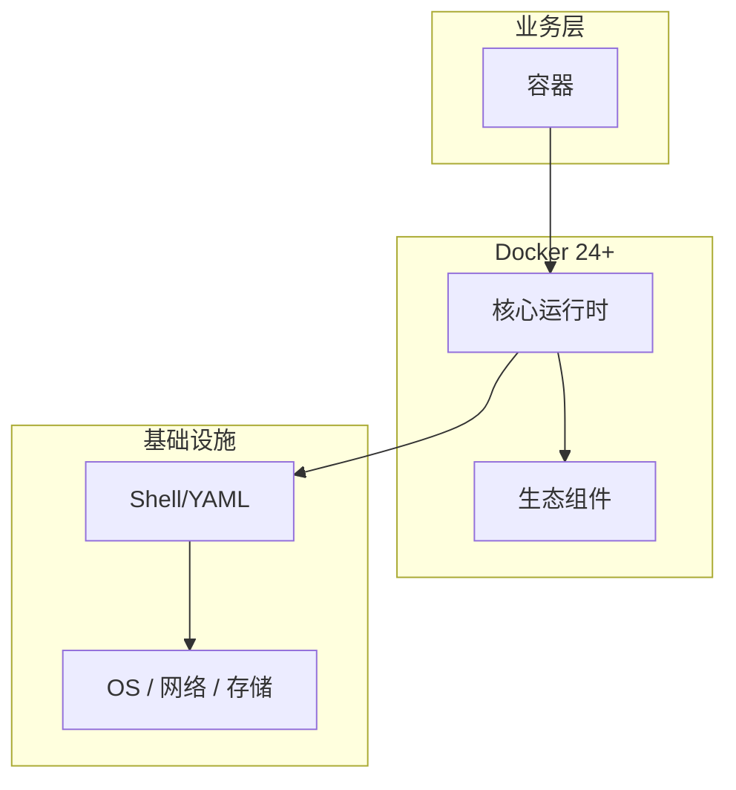

# 容器的源码级分析

> **领域**：Docker ｜ **模块**：容器 ｜ **难度**：入门 ｜ **类型**：源码分析

## 导读

本章系统讲解 **Docker** 中 **容器** 的相关知识（源码分析）。本章沿源码与调用链剖析 **容器** 的实现，适合需要排障或二次开发的读者。内容基于主流框架与工程实践撰写，不依赖过时概念堆砌。

## 核心知识

Docker 容器是 **进程级隔离**：Linux **Namespace** 隔离 PID/NET/MNT/UTS/IPC/USER，**Cgroups** 限制 CPU/内存/IO。容器共享宿主机内核，比 VM 更轻量。

### 核心知识

**1. Namespace 隔离**

PID namespace 内 init 为 PID 1；NET namespace 独立网络栈与 iptables；MNT namespace 独立挂载点视图。

**2. Cgroups v2**

限制 memory.max、cpu.max；OOM 时 kill 容器内进程而非宿主机。

**3. 容器即进程**

containerd 通过 runc 创建带 namespace 的进程；docker ps 列出的是 cgroup 中的进程组。

## 架构与流程

## 技术详解

### 源码与实现

dockerd → containerd → runc → 配置 namespaces + cgroups → 执行容器 entrypoint。

## 原理与实现

### 工作机制

dockerd → containerd → runc → 配置 namespaces + cgroups → 执行容器 entrypoint。

### 内部实现

镜像层 overlay2 联合挂载为容器 rootfs；Copy-on-Write 使新写落 upper layer。

## 性能、安全与排查

### 安全注意

非 root 用户运行；drop capabilities；只读 rootfs；seccomp/AppArmor 限制 syscall。

## 本章聚焦

源码阅读 **容器** 宜采用「由外向内」：先跟一次主路径请求，再展开分支与错误处理，避免陷入细节迷失主线。

### 最佳实践

1. 显式 USER 指令
2. healthcheck 探活
3. 资源 limits 防 noisy neighbor

## 巩固建议

建议结合 **Docker** 官方文档与小型实验，亲手验证 **容器** 的默认行为与边界条件；将本章要点整理为检查清单或 ADR，便于评审与团队 onboarding。

### 本章小结

学完本章，你应能独立说明 **容器** 在 Docker 中的角色，理解其核心机制，规避常见误区，并在项目中正确运用。

## 延伸学习

- 容器核心概念与原理
- 容器的实现机制详解
- 容器的关键技术点
- 容器的配置与使用
- 容器的常见问题与解决方案

### 延伸阅读

- Docker 架构文档
- Linux namespaces man7

---
*章节 ID: 018 ｜ 领域: Docker*