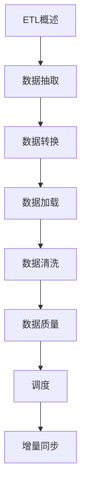

# ETL开发 学习指南

> **分类**：数据存储 ｜ **技术生态**：Airflow、dbt、Debezium、DataX、SeaTunnel

## 领域定位

ETL（Extract-Transform-Load）将源系统数据抽取、清洗转换后加载至目标库或数仓。CDC 与增量同步是现代实时数仓的关键。

覆盖批流一体、数据质量、调度与 Debezium/Canal 等 CDC 工具。

本领域常用技术栈与工具包括：Airflow、dbt、Debezium、DataX、SeaTunnel。

## 学习目标

- 能设计 idempotent 增量同步
- 能处理脏数据与质量规则
- 能编排 Airflow/DolphinScheduler 任务
- 能评估 Flink CDC 方案

## 前置知识

- SQL
- 一种脚本语言
- 数仓分层概念

## 学习路径

1. **ETL概述**
2. **数据抽取**
3. **数据转换**
4. **数据加载**
5. **数据清洗**
6. **数据质量**
7. **调度**
8. **增量同步**

## 模块体系

- **ETL概述**
- **数据抽取**
- **数据转换**
- **数据加载**
- **数据清洗**
- **数据质量**
- **调度**
- **增量同步**
- **CDC**
- **性能优化**
- **工具**
- **ETL最佳实践**

## 难度分布

| 入门 | 15 | 25% |
| 实战 | 15 | 25% |
| 进阶 | 15 | 25% |
| 高级 | 15 | 25% |

## 章节索引

### ETL概述

- [ETL概述核心概念与原理](chapters/001-ETL概述核心概念与原理.md) ｜ 入门
- [ETL概述的实现机制详解](chapters/002-ETL概述的实现机制详解.md) ｜ 入门
- [ETL概述的关键技术点](chapters/003-ETL概述的关键技术点.md) ｜ 入门
- [ETL概述的源码级分析](chapters/004-ETL概述的源码级分析.md) ｜ 入门
- [ETL概述的配置与使用](chapters/005-ETL概述的配置与使用.md) ｜ 入门

### 数据抽取

- [数据抽取核心概念与原理](chapters/006-数据抽取核心概念与原理.md) ｜ 入门
- [数据抽取的实现机制详解](chapters/007-数据抽取的实现机制详解.md) ｜ 入门
- [数据抽取的关键技术点](chapters/008-数据抽取的关键技术点.md) ｜ 入门
- [数据抽取的源码级分析](chapters/009-数据抽取的源码级分析.md) ｜ 入门
- [数据抽取的配置与使用](chapters/010-数据抽取的配置与使用.md) ｜ 入门

### 数据转换

- [数据转换核心概念与原理](chapters/011-数据转换核心概念与原理.md) ｜ 入门
- [数据转换的实现机制详解](chapters/012-数据转换的实现机制详解.md) ｜ 入门
- [数据转换的关键技术点](chapters/013-数据转换的关键技术点.md) ｜ 入门
- [数据转换的源码级分析](chapters/014-数据转换的源码级分析.md) ｜ 入门
- [数据转换的配置与使用](chapters/015-数据转换的配置与使用.md) ｜ 入门

### 数据加载

- [数据加载核心概念与原理](chapters/016-数据加载核心概念与原理.md) ｜ 进阶
- [数据加载的实现机制详解](chapters/017-数据加载的实现机制详解.md) ｜ 进阶
- [数据加载的关键技术点](chapters/018-数据加载的关键技术点.md) ｜ 进阶
- [数据加载的源码级分析](chapters/019-数据加载的源码级分析.md) ｜ 进阶
- [数据加载的配置与使用](chapters/020-数据加载的配置与使用.md) ｜ 进阶

### 数据清洗

- [数据清洗核心概念与原理](chapters/021-数据清洗核心概念与原理.md) ｜ 进阶
- [数据清洗的实现机制详解](chapters/022-数据清洗的实现机制详解.md) ｜ 进阶
- [数据清洗的关键技术点](chapters/023-数据清洗的关键技术点.md) ｜ 进阶
- [数据清洗的源码级分析](chapters/024-数据清洗的源码级分析.md) ｜ 进阶
- [数据清洗的配置与使用](chapters/025-数据清洗的配置与使用.md) ｜ 进阶

### 数据质量

- [数据质量核心概念与原理](chapters/026-数据质量核心概念与原理.md) ｜ 进阶
- [数据质量的实现机制详解](chapters/027-数据质量的实现机制详解.md) ｜ 进阶
- [数据质量的关键技术点](chapters/028-数据质量的关键技术点.md) ｜ 进阶
- [数据质量的源码级分析](chapters/029-数据质量的源码级分析.md) ｜ 进阶
- [数据质量的配置与使用](chapters/030-数据质量的配置与使用.md) ｜ 进阶

### 调度

- [调度核心概念与原理](chapters/031-调度核心概念与原理.md) ｜ 高级
- [调度的实现机制详解](chapters/032-调度的实现机制详解.md) ｜ 高级
- [调度的关键技术点](chapters/033-调度的关键技术点.md) ｜ 高级
- [调度的源码级分析](chapters/034-调度的源码级分析.md) ｜ 高级
- [调度的配置与使用](chapters/035-调度的配置与使用.md) ｜ 高级

### 增量同步

- [增量同步核心概念与原理](chapters/036-增量同步核心概念与原理.md) ｜ 高级
- [增量同步的实现机制详解](chapters/037-增量同步的实现机制详解.md) ｜ 高级
- [增量同步的关键技术点](chapters/038-增量同步的关键技术点.md) ｜ 高级
- [增量同步的源码级分析](chapters/039-增量同步的源码级分析.md) ｜ 高级
- [增量同步的配置与使用](chapters/040-增量同步的配置与使用.md) ｜ 高级

### CDC

- [CDC核心概念与原理](chapters/041-CDC核心概念与原理.md) ｜ 高级
- [CDC的实现机制详解](chapters/042-CDC的实现机制详解.md) ｜ 高级
- [CDC的关键技术点](chapters/043-CDC的关键技术点.md) ｜ 高级
- [CDC的源码级分析](chapters/044-CDC的源码级分析.md) ｜ 高级
- [CDC的配置与使用](chapters/045-CDC的配置与使用.md) ｜ 高级

### 性能优化

- [性能优化核心概念与原理](chapters/046-性能优化核心概念与原理.md) ｜ 实战
- [性能优化的实现机制详解](chapters/047-性能优化的实现机制详解.md) ｜ 实战
- [性能优化的关键技术点](chapters/048-性能优化的关键技术点.md) ｜ 实战
- [性能优化的源码级分析](chapters/049-性能优化的源码级分析.md) ｜ 实战
- [性能优化的配置与使用](chapters/050-性能优化的配置与使用.md) ｜ 实战

### 工具

- [工具核心概念与原理](chapters/051-工具核心概念与原理.md) ｜ 实战
- [工具的实现机制详解](chapters/052-工具的实现机制详解.md) ｜ 实战
- [工具的关键技术点](chapters/053-工具的关键技术点.md) ｜ 实战
- [工具的源码级分析](chapters/054-工具的源码级分析.md) ｜ 实战
- [工具的配置与使用](chapters/055-工具的配置与使用.md) ｜ 实战

### ETL最佳实践

- [ETL最佳实践核心概念与原理](chapters/056-ETL最佳实践核心概念与原理.md) ｜ 实战
- [ETL最佳实践的实现机制详解](chapters/057-ETL最佳实践的实现机制详解.md) ｜ 实战
- [ETL最佳实践的关键技术点](chapters/058-ETL最佳实践的关键技术点.md) ｜ 实战
- [ETL最佳实践的源码级分析](chapters/059-ETL最佳实践的源码级分析.md) ｜ 实战
- [ETL最佳实践的配置与使用](chapters/060-ETL最佳实践的配置与使用.md) ｜ 实战

---
*领域: ETL开发*