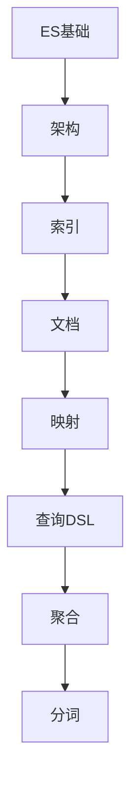

# Elasticsearch 学习指南

> **分类**：数据存储 ｜ **章节总数**：100 ｜ **技术栈**：ES 8

## 领域概述

Elasticsearch是数据存储领域的重要技术方向，本系列从基础到高级逐步深入，涵盖15个核心模块：ES基础、架构、索引、文档、映射等。每个知识点作为独立章节，包含原理讲解、实现要点、常见陷阱和最佳实践，配合源码分析和架构图，帮助读者建立完整的Elasticsearch知识体系。

本教程基于 **JSON/DSL** 与 **ES 8** 生态编写，涵盖 Kibana, Logstash 等主流工具与框架。每章独立成篇，文字精炼、逻辑清晰，适合系统学习与按需查阅。

## 你将学到什么

完成本系列后，你将能够：

- 系统理解 **Elasticsearch** 的核心概念与模块划分。
- 按难度递进掌握从入门到实战的完整知识路径。
- 在工程实践中做出合理的技术判断与问题排查。
- 通过章节索引快速定位所需知识点。

## 前置知识

- 编程基础
- 数据结构
- 计算机基础
- 数据存储基础概念

## 推荐学习路径

1. **ES基础**
2. **架构**
3. **索引**
4. **文档**
5. **映射**
6. **查询DSL**
7. **聚合**
8. **分词**

## 模块体系

本领域按以下模块组织，难度由浅入深：

- **ES基础**
- **架构**
- **索引**
- **文档**
- **映射**
- **查询DSL**
- **聚合**
- **分词**
- **集群**
- **分片**
- **性能优化**
- **高可用**
- **安全**
- **ELK栈**
- **ES最佳实践**

## 难度分布

| 难度 | 章节数 | 占比 |
|------|--------|------|
| 入门 | 21 | 21% |
| 实战 | 18 | 18% |
| 进阶 | 28 | 28% |
| 高级 | 33 | 33% |

## 章节索引

点击章节标题进入对应教程：

### ES基础

- [ES基础核心概念与原理](chapters/001-ES基础核心概念与原理.md) ｜ 入门
- [ES基础的实现机制详解](chapters/002-ES基础的实现机制详解.md) ｜ 入门
- [ES基础的关键技术点](chapters/003-ES基础的关键技术点.md) ｜ 入门
- [ES基础的源码级分析](chapters/004-ES基础的源码级分析.md) ｜ 入门
- [ES基础的配置与使用](chapters/005-ES基础的配置与使用.md) ｜ 入门
- [ES基础的常见问题与解决方案](chapters/006-ES基础的常见问题与解决方案.md) ｜ 入门
- [ES基础的性能优化技巧](chapters/007-ES基础的性能优化技巧.md) ｜ 入门

### 架构

- [架构核心概念与原理](chapters/008-架构核心概念与原理.md) ｜ 入门
- [架构的实现机制详解](chapters/009-架构的实现机制详解.md) ｜ 入门
- [架构的关键技术点](chapters/010-架构的关键技术点.md) ｜ 入门
- [架构的源码级分析](chapters/011-架构的源码级分析.md) ｜ 入门
- [架构的配置与使用](chapters/012-架构的配置与使用.md) ｜ 入门
- [架构的常见问题与解决方案](chapters/013-架构的常见问题与解决方案.md) ｜ 入门
- [架构的性能优化技巧](chapters/014-架构的性能优化技巧.md) ｜ 入门

### 索引

- [索引核心概念与原理](chapters/015-索引核心概念与原理.md) ｜ 入门
- [索引的实现机制详解](chapters/016-索引的实现机制详解.md) ｜ 入门
- [索引的关键技术点](chapters/017-索引的关键技术点.md) ｜ 入门
- [索引的源码级分析](chapters/018-索引的源码级分析.md) ｜ 入门
- [索引的配置与使用](chapters/019-索引的配置与使用.md) ｜ 入门
- [索引的常见问题与解决方案](chapters/020-索引的常见问题与解决方案.md) ｜ 入门
- [索引的性能优化技巧](chapters/021-索引的性能优化技巧.md) ｜ 入门

### 文档

- [文档核心概念与原理](chapters/022-文档核心概念与原理.md) ｜ 进阶
- [文档的实现机制详解](chapters/023-文档的实现机制详解.md) ｜ 进阶
- [文档的关键技术点](chapters/024-文档的关键技术点.md) ｜ 进阶
- [文档的源码级分析](chapters/025-文档的源码级分析.md) ｜ 进阶
- [文档的配置与使用](chapters/026-文档的配置与使用.md) ｜ 进阶
- [文档的常见问题与解决方案](chapters/027-文档的常见问题与解决方案.md) ｜ 进阶
- [文档的性能优化技巧](chapters/028-文档的性能优化技巧.md) ｜ 进阶

### 映射

- [映射核心概念与原理](chapters/029-映射核心概念与原理.md) ｜ 进阶
- [映射的实现机制详解](chapters/030-映射的实现机制详解.md) ｜ 进阶
- [映射的关键技术点](chapters/031-映射的关键技术点.md) ｜ 进阶
- [映射的源码级分析](chapters/032-映射的源码级分析.md) ｜ 进阶
- [映射的配置与使用](chapters/033-映射的配置与使用.md) ｜ 进阶
- [映射的常见问题与解决方案](chapters/034-映射的常见问题与解决方案.md) ｜ 进阶
- [映射的性能优化技巧](chapters/035-映射的性能优化技巧.md) ｜ 进阶

### 查询DSL

- [查询DSL核心概念与原理](chapters/036-查询DSL核心概念与原理.md) ｜ 进阶
- [查询DSL的实现机制详解](chapters/037-查询DSL的实现机制详解.md) ｜ 进阶
- [查询DSL的关键技术点](chapters/038-查询DSL的关键技术点.md) ｜ 进阶
- [查询DSL的源码级分析](chapters/039-查询DSL的源码级分析.md) ｜ 进阶
- [查询DSL的配置与使用](chapters/040-查询DSL的配置与使用.md) ｜ 进阶
- [查询DSL的常见问题与解决方案](chapters/041-查询DSL的常见问题与解决方案.md) ｜ 进阶
- [查询DSL的性能优化技巧](chapters/042-查询DSL的性能优化技巧.md) ｜ 进阶

### 聚合

- [聚合核心概念与原理](chapters/043-聚合核心概念与原理.md) ｜ 进阶
- [聚合的实现机制详解](chapters/044-聚合的实现机制详解.md) ｜ 进阶
- [聚合的关键技术点](chapters/045-聚合的关键技术点.md) ｜ 进阶
- [聚合的源码级分析](chapters/046-聚合的源码级分析.md) ｜ 进阶
- [聚合的配置与使用](chapters/047-聚合的配置与使用.md) ｜ 进阶
- [聚合的常见问题与解决方案](chapters/048-聚合的常见问题与解决方案.md) ｜ 进阶
- [聚合的性能优化技巧](chapters/049-聚合的性能优化技巧.md) ｜ 进阶

### 分词

- [分词核心概念与原理](chapters/050-分词核心概念与原理.md) ｜ 高级
- [分词的实现机制详解](chapters/051-分词的实现机制详解.md) ｜ 高级
- [分词的关键技术点](chapters/052-分词的关键技术点.md) ｜ 高级
- [分词的源码级分析](chapters/053-分词的源码级分析.md) ｜ 高级
- [分词的配置与使用](chapters/054-分词的配置与使用.md) ｜ 高级
- [分词的常见问题与解决方案](chapters/055-分词的常见问题与解决方案.md) ｜ 高级
- [分词的性能优化技巧](chapters/056-分词的性能优化技巧.md) ｜ 高级

### 集群

- [集群核心概念与原理](chapters/057-集群核心概念与原理.md) ｜ 高级
- [集群的实现机制详解](chapters/058-集群的实现机制详解.md) ｜ 高级
- [集群的关键技术点](chapters/059-集群的关键技术点.md) ｜ 高级
- [集群的源码级分析](chapters/060-集群的源码级分析.md) ｜ 高级
- [集群的配置与使用](chapters/061-集群的配置与使用.md) ｜ 高级
- [集群的常见问题与解决方案](chapters/062-集群的常见问题与解决方案.md) ｜ 高级
- [集群的性能优化技巧](chapters/063-集群的性能优化技巧.md) ｜ 高级

### 分片

- [分片核心概念与原理](chapters/064-分片核心概念与原理.md) ｜ 高级
- [分片的实现机制详解](chapters/065-分片的实现机制详解.md) ｜ 高级
- [分片的关键技术点](chapters/066-分片的关键技术点.md) ｜ 高级
- [分片的源码级分析](chapters/067-分片的源码级分析.md) ｜ 高级
- [分片的配置与使用](chapters/068-分片的配置与使用.md) ｜ 高级
- [分片的常见问题与解决方案](chapters/069-分片的常见问题与解决方案.md) ｜ 高级
- [分片的性能优化技巧](chapters/070-分片的性能优化技巧.md) ｜ 高级

### 性能优化

- [性能优化核心概念与原理](chapters/071-性能优化核心概念与原理.md) ｜ 高级
- [性能优化的实现机制详解](chapters/072-性能优化的实现机制详解.md) ｜ 高级
- [性能优化的关键技术点](chapters/073-性能优化的关键技术点.md) ｜ 高级
- [性能优化的源码级分析](chapters/074-性能优化的源码级分析.md) ｜ 高级
- [性能优化的配置与使用](chapters/075-性能优化的配置与使用.md) ｜ 高级
- [性能优化的常见问题与解决方案](chapters/076-性能优化的常见问题与解决方案.md) ｜ 高级

### 高可用

- [高可用核心概念与原理](chapters/077-高可用核心概念与原理.md) ｜ 高级
- [高可用的实现机制详解](chapters/078-高可用的实现机制详解.md) ｜ 高级
- [高可用的关键技术点](chapters/079-高可用的关键技术点.md) ｜ 高级
- [高可用的源码级分析](chapters/080-高可用的源码级分析.md) ｜ 高级
- [高可用的配置与使用](chapters/081-高可用的配置与使用.md) ｜ 高级
- [高可用的常见问题与解决方案](chapters/082-高可用的常见问题与解决方案.md) ｜ 高级

### 安全

- [安全核心概念与原理](chapters/083-安全核心概念与原理.md) ｜ 实战
- [安全的实现机制详解](chapters/084-安全的实现机制详解.md) ｜ 实战
- [安全的关键技术点](chapters/085-安全的关键技术点.md) ｜ 实战
- [安全的源码级分析](chapters/086-安全的源码级分析.md) ｜ 实战
- [安全的配置与使用](chapters/087-安全的配置与使用.md) ｜ 实战
- [安全的常见问题与解决方案](chapters/088-安全的常见问题与解决方案.md) ｜ 实战

### ELK栈

- [ELK栈核心概念与原理](chapters/089-ELK栈核心概念与原理.md) ｜ 实战
- [ELK栈的实现机制详解](chapters/090-ELK栈的实现机制详解.md) ｜ 实战
- [ELK栈的关键技术点](chapters/091-ELK栈的关键技术点.md) ｜ 实战
- [ELK栈的源码级分析](chapters/092-ELK栈的源码级分析.md) ｜ 实战
- [ELK栈的配置与使用](chapters/093-ELK栈的配置与使用.md) ｜ 实战
- [ELK栈的常见问题与解决方案](chapters/094-ELK栈的常见问题与解决方案.md) ｜ 实战

### ES最佳实践

- [ES最佳实践核心概念与原理](chapters/095-ES最佳实践核心概念与原理.md) ｜ 实战
- [ES最佳实践的实现机制详解](chapters/096-ES最佳实践的实现机制详解.md) ｜ 实战
- [ES最佳实践的关键技术点](chapters/097-ES最佳实践的关键技术点.md) ｜ 实战
- [ES最佳实践的源码级分析](chapters/098-ES最佳实践的源码级分析.md) ｜ 实战
- [ES最佳实践的配置与使用](chapters/099-ES最佳实践的配置与使用.md) ｜ 实战
- [ES最佳实践的常见问题与解决方案](chapters/100-ES最佳实践的常见问题与解决方案.md) ｜ 实战

## 学习方法建议

1. **先读概述再读章节**：用本指南建立全局地图，避免迷失在细节中。
2. **按模块递进**：同一模块内章节有前后关联，顺序阅读效果更好。
3. **主动复述**：每章读完后，用三五句话概括「是什么、为什么、怎么用」。
4. **关联阅读**：利用章节底部的「延伸学习」在同模块内构建知识网络。
5. **对照官方文档**：本教程提供结构化视角，细节以官方文档为准。

---
*领域: Elasticsearch ｜ 版本: 2.0 ｜ 共 100 章*