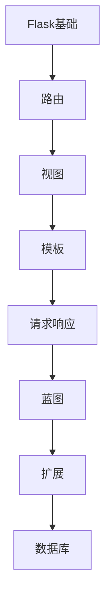

# Flask 学习指南

> **分类**：后端开发 ｜ **技术生态**：Werkzeug、Jinja2、SQLAlchemy、Flask-RESTful、Gunicorn

## 领域定位

Flask 是轻量 WSGI 框架，核心仅路由与模板，通过扩展组装 SQLAlchemy、JWT 等能力。Werkzeug 提供路由 Map 与 Request/Response 对象。

适合微服务、原型与中小型 API；强调显式配置与蓝图模块化。

本领域常用技术栈与工具包括：Werkzeug、Jinja2、SQLAlchemy、Flask-RESTful、Gunicorn。

## 学习目标

- 理解 Werkzeug 路由匹配
- 能用蓝图组织大型应用
- 能集成 SQLAlchemy 与 Marshmallow
- 能用 Gunicorn/uWSGI 部署

## 前置知识

- Python
- HTTP
- WSGI 概念

## 学习路径

1. **Flask基础**
2. **路由**
3. **视图**
4. **模板**
5. **请求响应**
6. **蓝图**
7. **扩展**
8. **数据库**

## 模块体系

- **Flask基础**
- **路由**
- **视图**
- **模板**
- **请求响应**
- **蓝图**
- **扩展**
- **数据库**
- **认证**
- **测试**
- **部署**
- **Flask最佳实践**

## 难度分布

| 入门 | 15 | 25% |
| 实战 | 15 | 25% |
| 进阶 | 15 | 25% |
| 高级 | 15 | 25% |

## 章节索引

### Flask基础

- [Flask基础核心概念与原理](chapters/001-Flask基础核心概念与原理.md) ｜ 入门
- [Flask基础的实现机制详解](chapters/002-Flask基础的实现机制详解.md) ｜ 入门
- [Flask基础的关键技术点](chapters/003-Flask基础的关键技术点.md) ｜ 入门
- [Flask基础的源码级分析](chapters/004-Flask基础的源码级分析.md) ｜ 入门
- [Flask基础的配置与使用](chapters/005-Flask基础的配置与使用.md) ｜ 入门

### 路由

- [路由核心概念与原理](chapters/006-路由核心概念与原理.md) ｜ 入门
- [路由的实现机制详解](chapters/007-路由的实现机制详解.md) ｜ 入门
- [路由的关键技术点](chapters/008-路由的关键技术点.md) ｜ 入门
- [路由的源码级分析](chapters/009-路由的源码级分析.md) ｜ 入门
- [路由的配置与使用](chapters/010-路由的配置与使用.md) ｜ 入门

### 视图

- [视图核心概念与原理](chapters/011-视图核心概念与原理.md) ｜ 入门
- [视图的实现机制详解](chapters/012-视图的实现机制详解.md) ｜ 入门
- [视图的关键技术点](chapters/013-视图的关键技术点.md) ｜ 入门
- [视图的源码级分析](chapters/014-视图的源码级分析.md) ｜ 入门
- [视图的配置与使用](chapters/015-视图的配置与使用.md) ｜ 入门

### 模板

- [模板核心概念与原理](chapters/016-模板核心概念与原理.md) ｜ 进阶
- [模板的实现机制详解](chapters/017-模板的实现机制详解.md) ｜ 进阶
- [模板的关键技术点](chapters/018-模板的关键技术点.md) ｜ 进阶
- [模板的源码级分析](chapters/019-模板的源码级分析.md) ｜ 进阶
- [模板的配置与使用](chapters/020-模板的配置与使用.md) ｜ 进阶

### 请求响应

- [请求响应核心概念与原理](chapters/021-请求响应核心概念与原理.md) ｜ 进阶
- [请求响应的实现机制详解](chapters/022-请求响应的实现机制详解.md) ｜ 进阶
- [请求响应的关键技术点](chapters/023-请求响应的关键技术点.md) ｜ 进阶
- [请求响应的源码级分析](chapters/024-请求响应的源码级分析.md) ｜ 进阶
- [请求响应的配置与使用](chapters/025-请求响应的配置与使用.md) ｜ 进阶

### 蓝图

- [蓝图核心概念与原理](chapters/026-蓝图核心概念与原理.md) ｜ 进阶
- [蓝图的实现机制详解](chapters/027-蓝图的实现机制详解.md) ｜ 进阶
- [蓝图的关键技术点](chapters/028-蓝图的关键技术点.md) ｜ 进阶
- [蓝图的源码级分析](chapters/029-蓝图的源码级分析.md) ｜ 进阶
- [蓝图的配置与使用](chapters/030-蓝图的配置与使用.md) ｜ 进阶

### 扩展

- [扩展核心概念与原理](chapters/031-扩展核心概念与原理.md) ｜ 高级
- [扩展的实现机制详解](chapters/032-扩展的实现机制详解.md) ｜ 高级
- [扩展的关键技术点](chapters/033-扩展的关键技术点.md) ｜ 高级
- [扩展的源码级分析](chapters/034-扩展的源码级分析.md) ｜ 高级
- [扩展的配置与使用](chapters/035-扩展的配置与使用.md) ｜ 高级

### 数据库

- [数据库核心概念与原理](chapters/036-数据库核心概念与原理.md) ｜ 高级
- [数据库的实现机制详解](chapters/037-数据库的实现机制详解.md) ｜ 高级
- [数据库的关键技术点](chapters/038-数据库的关键技术点.md) ｜ 高级
- [数据库的源码级分析](chapters/039-数据库的源码级分析.md) ｜ 高级
- [数据库的配置与使用](chapters/040-数据库的配置与使用.md) ｜ 高级

### 认证

- [认证核心概念与原理](chapters/041-认证核心概念与原理.md) ｜ 高级
- [认证的实现机制详解](chapters/042-认证的实现机制详解.md) ｜ 高级
- [认证的关键技术点](chapters/043-认证的关键技术点.md) ｜ 高级
- [认证的源码级分析](chapters/044-认证的源码级分析.md) ｜ 高级
- [认证的配置与使用](chapters/045-认证的配置与使用.md) ｜ 高级

### 测试

- [测试核心概念与原理](chapters/046-测试核心概念与原理.md) ｜ 实战
- [测试的实现机制详解](chapters/047-测试的实现机制详解.md) ｜ 实战
- [测试的关键技术点](chapters/048-测试的关键技术点.md) ｜ 实战
- [测试的源码级分析](chapters/049-测试的源码级分析.md) ｜ 实战
- [测试的配置与使用](chapters/050-测试的配置与使用.md) ｜ 实战

### 部署

- [部署核心概念与原理](chapters/051-部署核心概念与原理.md) ｜ 实战
- [部署的实现机制详解](chapters/052-部署的实现机制详解.md) ｜ 实战
- [部署的关键技术点](chapters/053-部署的关键技术点.md) ｜ 实战
- [部署的源码级分析](chapters/054-部署的源码级分析.md) ｜ 实战
- [部署的配置与使用](chapters/055-部署的配置与使用.md) ｜ 实战

### Flask最佳实践

- [Flask最佳实践核心概念与原理](chapters/056-Flask最佳实践核心概念与原理.md) ｜ 实战
- [Flask最佳实践的实现机制详解](chapters/057-Flask最佳实践的实现机制详解.md) ｜ 实战
- [Flask最佳实践的关键技术点](chapters/058-Flask最佳实践的关键技术点.md) ｜ 实战
- [Flask最佳实践的源码级分析](chapters/059-Flask最佳实践的源码级分析.md) ｜ 实战
- [Flask最佳实践的配置与使用](chapters/060-Flask最佳实践的配置与使用.md) ｜ 实战

---
*领域: Flask*