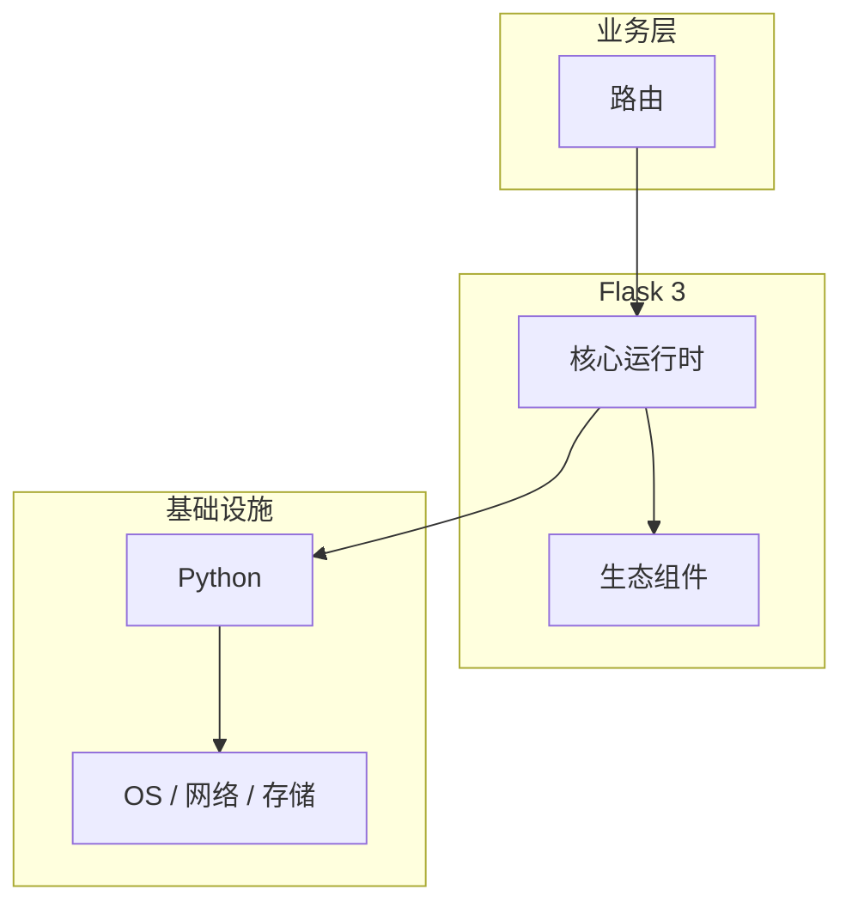

# 路由的关键技术点

> **领域**：Flask ｜ **模块**：路由 ｜ **难度**：入门 ｜ **类型**：关键技术

## 导读

本章系统讲解 **Flask** 中 **路由** 的相关知识（关键技术）。本章归纳 **路由** 在生产环境中最常用、最易出错的关键技术点。内容基于主流框架与工程实践撰写，不依赖过时概念堆砌。

## 核心知识

Flask 路由系统建立在 Werkzeug 的 **Map** 与 **Rule** 之上。应用启动时 `@app.route` 装饰器向 `app.url_map` 注册规则；请求到达时 Werkzeug 按规则优先级匹配 URL，提取动态参数并 dispatch 到视图函数。

### 核心知识

**1. Werkzeug Map 与 Rule**

`werkzeug.routing.Map` 维护一组 `Rule` 对象。每条 Rule 包含路径模式（如 `/user/<int:id>`）、允许的 HTTP 方法、endpoint 名称。Map 在编译阶段将路径转为正则与转换器（Converter），支持 `int`、`float`、`path`、`uuid` 等内置类型及自定义 Converter。

**2. 路由注册与 url_map**

Flask 在 `Flask.__init__` 中创建 `self.url_map = Map()`。`add_url_rule(rule, endpoint, view_func, methods=...)` 将 Rule 加入 Map。蓝图注册时会把蓝图的 url_map 合并到应用 Map，并加上 url_prefix。

**3. 匹配与 dispatch**

WSGI 入口 `Flask.wsgi_app` 构造 `Request`，调用 `url_map.bind_to_environ` 得到 `MapAdapter`，再 `match(path_info, method)` 返回 `(endpoint, view_args)`。405 由 MethodNotAllowed 触发，404 由 NotFound 触发。

## 架构与流程

## 技术详解

### 关键技术

1. 定义视图并用 `@app.route('/items/<int:item_id>', methods=['GET','PUT'])` 注册
2. 启动时检查 endpoint 唯一性
3. 请求 `/items/42` → Map 匹配 → `view_args={'item_id': 42}`
4. `app.view_functions[endpoint]` 被调用并返回 Response

## 原理与实现

### 工作机制

请求路径经 MapAdapter 逐级匹配：静态段精确比较，动态段调用 Converter.to_python。同一 endpoint 可绑定多条 Rule（不同 methods 或 paths）。Flask 2.x 默认 `strict_slashes=True`，尾部斜杠不一致会 308 重定向。

### 内部实现

Werkzeug Map 内部用状态机构建 URL 匹配树（类似 radix tree），比逐条正则遍历更高效。`Rule.build` 生成 `_regex` 与 `_trace`。阅读 `werkzeug/routing/map.py` 与 `flask/app.py` 的 `dispatch_request` 可完整跟踪调用链。

## 操作流程与实践

### 操作流程

1. 定义视图并用 `@app.route('/items/<int:item_id>', methods=['GET','PUT'])` 注册
2. 启动时检查 endpoint 唯一性
3. 请求 `/items/42` → Map 匹配 → `view_args={'item_id': 42}`
4. `app.view_functions[endpoint]` 被调用并返回 Response

## 性能、安全与排查

### 性能优化

路由匹配在内存中完成，开销通常可忽略；避免单 endpoint 挂载过多重叠 Rule 导致匹配回溯。

### 安全注意

动态段使用专用 Converter，避免将未校验字符串直接拼 SQL；敏感操作限定 methods=['POST'] 并校验 CSRF。

### 调试排错

`flask routes` CLI 或 `app.url_map.iter_rules()` 列出所有 Rule；404 时检查 methods 与 trailing slash。

## 本章聚焦

**路由** 的关键技术往往集中在默认配置与边界行为；生产问题多源于「以为懂了」的细节，应用 checklist 逐项验证。

### 常见误区与纠正

**endpoint 冲突**

后注册的同名 endpoint 覆盖前者，蓝图与应用间易冲突，应使用 `endpoint=` 显式命名。

**Converter 类型错误**

`<id>` 默认 str，数值比较前需 `<int:id>`，否则得到字符串导致 ORM 查询异常。

### 最佳实践

1. REST 资源用名词复数路径，版本放在 Header 或 URL 前缀
2. 大型项目用 Blueprint 拆分 url_map
3. 为 API 统一注册 errorhandler(404/405)

## 巩固建议

建议结合 **Flask** 官方文档与小型实验，亲手验证 **路由** 的默认行为与边界条件；将本章要点整理为检查清单或 ADR，便于评审与团队 onboarding。

### 本章小结

学完本章，你应能独立说明 **路由** 在 Flask 中的角色，理解其核心机制，规避常见误区，并在项目中正确运用。

## 延伸学习

- 路由核心概念与原理
- 路由的实现机制详解
- 路由的源码级分析
- 路由的配置与使用

### 延伸阅读

- Flask 官方文档 - Routing
- Werkzeug routing 源码
- PEP 3333 WSGI 规范

---
*章节 ID: 008 ｜ 领域: Flask*