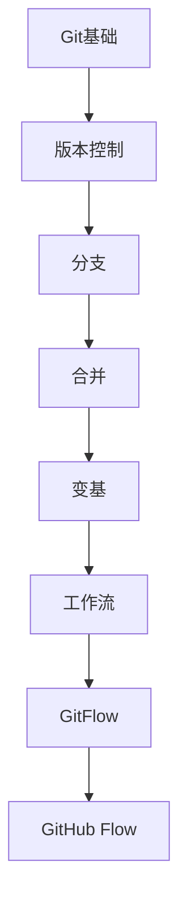

# Git版本控制 学习指南

> **分类**：DevOps ｜ **章节总数**：80 ｜ **技术栈**：Git 2.43+

## 领域概述

Git版本控制是DevOps领域的重要技术方向，本系列从基础到高级逐步深入，涵盖15个核心模块：Git基础、版本控制、分支、合并、变基等。每个知识点作为独立章节，包含原理讲解、实现要点、常见陷阱和最佳实践，配合源码分析和架构图，帮助读者建立完整的Git版本控制知识体系。

本教程基于 **Git** 与 **Git 2.43+** 生态编写，涵盖 GitHub, GitLab 等主流工具与框架。每章独立成篇，文字精炼、逻辑清晰，适合系统学习与按需查阅。

## 你将学到什么

完成本系列后，你将能够：

- 系统理解 **Git版本控制** 的核心概念与模块划分。
- 按难度递进掌握从入门到实战的完整知识路径。
- 在工程实践中做出合理的技术判断与问题排查。
- 通过章节索引快速定位所需知识点。

## 前置知识

- 编程基础
- 数据结构
- 计算机基础
- DevOps基础概念

## 推荐学习路径

1. **Git基础**
2. **版本控制**
3. **分支**
4. **合并**
5. **变基**
6. **工作流**
7. **GitFlow**
8. **GitHub Flow**

## 模块体系

本领域按以下模块组织，难度由浅入深：

- **Git基础**
- **版本控制**
- **分支**
- **合并**
- **变基**
- **工作流**
- **GitFlow**
- **GitHub Flow**
- **标签**
- **储藏**
- **子模块**
- **大文件**
- **冲突解决**
- **历史改写**
- **Git最佳实践**

## 难度分布

| 难度 | 章节数 | 占比 |
|------|--------|------|
| 入门 | 18 | 22% |
| 实战 | 15 | 18% |
| 进阶 | 22 | 27% |
| 高级 | 25 | 31% |

## 章节索引

点击章节标题进入对应教程：

### Git基础

- [Git基础核心概念与原理](chapters/001-Git基础核心概念与原理.md) ｜ 入门
- [Git基础的实现机制详解](chapters/002-Git基础的实现机制详解.md) ｜ 入门
- [Git基础的关键技术点](chapters/003-Git基础的关键技术点.md) ｜ 入门
- [Git基础的源码级分析](chapters/004-Git基础的源码级分析.md) ｜ 入门
- [Git基础的配置与使用](chapters/005-Git基础的配置与使用.md) ｜ 入门
- [Git基础的常见问题与解决方案](chapters/006-Git基础的常见问题与解决方案.md) ｜ 入门

### 版本控制

- [版本控制核心概念与原理](chapters/007-版本控制核心概念与原理.md) ｜ 入门
- [版本控制的实现机制详解](chapters/008-版本控制的实现机制详解.md) ｜ 入门
- [版本控制的关键技术点](chapters/009-版本控制的关键技术点.md) ｜ 入门
- [版本控制的源码级分析](chapters/010-版本控制的源码级分析.md) ｜ 入门
- [版本控制的配置与使用](chapters/011-版本控制的配置与使用.md) ｜ 入门
- [版本控制的常见问题与解决方案](chapters/012-版本控制的常见问题与解决方案.md) ｜ 入门

### 分支

- [分支核心概念与原理](chapters/013-分支核心概念与原理.md) ｜ 入门
- [分支的实现机制详解](chapters/014-分支的实现机制详解.md) ｜ 入门
- [分支的关键技术点](chapters/015-分支的关键技术点.md) ｜ 入门
- [分支的源码级分析](chapters/016-分支的源码级分析.md) ｜ 入门
- [分支的配置与使用](chapters/017-分支的配置与使用.md) ｜ 入门
- [分支的常见问题与解决方案](chapters/018-分支的常见问题与解决方案.md) ｜ 入门

### 合并

- [合并核心概念与原理](chapters/019-合并核心概念与原理.md) ｜ 进阶
- [合并的实现机制详解](chapters/020-合并的实现机制详解.md) ｜ 进阶
- [合并的关键技术点](chapters/021-合并的关键技术点.md) ｜ 进阶
- [合并的源码级分析](chapters/022-合并的源码级分析.md) ｜ 进阶
- [合并的配置与使用](chapters/023-合并的配置与使用.md) ｜ 进阶
- [合并的常见问题与解决方案](chapters/024-合并的常见问题与解决方案.md) ｜ 进阶

### 变基

- [变基核心概念与原理](chapters/025-变基核心概念与原理.md) ｜ 进阶
- [变基的实现机制详解](chapters/026-变基的实现机制详解.md) ｜ 进阶
- [变基的关键技术点](chapters/027-变基的关键技术点.md) ｜ 进阶
- [变基的源码级分析](chapters/028-变基的源码级分析.md) ｜ 进阶
- [变基的配置与使用](chapters/029-变基的配置与使用.md) ｜ 进阶
- [变基的常见问题与解决方案](chapters/030-变基的常见问题与解决方案.md) ｜ 进阶

### 工作流

- [工作流核心概念与原理](chapters/031-工作流核心概念与原理.md) ｜ 进阶
- [工作流的实现机制详解](chapters/032-工作流的实现机制详解.md) ｜ 进阶
- [工作流的关键技术点](chapters/033-工作流的关键技术点.md) ｜ 进阶
- [工作流的源码级分析](chapters/034-工作流的源码级分析.md) ｜ 进阶
- [工作流的配置与使用](chapters/035-工作流的配置与使用.md) ｜ 进阶

### GitFlow

- [GitFlow核心概念与原理](chapters/036-GitFlow核心概念与原理.md) ｜ 进阶
- [GitFlow的实现机制详解](chapters/037-GitFlow的实现机制详解.md) ｜ 进阶
- [GitFlow的关键技术点](chapters/038-GitFlow的关键技术点.md) ｜ 进阶
- [GitFlow的源码级分析](chapters/039-GitFlow的源码级分析.md) ｜ 进阶
- [GitFlow的配置与使用](chapters/040-GitFlow的配置与使用.md) ｜ 进阶

### GitHub Flow

- [GitHub Flow核心概念与原理](chapters/041-GitHub-Flow核心概念与原理.md) ｜ 高级
- [GitHub Flow的实现机制详解](chapters/042-GitHub-Flow的实现机制详解.md) ｜ 高级
- [GitHub Flow的关键技术点](chapters/043-GitHub-Flow的关键技术点.md) ｜ 高级
- [GitHub Flow的源码级分析](chapters/044-GitHub-Flow的源码级分析.md) ｜ 高级
- [GitHub Flow的配置与使用](chapters/045-GitHub-Flow的配置与使用.md) ｜ 高级

### 标签

- [标签核心概念与原理](chapters/046-标签核心概念与原理.md) ｜ 高级
- [标签的实现机制详解](chapters/047-标签的实现机制详解.md) ｜ 高级
- [标签的关键技术点](chapters/048-标签的关键技术点.md) ｜ 高级
- [标签的源码级分析](chapters/049-标签的源码级分析.md) ｜ 高级
- [标签的配置与使用](chapters/050-标签的配置与使用.md) ｜ 高级

### 储藏

- [储藏核心概念与原理](chapters/051-储藏核心概念与原理.md) ｜ 高级
- [储藏的实现机制详解](chapters/052-储藏的实现机制详解.md) ｜ 高级
- [储藏的关键技术点](chapters/053-储藏的关键技术点.md) ｜ 高级
- [储藏的源码级分析](chapters/054-储藏的源码级分析.md) ｜ 高级
- [储藏的配置与使用](chapters/055-储藏的配置与使用.md) ｜ 高级

### 子模块

- [子模块核心概念与原理](chapters/056-子模块核心概念与原理.md) ｜ 高级
- [子模块的实现机制详解](chapters/057-子模块的实现机制详解.md) ｜ 高级
- [子模块的关键技术点](chapters/058-子模块的关键技术点.md) ｜ 高级
- [子模块的源码级分析](chapters/059-子模块的源码级分析.md) ｜ 高级
- [子模块的配置与使用](chapters/060-子模块的配置与使用.md) ｜ 高级

### 大文件

- [大文件核心概念与原理](chapters/061-大文件核心概念与原理.md) ｜ 高级
- [大文件的实现机制详解](chapters/062-大文件的实现机制详解.md) ｜ 高级
- [大文件的关键技术点](chapters/063-大文件的关键技术点.md) ｜ 高级
- [大文件的源码级分析](chapters/064-大文件的源码级分析.md) ｜ 高级
- [大文件的配置与使用](chapters/065-大文件的配置与使用.md) ｜ 高级

### 冲突解决

- [冲突解决核心概念与原理](chapters/066-冲突解决核心概念与原理.md) ｜ 实战
- [冲突解决的实现机制详解](chapters/067-冲突解决的实现机制详解.md) ｜ 实战
- [冲突解决的关键技术点](chapters/068-冲突解决的关键技术点.md) ｜ 实战
- [冲突解决的源码级分析](chapters/069-冲突解决的源码级分析.md) ｜ 实战
- [冲突解决的配置与使用](chapters/070-冲突解决的配置与使用.md) ｜ 实战

### 历史改写

- [历史改写核心概念与原理](chapters/071-历史改写核心概念与原理.md) ｜ 实战
- [历史改写的实现机制详解](chapters/072-历史改写的实现机制详解.md) ｜ 实战
- [历史改写的关键技术点](chapters/073-历史改写的关键技术点.md) ｜ 实战
- [历史改写的源码级分析](chapters/074-历史改写的源码级分析.md) ｜ 实战
- [历史改写的配置与使用](chapters/075-历史改写的配置与使用.md) ｜ 实战

### Git最佳实践

- [Git最佳实践核心概念与原理](chapters/076-Git最佳实践核心概念与原理.md) ｜ 实战
- [Git最佳实践的实现机制详解](chapters/077-Git最佳实践的实现机制详解.md) ｜ 实战
- [Git最佳实践的关键技术点](chapters/078-Git最佳实践的关键技术点.md) ｜ 实战
- [Git最佳实践的源码级分析](chapters/079-Git最佳实践的源码级分析.md) ｜ 实战
- [Git最佳实践的配置与使用](chapters/080-Git最佳实践的配置与使用.md) ｜ 实战

## 学习方法建议

1. **先读概述再读章节**：用本指南建立全局地图，避免迷失在细节中。
2. **按模块递进**：同一模块内章节有前后关联，顺序阅读效果更好。
3. **主动复述**：每章读完后，用三五句话概括「是什么、为什么、怎么用」。
4. **关联阅读**：利用章节底部的「延伸学习」在同模块内构建知识网络。
5. **对照官方文档**：本教程提供结构化视角，细节以官方文档为准。

---
*领域: Git版本控制 ｜ 版本: 2.0 ｜ 共 80 章*