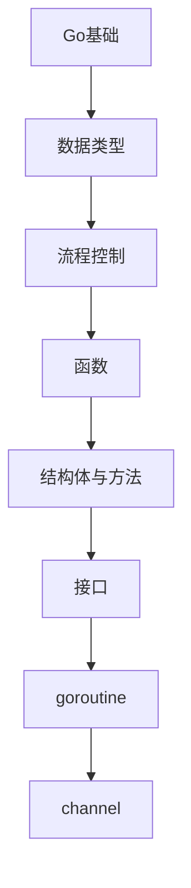

# Go语言 学习指南

> **分类**：编程语言 ｜ **技术生态**：见正文

## 领域定位

Go 由 Google 设计，强调简洁与高效并发：goroutine 轻量、channel 通信、静态编译单二进制，广泛应用于云原生与基础设施。

系统学习 Go语言 需兼顾原理与工程实践，本指南按模块组织章节，由浅入深。

建议结合官方文档与社区主流工具链同步学习。

## 学习目标

- 系统掌握 Go语言 核心模块与协作关系
- 能独立分析常见问题并给出可验证的解决方案
- 能在真实项目中做出合理的技术选型与架构决策
- 能阅读官方文档与源码定位关键实现路径

## 前置知识

- 无硬性前置，按章节难度循序渐进即可

## 学习路径

1. **Go基础**
2. **数据类型**
3. **流程控制**
4. **函数**
5. **结构体与方法**
6. **接口**
7. **goroutine**
8. **channel**

## 模块体系

- **Go基础**
- **数据类型**
- **流程控制**
- **函数**
- **结构体与方法**
- **接口**
- **goroutine**
- **channel**
- **并发模式**
- **错误处理**
- **包管理**
- **测试**
- **反射**
- **泛型**
- **性能优化**
- **Go最佳实践**

## 难度分布

| 入门 | 24 | 20% |
| 实战 | 28 | 23% |
| 进阶 | 40 | 33% |
| 高级 | 28 | 23% |

## 章节索引

### Go基础

- [Go基础核心概念与原理](chapters/001-Go基础核心概念与原理.md) ｜ 入门
- [Go基础的实现机制详解](chapters/002-Go基础的实现机制详解.md) ｜ 入门
- [Go基础的关键技术点](chapters/003-Go基础的关键技术点.md) ｜ 入门
- [Go基础的源码级分析](chapters/004-Go基础的源码级分析.md) ｜ 入门
- [Go基础的配置与使用](chapters/005-Go基础的配置与使用.md) ｜ 入门
- [Go基础的常见问题与解决方案](chapters/006-Go基础的常见问题与解决方案.md) ｜ 入门
- [Go基础的性能优化技巧](chapters/007-Go基础的性能优化技巧.md) ｜ 入门
- [Go基础的最佳实践指南](chapters/008-Go基础的最佳实践指南.md) ｜ 入门

### 数据类型

- [数据类型核心概念与原理](chapters/009-数据类型核心概念与原理.md) ｜ 入门
- [数据类型的实现机制详解](chapters/010-数据类型的实现机制详解.md) ｜ 入门
- [数据类型的关键技术点](chapters/011-数据类型的关键技术点.md) ｜ 入门
- [数据类型的源码级分析](chapters/012-数据类型的源码级分析.md) ｜ 入门
- [数据类型的配置与使用](chapters/013-数据类型的配置与使用.md) ｜ 入门
- [数据类型的常见问题与解决方案](chapters/014-数据类型的常见问题与解决方案.md) ｜ 入门
- [数据类型的性能优化技巧](chapters/015-数据类型的性能优化技巧.md) ｜ 入门
- [数据类型的最佳实践指南](chapters/016-数据类型的最佳实践指南.md) ｜ 入门

### 流程控制

- [流程控制核心概念与原理](chapters/017-流程控制核心概念与原理.md) ｜ 入门
- [流程控制的实现机制详解](chapters/018-流程控制的实现机制详解.md) ｜ 入门
- [流程控制的关键技术点](chapters/019-流程控制的关键技术点.md) ｜ 入门
- [流程控制的源码级分析](chapters/020-流程控制的源码级分析.md) ｜ 入门
- [流程控制的配置与使用](chapters/021-流程控制的配置与使用.md) ｜ 入门
- [流程控制的常见问题与解决方案](chapters/022-流程控制的常见问题与解决方案.md) ｜ 入门
- [流程控制的性能优化技巧](chapters/023-流程控制的性能优化技巧.md) ｜ 入门
- [流程控制的最佳实践指南](chapters/024-流程控制的最佳实践指南.md) ｜ 入门

### 函数

- [函数核心概念与原理](chapters/025-函数核心概念与原理.md) ｜ 进阶
- [函数的实现机制详解](chapters/026-函数的实现机制详解.md) ｜ 进阶
- [函数的关键技术点](chapters/027-函数的关键技术点.md) ｜ 进阶
- [函数的源码级分析](chapters/028-函数的源码级分析.md) ｜ 进阶
- [函数的配置与使用](chapters/029-函数的配置与使用.md) ｜ 进阶
- [函数的常见问题与解决方案](chapters/030-函数的常见问题与解决方案.md) ｜ 进阶
- [函数的性能优化技巧](chapters/031-函数的性能优化技巧.md) ｜ 进阶
- [函数的最佳实践指南](chapters/032-函数的最佳实践指南.md) ｜ 进阶

### 结构体与方法

- [结构体与方法核心概念与原理](chapters/033-结构体与方法核心概念与原理.md) ｜ 进阶
- [结构体与方法的实现机制详解](chapters/034-结构体与方法的实现机制详解.md) ｜ 进阶
- [结构体与方法的关键技术点](chapters/035-结构体与方法的关键技术点.md) ｜ 进阶
- [结构体与方法的源码级分析](chapters/036-结构体与方法的源码级分析.md) ｜ 进阶
- [结构体与方法的配置与使用](chapters/037-结构体与方法的配置与使用.md) ｜ 进阶
- [结构体与方法的常见问题与解决方案](chapters/038-结构体与方法的常见问题与解决方案.md) ｜ 进阶
- [结构体与方法的性能优化技巧](chapters/039-结构体与方法的性能优化技巧.md) ｜ 进阶
- [结构体与方法的最佳实践指南](chapters/040-结构体与方法的最佳实践指南.md) ｜ 进阶

### 接口

- [接口核心概念与原理](chapters/041-接口核心概念与原理.md) ｜ 进阶
- [接口的实现机制详解](chapters/042-接口的实现机制详解.md) ｜ 进阶
- [接口的关键技术点](chapters/043-接口的关键技术点.md) ｜ 进阶
- [接口的源码级分析](chapters/044-接口的源码级分析.md) ｜ 进阶
- [接口的配置与使用](chapters/045-接口的配置与使用.md) ｜ 进阶
- [接口的常见问题与解决方案](chapters/046-接口的常见问题与解决方案.md) ｜ 进阶
- [接口的性能优化技巧](chapters/047-接口的性能优化技巧.md) ｜ 进阶
- [接口的最佳实践指南](chapters/048-接口的最佳实践指南.md) ｜ 进阶

### goroutine

- [goroutine核心概念与原理](chapters/049-goroutine核心概念与原理.md) ｜ 进阶
- [goroutine的实现机制详解](chapters/050-goroutine的实现机制详解.md) ｜ 进阶
- [goroutine的关键技术点](chapters/051-goroutine的关键技术点.md) ｜ 进阶
- [goroutine的源码级分析](chapters/052-goroutine的源码级分析.md) ｜ 进阶
- [goroutine的配置与使用](chapters/053-goroutine的配置与使用.md) ｜ 进阶
- [goroutine的常见问题与解决方案](chapters/054-goroutine的常见问题与解决方案.md) ｜ 进阶
- [goroutine的性能优化技巧](chapters/055-goroutine的性能优化技巧.md) ｜ 进阶
- [goroutine的最佳实践指南](chapters/056-goroutine的最佳实践指南.md) ｜ 进阶

### channel

- [channel核心概念与原理](chapters/057-channel核心概念与原理.md) ｜ 进阶
- [channel的实现机制详解](chapters/058-channel的实现机制详解.md) ｜ 进阶
- [channel的关键技术点](chapters/059-channel的关键技术点.md) ｜ 进阶
- [channel的源码级分析](chapters/060-channel的源码级分析.md) ｜ 进阶
- [channel的配置与使用](chapters/061-channel的配置与使用.md) ｜ 进阶
- [channel的常见问题与解决方案](chapters/062-channel的常见问题与解决方案.md) ｜ 进阶
- [channel的性能优化技巧](chapters/063-channel的性能优化技巧.md) ｜ 进阶
- [channel的最佳实践指南](chapters/064-channel的最佳实践指南.md) ｜ 进阶

### 并发模式

- [并发模式核心概念与原理](chapters/065-并发模式核心概念与原理.md) ｜ 高级
- [并发模式的实现机制详解](chapters/066-并发模式的实现机制详解.md) ｜ 高级
- [并发模式的关键技术点](chapters/067-并发模式的关键技术点.md) ｜ 高级
- [并发模式的源码级分析](chapters/068-并发模式的源码级分析.md) ｜ 高级
- [并发模式的配置与使用](chapters/069-并发模式的配置与使用.md) ｜ 高级
- [并发模式的常见问题与解决方案](chapters/070-并发模式的常见问题与解决方案.md) ｜ 高级
- [并发模式的性能优化技巧](chapters/071-并发模式的性能优化技巧.md) ｜ 高级

### 错误处理

- [错误处理核心概念与原理](chapters/072-错误处理核心概念与原理.md) ｜ 高级
- [错误处理的实现机制详解](chapters/073-错误处理的实现机制详解.md) ｜ 高级
- [错误处理的关键技术点](chapters/074-错误处理的关键技术点.md) ｜ 高级
- [错误处理的源码级分析](chapters/075-错误处理的源码级分析.md) ｜ 高级
- [错误处理的配置与使用](chapters/076-错误处理的配置与使用.md) ｜ 高级
- [错误处理的常见问题与解决方案](chapters/077-错误处理的常见问题与解决方案.md) ｜ 高级
- [错误处理的性能优化技巧](chapters/078-错误处理的性能优化技巧.md) ｜ 高级

### 包管理

- [包管理核心概念与原理](chapters/079-包管理核心概念与原理.md) ｜ 高级
- [包管理的实现机制详解](chapters/080-包管理的实现机制详解.md) ｜ 高级
- [包管理的关键技术点](chapters/081-包管理的关键技术点.md) ｜ 高级
- [包管理的源码级分析](chapters/082-包管理的源码级分析.md) ｜ 高级
- [包管理的配置与使用](chapters/083-包管理的配置与使用.md) ｜ 高级
- [包管理的常见问题与解决方案](chapters/084-包管理的常见问题与解决方案.md) ｜ 高级
- [包管理的性能优化技巧](chapters/085-包管理的性能优化技巧.md) ｜ 高级

### 测试

- [测试核心概念与原理](chapters/086-测试核心概念与原理.md) ｜ 高级
- [测试的实现机制详解](chapters/087-测试的实现机制详解.md) ｜ 高级
- [测试的关键技术点](chapters/088-测试的关键技术点.md) ｜ 高级
- [测试的源码级分析](chapters/089-测试的源码级分析.md) ｜ 高级
- [测试的配置与使用](chapters/090-测试的配置与使用.md) ｜ 高级
- [测试的常见问题与解决方案](chapters/091-测试的常见问题与解决方案.md) ｜ 高级
- [测试的性能优化技巧](chapters/092-测试的性能优化技巧.md) ｜ 高级

### 反射

- [反射核心概念与原理](chapters/093-反射核心概念与原理.md) ｜ 实战
- [反射的实现机制详解](chapters/094-反射的实现机制详解.md) ｜ 实战
- [反射的关键技术点](chapters/095-反射的关键技术点.md) ｜ 实战
- [反射的源码级分析](chapters/096-反射的源码级分析.md) ｜ 实战
- [反射的配置与使用](chapters/097-反射的配置与使用.md) ｜ 实战
- [反射的常见问题与解决方案](chapters/098-反射的常见问题与解决方案.md) ｜ 实战
- [反射的性能优化技巧](chapters/099-反射的性能优化技巧.md) ｜ 实战

### 泛型

- [泛型核心概念与原理](chapters/100-泛型核心概念与原理.md) ｜ 实战
- [泛型的实现机制详解](chapters/101-泛型的实现机制详解.md) ｜ 实战
- [泛型的关键技术点](chapters/102-泛型的关键技术点.md) ｜ 实战
- [泛型的源码级分析](chapters/103-泛型的源码级分析.md) ｜ 实战
- [泛型的配置与使用](chapters/104-泛型的配置与使用.md) ｜ 实战
- [泛型的常见问题与解决方案](chapters/105-泛型的常见问题与解决方案.md) ｜ 实战
- [泛型的性能优化技巧](chapters/106-泛型的性能优化技巧.md) ｜ 实战

### 性能优化

- [性能优化核心概念与原理](chapters/107-性能优化核心概念与原理.md) ｜ 实战
- [性能优化的实现机制详解](chapters/108-性能优化的实现机制详解.md) ｜ 实战
- [性能优化的关键技术点](chapters/109-性能优化的关键技术点.md) ｜ 实战
- [性能优化的源码级分析](chapters/110-性能优化的源码级分析.md) ｜ 实战
- [性能优化的配置与使用](chapters/111-性能优化的配置与使用.md) ｜ 实战
- [性能优化的常见问题与解决方案](chapters/112-性能优化的常见问题与解决方案.md) ｜ 实战
- [性能优化的性能优化技巧](chapters/113-性能优化的性能优化技巧.md) ｜ 实战

### Go最佳实践

- [Go最佳实践核心概念与原理](chapters/114-Go最佳实践核心概念与原理.md) ｜ 实战
- [Go最佳实践的实现机制详解](chapters/115-Go最佳实践的实现机制详解.md) ｜ 实战
- [Go最佳实践的关键技术点](chapters/116-Go最佳实践的关键技术点.md) ｜ 实战
- [Go最佳实践的源码级分析](chapters/117-Go最佳实践的源码级分析.md) ｜ 实战
- [Go最佳实践的配置与使用](chapters/118-Go最佳实践的配置与使用.md) ｜ 实战
- [Go最佳实践的常见问题与解决方案](chapters/119-Go最佳实践的常见问题与解决方案.md) ｜ 实战
- [Go最佳实践的性能优化技巧](chapters/120-Go最佳实践的性能优化技巧.md) ｜ 实战

---
*领域: Go语言*