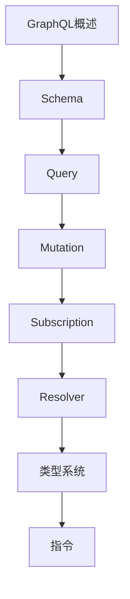

# GraphQL 学习指南

> **分类**：后端开发 ｜ **章节总数**：60 ｜ **技术栈**：Apollo/GraphQL

## 领域概述

GraphQL是后端开发领域的重要技术方向，本系列从基础到高级逐步深入，涵盖14个核心模块：GraphQL概述、Schema、Query、Mutation、Subscription等。每个知识点作为独立章节，包含原理讲解、实现要点、常见陷阱和最佳实践，配合源码分析和架构图，帮助读者建立完整的GraphQL知识体系。

本教程基于 **GraphQL** 与 **Apollo/GraphQL** 生态编写，涵盖 Relay, Prisma 等主流工具与框架。每章独立成篇，文字精炼、逻辑清晰，适合系统学习与按需查阅。

## 你将学到什么

完成本系列后，你将能够：

- 系统理解 **GraphQL** 的核心概念与模块划分。
- 按难度递进掌握从入门到实战的完整知识路径。
- 在工程实践中做出合理的技术判断与问题排查。
- 通过章节索引快速定位所需知识点。

## 前置知识

- 编程基础
- 数据结构
- 计算机基础
- 后端开发基础概念

## 推荐学习路径

1. **GraphQL概述**
2. **Schema**
3. **Query**
4. **Mutation**
5. **Subscription**
6. **Resolver**
7. **类型系统**
8. **指令**

## 模块体系

本领域按以下模块组织，难度由浅入深：

- **GraphQL概述**
- **Schema**
- **Query**
- **Mutation**
- **Subscription**
- **Resolver**
- **类型系统**
- **指令**
- **缓存**
- **性能优化**
- **安全**
- **工具链**
- **Apollo**
- **GraphQL最佳实践**

## 难度分布

| 难度 | 章节数 | 占比 |
|------|--------|------|
| 入门 | 15 | 25% |
| 实战 | 12 | 20% |
| 进阶 | 17 | 28% |
| 高级 | 16 | 26% |

## 章节索引

点击章节标题进入对应教程：

### GraphQL概述

- [GraphQL概述核心概念与原理](chapters/001-GraphQL概述核心概念与原理.md) ｜ 入门
- [GraphQL概述的实现机制详解](chapters/002-GraphQL概述的实现机制详解.md) ｜ 入门
- [GraphQL概述的关键技术点](chapters/003-GraphQL概述的关键技术点.md) ｜ 入门
- [GraphQL概述的源码级分析](chapters/004-GraphQL概述的源码级分析.md) ｜ 入门
- [GraphQL概述的配置与使用](chapters/005-GraphQL概述的配置与使用.md) ｜ 入门

### Schema

- [Schema核心概念与原理](chapters/006-Schema核心概念与原理.md) ｜ 入门
- [Schema的实现机制详解](chapters/007-Schema的实现机制详解.md) ｜ 入门
- [Schema的关键技术点](chapters/008-Schema的关键技术点.md) ｜ 入门
- [Schema的源码级分析](chapters/009-Schema的源码级分析.md) ｜ 入门
- [Schema的配置与使用](chapters/010-Schema的配置与使用.md) ｜ 入门

### Query

- [Query核心概念与原理](chapters/011-Query核心概念与原理.md) ｜ 入门
- [Query的实现机制详解](chapters/012-Query的实现机制详解.md) ｜ 入门
- [Query的关键技术点](chapters/013-Query的关键技术点.md) ｜ 入门
- [Query的源码级分析](chapters/014-Query的源码级分析.md) ｜ 入门
- [Query的配置与使用](chapters/015-Query的配置与使用.md) ｜ 入门

### Mutation

- [Mutation核心概念与原理](chapters/016-Mutation核心概念与原理.md) ｜ 进阶
- [Mutation的实现机制详解](chapters/017-Mutation的实现机制详解.md) ｜ 进阶
- [Mutation的关键技术点](chapters/018-Mutation的关键技术点.md) ｜ 进阶
- [Mutation的源码级分析](chapters/019-Mutation的源码级分析.md) ｜ 进阶
- [Mutation的配置与使用](chapters/020-Mutation的配置与使用.md) ｜ 进阶

### Subscription

- [Subscription核心概念与原理](chapters/021-Subscription核心概念与原理.md) ｜ 进阶
- [Subscription的实现机制详解](chapters/022-Subscription的实现机制详解.md) ｜ 进阶
- [Subscription的关键技术点](chapters/023-Subscription的关键技术点.md) ｜ 进阶
- [Subscription的源码级分析](chapters/024-Subscription的源码级分析.md) ｜ 进阶

### Resolver

- [Resolver核心概念与原理](chapters/025-Resolver核心概念与原理.md) ｜ 进阶
- [Resolver的实现机制详解](chapters/026-Resolver的实现机制详解.md) ｜ 进阶
- [Resolver的关键技术点](chapters/027-Resolver的关键技术点.md) ｜ 进阶
- [Resolver的源码级分析](chapters/028-Resolver的源码级分析.md) ｜ 进阶

### 类型系统

- [类型系统核心概念与原理](chapters/029-类型系统核心概念与原理.md) ｜ 进阶
- [类型系统的实现机制详解](chapters/030-类型系统的实现机制详解.md) ｜ 进阶
- [类型系统的关键技术点](chapters/031-类型系统的关键技术点.md) ｜ 进阶
- [类型系统的源码级分析](chapters/032-类型系统的源码级分析.md) ｜ 进阶

### 指令

- [指令核心概念与原理](chapters/033-指令核心概念与原理.md) ｜ 高级
- [指令的实现机制详解](chapters/034-指令的实现机制详解.md) ｜ 高级
- [指令的关键技术点](chapters/035-指令的关键技术点.md) ｜ 高级
- [指令的源码级分析](chapters/036-指令的源码级分析.md) ｜ 高级

### 缓存

- [缓存核心概念与原理](chapters/037-缓存核心概念与原理.md) ｜ 高级
- [缓存的实现机制详解](chapters/038-缓存的实现机制详解.md) ｜ 高级
- [缓存的关键技术点](chapters/039-缓存的关键技术点.md) ｜ 高级
- [缓存的源码级分析](chapters/040-缓存的源码级分析.md) ｜ 高级

### 性能优化

- [性能优化核心概念与原理](chapters/041-性能优化核心概念与原理.md) ｜ 高级
- [性能优化的实现机制详解](chapters/042-性能优化的实现机制详解.md) ｜ 高级
- [性能优化的关键技术点](chapters/043-性能优化的关键技术点.md) ｜ 高级
- [性能优化的源码级分析](chapters/044-性能优化的源码级分析.md) ｜ 高级

### 安全

- [安全核心概念与原理](chapters/045-安全核心概念与原理.md) ｜ 高级
- [安全的实现机制详解](chapters/046-安全的实现机制详解.md) ｜ 高级
- [安全的关键技术点](chapters/047-安全的关键技术点.md) ｜ 高级
- [安全的源码级分析](chapters/048-安全的源码级分析.md) ｜ 高级

### 工具链

- [工具链核心概念与原理](chapters/049-工具链核心概念与原理.md) ｜ 实战
- [工具链的实现机制详解](chapters/050-工具链的实现机制详解.md) ｜ 实战
- [工具链的关键技术点](chapters/051-工具链的关键技术点.md) ｜ 实战
- [工具链的源码级分析](chapters/052-工具链的源码级分析.md) ｜ 实战

### Apollo

- [Apollo核心概念与原理](chapters/053-Apollo核心概念与原理.md) ｜ 实战
- [Apollo的实现机制详解](chapters/054-Apollo的实现机制详解.md) ｜ 实战
- [Apollo的关键技术点](chapters/055-Apollo的关键技术点.md) ｜ 实战
- [Apollo的源码级分析](chapters/056-Apollo的源码级分析.md) ｜ 实战

### GraphQL最佳实践

- [GraphQL最佳实践核心概念与原理](chapters/057-GraphQL最佳实践核心概念与原理.md) ｜ 实战
- [GraphQL最佳实践的实现机制详解](chapters/058-GraphQL最佳实践的实现机制详解.md) ｜ 实战
- [GraphQL最佳实践的关键技术点](chapters/059-GraphQL最佳实践的关键技术点.md) ｜ 实战
- [GraphQL最佳实践的源码级分析](chapters/060-GraphQL最佳实践的源码级分析.md) ｜ 实战

## 学习方法建议

1. **先读概述再读章节**：用本指南建立全局地图，避免迷失在细节中。
2. **按模块递进**：同一模块内章节有前后关联，顺序阅读效果更好。
3. **主动复述**：每章读完后，用三五句话概括「是什么、为什么、怎么用」。
4. **关联阅读**：利用章节底部的「延伸学习」在同模块内构建知识网络。
5. **对照官方文档**：本教程提供结构化视角，细节以官方文档为准。

---
*领域: GraphQL ｜ 版本: 2.0 ｜ 共 60 章*