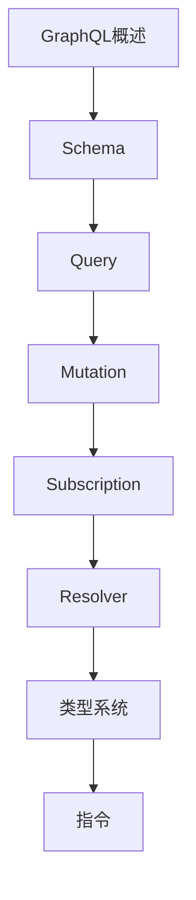

# GraphQL 学习指南

> **分类**：后端开发 ｜ **技术生态**：Apollo Server、GraphQL Java、Hasura、Relay

## 领域定位

GraphQL 提供强类型 Schema 与客户端按需取字段，减少 over-fetching。Subscription 支持实时推送，适合 BFF 与复杂前端数据聚合。

从 Schema 设计、Resolver、DataLoader 到安全与性能，对比 REST 的适用边界。

本领域常用技术栈与工具包括：Apollo Server、GraphQL Java、Hasura、Relay。

## 学习目标

- 能设计可演进 Schema
- 能优化 N+1 与查询复杂度
- 能实现 Subscription
- 能评估 Federation 与 REST 共存

## 前置知识

- JSON
- REST 基础
- TypeScript 或 Java 一种

## 学习路径

1. **GraphQL概述**
2. **Schema**
3. **Query**
4. **Mutation**
5. **Subscription**
6. **Resolver**
7. **类型系统**
8. **指令**

## 模块体系

- **GraphQL概述**
- **Schema**
- **Query**
- **Mutation**
- **Subscription**
- **Resolver**
- **类型系统**
- **指令**
- **缓存**
- **性能优化**
- **安全**
- **工具链**
- **Apollo**
- **GraphQL最佳实践**

## 难度分布

| 入门 | 15 | 25% |
| 实战 | 12 | 20% |
| 进阶 | 17 | 28% |
| 高级 | 16 | 26% |

## 章节索引

### GraphQL概述

- [GraphQL概述核心概念与原理](chapters/001-GraphQL概述核心概念与原理.md) ｜ 入门
- [GraphQL概述的实现机制详解](chapters/002-GraphQL概述的实现机制详解.md) ｜ 入门
- [GraphQL概述的关键技术点](chapters/003-GraphQL概述的关键技术点.md) ｜ 入门
- [GraphQL概述的源码级分析](chapters/004-GraphQL概述的源码级分析.md) ｜ 入门
- [GraphQL概述的配置与使用](chapters/005-GraphQL概述的配置与使用.md) ｜ 入门

### Schema

- [Schema核心概念与原理](chapters/006-Schema核心概念与原理.md) ｜ 入门
- [Schema的实现机制详解](chapters/007-Schema的实现机制详解.md) ｜ 入门
- [Schema的关键技术点](chapters/008-Schema的关键技术点.md) ｜ 入门
- [Schema的源码级分析](chapters/009-Schema的源码级分析.md) ｜ 入门
- [Schema的配置与使用](chapters/010-Schema的配置与使用.md) ｜ 入门

### Query

- [Query核心概念与原理](chapters/011-Query核心概念与原理.md) ｜ 入门
- [Query的实现机制详解](chapters/012-Query的实现机制详解.md) ｜ 入门
- [Query的关键技术点](chapters/013-Query的关键技术点.md) ｜ 入门
- [Query的源码级分析](chapters/014-Query的源码级分析.md) ｜ 入门
- [Query的配置与使用](chapters/015-Query的配置与使用.md) ｜ 入门

### Mutation

- [Mutation核心概念与原理](chapters/016-Mutation核心概念与原理.md) ｜ 进阶
- [Mutation的实现机制详解](chapters/017-Mutation的实现机制详解.md) ｜ 进阶
- [Mutation的关键技术点](chapters/018-Mutation的关键技术点.md) ｜ 进阶
- [Mutation的源码级分析](chapters/019-Mutation的源码级分析.md) ｜ 进阶
- [Mutation的配置与使用](chapters/020-Mutation的配置与使用.md) ｜ 进阶

### Subscription

- [Subscription核心概念与原理](chapters/021-Subscription核心概念与原理.md) ｜ 进阶
- [Subscription的实现机制详解](chapters/022-Subscription的实现机制详解.md) ｜ 进阶
- [Subscription的关键技术点](chapters/023-Subscription的关键技术点.md) ｜ 进阶
- [Subscription的源码级分析](chapters/024-Subscription的源码级分析.md) ｜ 进阶

### Resolver

- [Resolver核心概念与原理](chapters/025-Resolver核心概念与原理.md) ｜ 进阶
- [Resolver的实现机制详解](chapters/026-Resolver的实现机制详解.md) ｜ 进阶
- [Resolver的关键技术点](chapters/027-Resolver的关键技术点.md) ｜ 进阶
- [Resolver的源码级分析](chapters/028-Resolver的源码级分析.md) ｜ 进阶

### 类型系统

- [类型系统核心概念与原理](chapters/029-类型系统核心概念与原理.md) ｜ 进阶
- [类型系统的实现机制详解](chapters/030-类型系统的实现机制详解.md) ｜ 进阶
- [类型系统的关键技术点](chapters/031-类型系统的关键技术点.md) ｜ 进阶
- [类型系统的源码级分析](chapters/032-类型系统的源码级分析.md) ｜ 进阶

### 指令

- [指令核心概念与原理](chapters/033-指令核心概念与原理.md) ｜ 高级
- [指令的实现机制详解](chapters/034-指令的实现机制详解.md) ｜ 高级
- [指令的关键技术点](chapters/035-指令的关键技术点.md) ｜ 高级
- [指令的源码级分析](chapters/036-指令的源码级分析.md) ｜ 高级

### 缓存

- [缓存核心概念与原理](chapters/037-缓存核心概念与原理.md) ｜ 高级
- [缓存的实现机制详解](chapters/038-缓存的实现机制详解.md) ｜ 高级
- [缓存的关键技术点](chapters/039-缓存的关键技术点.md) ｜ 高级
- [缓存的源码级分析](chapters/040-缓存的源码级分析.md) ｜ 高级

### 性能优化

- [性能优化核心概念与原理](chapters/041-性能优化核心概念与原理.md) ｜ 高级
- [性能优化的实现机制详解](chapters/042-性能优化的实现机制详解.md) ｜ 高级
- [性能优化的关键技术点](chapters/043-性能优化的关键技术点.md) ｜ 高级
- [性能优化的源码级分析](chapters/044-性能优化的源码级分析.md) ｜ 高级

### 安全

- [安全核心概念与原理](chapters/045-安全核心概念与原理.md) ｜ 高级
- [安全的实现机制详解](chapters/046-安全的实现机制详解.md) ｜ 高级
- [安全的关键技术点](chapters/047-安全的关键技术点.md) ｜ 高级
- [安全的源码级分析](chapters/048-安全的源码级分析.md) ｜ 高级

### 工具链

- [工具链核心概念与原理](chapters/049-工具链核心概念与原理.md) ｜ 实战
- [工具链的实现机制详解](chapters/050-工具链的实现机制详解.md) ｜ 实战
- [工具链的关键技术点](chapters/051-工具链的关键技术点.md) ｜ 实战
- [工具链的源码级分析](chapters/052-工具链的源码级分析.md) ｜ 实战

### Apollo

- [Apollo核心概念与原理](chapters/053-Apollo核心概念与原理.md) ｜ 实战
- [Apollo的实现机制详解](chapters/054-Apollo的实现机制详解.md) ｜ 实战
- [Apollo的关键技术点](chapters/055-Apollo的关键技术点.md) ｜ 实战
- [Apollo的源码级分析](chapters/056-Apollo的源码级分析.md) ｜ 实战

### GraphQL最佳实践

- [GraphQL最佳实践核心概念与原理](chapters/057-GraphQL最佳实践核心概念与原理.md) ｜ 实战
- [GraphQL最佳实践的实现机制详解](chapters/058-GraphQL最佳实践的实现机制详解.md) ｜ 实战
- [GraphQL最佳实践的关键技术点](chapters/059-GraphQL最佳实践的关键技术点.md) ｜ 实战
- [GraphQL最佳实践的源码级分析](chapters/060-GraphQL最佳实践的源码级分析.md) ｜ 实战

---
*领域: GraphQL*