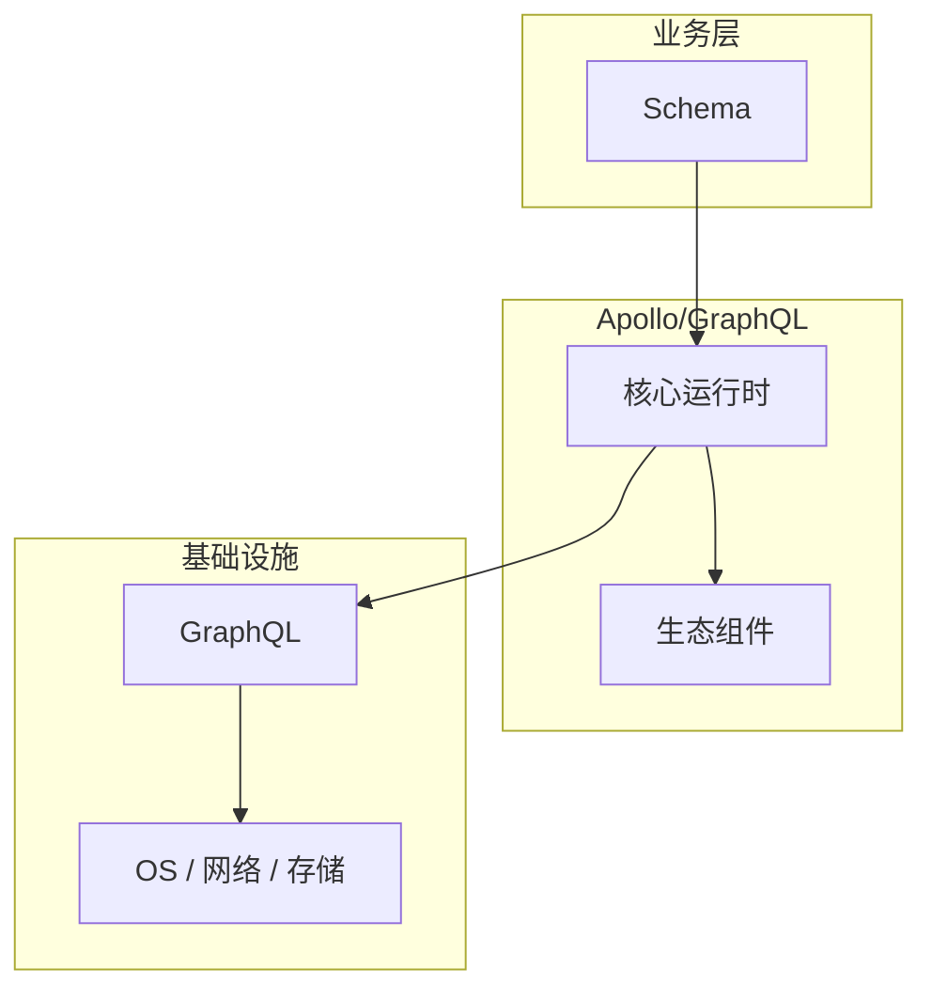

# Schema的源码级分析

> **领域**：GraphQL ｜ **模块**：Schema ｜ **难度**：入门 ｜ **类型**：源码分析

## 导读

本章系统讲解 **GraphQL** 中 **Schema** 的相关知识（源码分析）。本章沿源码与调用链剖析 **Schema** 的实现，适合需要排障或二次开发的读者。内容基于主流框架与工程实践撰写，不依赖过时概念堆砌。

## 核心知识

GraphQL Schema 用 SDL 定义 Query/Mutation/Subscription 根类型及对象图。强类型系统使客户端明确可请求字段，服务端 Resolver 按字段粒度解析。

### 核心知识

**1. 类型与字段**

Object Type 定义字段与参数；Non-Null `!` 与 List `[]` 组合表达 cardinality。

**2. Resolver 函数**

每个字段可绑定 `(parent, args, context, info) => value`；默认 resolver 读 parent 属性。

**3. Introspection**

`__schema` 查询使 GraphiQL 等工具自动生成文档与类型校验。

## 架构与流程

## 技术详解

### 源码与实现

Query 解析 → 验证 against schema → 执行计划（并行无依赖字段）→ 序列化 JSON 响应。

## 原理与实现

### 工作机制

Query 解析 → 验证 against schema → 执行计划（并行无依赖字段）→ 序列化 JSON 响应。

## 性能、安全与排查

### 安全注意

限制查询深度与复杂度；禁用生产 introspection；Persisted Queries 白名单。

## 本章聚焦

源码阅读 **Schema** 宜采用「由外向内」：先跟一次主路径请求，再展开分支与错误处理，避免陷入细节迷失主线。

### 常见误区与纠正

**N+1 查询**

列表字段逐条 resolver 查 DB，用 DataLoader 批量加载。

### 最佳实践

1. Schema 优先设计
2. 错误遵循 GraphQL errors 规范

## 巩固建议

建议结合 **GraphQL** 官方文档与小型实验，亲手验证 **Schema** 的默认行为与边界条件；将本章要点整理为检查清单或 ADR，便于评审与团队 onboarding。

### 本章小结

学完本章，你应能独立说明 **Schema** 在 GraphQL 中的角色，理解其核心机制，规避常见误区，并在项目中正确运用。

## 延伸学习

- Schema核心概念与原理
- Schema的实现机制详解
- Schema的关键技术点
- Schema的配置与使用

### 延伸阅读

- GraphQL Spec
- Apollo Server 文档

---
*章节 ID: 009 ｜ 领域: GraphQL*