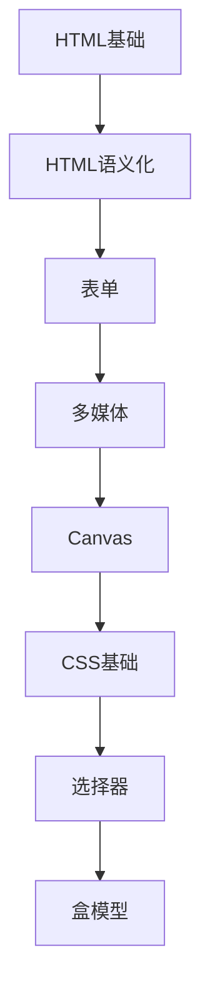

# HTML与CSS 学习指南

> **分类**：前端开发 ｜ **章节总数**：120 ｜ **技术栈**：Web标准

## 领域概述

HTML与CSS是前端开发领域的重要技术方向，本系列从基础到高级逐步深入，涵盖16个核心模块：HTML基础、HTML语义化、表单、多媒体、Canvas等。每个知识点作为独立章节，包含原理讲解、实现要点、常见陷阱和最佳实践，配合源码分析和架构图，帮助读者建立完整的HTML与CSS知识体系。

本教程基于 **HTML/CSS** 与 **Web标准** 生态编写，涵盖 Flexbox, Grid, CSS Variables 等主流工具与框架。每章独立成篇，文字精炼、逻辑清晰，适合系统学习与按需查阅。

## 你将学到什么

完成本系列后，你将能够：

- 系统理解 **HTML与CSS** 的核心概念与模块划分。
- 按难度递进掌握从入门到实战的完整知识路径。
- 在工程实践中做出合理的技术判断与问题排查。
- 通过章节索引快速定位所需知识点。

## 前置知识

- 编程基础
- 数据结构
- 计算机基础
- 前端开发基础概念

## 推荐学习路径

1. **HTML基础**
2. **HTML语义化**
3. **表单**
4. **多媒体**
5. **Canvas**
6. **CSS基础**
7. **选择器**
8. **盒模型**

## 模块体系

本领域按以下模块组织，难度由浅入深：

- **HTML基础**
- **HTML语义化**
- **表单**
- **多媒体**
- **Canvas**
- **CSS基础**
- **选择器**
- **盒模型**
- **布局**
- **Flexbox**
- **Grid**
- **响应式设计**
- **动画与过渡**
- **CSS预处理器**
- **性能优化**
- **最佳实践**

## 难度分布

| 难度 | 章节数 | 占比 |
|------|--------|------|
| 入门 | 24 | 20% |
| 实战 | 28 | 23% |
| 进阶 | 40 | 33% |
| 高级 | 28 | 23% |

## 章节索引

点击章节标题进入对应教程：

### HTML基础

- [HTML基础核心概念与原理](chapters/001-HTML基础核心概念与原理.md) ｜ 入门
- [HTML基础的实现机制详解](chapters/002-HTML基础的实现机制详解.md) ｜ 入门
- [HTML基础的关键技术点](chapters/003-HTML基础的关键技术点.md) ｜ 入门
- [HTML基础的源码级分析](chapters/004-HTML基础的源码级分析.md) ｜ 入门
- [HTML基础的配置与使用](chapters/005-HTML基础的配置与使用.md) ｜ 入门
- [HTML基础的常见问题与解决方案](chapters/006-HTML基础的常见问题与解决方案.md) ｜ 入门
- [HTML基础的性能优化技巧](chapters/007-HTML基础的性能优化技巧.md) ｜ 入门
- [HTML基础的最佳实践指南](chapters/008-HTML基础的最佳实践指南.md) ｜ 入门

### HTML语义化

- [HTML语义化核心概念与原理](chapters/009-HTML语义化核心概念与原理.md) ｜ 入门
- [HTML语义化的实现机制详解](chapters/010-HTML语义化的实现机制详解.md) ｜ 入门
- [HTML语义化的关键技术点](chapters/011-HTML语义化的关键技术点.md) ｜ 入门
- [HTML语义化的源码级分析](chapters/012-HTML语义化的源码级分析.md) ｜ 入门
- [HTML语义化的配置与使用](chapters/013-HTML语义化的配置与使用.md) ｜ 入门
- [HTML语义化的常见问题与解决方案](chapters/014-HTML语义化的常见问题与解决方案.md) ｜ 入门
- [HTML语义化的性能优化技巧](chapters/015-HTML语义化的性能优化技巧.md) ｜ 入门
- [HTML语义化的最佳实践指南](chapters/016-HTML语义化的最佳实践指南.md) ｜ 入门

### 表单

- [表单核心概念与原理](chapters/017-表单核心概念与原理.md) ｜ 入门
- [表单的实现机制详解](chapters/018-表单的实现机制详解.md) ｜ 入门
- [表单的关键技术点](chapters/019-表单的关键技术点.md) ｜ 入门
- [表单的源码级分析](chapters/020-表单的源码级分析.md) ｜ 入门
- [表单的配置与使用](chapters/021-表单的配置与使用.md) ｜ 入门
- [表单的常见问题与解决方案](chapters/022-表单的常见问题与解决方案.md) ｜ 入门
- [表单的性能优化技巧](chapters/023-表单的性能优化技巧.md) ｜ 入门
- [表单的最佳实践指南](chapters/024-表单的最佳实践指南.md) ｜ 入门

### 多媒体

- [多媒体核心概念与原理](chapters/025-多媒体核心概念与原理.md) ｜ 进阶
- [多媒体的实现机制详解](chapters/026-多媒体的实现机制详解.md) ｜ 进阶
- [多媒体的关键技术点](chapters/027-多媒体的关键技术点.md) ｜ 进阶
- [多媒体的源码级分析](chapters/028-多媒体的源码级分析.md) ｜ 进阶
- [多媒体的配置与使用](chapters/029-多媒体的配置与使用.md) ｜ 进阶
- [多媒体的常见问题与解决方案](chapters/030-多媒体的常见问题与解决方案.md) ｜ 进阶
- [多媒体的性能优化技巧](chapters/031-多媒体的性能优化技巧.md) ｜ 进阶
- [多媒体的最佳实践指南](chapters/032-多媒体的最佳实践指南.md) ｜ 进阶

### Canvas

- [Canvas核心概念与原理](chapters/033-Canvas核心概念与原理.md) ｜ 进阶
- [Canvas的实现机制详解](chapters/034-Canvas的实现机制详解.md) ｜ 进阶
- [Canvas的关键技术点](chapters/035-Canvas的关键技术点.md) ｜ 进阶
- [Canvas的源码级分析](chapters/036-Canvas的源码级分析.md) ｜ 进阶
- [Canvas的配置与使用](chapters/037-Canvas的配置与使用.md) ｜ 进阶
- [Canvas的常见问题与解决方案](chapters/038-Canvas的常见问题与解决方案.md) ｜ 进阶
- [Canvas的性能优化技巧](chapters/039-Canvas的性能优化技巧.md) ｜ 进阶
- [Canvas的最佳实践指南](chapters/040-Canvas的最佳实践指南.md) ｜ 进阶

### CSS基础

- [CSS基础核心概念与原理](chapters/041-CSS基础核心概念与原理.md) ｜ 进阶
- [CSS基础的实现机制详解](chapters/042-CSS基础的实现机制详解.md) ｜ 进阶
- [CSS基础的关键技术点](chapters/043-CSS基础的关键技术点.md) ｜ 进阶
- [CSS基础的源码级分析](chapters/044-CSS基础的源码级分析.md) ｜ 进阶
- [CSS基础的配置与使用](chapters/045-CSS基础的配置与使用.md) ｜ 进阶
- [CSS基础的常见问题与解决方案](chapters/046-CSS基础的常见问题与解决方案.md) ｜ 进阶
- [CSS基础的性能优化技巧](chapters/047-CSS基础的性能优化技巧.md) ｜ 进阶
- [CSS基础的最佳实践指南](chapters/048-CSS基础的最佳实践指南.md) ｜ 进阶

### 选择器

- [选择器核心概念与原理](chapters/049-选择器核心概念与原理.md) ｜ 进阶
- [选择器的实现机制详解](chapters/050-选择器的实现机制详解.md) ｜ 进阶
- [选择器的关键技术点](chapters/051-选择器的关键技术点.md) ｜ 进阶
- [选择器的源码级分析](chapters/052-选择器的源码级分析.md) ｜ 进阶
- [选择器的配置与使用](chapters/053-选择器的配置与使用.md) ｜ 进阶
- [选择器的常见问题与解决方案](chapters/054-选择器的常见问题与解决方案.md) ｜ 进阶
- [选择器的性能优化技巧](chapters/055-选择器的性能优化技巧.md) ｜ 进阶
- [选择器的最佳实践指南](chapters/056-选择器的最佳实践指南.md) ｜ 进阶

### 盒模型

- [盒模型核心概念与原理](chapters/057-盒模型核心概念与原理.md) ｜ 进阶
- [盒模型的实现机制详解](chapters/058-盒模型的实现机制详解.md) ｜ 进阶
- [盒模型的关键技术点](chapters/059-盒模型的关键技术点.md) ｜ 进阶
- [盒模型的源码级分析](chapters/060-盒模型的源码级分析.md) ｜ 进阶
- [盒模型的配置与使用](chapters/061-盒模型的配置与使用.md) ｜ 进阶
- [盒模型的常见问题与解决方案](chapters/062-盒模型的常见问题与解决方案.md) ｜ 进阶
- [盒模型的性能优化技巧](chapters/063-盒模型的性能优化技巧.md) ｜ 进阶
- [盒模型的最佳实践指南](chapters/064-盒模型的最佳实践指南.md) ｜ 进阶

### 布局

- [布局核心概念与原理](chapters/065-布局核心概念与原理.md) ｜ 高级
- [布局的实现机制详解](chapters/066-布局的实现机制详解.md) ｜ 高级
- [布局的关键技术点](chapters/067-布局的关键技术点.md) ｜ 高级
- [布局的源码级分析](chapters/068-布局的源码级分析.md) ｜ 高级
- [布局的配置与使用](chapters/069-布局的配置与使用.md) ｜ 高级
- [布局的常见问题与解决方案](chapters/070-布局的常见问题与解决方案.md) ｜ 高级
- [布局的性能优化技巧](chapters/071-布局的性能优化技巧.md) ｜ 高级

### Flexbox

- [Flexbox核心概念与原理](chapters/072-Flexbox核心概念与原理.md) ｜ 高级
- [Flexbox的实现机制详解](chapters/073-Flexbox的实现机制详解.md) ｜ 高级
- [Flexbox的关键技术点](chapters/074-Flexbox的关键技术点.md) ｜ 高级
- [Flexbox的源码级分析](chapters/075-Flexbox的源码级分析.md) ｜ 高级
- [Flexbox的配置与使用](chapters/076-Flexbox的配置与使用.md) ｜ 高级
- [Flexbox的常见问题与解决方案](chapters/077-Flexbox的常见问题与解决方案.md) ｜ 高级
- [Flexbox的性能优化技巧](chapters/078-Flexbox的性能优化技巧.md) ｜ 高级

### Grid

- [Grid核心概念与原理](chapters/079-Grid核心概念与原理.md) ｜ 高级
- [Grid的实现机制详解](chapters/080-Grid的实现机制详解.md) ｜ 高级
- [Grid的关键技术点](chapters/081-Grid的关键技术点.md) ｜ 高级
- [Grid的源码级分析](chapters/082-Grid的源码级分析.md) ｜ 高级
- [Grid的配置与使用](chapters/083-Grid的配置与使用.md) ｜ 高级
- [Grid的常见问题与解决方案](chapters/084-Grid的常见问题与解决方案.md) ｜ 高级
- [Grid的性能优化技巧](chapters/085-Grid的性能优化技巧.md) ｜ 高级

### 响应式设计

- [响应式设计核心概念与原理](chapters/086-响应式设计核心概念与原理.md) ｜ 高级
- [响应式设计的实现机制详解](chapters/087-响应式设计的实现机制详解.md) ｜ 高级
- [响应式设计的关键技术点](chapters/088-响应式设计的关键技术点.md) ｜ 高级
- [响应式设计的源码级分析](chapters/089-响应式设计的源码级分析.md) ｜ 高级
- [响应式设计的配置与使用](chapters/090-响应式设计的配置与使用.md) ｜ 高级
- [响应式设计的常见问题与解决方案](chapters/091-响应式设计的常见问题与解决方案.md) ｜ 高级
- [响应式设计的性能优化技巧](chapters/092-响应式设计的性能优化技巧.md) ｜ 高级

### 动画与过渡

- [动画与过渡核心概念与原理](chapters/093-动画与过渡核心概念与原理.md) ｜ 实战
- [动画与过渡的实现机制详解](chapters/094-动画与过渡的实现机制详解.md) ｜ 实战
- [动画与过渡的关键技术点](chapters/095-动画与过渡的关键技术点.md) ｜ 实战
- [动画与过渡的源码级分析](chapters/096-动画与过渡的源码级分析.md) ｜ 实战
- [动画与过渡的配置与使用](chapters/097-动画与过渡的配置与使用.md) ｜ 实战
- [动画与过渡的常见问题与解决方案](chapters/098-动画与过渡的常见问题与解决方案.md) ｜ 实战
- [动画与过渡的性能优化技巧](chapters/099-动画与过渡的性能优化技巧.md) ｜ 实战

### CSS预处理器

- [CSS预处理器核心概念与原理](chapters/100-CSS预处理器核心概念与原理.md) ｜ 实战
- [CSS预处理器的实现机制详解](chapters/101-CSS预处理器的实现机制详解.md) ｜ 实战
- [CSS预处理器的关键技术点](chapters/102-CSS预处理器的关键技术点.md) ｜ 实战
- [CSS预处理器的源码级分析](chapters/103-CSS预处理器的源码级分析.md) ｜ 实战
- [CSS预处理器的配置与使用](chapters/104-CSS预处理器的配置与使用.md) ｜ 实战
- [CSS预处理器的常见问题与解决方案](chapters/105-CSS预处理器的常见问题与解决方案.md) ｜ 实战
- [CSS预处理器的性能优化技巧](chapters/106-CSS预处理器的性能优化技巧.md) ｜ 实战

### 性能优化

- [性能优化核心概念与原理](chapters/107-性能优化核心概念与原理.md) ｜ 实战
- [性能优化的实现机制详解](chapters/108-性能优化的实现机制详解.md) ｜ 实战
- [性能优化的关键技术点](chapters/109-性能优化的关键技术点.md) ｜ 实战
- [性能优化的源码级分析](chapters/110-性能优化的源码级分析.md) ｜ 实战
- [性能优化的配置与使用](chapters/111-性能优化的配置与使用.md) ｜ 实战
- [性能优化的常见问题与解决方案](chapters/112-性能优化的常见问题与解决方案.md) ｜ 实战
- [性能优化的性能优化技巧](chapters/113-性能优化的性能优化技巧.md) ｜ 实战

### 最佳实践

- [最佳实践核心概念与原理](chapters/114-最佳实践核心概念与原理.md) ｜ 实战
- [最佳实践的实现机制详解](chapters/115-最佳实践的实现机制详解.md) ｜ 实战
- [最佳实践的关键技术点](chapters/116-最佳实践的关键技术点.md) ｜ 实战
- [最佳实践的源码级分析](chapters/117-最佳实践的源码级分析.md) ｜ 实战
- [最佳实践的配置与使用](chapters/118-最佳实践的配置与使用.md) ｜ 实战
- [最佳实践的常见问题与解决方案](chapters/119-最佳实践的常见问题与解决方案.md) ｜ 实战
- [最佳实践的性能优化技巧](chapters/120-最佳实践的性能优化技巧.md) ｜ 实战

## 学习方法建议

1. **先读概述再读章节**：用本指南建立全局地图，避免迷失在细节中。
2. **按模块递进**：同一模块内章节有前后关联，顺序阅读效果更好。
3. **主动复述**：每章读完后，用三五句话概括「是什么、为什么、怎么用」。
4. **关联阅读**：利用章节底部的「延伸学习」在同模块内构建知识网络。
5. **对照官方文档**：本教程提供结构化视角，细节以官方文档为准。

---
*领域: HTML与CSS ｜ 版本: 2.0 ｜ 共 120 章*