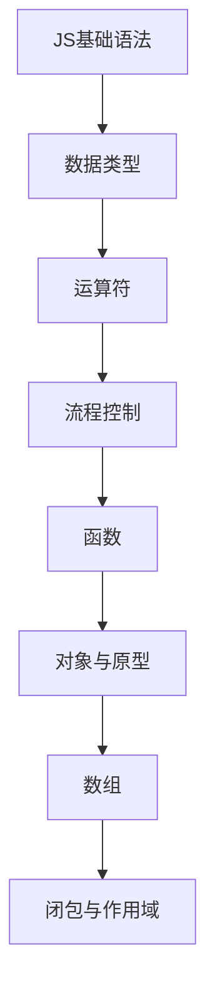

# JavaScript核心 学习指南

> **分类**：编程语言 ｜ **技术生态**：见正文

## 领域定位

JavaScript 是 Web 原生语言，ES2024 持续演进，事件驱动、原型链与异步模型是理解浏览器与 Node.js 的基础。

系统学习 JavaScript核心 需兼顾原理与工程实践，本指南按模块组织章节，由浅入深。

建议结合官方文档与社区主流工具链同步学习。

## 学习目标

- 系统掌握 JavaScript核心 核心模块与协作关系
- 能独立分析常见问题并给出可验证的解决方案
- 能在真实项目中做出合理的技术选型与架构决策
- 能阅读官方文档与源码定位关键实现路径

## 前置知识

- 无硬性前置，按章节难度循序渐进即可

## 学习路径

1. **JS基础语法**
2. **数据类型**
3. **运算符**
4. **流程控制**
5. **函数**
6. **对象与原型**
7. **数组**
8. **闭包与作用域**

## 模块体系

- **JS基础语法**
- **数据类型**
- **运算符**
- **流程控制**
- **函数**
- **对象与原型**
- **数组**
- **闭包与作用域**
- **this绑定**
- **ES6+新特性**
- **异步编程**
- **Promise与async/await**
- **模块化**
- **DOM操作**
- **事件处理**
- **错误处理**
- **JS最佳实践**

## 难度分布

| 入门 | 48 | 24% |
| 实战 | 44 | 22% |
| 进阶 | 48 | 24% |
| 高级 | 60 | 30% |

## 章节索引

### JS基础语法

- [JS基础语法核心概念与原理](chapters/001-JS基础语法核心概念与原理.md) ｜ 入门
- [JS基础语法的实现机制详解](chapters/002-JS基础语法的实现机制详解.md) ｜ 入门
- [JS基础语法的关键技术点](chapters/003-JS基础语法的关键技术点.md) ｜ 入门
- [JS基础语法的源码级分析](chapters/004-JS基础语法的源码级分析.md) ｜ 入门
- [JS基础语法的配置与使用](chapters/005-JS基础语法的配置与使用.md) ｜ 入门
- [JS基础语法的常见问题与解决方案](chapters/006-JS基础语法的常见问题与解决方案.md) ｜ 入门
- [JS基础语法的性能优化技巧](chapters/007-JS基础语法的性能优化技巧.md) ｜ 入门
- [JS基础语法的最佳实践指南](chapters/008-JS基础语法的最佳实践指南.md) ｜ 入门
- [JS基础语法的高级应用场景](chapters/009-JS基础语法的高级应用场景.md) ｜ 入门
- [JS基础语法的实战案例分析](chapters/010-JS基础语法的实战案例分析.md) ｜ 入门
- [JS基础语法的设计思想与演进](chapters/011-JS基础语法的设计思想与演进.md) ｜ 入门
- [JS基础语法的底层原理剖析](chapters/012-JS基础语法的底层原理剖析.md) ｜ 入门

### 数据类型

- [数据类型核心概念与原理](chapters/013-数据类型核心概念与原理.md) ｜ 入门
- [数据类型的实现机制详解](chapters/014-数据类型的实现机制详解.md) ｜ 入门
- [数据类型的关键技术点](chapters/015-数据类型的关键技术点.md) ｜ 入门
- [数据类型的源码级分析](chapters/016-数据类型的源码级分析.md) ｜ 入门
- [数据类型的配置与使用](chapters/017-数据类型的配置与使用.md) ｜ 入门
- [数据类型的常见问题与解决方案](chapters/018-数据类型的常见问题与解决方案.md) ｜ 入门
- [数据类型的性能优化技巧](chapters/019-数据类型的性能优化技巧.md) ｜ 入门
- [数据类型的最佳实践指南](chapters/020-数据类型的最佳实践指南.md) ｜ 入门
- [数据类型的高级应用场景](chapters/021-数据类型的高级应用场景.md) ｜ 入门
- [数据类型的实战案例分析](chapters/022-数据类型的实战案例分析.md) ｜ 入门
- [数据类型的设计思想与演进](chapters/023-数据类型的设计思想与演进.md) ｜ 入门
- [数据类型的底层原理剖析](chapters/024-数据类型的底层原理剖析.md) ｜ 入门

### 运算符

- [运算符核心概念与原理](chapters/025-运算符核心概念与原理.md) ｜ 入门
- [运算符的实现机制详解](chapters/026-运算符的实现机制详解.md) ｜ 入门
- [运算符的关键技术点](chapters/027-运算符的关键技术点.md) ｜ 入门
- [运算符的源码级分析](chapters/028-运算符的源码级分析.md) ｜ 入门
- [运算符的配置与使用](chapters/029-运算符的配置与使用.md) ｜ 入门
- [运算符的常见问题与解决方案](chapters/030-运算符的常见问题与解决方案.md) ｜ 入门
- [运算符的性能优化技巧](chapters/031-运算符的性能优化技巧.md) ｜ 入门
- [运算符的最佳实践指南](chapters/032-运算符的最佳实践指南.md) ｜ 入门
- [运算符的高级应用场景](chapters/033-运算符的高级应用场景.md) ｜ 入门
- [运算符的实战案例分析](chapters/034-运算符的实战案例分析.md) ｜ 入门
- [运算符的设计思想与演进](chapters/035-运算符的设计思想与演进.md) ｜ 入门
- [运算符的底层原理剖析](chapters/036-运算符的底层原理剖析.md) ｜ 入门

### 流程控制

- [流程控制核心概念与原理](chapters/037-流程控制核心概念与原理.md) ｜ 入门
- [流程控制的实现机制详解](chapters/038-流程控制的实现机制详解.md) ｜ 入门
- [流程控制的关键技术点](chapters/039-流程控制的关键技术点.md) ｜ 入门
- [流程控制的源码级分析](chapters/040-流程控制的源码级分析.md) ｜ 入门
- [流程控制的配置与使用](chapters/041-流程控制的配置与使用.md) ｜ 入门
- [流程控制的常见问题与解决方案](chapters/042-流程控制的常见问题与解决方案.md) ｜ 入门
- [流程控制的性能优化技巧](chapters/043-流程控制的性能优化技巧.md) ｜ 入门
- [流程控制的最佳实践指南](chapters/044-流程控制的最佳实践指南.md) ｜ 入门
- [流程控制的高级应用场景](chapters/045-流程控制的高级应用场景.md) ｜ 入门
- [流程控制的实战案例分析](chapters/046-流程控制的实战案例分析.md) ｜ 入门
- [流程控制的设计思想与演进](chapters/047-流程控制的设计思想与演进.md) ｜ 入门
- [流程控制的底层原理剖析](chapters/048-流程控制的底层原理剖析.md) ｜ 入门

### 函数

- [函数核心概念与原理](chapters/049-函数核心概念与原理.md) ｜ 进阶
- [函数的实现机制详解](chapters/050-函数的实现机制详解.md) ｜ 进阶
- [函数的关键技术点](chapters/051-函数的关键技术点.md) ｜ 进阶
- [函数的源码级分析](chapters/052-函数的源码级分析.md) ｜ 进阶
- [函数的配置与使用](chapters/053-函数的配置与使用.md) ｜ 进阶
- [函数的常见问题与解决方案](chapters/054-函数的常见问题与解决方案.md) ｜ 进阶
- [函数的性能优化技巧](chapters/055-函数的性能优化技巧.md) ｜ 进阶
- [函数的最佳实践指南](chapters/056-函数的最佳实践指南.md) ｜ 进阶
- [函数的高级应用场景](chapters/057-函数的高级应用场景.md) ｜ 进阶
- [函数的实战案例分析](chapters/058-函数的实战案例分析.md) ｜ 进阶
- [函数的设计思想与演进](chapters/059-函数的设计思想与演进.md) ｜ 进阶
- [函数的底层原理剖析](chapters/060-函数的底层原理剖析.md) ｜ 进阶

### 对象与原型

- [对象与原型核心概念与原理](chapters/061-对象与原型核心概念与原理.md) ｜ 进阶
- [对象与原型的实现机制详解](chapters/062-对象与原型的实现机制详解.md) ｜ 进阶
- [对象与原型的关键技术点](chapters/063-对象与原型的关键技术点.md) ｜ 进阶
- [对象与原型的源码级分析](chapters/064-对象与原型的源码级分析.md) ｜ 进阶
- [对象与原型的配置与使用](chapters/065-对象与原型的配置与使用.md) ｜ 进阶
- [对象与原型的常见问题与解决方案](chapters/066-对象与原型的常见问题与解决方案.md) ｜ 进阶
- [对象与原型的性能优化技巧](chapters/067-对象与原型的性能优化技巧.md) ｜ 进阶
- [对象与原型的最佳实践指南](chapters/068-对象与原型的最佳实践指南.md) ｜ 进阶
- [对象与原型的高级应用场景](chapters/069-对象与原型的高级应用场景.md) ｜ 进阶
- [对象与原型的实战案例分析](chapters/070-对象与原型的实战案例分析.md) ｜ 进阶
- [对象与原型的设计思想与演进](chapters/071-对象与原型的设计思想与演进.md) ｜ 进阶
- [对象与原型的底层原理剖析](chapters/072-对象与原型的底层原理剖析.md) ｜ 进阶

### 数组

- [数组核心概念与原理](chapters/073-数组核心概念与原理.md) ｜ 进阶
- [数组的实现机制详解](chapters/074-数组的实现机制详解.md) ｜ 进阶
- [数组的关键技术点](chapters/075-数组的关键技术点.md) ｜ 进阶
- [数组的源码级分析](chapters/076-数组的源码级分析.md) ｜ 进阶
- [数组的配置与使用](chapters/077-数组的配置与使用.md) ｜ 进阶
- [数组的常见问题与解决方案](chapters/078-数组的常见问题与解决方案.md) ｜ 进阶
- [数组的性能优化技巧](chapters/079-数组的性能优化技巧.md) ｜ 进阶
- [数组的最佳实践指南](chapters/080-数组的最佳实践指南.md) ｜ 进阶
- [数组的高级应用场景](chapters/081-数组的高级应用场景.md) ｜ 进阶
- [数组的实战案例分析](chapters/082-数组的实战案例分析.md) ｜ 进阶
- [数组的设计思想与演进](chapters/083-数组的设计思想与演进.md) ｜ 进阶
- [数组的底层原理剖析](chapters/084-数组的底层原理剖析.md) ｜ 进阶

### 闭包与作用域

- [闭包与作用域核心概念与原理](chapters/085-闭包与作用域核心概念与原理.md) ｜ 进阶
- [闭包与作用域的实现机制详解](chapters/086-闭包与作用域的实现机制详解.md) ｜ 进阶
- [闭包与作用域的关键技术点](chapters/087-闭包与作用域的关键技术点.md) ｜ 进阶
- [闭包与作用域的源码级分析](chapters/088-闭包与作用域的源码级分析.md) ｜ 进阶
- [闭包与作用域的配置与使用](chapters/089-闭包与作用域的配置与使用.md) ｜ 进阶
- [闭包与作用域的常见问题与解决方案](chapters/090-闭包与作用域的常见问题与解决方案.md) ｜ 进阶
- [闭包与作用域的性能优化技巧](chapters/091-闭包与作用域的性能优化技巧.md) ｜ 进阶
- [闭包与作用域的最佳实践指南](chapters/092-闭包与作用域的最佳实践指南.md) ｜ 进阶
- [闭包与作用域的高级应用场景](chapters/093-闭包与作用域的高级应用场景.md) ｜ 进阶
- [闭包与作用域的实战案例分析](chapters/094-闭包与作用域的实战案例分析.md) ｜ 进阶
- [闭包与作用域的设计思想与演进](chapters/095-闭包与作用域的设计思想与演进.md) ｜ 进阶
- [闭包与作用域的底层原理剖析](chapters/096-闭包与作用域的底层原理剖析.md) ｜ 进阶

### this绑定

- [this绑定核心概念与原理](chapters/097-this绑定核心概念与原理.md) ｜ 高级
- [this绑定的实现机制详解](chapters/098-this绑定的实现机制详解.md) ｜ 高级
- [this绑定的关键技术点](chapters/099-this绑定的关键技术点.md) ｜ 高级
- [this绑定的源码级分析](chapters/100-this绑定的源码级分析.md) ｜ 高级
- [this绑定的配置与使用](chapters/101-this绑定的配置与使用.md) ｜ 高级
- [this绑定的常见问题与解决方案](chapters/102-this绑定的常见问题与解决方案.md) ｜ 高级
- [this绑定的性能优化技巧](chapters/103-this绑定的性能优化技巧.md) ｜ 高级
- [this绑定的最佳实践指南](chapters/104-this绑定的最佳实践指南.md) ｜ 高级
- [this绑定的高级应用场景](chapters/105-this绑定的高级应用场景.md) ｜ 高级
- [this绑定的实战案例分析](chapters/106-this绑定的实战案例分析.md) ｜ 高级
- [this绑定的设计思想与演进](chapters/107-this绑定的设计思想与演进.md) ｜ 高级
- [this绑定的底层原理剖析](chapters/108-this绑定的底层原理剖析.md) ｜ 高级

### ES6+新特性

- [ES6+新特性核心概念与原理](chapters/109-ES6+新特性核心概念与原理.md) ｜ 高级
- [ES6+新特性的实现机制详解](chapters/110-ES6+新特性的实现机制详解.md) ｜ 高级
- [ES6+新特性的关键技术点](chapters/111-ES6+新特性的关键技术点.md) ｜ 高级
- [ES6+新特性的源码级分析](chapters/112-ES6+新特性的源码级分析.md) ｜ 高级
- [ES6+新特性的配置与使用](chapters/113-ES6+新特性的配置与使用.md) ｜ 高级
- [ES6+新特性的常见问题与解决方案](chapters/114-ES6+新特性的常见问题与解决方案.md) ｜ 高级
- [ES6+新特性的性能优化技巧](chapters/115-ES6+新特性的性能优化技巧.md) ｜ 高级
- [ES6+新特性的最佳实践指南](chapters/116-ES6+新特性的最佳实践指南.md) ｜ 高级
- [ES6+新特性的高级应用场景](chapters/117-ES6+新特性的高级应用场景.md) ｜ 高级
- [ES6+新特性的实战案例分析](chapters/118-ES6+新特性的实战案例分析.md) ｜ 高级
- [ES6+新特性的设计思想与演进](chapters/119-ES6+新特性的设计思想与演进.md) ｜ 高级
- [ES6+新特性的底层原理剖析](chapters/120-ES6+新特性的底层原理剖析.md) ｜ 高级

### 异步编程

- [异步编程核心概念与原理](chapters/121-异步编程核心概念与原理.md) ｜ 高级
- [异步编程的实现机制详解](chapters/122-异步编程的实现机制详解.md) ｜ 高级
- [异步编程的关键技术点](chapters/123-异步编程的关键技术点.md) ｜ 高级
- [异步编程的源码级分析](chapters/124-异步编程的源码级分析.md) ｜ 高级
- [异步编程的配置与使用](chapters/125-异步编程的配置与使用.md) ｜ 高级
- [异步编程的常见问题与解决方案](chapters/126-异步编程的常见问题与解决方案.md) ｜ 高级
- [异步编程的性能优化技巧](chapters/127-异步编程的性能优化技巧.md) ｜ 高级
- [异步编程的最佳实践指南](chapters/128-异步编程的最佳实践指南.md) ｜ 高级
- [异步编程的高级应用场景](chapters/129-异步编程的高级应用场景.md) ｜ 高级
- [异步编程的实战案例分析](chapters/130-异步编程的实战案例分析.md) ｜ 高级
- [异步编程的设计思想与演进](chapters/131-异步编程的设计思想与演进.md) ｜ 高级
- [异步编程的底层原理剖析](chapters/132-异步编程的底层原理剖析.md) ｜ 高级

### Promise与async/await

- [Promise与async/await核心概念与原理](chapters/133-Promise与asyncawait核心概念与原理.md) ｜ 高级
- [Promise与async/await的实现机制详解](chapters/134-Promise与asyncawait的实现机制详解.md) ｜ 高级
- [Promise与async/await的关键技术点](chapters/135-Promise与asyncawait的关键技术点.md) ｜ 高级
- [Promise与async/await的源码级分析](chapters/136-Promise与asyncawait的源码级分析.md) ｜ 高级
- [Promise与async/await的配置与使用](chapters/137-Promise与asyncawait的配置与使用.md) ｜ 高级
- [Promise与async/await的常见问题与解决方案](chapters/138-Promise与asyncawait的常见问题与解决方案.md) ｜ 高级
- [Promise与async/await的性能优化技巧](chapters/139-Promise与asyncawait的性能优化技巧.md) ｜ 高级
- [Promise与async/await的最佳实践指南](chapters/140-Promise与asyncawait的最佳实践指南.md) ｜ 高级
- [Promise与async/await的高级应用场景](chapters/141-Promise与asyncawait的高级应用场景.md) ｜ 高级
- [Promise与async/await的实战案例分析](chapters/142-Promise与asyncawait的实战案例分析.md) ｜ 高级
- [Promise与async/await的设计思想与演进](chapters/143-Promise与asyncawait的设计思想与演进.md) ｜ 高级
- [Promise与async/await的底层原理剖析](chapters/144-Promise与asyncawait的底层原理剖析.md) ｜ 高级

### 模块化

- [模块化核心概念与原理](chapters/145-模块化核心概念与原理.md) ｜ 高级
- [模块化的实现机制详解](chapters/146-模块化的实现机制详解.md) ｜ 高级
- [模块化的关键技术点](chapters/147-模块化的关键技术点.md) ｜ 高级
- [模块化的源码级分析](chapters/148-模块化的源码级分析.md) ｜ 高级
- [模块化的配置与使用](chapters/149-模块化的配置与使用.md) ｜ 高级
- [模块化的常见问题与解决方案](chapters/150-模块化的常见问题与解决方案.md) ｜ 高级
- [模块化的性能优化技巧](chapters/151-模块化的性能优化技巧.md) ｜ 高级
- [模块化的最佳实践指南](chapters/152-模块化的最佳实践指南.md) ｜ 高级
- [模块化的高级应用场景](chapters/153-模块化的高级应用场景.md) ｜ 高级
- [模块化的实战案例分析](chapters/154-模块化的实战案例分析.md) ｜ 高级
- [模块化的设计思想与演进](chapters/155-模块化的设计思想与演进.md) ｜ 高级
- [模块化的底层原理剖析](chapters/156-模块化的底层原理剖析.md) ｜ 高级

### DOM操作

- [DOM操作核心概念与原理](chapters/157-DOM操作核心概念与原理.md) ｜ 实战
- [DOM操作的实现机制详解](chapters/158-DOM操作的实现机制详解.md) ｜ 实战
- [DOM操作的关键技术点](chapters/159-DOM操作的关键技术点.md) ｜ 实战
- [DOM操作的源码级分析](chapters/160-DOM操作的源码级分析.md) ｜ 实战
- [DOM操作的配置与使用](chapters/161-DOM操作的配置与使用.md) ｜ 实战
- [DOM操作的常见问题与解决方案](chapters/162-DOM操作的常见问题与解决方案.md) ｜ 实战
- [DOM操作的性能优化技巧](chapters/163-DOM操作的性能优化技巧.md) ｜ 实战
- [DOM操作的最佳实践指南](chapters/164-DOM操作的最佳实践指南.md) ｜ 实战
- [DOM操作的高级应用场景](chapters/165-DOM操作的高级应用场景.md) ｜ 实战
- [DOM操作的实战案例分析](chapters/166-DOM操作的实战案例分析.md) ｜ 实战
- [DOM操作的设计思想与演进](chapters/167-DOM操作的设计思想与演进.md) ｜ 实战

### 事件处理

- [事件处理核心概念与原理](chapters/168-事件处理核心概念与原理.md) ｜ 实战
- [事件处理的实现机制详解](chapters/169-事件处理的实现机制详解.md) ｜ 实战
- [事件处理的关键技术点](chapters/170-事件处理的关键技术点.md) ｜ 实战
- [事件处理的源码级分析](chapters/171-事件处理的源码级分析.md) ｜ 实战
- [事件处理的配置与使用](chapters/172-事件处理的配置与使用.md) ｜ 实战
- [事件处理的常见问题与解决方案](chapters/173-事件处理的常见问题与解决方案.md) ｜ 实战
- [事件处理的性能优化技巧](chapters/174-事件处理的性能优化技巧.md) ｜ 实战
- [事件处理的最佳实践指南](chapters/175-事件处理的最佳实践指南.md) ｜ 实战
- [事件处理的高级应用场景](chapters/176-事件处理的高级应用场景.md) ｜ 实战
- [事件处理的实战案例分析](chapters/177-事件处理的实战案例分析.md) ｜ 实战
- [事件处理的设计思想与演进](chapters/178-事件处理的设计思想与演进.md) ｜ 实战

### 错误处理

- [错误处理核心概念与原理](chapters/179-错误处理核心概念与原理.md) ｜ 实战
- [错误处理的实现机制详解](chapters/180-错误处理的实现机制详解.md) ｜ 实战
- [错误处理的关键技术点](chapters/181-错误处理的关键技术点.md) ｜ 实战
- [错误处理的源码级分析](chapters/182-错误处理的源码级分析.md) ｜ 实战
- [错误处理的配置与使用](chapters/183-错误处理的配置与使用.md) ｜ 实战
- [错误处理的常见问题与解决方案](chapters/184-错误处理的常见问题与解决方案.md) ｜ 实战
- [错误处理的性能优化技巧](chapters/185-错误处理的性能优化技巧.md) ｜ 实战
- [错误处理的最佳实践指南](chapters/186-错误处理的最佳实践指南.md) ｜ 实战
- [错误处理的高级应用场景](chapters/187-错误处理的高级应用场景.md) ｜ 实战
- [错误处理的实战案例分析](chapters/188-错误处理的实战案例分析.md) ｜ 实战
- [错误处理的设计思想与演进](chapters/189-错误处理的设计思想与演进.md) ｜ 实战

### JS最佳实践

- [JS最佳实践核心概念与原理](chapters/190-JS最佳实践核心概念与原理.md) ｜ 实战
- [JS最佳实践的实现机制详解](chapters/191-JS最佳实践的实现机制详解.md) ｜ 实战
- [JS最佳实践的关键技术点](chapters/192-JS最佳实践的关键技术点.md) ｜ 实战
- [JS最佳实践的源码级分析](chapters/193-JS最佳实践的源码级分析.md) ｜ 实战
- [JS最佳实践的配置与使用](chapters/194-JS最佳实践的配置与使用.md) ｜ 实战
- [JS最佳实践的常见问题与解决方案](chapters/195-JS最佳实践的常见问题与解决方案.md) ｜ 实战
- [JS最佳实践的性能优化技巧](chapters/196-JS最佳实践的性能优化技巧.md) ｜ 实战
- [JS最佳实践的最佳实践指南](chapters/197-JS最佳实践的最佳实践指南.md) ｜ 实战
- [JS最佳实践的高级应用场景](chapters/198-JS最佳实践的高级应用场景.md) ｜ 实战
- [JS最佳实践的实战案例分析](chapters/199-JS最佳实践的实战案例分析.md) ｜ 实战
- [JS最佳实践的设计思想与演进](chapters/200-JS最佳实践的设计思想与演进.md) ｜ 实战

---
*领域: JavaScript核心*