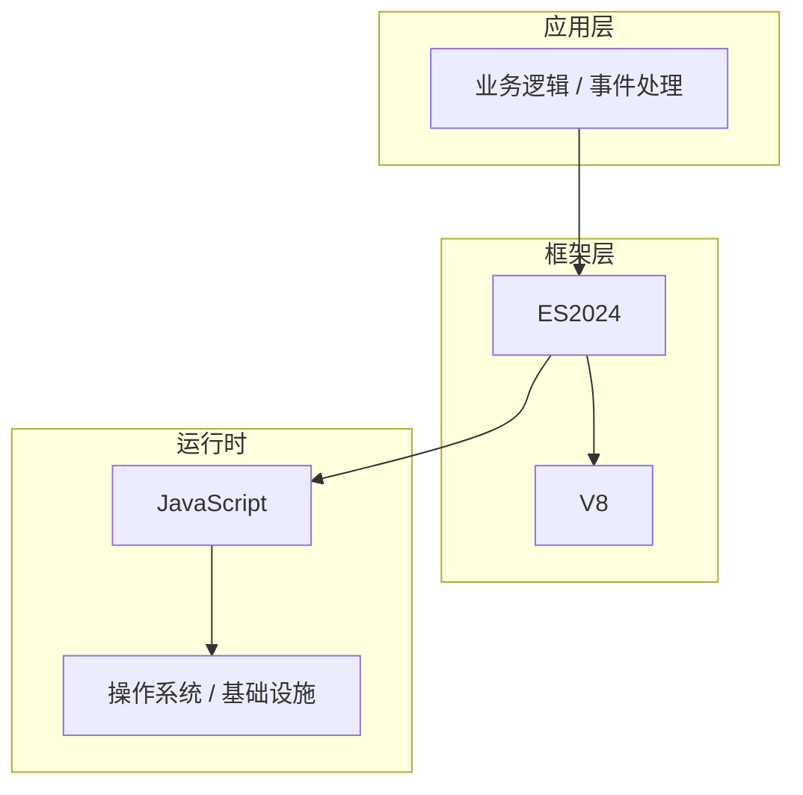

# 事件处理的配置与使用

> **领域**：JavaScript核心 ｜ **模块**：事件处理 ｜ **难度**：实战 ｜ **类型**：配置实践

## 导读

本章属于 **JavaScript核心** 教程的 **事件处理** 模块，难度为 **实战**。阅读重点在于建立清晰的概念模型与工程判断能力，而非死记细节。

## 核心概念

JavaScript 是 Web 原生语言，ES2024 持续演进，事件驱动、原型链与异步模型是理解浏览器与 Node.js 的基础。

在 **JavaScript核心** 体系中，**事件处理** 与上下游模块形成协作。技术栈以 **ES2024** 为核心（JavaScript），生态包括 V8, Node.js, Browser。

「事件处理」是该领域的核心知识模块，理解其原理与边界是工程实践的基础。

### 概念精讲

**事件处理的基本概念与定义**

从关系出发：它与上下游模块的依赖与接口契约。 在 事件处理 语境下，这一点直接影响设计决策与故障排查思路。

**事件处理在JavaScript核心中的作用与地位**

从实践出发：典型应用场景与反模式（不该用的场景）。 在 事件处理 语境下，这一点直接影响设计决策与故障排查思路。

**事件处理的核心数据结构**

从演进出发：历史上为何出现、未来可能如何变化。 在 事件处理 语境下，这一点直接影响设计决策与故障排查思路。

**事件处理的关键算法与流程**

从度量出发：如何评估它是否工作正常、性能是否达标。 在 事件处理 语境下，这一点直接影响设计决策与故障排查思路。

**事件处理与其他模块的关系**

从定义出发：它解决什么问题、不解决什么问题，边界在哪里。 在 事件处理 语境下，这一点直接影响设计决策与故障排查思路。

## 架构与流程

以下框图帮助你在宏观层面把握模块协作关系与处理流向：

## 深度讲解

### 配置三层

- **默认值**：框架内置，开箱可用。
- **环境配置**：开发/测试/生产差异化注入。
- **运行时覆盖**：紧急开关、限流阈值。

### 原则

敏感项由密钥服务注入；变更可追溯；启动时校验，失败快速退出。

### 版本注意

ES2024 配置项可能随大版本更名，升级前对照迁移指南。

### 落地检查清单

- **理解事件处理的设计思想与适用场景**：落地时需明确验收标准与回滚方案。
- **掌握事件处理的核心API与配置项**：落地时需明确验收标准与回滚方案。
- **分析事件处理的源码实现与调用流程**：落地时需明确验收标准与回滚方案。
- **了解事件处理的性能特点与瓶颈**：落地时需明确验收标准与回滚方案。

### 常见误区与应对

**误区：对事件处理的概念理解不深入导致误用**

**应对**：回到官方定义画一张概念图，与同事讲解一遍，确保能用自己的话复述。

**误区：忽略事件处理的性能边界与限制条件**

**应对**：用 Profiler 或压测建立基线，对比优化前后数据，避免凭感觉优化。

**误区：事件处理配置不当引发的问题**

**应对**：核对环境变量、配置文件与部署清单是否一致，使用配置 diff 工具排查。

**误区：缺乏对事件处理底层原理的理解**

**应对**：阅读官方文档与一篇深度文章，结合小实验验证理解。

**误区：事件处理与其他模块集成时的兼容性问题**

**应对**：列出依赖版本矩阵，在 CI 中跑集成测试覆盖主要组合。

### 最佳实践

1. **遵循事件处理的官方推荐用法与规范** — 落地方式：写入团队 Wiki 并纳入 Code Review 检查项。

2. **在理解原理的基础上合理使用事件处理** — 落地方式：配置静态检查或 CI 规则自动拦截违规写法。

3. **建立完善的事件处理监控与告警机制** — 落地方式：在新人 onboarding 中作为必修内容讲解。

4. **编写充分的测试用例覆盖事件处理的各种场景** — 落地方式：每季度回顾一次，对照社区最佳实践更新。

5. **持续关注事件处理的版本更新与最佳实践演进** — 落地方式：用真实项目案例演示正确与错误对比。

### 本章小结

学完本章，你应能：

- 说清 **事件处理的配置与使用** 在 JavaScript核心/事件处理 中的定位。
- 描述核心流程与关键概念，能用自己的话复述。
- 识别常见误区并采取预防与排查手段。
- 在项目中做出与场景匹配的工程决策。

类型：**配置实践**。建议完成小练习或复盘笔记，将阅读转化为能力。

## 延伸学习

建议结合以下同模块章节继续阅读，构建完整知识链：

- 事件处理的关键技术点
- 事件处理的源码级分析
- 事件处理的常见问题与解决方案
- 事件处理的性能优化技巧

### 参考资料

- JavaScript核心官方文档 - 事件处理章节
- 《JavaScript核心权威指南》相关章节
- 事件处理源码实现与注释
- JavaScript核心社区最佳实践文章
- 事件处理相关技术博客与教程

---
*章节 ID: 172 ｜ 领域: JavaScript核心 ｜ 版本: 2.0*