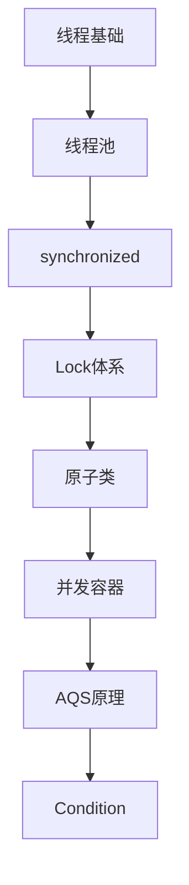

# Java并发 学习指南

> **分类**：编程语言 ｜ **技术生态**：见正文

## 领域定位

Java并发 是当前技术生态中的重要方向。

系统学习 Java并发 需兼顾原理与工程实践，本指南按模块组织章节，由浅入深。

建议结合官方文档与社区主流工具链同步学习。

## 学习目标

- 系统掌握 Java并发 核心模块与协作关系
- 能独立分析常见问题并给出可验证的解决方案
- 能在真实项目中做出合理的技术选型与架构决策
- 能阅读官方文档与源码定位关键实现路径

## 前置知识

- 无硬性前置，按章节难度循序渐进即可

## 学习路径

1. **线程基础**
2. **线程池**
3. **synchronized**
4. **Lock体系**
5. **原子类**
6. **并发容器**
7. **AQS原理**
8. **Condition**

## 模块体系

- **线程基础**
- **线程池**
- **synchronized**
- **Lock体系**
- **原子类**
- **并发容器**
- **AQS原理**
- **Condition**
- **CountDownLatch**
- **CyclicBarrier**
- **Semaphore**
- **Future与CompletableFuture**
- **ForkJoinPool**
- **并发设计模式**
- **并发性能调优**

## 难度分布

| 入门 | 24 | 20% |
| 实战 | 24 | 20% |
| 进阶 | 32 | 26% |
| 高级 | 40 | 33% |

## 章节索引

### 线程基础

- [线程基础核心概念与原理](chapters/001-线程基础核心概念与原理.md) ｜ 入门
- [线程基础的实现机制详解](chapters/002-线程基础的实现机制详解.md) ｜ 入门
- [线程基础的关键技术点](chapters/003-线程基础的关键技术点.md) ｜ 入门
- [线程基础的源码级分析](chapters/004-线程基础的源码级分析.md) ｜ 入门
- [线程基础的配置与使用](chapters/005-线程基础的配置与使用.md) ｜ 入门
- [线程基础的常见问题与解决方案](chapters/006-线程基础的常见问题与解决方案.md) ｜ 入门
- [线程基础的性能优化技巧](chapters/007-线程基础的性能优化技巧.md) ｜ 入门
- [线程基础的最佳实践指南](chapters/008-线程基础的最佳实践指南.md) ｜ 入门

### 线程池

- [线程池核心概念与原理](chapters/009-线程池核心概念与原理.md) ｜ 入门
- [线程池的实现机制详解](chapters/010-线程池的实现机制详解.md) ｜ 入门
- [线程池的关键技术点](chapters/011-线程池的关键技术点.md) ｜ 入门
- [线程池的源码级分析](chapters/012-线程池的源码级分析.md) ｜ 入门
- [线程池的配置与使用](chapters/013-线程池的配置与使用.md) ｜ 入门
- [线程池的常见问题与解决方案](chapters/014-线程池的常见问题与解决方案.md) ｜ 入门
- [线程池的性能优化技巧](chapters/015-线程池的性能优化技巧.md) ｜ 入门
- [线程池的最佳实践指南](chapters/016-线程池的最佳实践指南.md) ｜ 入门

### synchronized

- [synchronized核心概念与原理](chapters/017-synchronized核心概念与原理.md) ｜ 入门
- [synchronized的实现机制详解](chapters/018-synchronized的实现机制详解.md) ｜ 入门
- [synchronized的关键技术点](chapters/019-synchronized的关键技术点.md) ｜ 入门
- [synchronized的源码级分析](chapters/020-synchronized的源码级分析.md) ｜ 入门
- [synchronized的配置与使用](chapters/021-synchronized的配置与使用.md) ｜ 入门
- [synchronized的常见问题与解决方案](chapters/022-synchronized的常见问题与解决方案.md) ｜ 入门
- [synchronized的性能优化技巧](chapters/023-synchronized的性能优化技巧.md) ｜ 入门
- [synchronized的最佳实践指南](chapters/024-synchronized的最佳实践指南.md) ｜ 入门

### Lock体系

- [Lock体系核心概念与原理](chapters/025-Lock体系核心概念与原理.md) ｜ 进阶
- [Lock体系的实现机制详解](chapters/026-Lock体系的实现机制详解.md) ｜ 进阶
- [Lock体系的关键技术点](chapters/027-Lock体系的关键技术点.md) ｜ 进阶
- [Lock体系的源码级分析](chapters/028-Lock体系的源码级分析.md) ｜ 进阶
- [Lock体系的配置与使用](chapters/029-Lock体系的配置与使用.md) ｜ 进阶
- [Lock体系的常见问题与解决方案](chapters/030-Lock体系的常见问题与解决方案.md) ｜ 进阶
- [Lock体系的性能优化技巧](chapters/031-Lock体系的性能优化技巧.md) ｜ 进阶
- [Lock体系的最佳实践指南](chapters/032-Lock体系的最佳实践指南.md) ｜ 进阶

### 原子类

- [原子类核心概念与原理](chapters/033-原子类核心概念与原理.md) ｜ 进阶
- [原子类的实现机制详解](chapters/034-原子类的实现机制详解.md) ｜ 进阶
- [原子类的关键技术点](chapters/035-原子类的关键技术点.md) ｜ 进阶
- [原子类的源码级分析](chapters/036-原子类的源码级分析.md) ｜ 进阶
- [原子类的配置与使用](chapters/037-原子类的配置与使用.md) ｜ 进阶
- [原子类的常见问题与解决方案](chapters/038-原子类的常见问题与解决方案.md) ｜ 进阶
- [原子类的性能优化技巧](chapters/039-原子类的性能优化技巧.md) ｜ 进阶
- [原子类的最佳实践指南](chapters/040-原子类的最佳实践指南.md) ｜ 进阶

### 并发容器

- [并发容器核心概念与原理](chapters/041-并发容器核心概念与原理.md) ｜ 进阶
- [并发容器的实现机制详解](chapters/042-并发容器的实现机制详解.md) ｜ 进阶
- [并发容器的关键技术点](chapters/043-并发容器的关键技术点.md) ｜ 进阶
- [并发容器的源码级分析](chapters/044-并发容器的源码级分析.md) ｜ 进阶
- [并发容器的配置与使用](chapters/045-并发容器的配置与使用.md) ｜ 进阶
- [并发容器的常见问题与解决方案](chapters/046-并发容器的常见问题与解决方案.md) ｜ 进阶
- [并发容器的性能优化技巧](chapters/047-并发容器的性能优化技巧.md) ｜ 进阶
- [并发容器的最佳实践指南](chapters/048-并发容器的最佳实践指南.md) ｜ 进阶

### AQS原理

- [AQS原理核心概念与原理](chapters/049-AQS原理核心概念与原理.md) ｜ 进阶
- [AQS原理的实现机制详解](chapters/050-AQS原理的实现机制详解.md) ｜ 进阶
- [AQS原理的关键技术点](chapters/051-AQS原理的关键技术点.md) ｜ 进阶
- [AQS原理的源码级分析](chapters/052-AQS原理的源码级分析.md) ｜ 进阶
- [AQS原理的配置与使用](chapters/053-AQS原理的配置与使用.md) ｜ 进阶
- [AQS原理的常见问题与解决方案](chapters/054-AQS原理的常见问题与解决方案.md) ｜ 进阶
- [AQS原理的性能优化技巧](chapters/055-AQS原理的性能优化技巧.md) ｜ 进阶
- [AQS原理的最佳实践指南](chapters/056-AQS原理的最佳实践指南.md) ｜ 进阶

### Condition

- [Condition核心概念与原理](chapters/057-Condition核心概念与原理.md) ｜ 高级
- [Condition的实现机制详解](chapters/058-Condition的实现机制详解.md) ｜ 高级
- [Condition的关键技术点](chapters/059-Condition的关键技术点.md) ｜ 高级
- [Condition的源码级分析](chapters/060-Condition的源码级分析.md) ｜ 高级
- [Condition的配置与使用](chapters/061-Condition的配置与使用.md) ｜ 高级
- [Condition的常见问题与解决方案](chapters/062-Condition的常见问题与解决方案.md) ｜ 高级
- [Condition的性能优化技巧](chapters/063-Condition的性能优化技巧.md) ｜ 高级
- [Condition的最佳实践指南](chapters/064-Condition的最佳实践指南.md) ｜ 高级

### CountDownLatch

- [CountDownLatch核心概念与原理](chapters/065-CountDownLatch核心概念与原理.md) ｜ 高级
- [CountDownLatch的实现机制详解](chapters/066-CountDownLatch的实现机制详解.md) ｜ 高级
- [CountDownLatch的关键技术点](chapters/067-CountDownLatch的关键技术点.md) ｜ 高级
- [CountDownLatch的源码级分析](chapters/068-CountDownLatch的源码级分析.md) ｜ 高级
- [CountDownLatch的配置与使用](chapters/069-CountDownLatch的配置与使用.md) ｜ 高级
- [CountDownLatch的常见问题与解决方案](chapters/070-CountDownLatch的常见问题与解决方案.md) ｜ 高级
- [CountDownLatch的性能优化技巧](chapters/071-CountDownLatch的性能优化技巧.md) ｜ 高级
- [CountDownLatch的最佳实践指南](chapters/072-CountDownLatch的最佳实践指南.md) ｜ 高级

### CyclicBarrier

- [CyclicBarrier核心概念与原理](chapters/073-CyclicBarrier核心概念与原理.md) ｜ 高级
- [CyclicBarrier的实现机制详解](chapters/074-CyclicBarrier的实现机制详解.md) ｜ 高级
- [CyclicBarrier的关键技术点](chapters/075-CyclicBarrier的关键技术点.md) ｜ 高级
- [CyclicBarrier的源码级分析](chapters/076-CyclicBarrier的源码级分析.md) ｜ 高级
- [CyclicBarrier的配置与使用](chapters/077-CyclicBarrier的配置与使用.md) ｜ 高级
- [CyclicBarrier的常见问题与解决方案](chapters/078-CyclicBarrier的常见问题与解决方案.md) ｜ 高级
- [CyclicBarrier的性能优化技巧](chapters/079-CyclicBarrier的性能优化技巧.md) ｜ 高级
- [CyclicBarrier的最佳实践指南](chapters/080-CyclicBarrier的最佳实践指南.md) ｜ 高级

### Semaphore

- [Semaphore核心概念与原理](chapters/081-Semaphore核心概念与原理.md) ｜ 高级
- [Semaphore的实现机制详解](chapters/082-Semaphore的实现机制详解.md) ｜ 高级
- [Semaphore的关键技术点](chapters/083-Semaphore的关键技术点.md) ｜ 高级
- [Semaphore的源码级分析](chapters/084-Semaphore的源码级分析.md) ｜ 高级
- [Semaphore的配置与使用](chapters/085-Semaphore的配置与使用.md) ｜ 高级
- [Semaphore的常见问题与解决方案](chapters/086-Semaphore的常见问题与解决方案.md) ｜ 高级
- [Semaphore的性能优化技巧](chapters/087-Semaphore的性能优化技巧.md) ｜ 高级
- [Semaphore的最佳实践指南](chapters/088-Semaphore的最佳实践指南.md) ｜ 高级

### Future与CompletableFuture

- [Future与CompletableFuture核心概念与原理](chapters/089-Future与CompletableFuture核心概念与原理.md) ｜ 高级
- [Future与CompletableFuture的实现机制详解](chapters/090-Future与CompletableFuture的实现机制详解.md) ｜ 高级
- [Future与CompletableFuture的关键技术点](chapters/091-Future与CompletableFuture的关键技术点.md) ｜ 高级
- [Future与CompletableFuture的源码级分析](chapters/092-Future与CompletableFuture的源码级分析.md) ｜ 高级
- [Future与CompletableFuture的配置与使用](chapters/093-Future与CompletableFuture的配置与使用.md) ｜ 高级
- [Future与CompletableFuture的常见问题与解决方案](chapters/094-Future与CompletableFuture的常见问题与解决方案.md) ｜ 高级
- [Future与CompletableFuture的性能优化技巧](chapters/095-Future与CompletableFuture的性能优化技巧.md) ｜ 高级
- [Future与CompletableFuture的最佳实践指南](chapters/096-Future与CompletableFuture的最佳实践指南.md) ｜ 高级

### ForkJoinPool

- [ForkJoinPool核心概念与原理](chapters/097-ForkJoinPool核心概念与原理.md) ｜ 实战
- [ForkJoinPool的实现机制详解](chapters/098-ForkJoinPool的实现机制详解.md) ｜ 实战
- [ForkJoinPool的关键技术点](chapters/099-ForkJoinPool的关键技术点.md) ｜ 实战
- [ForkJoinPool的源码级分析](chapters/100-ForkJoinPool的源码级分析.md) ｜ 实战
- [ForkJoinPool的配置与使用](chapters/101-ForkJoinPool的配置与使用.md) ｜ 实战
- [ForkJoinPool的常见问题与解决方案](chapters/102-ForkJoinPool的常见问题与解决方案.md) ｜ 实战
- [ForkJoinPool的性能优化技巧](chapters/103-ForkJoinPool的性能优化技巧.md) ｜ 实战
- [ForkJoinPool的最佳实践指南](chapters/104-ForkJoinPool的最佳实践指南.md) ｜ 实战

### 并发设计模式

- [并发设计模式核心概念与原理](chapters/105-并发设计模式核心概念与原理.md) ｜ 实战
- [并发设计模式的实现机制详解](chapters/106-并发设计模式的实现机制详解.md) ｜ 实战
- [并发设计模式的关键技术点](chapters/107-并发设计模式的关键技术点.md) ｜ 实战
- [并发设计模式的源码级分析](chapters/108-并发设计模式的源码级分析.md) ｜ 实战
- [并发设计模式的配置与使用](chapters/109-并发设计模式的配置与使用.md) ｜ 实战
- [并发设计模式的常见问题与解决方案](chapters/110-并发设计模式的常见问题与解决方案.md) ｜ 实战
- [并发设计模式的性能优化技巧](chapters/111-并发设计模式的性能优化技巧.md) ｜ 实战
- [并发设计模式的最佳实践指南](chapters/112-并发设计模式的最佳实践指南.md) ｜ 实战

### 并发性能调优

- [并发性能调优核心概念与原理](chapters/113-并发性能调优核心概念与原理.md) ｜ 实战
- [并发性能调优的实现机制详解](chapters/114-并发性能调优的实现机制详解.md) ｜ 实战
- [并发性能调优的关键技术点](chapters/115-并发性能调优的关键技术点.md) ｜ 实战
- [并发性能调优的源码级分析](chapters/116-并发性能调优的源码级分析.md) ｜ 实战
- [并发性能调优的配置与使用](chapters/117-并发性能调优的配置与使用.md) ｜ 实战
- [并发性能调优的常见问题与解决方案](chapters/118-并发性能调优的常见问题与解决方案.md) ｜ 实战
- [并发性能调优的性能优化技巧](chapters/119-并发性能调优的性能优化技巧.md) ｜ 实战
- [并发性能调优的最佳实践指南](chapters/120-并发性能调优的最佳实践指南.md) ｜ 实战

---
*领域: Java并发*