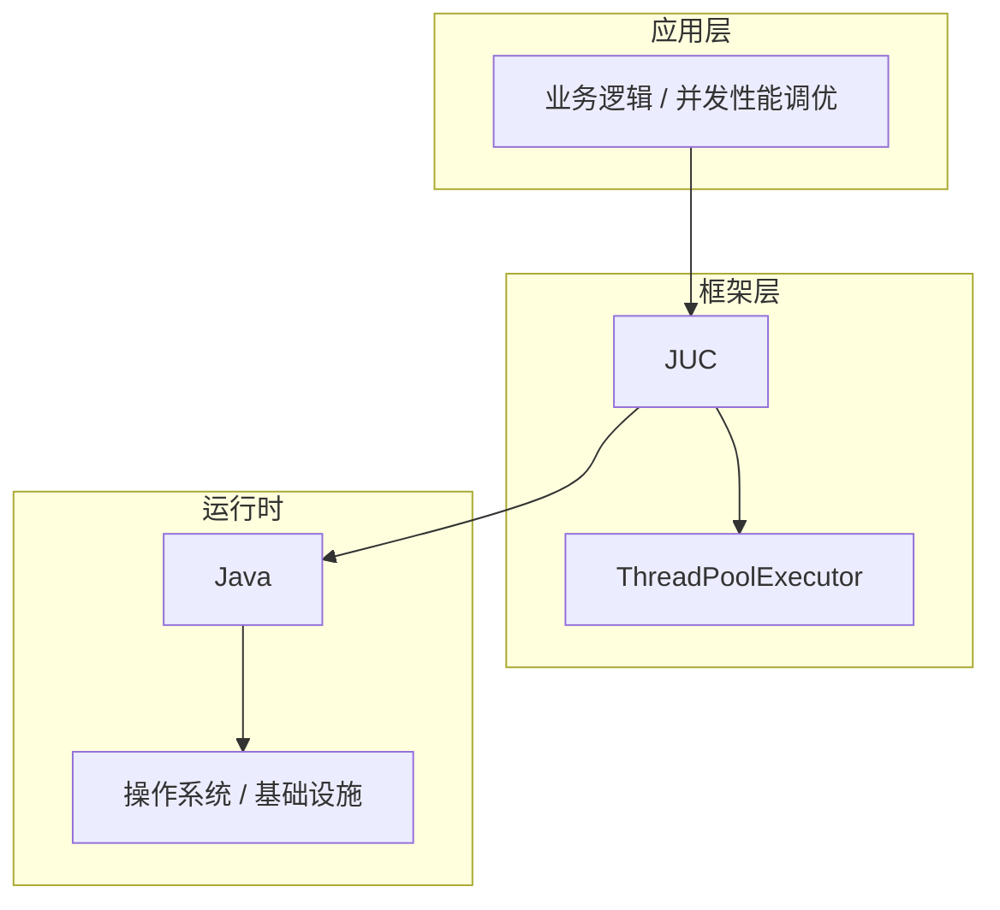

# 并发性能调优的最佳实践指南

> **领域**：Java并发 ｜ **模块**：并发性能调优 ｜ **难度**：实战 ｜ **类型**：最佳实践

## 导读

本章属于 **Java并发** 教程的 **并发性能调优** 模块，难度为 **实战**。阅读重点在于建立清晰的概念模型与工程判断能力，而非死记细节。

## 核心概念

Java并发 是当前技术生态中的重要方向，系统学习需兼顾概念、原理与工程实践。

在 **Java并发** 体系中，**并发性能调优** 与上下游模块形成协作。技术栈以 **JUC** 为核心（Java），生态包括 ThreadPoolExecutor, CompletableFuture。

「并发性能调优」是该领域的核心知识模块，理解其原理与边界是工程实践的基础。

### 概念精讲

**并发性能调优的基本概念与定义**

从定义出发：它解决什么问题、不解决什么问题，边界在哪里。 在 并发性能调优 语境下，这一点直接影响设计决策与故障排查思路。

**并发性能调优在Java并发中的作用与地位**

从结构出发：核心组成部分是什么，彼此如何协作。 在 并发性能调优 语境下，这一点直接影响设计决策与故障排查思路。

**并发性能调优的核心数据结构**

从流程出发：一次完整调用或生命周期经历哪些阶段。 在 并发性能调优 语境下，这一点直接影响设计决策与故障排查思路。

**并发性能调优的关键算法与流程**

从数据出发：输入输出是什么格式，状态如何变迁。 在 并发性能调优 语境下，这一点直接影响设计决策与故障排查思路。

**并发性能调优与其他模块的关系**

从关系出发：它与上下游模块的依赖与接口契约。 在 并发性能调优 语境下，这一点直接影响设计决策与故障排查思路。

## 架构与流程

以下框图帮助你在宏观层面把握模块协作关系与处理流向：

## 深度讲解

### 编码规范

遵循 Java并发 风格指南；并发性能调优 逻辑集中存放；公开接口文档化，契约变更版本化。

### 测试策略

- 单元测试：核心逻辑与边界（空值、超限、并发）。
- 集成测试：并发性能调优 与依赖的真实协作。
- 回归测试：每次发布前自动运行。

### 可观测性

结构化日志、关键指标、告警阈值与 Runbook。日志带追踪 ID，便于跨服务串联。

### 团队协作

复杂模块设 Owner；重大变更经设计评审；小步迭代。

### 落地检查清单

- **掌握并发性能调优的调优技巧与最佳实践**：落地时需明确验收标准与回滚方案。
- **了解并发性能调优在实际项目中的应用案例**：落地时需明确验收标准与回滚方案。
- **理解并发性能调优的设计思想与适用场景**：落地时需明确验收标准与回滚方案。
- **掌握并发性能调优的核心API与配置项**：落地时需明确验收标准与回滚方案。

### 常见误区与应对

**误区：对并发性能调优的概念理解不深入导致误用**

**应对**：回到官方定义画一张概念图，与同事讲解一遍，确保能用自己的话复述。

**误区：忽略并发性能调优的性能边界与限制条件**

**应对**：用 Profiler 或压测建立基线，对比优化前后数据，避免凭感觉优化。

**误区：并发性能调优配置不当引发的问题**

**应对**：用 Profiler 或压测建立基线，对比优化前后数据，避免凭感觉优化。

**误区：缺乏对并发性能调优底层原理的理解**

**应对**：用 Profiler 或压测建立基线，对比优化前后数据，避免凭感觉优化。

**误区：并发性能调优与其他模块集成时的兼容性问题**

**应对**：用 Profiler 或压测建立基线，对比优化前后数据，避免凭感觉优化。

### 最佳实践

1. **遵循并发性能调优的官方推荐用法与规范** — 落地方式：写入团队 Wiki 并纳入 Code Review 检查项。

2. **在理解原理的基础上合理使用并发性能调优** — 落地方式：配置静态检查或 CI 规则自动拦截违规写法。

3. **建立完善的并发性能调优监控与告警机制** — 落地方式：在新人 onboarding 中作为必修内容讲解。

4. **编写充分的测试用例覆盖并发性能调优的各种场景** — 落地方式：每季度回顾一次，对照社区最佳实践更新。

5. **持续关注并发性能调优的版本更新与最佳实践演进** — 落地方式：用真实项目案例演示正确与错误对比。

### 本章小结

学完本章，你应能：

- 说清 **并发性能调优的最佳实践指南** 在 Java并发/并发性能调优 中的定位。
- 描述核心流程与关键概念，能用自己的话复述。
- 识别常见误区并采取预防与排查手段。
- 在项目中做出与场景匹配的工程决策。

类型：**最佳实践**。建议完成小练习或复盘笔记，将阅读转化为能力。

## 延伸学习

建议结合以下同模块章节继续阅读，构建完整知识链：

- 并发性能调优的常见问题与解决方案
- 并发性能调优的性能优化技巧

### 参考资料

- Java并发官方文档 - 并发性能调优章节
- 《Java并发权威指南》相关章节
- 并发性能调优源码实现与注释
- Java并发社区最佳实践文章
- 并发性能调优相关技术博客与教程

---
*章节 ID: 120 ｜ 领域: Java并发 ｜ 版本: 2.0*