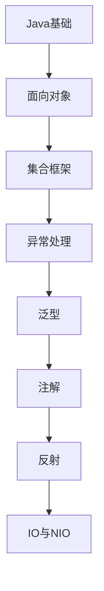

# Java核心 学习指南

> **分类**：编程语言 ｜ **技术生态**：见正文

## 领域定位

Java核心 是当前技术生态中的重要方向。

系统学习 Java核心 需兼顾原理与工程实践，本指南按模块组织章节，由浅入深。

建议结合官方文档与社区主流工具链同步学习。

## 学习目标

- 系统掌握 Java核心 核心模块与协作关系
- 能独立分析常见问题并给出可验证的解决方案
- 能在真实项目中做出合理的技术选型与架构决策
- 能阅读官方文档与源码定位关键实现路径

## 前置知识

- 无硬性前置，按章节难度循序渐进即可

## 学习路径

1. **Java基础**
2. **面向对象**
3. **集合框架**
4. **异常处理**
5. **泛型**
6. **注解**
7. **反射**
8. **IO与NIO**

## 模块体系

- **Java基础**
- **面向对象**
- **集合框架**
- **异常处理**
- **泛型**
- **注解**
- **反射**
- **IO与NIO**
- **多线程基础**
- **JVM内存模型**
- **垃圾回收**
- **类加载机制**
- **Java8新特性**
- **模块化系统**
- **Java最佳实践**

## 难度分布

| 入门 | 30 | 20% |
| 实战 | 30 | 20% |
| 进阶 | 40 | 26% |
| 高级 | 50 | 33% |

## 章节索引

### Java基础

- [Java基础核心概念与原理](chapters/001-Java基础核心概念与原理.md) ｜ 入门
- [Java基础的实现机制详解](chapters/002-Java基础的实现机制详解.md) ｜ 入门
- [Java基础的关键技术点](chapters/003-Java基础的关键技术点.md) ｜ 入门
- [Java基础的源码级分析](chapters/004-Java基础的源码级分析.md) ｜ 入门
- [Java基础的配置与使用](chapters/005-Java基础的配置与使用.md) ｜ 入门
- [Java基础的常见问题与解决方案](chapters/006-Java基础的常见问题与解决方案.md) ｜ 入门
- [Java基础的性能优化技巧](chapters/007-Java基础的性能优化技巧.md) ｜ 入门
- [Java基础的最佳实践指南](chapters/008-Java基础的最佳实践指南.md) ｜ 入门
- [Java基础的高级应用场景](chapters/009-Java基础的高级应用场景.md) ｜ 入门
- [Java基础的实战案例分析](chapters/010-Java基础的实战案例分析.md) ｜ 入门

### 面向对象

- [面向对象核心概念与原理](chapters/011-面向对象核心概念与原理.md) ｜ 入门
- [面向对象的实现机制详解](chapters/012-面向对象的实现机制详解.md) ｜ 入门
- [面向对象的关键技术点](chapters/013-面向对象的关键技术点.md) ｜ 入门
- [面向对象的源码级分析](chapters/014-面向对象的源码级分析.md) ｜ 入门
- [面向对象的配置与使用](chapters/015-面向对象的配置与使用.md) ｜ 入门
- [面向对象的常见问题与解决方案](chapters/016-面向对象的常见问题与解决方案.md) ｜ 入门
- [面向对象的性能优化技巧](chapters/017-面向对象的性能优化技巧.md) ｜ 入门
- [面向对象的最佳实践指南](chapters/018-面向对象的最佳实践指南.md) ｜ 入门
- [面向对象的高级应用场景](chapters/019-面向对象的高级应用场景.md) ｜ 入门
- [面向对象的实战案例分析](chapters/020-面向对象的实战案例分析.md) ｜ 入门

### 集合框架

- [集合框架核心概念与原理](chapters/021-集合框架核心概念与原理.md) ｜ 入门
- [集合框架的实现机制详解](chapters/022-集合框架的实现机制详解.md) ｜ 入门
- [集合框架的关键技术点](chapters/023-集合框架的关键技术点.md) ｜ 入门
- [集合框架的源码级分析](chapters/024-集合框架的源码级分析.md) ｜ 入门
- [集合框架的配置与使用](chapters/025-集合框架的配置与使用.md) ｜ 入门
- [集合框架的常见问题与解决方案](chapters/026-集合框架的常见问题与解决方案.md) ｜ 入门
- [集合框架的性能优化技巧](chapters/027-集合框架的性能优化技巧.md) ｜ 入门
- [集合框架的最佳实践指南](chapters/028-集合框架的最佳实践指南.md) ｜ 入门
- [集合框架的高级应用场景](chapters/029-集合框架的高级应用场景.md) ｜ 入门
- [集合框架的实战案例分析](chapters/030-集合框架的实战案例分析.md) ｜ 入门

### 异常处理

- [异常处理核心概念与原理](chapters/031-异常处理核心概念与原理.md) ｜ 进阶
- [异常处理的实现机制详解](chapters/032-异常处理的实现机制详解.md) ｜ 进阶
- [异常处理的关键技术点](chapters/033-异常处理的关键技术点.md) ｜ 进阶
- [异常处理的源码级分析](chapters/034-异常处理的源码级分析.md) ｜ 进阶
- [异常处理的配置与使用](chapters/035-异常处理的配置与使用.md) ｜ 进阶
- [异常处理的常见问题与解决方案](chapters/036-异常处理的常见问题与解决方案.md) ｜ 进阶
- [异常处理的性能优化技巧](chapters/037-异常处理的性能优化技巧.md) ｜ 进阶
- [异常处理的最佳实践指南](chapters/038-异常处理的最佳实践指南.md) ｜ 进阶
- [异常处理的高级应用场景](chapters/039-异常处理的高级应用场景.md) ｜ 进阶
- [异常处理的实战案例分析](chapters/040-异常处理的实战案例分析.md) ｜ 进阶

### 泛型

- [泛型核心概念与原理](chapters/041-泛型核心概念与原理.md) ｜ 进阶
- [泛型的实现机制详解](chapters/042-泛型的实现机制详解.md) ｜ 进阶
- [泛型的关键技术点](chapters/043-泛型的关键技术点.md) ｜ 进阶
- [泛型的源码级分析](chapters/044-泛型的源码级分析.md) ｜ 进阶
- [泛型的配置与使用](chapters/045-泛型的配置与使用.md) ｜ 进阶
- [泛型的常见问题与解决方案](chapters/046-泛型的常见问题与解决方案.md) ｜ 进阶
- [泛型的性能优化技巧](chapters/047-泛型的性能优化技巧.md) ｜ 进阶
- [泛型的最佳实践指南](chapters/048-泛型的最佳实践指南.md) ｜ 进阶
- [泛型的高级应用场景](chapters/049-泛型的高级应用场景.md) ｜ 进阶
- [泛型的实战案例分析](chapters/050-泛型的实战案例分析.md) ｜ 进阶

### 注解

- [注解核心概念与原理](chapters/051-注解核心概念与原理.md) ｜ 进阶
- [注解的实现机制详解](chapters/052-注解的实现机制详解.md) ｜ 进阶
- [注解的关键技术点](chapters/053-注解的关键技术点.md) ｜ 进阶
- [注解的源码级分析](chapters/054-注解的源码级分析.md) ｜ 进阶
- [注解的配置与使用](chapters/055-注解的配置与使用.md) ｜ 进阶
- [注解的常见问题与解决方案](chapters/056-注解的常见问题与解决方案.md) ｜ 进阶
- [注解的性能优化技巧](chapters/057-注解的性能优化技巧.md) ｜ 进阶
- [注解的最佳实践指南](chapters/058-注解的最佳实践指南.md) ｜ 进阶
- [注解的高级应用场景](chapters/059-注解的高级应用场景.md) ｜ 进阶
- [注解的实战案例分析](chapters/060-注解的实战案例分析.md) ｜ 进阶

### 反射

- [反射核心概念与原理](chapters/061-反射核心概念与原理.md) ｜ 进阶
- [反射的实现机制详解](chapters/062-反射的实现机制详解.md) ｜ 进阶
- [反射的关键技术点](chapters/063-反射的关键技术点.md) ｜ 进阶
- [反射的源码级分析](chapters/064-反射的源码级分析.md) ｜ 进阶
- [反射的配置与使用](chapters/065-反射的配置与使用.md) ｜ 进阶
- [反射的常见问题与解决方案](chapters/066-反射的常见问题与解决方案.md) ｜ 进阶
- [反射的性能优化技巧](chapters/067-反射的性能优化技巧.md) ｜ 进阶
- [反射的最佳实践指南](chapters/068-反射的最佳实践指南.md) ｜ 进阶
- [反射的高级应用场景](chapters/069-反射的高级应用场景.md) ｜ 进阶
- [反射的实战案例分析](chapters/070-反射的实战案例分析.md) ｜ 进阶

### IO与NIO

- [IO与NIO核心概念与原理](chapters/071-IO与NIO核心概念与原理.md) ｜ 高级
- [IO与NIO的实现机制详解](chapters/072-IO与NIO的实现机制详解.md) ｜ 高级
- [IO与NIO的关键技术点](chapters/073-IO与NIO的关键技术点.md) ｜ 高级
- [IO与NIO的源码级分析](chapters/074-IO与NIO的源码级分析.md) ｜ 高级
- [IO与NIO的配置与使用](chapters/075-IO与NIO的配置与使用.md) ｜ 高级
- [IO与NIO的常见问题与解决方案](chapters/076-IO与NIO的常见问题与解决方案.md) ｜ 高级
- [IO与NIO的性能优化技巧](chapters/077-IO与NIO的性能优化技巧.md) ｜ 高级
- [IO与NIO的最佳实践指南](chapters/078-IO与NIO的最佳实践指南.md) ｜ 高级
- [IO与NIO的高级应用场景](chapters/079-IO与NIO的高级应用场景.md) ｜ 高级
- [IO与NIO的实战案例分析](chapters/080-IO与NIO的实战案例分析.md) ｜ 高级

### 多线程基础

- [多线程基础核心概念与原理](chapters/081-多线程基础核心概念与原理.md) ｜ 高级
- [多线程基础的实现机制详解](chapters/082-多线程基础的实现机制详解.md) ｜ 高级
- [多线程基础的关键技术点](chapters/083-多线程基础的关键技术点.md) ｜ 高级
- [多线程基础的源码级分析](chapters/084-多线程基础的源码级分析.md) ｜ 高级
- [多线程基础的配置与使用](chapters/085-多线程基础的配置与使用.md) ｜ 高级
- [多线程基础的常见问题与解决方案](chapters/086-多线程基础的常见问题与解决方案.md) ｜ 高级
- [多线程基础的性能优化技巧](chapters/087-多线程基础的性能优化技巧.md) ｜ 高级
- [多线程基础的最佳实践指南](chapters/088-多线程基础的最佳实践指南.md) ｜ 高级
- [多线程基础的高级应用场景](chapters/089-多线程基础的高级应用场景.md) ｜ 高级
- [多线程基础的实战案例分析](chapters/090-多线程基础的实战案例分析.md) ｜ 高级

### JVM内存模型

- [JVM内存模型核心概念与原理](chapters/091-JVM内存模型核心概念与原理.md) ｜ 高级
- [JVM内存模型的实现机制详解](chapters/092-JVM内存模型的实现机制详解.md) ｜ 高级
- [JVM内存模型的关键技术点](chapters/093-JVM内存模型的关键技术点.md) ｜ 高级
- [JVM内存模型的源码级分析](chapters/094-JVM内存模型的源码级分析.md) ｜ 高级
- [JVM内存模型的配置与使用](chapters/095-JVM内存模型的配置与使用.md) ｜ 高级
- [JVM内存模型的常见问题与解决方案](chapters/096-JVM内存模型的常见问题与解决方案.md) ｜ 高级
- [JVM内存模型的性能优化技巧](chapters/097-JVM内存模型的性能优化技巧.md) ｜ 高级
- [JVM内存模型的最佳实践指南](chapters/098-JVM内存模型的最佳实践指南.md) ｜ 高级
- [JVM内存模型的高级应用场景](chapters/099-JVM内存模型的高级应用场景.md) ｜ 高级
- [JVM内存模型的实战案例分析](chapters/100-JVM内存模型的实战案例分析.md) ｜ 高级

### 垃圾回收

- [垃圾回收核心概念与原理](chapters/101-垃圾回收核心概念与原理.md) ｜ 高级
- [垃圾回收的实现机制详解](chapters/102-垃圾回收的实现机制详解.md) ｜ 高级
- [垃圾回收的关键技术点](chapters/103-垃圾回收的关键技术点.md) ｜ 高级
- [垃圾回收的源码级分析](chapters/104-垃圾回收的源码级分析.md) ｜ 高级
- [垃圾回收的配置与使用](chapters/105-垃圾回收的配置与使用.md) ｜ 高级
- [垃圾回收的常见问题与解决方案](chapters/106-垃圾回收的常见问题与解决方案.md) ｜ 高级
- [垃圾回收的性能优化技巧](chapters/107-垃圾回收的性能优化技巧.md) ｜ 高级
- [垃圾回收的最佳实践指南](chapters/108-垃圾回收的最佳实践指南.md) ｜ 高级
- [垃圾回收的高级应用场景](chapters/109-垃圾回收的高级应用场景.md) ｜ 高级
- [垃圾回收的实战案例分析](chapters/110-垃圾回收的实战案例分析.md) ｜ 高级

### 类加载机制

- [类加载机制核心概念与原理](chapters/111-类加载机制核心概念与原理.md) ｜ 高级
- [类加载机制的实现机制详解](chapters/112-类加载机制的实现机制详解.md) ｜ 高级
- [类加载机制的关键技术点](chapters/113-类加载机制的关键技术点.md) ｜ 高级
- [类加载机制的源码级分析](chapters/114-类加载机制的源码级分析.md) ｜ 高级
- [类加载机制的配置与使用](chapters/115-类加载机制的配置与使用.md) ｜ 高级
- [类加载机制的常见问题与解决方案](chapters/116-类加载机制的常见问题与解决方案.md) ｜ 高级
- [类加载机制的性能优化技巧](chapters/117-类加载机制的性能优化技巧.md) ｜ 高级
- [类加载机制的最佳实践指南](chapters/118-类加载机制的最佳实践指南.md) ｜ 高级
- [类加载机制的高级应用场景](chapters/119-类加载机制的高级应用场景.md) ｜ 高级
- [类加载机制的实战案例分析](chapters/120-类加载机制的实战案例分析.md) ｜ 高级

### Java8新特性

- [Java8新特性核心概念与原理](chapters/121-Java8新特性核心概念与原理.md) ｜ 实战
- [Java8新特性的实现机制详解](chapters/122-Java8新特性的实现机制详解.md) ｜ 实战
- [Java8新特性的关键技术点](chapters/123-Java8新特性的关键技术点.md) ｜ 实战
- [Java8新特性的源码级分析](chapters/124-Java8新特性的源码级分析.md) ｜ 实战
- [Java8新特性的配置与使用](chapters/125-Java8新特性的配置与使用.md) ｜ 实战
- [Java8新特性的常见问题与解决方案](chapters/126-Java8新特性的常见问题与解决方案.md) ｜ 实战
- [Java8新特性的性能优化技巧](chapters/127-Java8新特性的性能优化技巧.md) ｜ 实战
- [Java8新特性的最佳实践指南](chapters/128-Java8新特性的最佳实践指南.md) ｜ 实战
- [Java8新特性的高级应用场景](chapters/129-Java8新特性的高级应用场景.md) ｜ 实战
- [Java8新特性的实战案例分析](chapters/130-Java8新特性的实战案例分析.md) ｜ 实战

### 模块化系统

- [模块化系统核心概念与原理](chapters/131-模块化系统核心概念与原理.md) ｜ 实战
- [模块化系统的实现机制详解](chapters/132-模块化系统的实现机制详解.md) ｜ 实战
- [模块化系统的关键技术点](chapters/133-模块化系统的关键技术点.md) ｜ 实战
- [模块化系统的源码级分析](chapters/134-模块化系统的源码级分析.md) ｜ 实战
- [模块化系统的配置与使用](chapters/135-模块化系统的配置与使用.md) ｜ 实战
- [模块化系统的常见问题与解决方案](chapters/136-模块化系统的常见问题与解决方案.md) ｜ 实战
- [模块化系统的性能优化技巧](chapters/137-模块化系统的性能优化技巧.md) ｜ 实战
- [模块化系统的最佳实践指南](chapters/138-模块化系统的最佳实践指南.md) ｜ 实战
- [模块化系统的高级应用场景](chapters/139-模块化系统的高级应用场景.md) ｜ 实战
- [模块化系统的实战案例分析](chapters/140-模块化系统的实战案例分析.md) ｜ 实战

### Java最佳实践

- [Java最佳实践核心概念与原理](chapters/141-Java最佳实践核心概念与原理.md) ｜ 实战
- [Java最佳实践的实现机制详解](chapters/142-Java最佳实践的实现机制详解.md) ｜ 实战
- [Java最佳实践的关键技术点](chapters/143-Java最佳实践的关键技术点.md) ｜ 实战
- [Java最佳实践的源码级分析](chapters/144-Java最佳实践的源码级分析.md) ｜ 实战
- [Java最佳实践的配置与使用](chapters/145-Java最佳实践的配置与使用.md) ｜ 实战
- [Java最佳实践的常见问题与解决方案](chapters/146-Java最佳实践的常见问题与解决方案.md) ｜ 实战
- [Java最佳实践的性能优化技巧](chapters/147-Java最佳实践的性能优化技巧.md) ｜ 实战
- [Java最佳实践的最佳实践指南](chapters/148-Java最佳实践的最佳实践指南.md) ｜ 实战
- [Java最佳实践的高级应用场景](chapters/149-Java最佳实践的高级应用场景.md) ｜ 实战
- [Java最佳实践的实战案例分析](chapters/150-Java最佳实践的实战案例分析.md) ｜ 实战

---
*领域: Java核心*