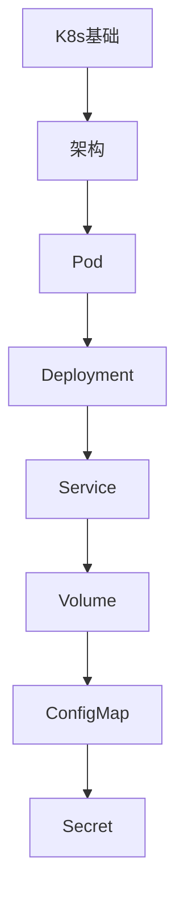

# Kubernetes 学习指南

> **分类**：DevOps ｜ **章节总数**：200 ｜ **技术栈**：K8s 1.29+

## 领域概述

Kubernetes是DevOps领域的重要技术方向，本系列从基础到高级逐步深入，涵盖25个核心模块：K8s基础、架构、Pod、Deployment、Service等。每个知识点作为独立章节，包含原理讲解、实现要点、常见陷阱和最佳实践，配合源码分析和架构图，帮助读者建立完整的Kubernetes知识体系。

本教程基于 **YAML/Go** 与 **K8s 1.29+** 生态编写，涵盖 kubectl, Helm, CRD 等主流工具与框架。每章独立成篇，文字精炼、逻辑清晰，适合系统学习与按需查阅。

## 你将学到什么

完成本系列后，你将能够：

- 系统理解 **Kubernetes** 的核心概念与模块划分。
- 按难度递进掌握从入门到实战的完整知识路径。
- 在工程实践中做出合理的技术判断与问题排查。
- 通过章节索引快速定位所需知识点。

## 前置知识

- 编程基础
- 数据结构
- 计算机基础
- DevOps基础概念

## 推荐学习路径

1. **K8s基础**
2. **架构**
3. **Pod**
4. **Deployment**
5. **Service**
6. **Volume**
7. **ConfigMap**
8. **Secret**

## 模块体系

本领域按以下模块组织，难度由浅入深：

- **K8s基础**
- **架构**
- **Pod**
- **Deployment**
- **Service**
- **Volume**
- **ConfigMap**
- **Secret**
- **Namespace**
- **Ingress**
- **StatefulSet**
- **DaemonSet**
- **Job**
- **CronJob**
- **RBAC**
- **网络策略**
- **资源限制**
- **调度**
- **Helm**
- **Operator**
- **监控**
- **日志**
- **安全**
- **性能优化**
- **K8s最佳实践**

## 难度分布

| 难度 | 章节数 | 占比 |
|------|--------|------|
| 入门 | 40 | 20% |
| 实战 | 40 | 20% |
| 进阶 | 56 | 28% |
| 高级 | 64 | 32% |

## 章节索引

点击章节标题进入对应教程：

### K8s基础

- [K8s基础核心概念与原理](chapters/001-K8s基础核心概念与原理.md) ｜ 入门
- [K8s基础的实现机制详解](chapters/002-K8s基础的实现机制详解.md) ｜ 入门
- [K8s基础的关键技术点](chapters/003-K8s基础的关键技术点.md) ｜ 入门
- [K8s基础的源码级分析](chapters/004-K8s基础的源码级分析.md) ｜ 入门
- [K8s基础的配置与使用](chapters/005-K8s基础的配置与使用.md) ｜ 入门
- [K8s基础的常见问题与解决方案](chapters/006-K8s基础的常见问题与解决方案.md) ｜ 入门
- [K8s基础的性能优化技巧](chapters/007-K8s基础的性能优化技巧.md) ｜ 入门
- [K8s基础的最佳实践指南](chapters/008-K8s基础的最佳实践指南.md) ｜ 入门

### 架构

- [架构核心概念与原理](chapters/009-架构核心概念与原理.md) ｜ 入门
- [架构的实现机制详解](chapters/010-架构的实现机制详解.md) ｜ 入门
- [架构的关键技术点](chapters/011-架构的关键技术点.md) ｜ 入门
- [架构的源码级分析](chapters/012-架构的源码级分析.md) ｜ 入门
- [架构的配置与使用](chapters/013-架构的配置与使用.md) ｜ 入门
- [架构的常见问题与解决方案](chapters/014-架构的常见问题与解决方案.md) ｜ 入门
- [架构的性能优化技巧](chapters/015-架构的性能优化技巧.md) ｜ 入门
- [架构的最佳实践指南](chapters/016-架构的最佳实践指南.md) ｜ 入门

### Pod

- [Pod核心概念与原理](chapters/017-Pod核心概念与原理.md) ｜ 入门
- [Pod的实现机制详解](chapters/018-Pod的实现机制详解.md) ｜ 入门
- [Pod的关键技术点](chapters/019-Pod的关键技术点.md) ｜ 入门
- [Pod的源码级分析](chapters/020-Pod的源码级分析.md) ｜ 入门
- [Pod的配置与使用](chapters/021-Pod的配置与使用.md) ｜ 入门
- [Pod的常见问题与解决方案](chapters/022-Pod的常见问题与解决方案.md) ｜ 入门
- [Pod的性能优化技巧](chapters/023-Pod的性能优化技巧.md) ｜ 入门
- [Pod的最佳实践指南](chapters/024-Pod的最佳实践指南.md) ｜ 入门

### Deployment

- [Deployment核心概念与原理](chapters/025-Deployment核心概念与原理.md) ｜ 入门
- [Deployment的实现机制详解](chapters/026-Deployment的实现机制详解.md) ｜ 入门
- [Deployment的关键技术点](chapters/027-Deployment的关键技术点.md) ｜ 入门
- [Deployment的源码级分析](chapters/028-Deployment的源码级分析.md) ｜ 入门
- [Deployment的配置与使用](chapters/029-Deployment的配置与使用.md) ｜ 入门
- [Deployment的常见问题与解决方案](chapters/030-Deployment的常见问题与解决方案.md) ｜ 入门
- [Deployment的性能优化技巧](chapters/031-Deployment的性能优化技巧.md) ｜ 入门
- [Deployment的最佳实践指南](chapters/032-Deployment的最佳实践指南.md) ｜ 入门

### Service

- [Service核心概念与原理](chapters/033-Service核心概念与原理.md) ｜ 入门
- [Service的实现机制详解](chapters/034-Service的实现机制详解.md) ｜ 入门
- [Service的关键技术点](chapters/035-Service的关键技术点.md) ｜ 入门
- [Service的源码级分析](chapters/036-Service的源码级分析.md) ｜ 入门
- [Service的配置与使用](chapters/037-Service的配置与使用.md) ｜ 入门
- [Service的常见问题与解决方案](chapters/038-Service的常见问题与解决方案.md) ｜ 入门
- [Service的性能优化技巧](chapters/039-Service的性能优化技巧.md) ｜ 入门
- [Service的最佳实践指南](chapters/040-Service的最佳实践指南.md) ｜ 入门

### Volume

- [Volume核心概念与原理](chapters/041-Volume核心概念与原理.md) ｜ 进阶
- [Volume的实现机制详解](chapters/042-Volume的实现机制详解.md) ｜ 进阶
- [Volume的关键技术点](chapters/043-Volume的关键技术点.md) ｜ 进阶
- [Volume的源码级分析](chapters/044-Volume的源码级分析.md) ｜ 进阶
- [Volume的配置与使用](chapters/045-Volume的配置与使用.md) ｜ 进阶
- [Volume的常见问题与解决方案](chapters/046-Volume的常见问题与解决方案.md) ｜ 进阶
- [Volume的性能优化技巧](chapters/047-Volume的性能优化技巧.md) ｜ 进阶
- [Volume的最佳实践指南](chapters/048-Volume的最佳实践指南.md) ｜ 进阶

### ConfigMap

- [ConfigMap核心概念与原理](chapters/049-ConfigMap核心概念与原理.md) ｜ 进阶
- [ConfigMap的实现机制详解](chapters/050-ConfigMap的实现机制详解.md) ｜ 进阶
- [ConfigMap的关键技术点](chapters/051-ConfigMap的关键技术点.md) ｜ 进阶
- [ConfigMap的源码级分析](chapters/052-ConfigMap的源码级分析.md) ｜ 进阶
- [ConfigMap的配置与使用](chapters/053-ConfigMap的配置与使用.md) ｜ 进阶
- [ConfigMap的常见问题与解决方案](chapters/054-ConfigMap的常见问题与解决方案.md) ｜ 进阶
- [ConfigMap的性能优化技巧](chapters/055-ConfigMap的性能优化技巧.md) ｜ 进阶
- [ConfigMap的最佳实践指南](chapters/056-ConfigMap的最佳实践指南.md) ｜ 进阶

### Secret

- [Secret核心概念与原理](chapters/057-Secret核心概念与原理.md) ｜ 进阶
- [Secret的实现机制详解](chapters/058-Secret的实现机制详解.md) ｜ 进阶
- [Secret的关键技术点](chapters/059-Secret的关键技术点.md) ｜ 进阶
- [Secret的源码级分析](chapters/060-Secret的源码级分析.md) ｜ 进阶
- [Secret的配置与使用](chapters/061-Secret的配置与使用.md) ｜ 进阶
- [Secret的常见问题与解决方案](chapters/062-Secret的常见问题与解决方案.md) ｜ 进阶
- [Secret的性能优化技巧](chapters/063-Secret的性能优化技巧.md) ｜ 进阶
- [Secret的最佳实践指南](chapters/064-Secret的最佳实践指南.md) ｜ 进阶

### Namespace

- [Namespace核心概念与原理](chapters/065-Namespace核心概念与原理.md) ｜ 进阶
- [Namespace的实现机制详解](chapters/066-Namespace的实现机制详解.md) ｜ 进阶
- [Namespace的关键技术点](chapters/067-Namespace的关键技术点.md) ｜ 进阶
- [Namespace的源码级分析](chapters/068-Namespace的源码级分析.md) ｜ 进阶
- [Namespace的配置与使用](chapters/069-Namespace的配置与使用.md) ｜ 进阶
- [Namespace的常见问题与解决方案](chapters/070-Namespace的常见问题与解决方案.md) ｜ 进阶
- [Namespace的性能优化技巧](chapters/071-Namespace的性能优化技巧.md) ｜ 进阶
- [Namespace的最佳实践指南](chapters/072-Namespace的最佳实践指南.md) ｜ 进阶

### Ingress

- [Ingress核心概念与原理](chapters/073-Ingress核心概念与原理.md) ｜ 进阶
- [Ingress的实现机制详解](chapters/074-Ingress的实现机制详解.md) ｜ 进阶
- [Ingress的关键技术点](chapters/075-Ingress的关键技术点.md) ｜ 进阶
- [Ingress的源码级分析](chapters/076-Ingress的源码级分析.md) ｜ 进阶
- [Ingress的配置与使用](chapters/077-Ingress的配置与使用.md) ｜ 进阶
- [Ingress的常见问题与解决方案](chapters/078-Ingress的常见问题与解决方案.md) ｜ 进阶
- [Ingress的性能优化技巧](chapters/079-Ingress的性能优化技巧.md) ｜ 进阶
- [Ingress的最佳实践指南](chapters/080-Ingress的最佳实践指南.md) ｜ 进阶

### StatefulSet

- [StatefulSet核心概念与原理](chapters/081-StatefulSet核心概念与原理.md) ｜ 进阶
- [StatefulSet的实现机制详解](chapters/082-StatefulSet的实现机制详解.md) ｜ 进阶
- [StatefulSet的关键技术点](chapters/083-StatefulSet的关键技术点.md) ｜ 进阶
- [StatefulSet的源码级分析](chapters/084-StatefulSet的源码级分析.md) ｜ 进阶
- [StatefulSet的配置与使用](chapters/085-StatefulSet的配置与使用.md) ｜ 进阶
- [StatefulSet的常见问题与解决方案](chapters/086-StatefulSet的常见问题与解决方案.md) ｜ 进阶
- [StatefulSet的性能优化技巧](chapters/087-StatefulSet的性能优化技巧.md) ｜ 进阶
- [StatefulSet的最佳实践指南](chapters/088-StatefulSet的最佳实践指南.md) ｜ 进阶

### DaemonSet

- [DaemonSet核心概念与原理](chapters/089-DaemonSet核心概念与原理.md) ｜ 进阶
- [DaemonSet的实现机制详解](chapters/090-DaemonSet的实现机制详解.md) ｜ 进阶
- [DaemonSet的关键技术点](chapters/091-DaemonSet的关键技术点.md) ｜ 进阶
- [DaemonSet的源码级分析](chapters/092-DaemonSet的源码级分析.md) ｜ 进阶
- [DaemonSet的配置与使用](chapters/093-DaemonSet的配置与使用.md) ｜ 进阶
- [DaemonSet的常见问题与解决方案](chapters/094-DaemonSet的常见问题与解决方案.md) ｜ 进阶
- [DaemonSet的性能优化技巧](chapters/095-DaemonSet的性能优化技巧.md) ｜ 进阶
- [DaemonSet的最佳实践指南](chapters/096-DaemonSet的最佳实践指南.md) ｜ 进阶

### Job

- [Job核心概念与原理](chapters/097-Job核心概念与原理.md) ｜ 高级
- [Job的实现机制详解](chapters/098-Job的实现机制详解.md) ｜ 高级
- [Job的关键技术点](chapters/099-Job的关键技术点.md) ｜ 高级
- [Job的源码级分析](chapters/100-Job的源码级分析.md) ｜ 高级
- [Job的配置与使用](chapters/101-Job的配置与使用.md) ｜ 高级
- [Job的常见问题与解决方案](chapters/102-Job的常见问题与解决方案.md) ｜ 高级
- [Job的性能优化技巧](chapters/103-Job的性能优化技巧.md) ｜ 高级
- [Job的最佳实践指南](chapters/104-Job的最佳实践指南.md) ｜ 高级

### CronJob

- [CronJob核心概念与原理](chapters/105-CronJob核心概念与原理.md) ｜ 高级
- [CronJob的实现机制详解](chapters/106-CronJob的实现机制详解.md) ｜ 高级
- [CronJob的关键技术点](chapters/107-CronJob的关键技术点.md) ｜ 高级
- [CronJob的源码级分析](chapters/108-CronJob的源码级分析.md) ｜ 高级
- [CronJob的配置与使用](chapters/109-CronJob的配置与使用.md) ｜ 高级
- [CronJob的常见问题与解决方案](chapters/110-CronJob的常见问题与解决方案.md) ｜ 高级
- [CronJob的性能优化技巧](chapters/111-CronJob的性能优化技巧.md) ｜ 高级
- [CronJob的最佳实践指南](chapters/112-CronJob的最佳实践指南.md) ｜ 高级

### RBAC

- [RBAC核心概念与原理](chapters/113-RBAC核心概念与原理.md) ｜ 高级
- [RBAC的实现机制详解](chapters/114-RBAC的实现机制详解.md) ｜ 高级
- [RBAC的关键技术点](chapters/115-RBAC的关键技术点.md) ｜ 高级
- [RBAC的源码级分析](chapters/116-RBAC的源码级分析.md) ｜ 高级
- [RBAC的配置与使用](chapters/117-RBAC的配置与使用.md) ｜ 高级
- [RBAC的常见问题与解决方案](chapters/118-RBAC的常见问题与解决方案.md) ｜ 高级
- [RBAC的性能优化技巧](chapters/119-RBAC的性能优化技巧.md) ｜ 高级
- [RBAC的最佳实践指南](chapters/120-RBAC的最佳实践指南.md) ｜ 高级

### 网络策略

- [网络策略核心概念与原理](chapters/121-网络策略核心概念与原理.md) ｜ 高级
- [网络策略的实现机制详解](chapters/122-网络策略的实现机制详解.md) ｜ 高级
- [网络策略的关键技术点](chapters/123-网络策略的关键技术点.md) ｜ 高级
- [网络策略的源码级分析](chapters/124-网络策略的源码级分析.md) ｜ 高级
- [网络策略的配置与使用](chapters/125-网络策略的配置与使用.md) ｜ 高级
- [网络策略的常见问题与解决方案](chapters/126-网络策略的常见问题与解决方案.md) ｜ 高级
- [网络策略的性能优化技巧](chapters/127-网络策略的性能优化技巧.md) ｜ 高级
- [网络策略的最佳实践指南](chapters/128-网络策略的最佳实践指南.md) ｜ 高级

### 资源限制

- [资源限制核心概念与原理](chapters/129-资源限制核心概念与原理.md) ｜ 高级
- [资源限制的实现机制详解](chapters/130-资源限制的实现机制详解.md) ｜ 高级
- [资源限制的关键技术点](chapters/131-资源限制的关键技术点.md) ｜ 高级
- [资源限制的源码级分析](chapters/132-资源限制的源码级分析.md) ｜ 高级
- [资源限制的配置与使用](chapters/133-资源限制的配置与使用.md) ｜ 高级
- [资源限制的常见问题与解决方案](chapters/134-资源限制的常见问题与解决方案.md) ｜ 高级
- [资源限制的性能优化技巧](chapters/135-资源限制的性能优化技巧.md) ｜ 高级
- [资源限制的最佳实践指南](chapters/136-资源限制的最佳实践指南.md) ｜ 高级

### 调度

- [调度核心概念与原理](chapters/137-调度核心概念与原理.md) ｜ 高级
- [调度的实现机制详解](chapters/138-调度的实现机制详解.md) ｜ 高级
- [调度的关键技术点](chapters/139-调度的关键技术点.md) ｜ 高级
- [调度的源码级分析](chapters/140-调度的源码级分析.md) ｜ 高级
- [调度的配置与使用](chapters/141-调度的配置与使用.md) ｜ 高级
- [调度的常见问题与解决方案](chapters/142-调度的常见问题与解决方案.md) ｜ 高级
- [调度的性能优化技巧](chapters/143-调度的性能优化技巧.md) ｜ 高级
- [调度的最佳实践指南](chapters/144-调度的最佳实践指南.md) ｜ 高级

### Helm

- [Helm核心概念与原理](chapters/145-Helm核心概念与原理.md) ｜ 高级
- [Helm的实现机制详解](chapters/146-Helm的实现机制详解.md) ｜ 高级
- [Helm的关键技术点](chapters/147-Helm的关键技术点.md) ｜ 高级
- [Helm的源码级分析](chapters/148-Helm的源码级分析.md) ｜ 高级
- [Helm的配置与使用](chapters/149-Helm的配置与使用.md) ｜ 高级
- [Helm的常见问题与解决方案](chapters/150-Helm的常见问题与解决方案.md) ｜ 高级
- [Helm的性能优化技巧](chapters/151-Helm的性能优化技巧.md) ｜ 高级
- [Helm的最佳实践指南](chapters/152-Helm的最佳实践指南.md) ｜ 高级

### Operator

- [Operator核心概念与原理](chapters/153-Operator核心概念与原理.md) ｜ 高级
- [Operator的实现机制详解](chapters/154-Operator的实现机制详解.md) ｜ 高级
- [Operator的关键技术点](chapters/155-Operator的关键技术点.md) ｜ 高级
- [Operator的源码级分析](chapters/156-Operator的源码级分析.md) ｜ 高级
- [Operator的配置与使用](chapters/157-Operator的配置与使用.md) ｜ 高级
- [Operator的常见问题与解决方案](chapters/158-Operator的常见问题与解决方案.md) ｜ 高级
- [Operator的性能优化技巧](chapters/159-Operator的性能优化技巧.md) ｜ 高级
- [Operator的最佳实践指南](chapters/160-Operator的最佳实践指南.md) ｜ 高级

### 监控

- [监控核心概念与原理](chapters/161-监控核心概念与原理.md) ｜ 实战
- [监控的实现机制详解](chapters/162-监控的实现机制详解.md) ｜ 实战
- [监控的关键技术点](chapters/163-监控的关键技术点.md) ｜ 实战
- [监控的源码级分析](chapters/164-监控的源码级分析.md) ｜ 实战
- [监控的配置与使用](chapters/165-监控的配置与使用.md) ｜ 实战
- [监控的常见问题与解决方案](chapters/166-监控的常见问题与解决方案.md) ｜ 实战
- [监控的性能优化技巧](chapters/167-监控的性能优化技巧.md) ｜ 实战
- [监控的最佳实践指南](chapters/168-监控的最佳实践指南.md) ｜ 实战

### 日志

- [日志核心概念与原理](chapters/169-日志核心概念与原理.md) ｜ 实战
- [日志的实现机制详解](chapters/170-日志的实现机制详解.md) ｜ 实战
- [日志的关键技术点](chapters/171-日志的关键技术点.md) ｜ 实战
- [日志的源码级分析](chapters/172-日志的源码级分析.md) ｜ 实战
- [日志的配置与使用](chapters/173-日志的配置与使用.md) ｜ 实战
- [日志的常见问题与解决方案](chapters/174-日志的常见问题与解决方案.md) ｜ 实战
- [日志的性能优化技巧](chapters/175-日志的性能优化技巧.md) ｜ 实战
- [日志的最佳实践指南](chapters/176-日志的最佳实践指南.md) ｜ 实战

### 安全

- [安全核心概念与原理](chapters/177-安全核心概念与原理.md) ｜ 实战
- [安全的实现机制详解](chapters/178-安全的实现机制详解.md) ｜ 实战
- [安全的关键技术点](chapters/179-安全的关键技术点.md) ｜ 实战
- [安全的源码级分析](chapters/180-安全的源码级分析.md) ｜ 实战
- [安全的配置与使用](chapters/181-安全的配置与使用.md) ｜ 实战
- [安全的常见问题与解决方案](chapters/182-安全的常见问题与解决方案.md) ｜ 实战
- [安全的性能优化技巧](chapters/183-安全的性能优化技巧.md) ｜ 实战
- [安全的最佳实践指南](chapters/184-安全的最佳实践指南.md) ｜ 实战

### 性能优化

- [性能优化核心概念与原理](chapters/185-性能优化核心概念与原理.md) ｜ 实战
- [性能优化的实现机制详解](chapters/186-性能优化的实现机制详解.md) ｜ 实战
- [性能优化的关键技术点](chapters/187-性能优化的关键技术点.md) ｜ 实战
- [性能优化的源码级分析](chapters/188-性能优化的源码级分析.md) ｜ 实战
- [性能优化的配置与使用](chapters/189-性能优化的配置与使用.md) ｜ 实战
- [性能优化的常见问题与解决方案](chapters/190-性能优化的常见问题与解决方案.md) ｜ 实战
- [性能优化的性能优化技巧](chapters/191-性能优化的性能优化技巧.md) ｜ 实战
- [性能优化的最佳实践指南](chapters/192-性能优化的最佳实践指南.md) ｜ 实战

### K8s最佳实践

- [K8s最佳实践核心概念与原理](chapters/193-K8s最佳实践核心概念与原理.md) ｜ 实战
- [K8s最佳实践的实现机制详解](chapters/194-K8s最佳实践的实现机制详解.md) ｜ 实战
- [K8s最佳实践的关键技术点](chapters/195-K8s最佳实践的关键技术点.md) ｜ 实战
- [K8s最佳实践的源码级分析](chapters/196-K8s最佳实践的源码级分析.md) ｜ 实战
- [K8s最佳实践的配置与使用](chapters/197-K8s最佳实践的配置与使用.md) ｜ 实战
- [K8s最佳实践的常见问题与解决方案](chapters/198-K8s最佳实践的常见问题与解决方案.md) ｜ 实战
- [K8s最佳实践的性能优化技巧](chapters/199-K8s最佳实践的性能优化技巧.md) ｜ 实战
- [K8s最佳实践的最佳实践指南](chapters/200-K8s最佳实践的最佳实践指南.md) ｜ 实战

## 学习方法建议

1. **先读概述再读章节**：用本指南建立全局地图，避免迷失在细节中。
2. **按模块递进**：同一模块内章节有前后关联，顺序阅读效果更好。
3. **主动复述**：每章读完后，用三五句话概括「是什么、为什么、怎么用」。
4. **关联阅读**：利用章节底部的「延伸学习」在同模块内构建知识网络。
5. **对照官方文档**：本教程提供结构化视角，细节以官方文档为准。

---
*领域: Kubernetes ｜ 版本: 2.0 ｜ 共 200 章*