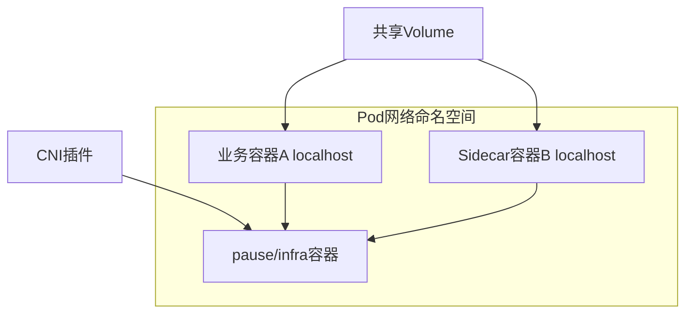

# Pod核心概念与原理

> **领域**：Kubernetes ｜ **模块**：Pod ｜ **难度**：入门 ｜ **类型**：基础概念

## 导读

本章系统讲解 **Kubernetes** 中 **Pod** 的相关知识（基础概念）。本章建立 **Pod** 的概念模型与工作原理，是后续专题章节的基础。内容基于主流框架与工程实践撰写，不依赖过时概念堆砌。

## 核心知识

Pod 是 Kubernetes 最小调度单元，是一组共享 Linux 命名空间的容器集合。同一 Pod 内容器共享 **network namespace**（同一 IP、localhost 互通）、可选共享 **IPC** 与 **PID namespace**（enableShareProcessNamespace），并通过 Volume 共享存储。

### 核心知识

**1. Pause 容器与网络命名空间**

Pod 创建时 kubelet 先启动 **pause**（sandbox）容器，持有 network namespace。业务容器通过 `network_mode=container:<pause_id>` 加入该 NS，因此 Pod IP 即 pause 容器在 CNI 插件分配下的地址，生命周期独立于业务容器重启。

**2. 共享存储卷**

Pod spec 中 `volumes` 声明存储，`containers[].volumeMounts` 挂载到相同或不同路径。emptyDir 随 Pod 生灭；PVC 可跨 Pod 但同 Pod 多容器共享一 mount 可实现 sidecar 日志采集。

**3. Sidecar 模式**

主容器处理业务，Sidecar 处理代理（Envoy）、日志（Fluent Bit）、配置热加载等。共享 network NS 使 Sidecar 可 localhost 拦截主容器流量而无需改应用代码。

## 架构与流程

## 技术详解

### 基础理解

Pod 是 Kubernetes 最小调度单元，是一组共享 Linux 命名空间的容器集合。同一 Pod 内容器共享 **network namespace**（同一 IP、localhost 互通）、可选共享 **IPC** 与 **PID namespace**（enableShareProcessNamespace），并通过 Volume 共享存储。

1. 编写 Pod YAML（containers、volumes、resources）
2. kubectl apply → API Server 持久化
3. Scheduler 过滤+打分选 Node
4. kubelet 拉镜像、创 sandbox、挂载卷、启动容器
5. kubelet 上报 status → Endpoints 控制器更新 Service 后端

## 原理与实现

### 工作机制

kubelet 调用 CRI（containerd/CRI-O）创建 PodSandbox → 创建 infra 容器 → 按序启动 containers。liveness/readiness probe 由 kubelet 执行。Pod 状态聚合所有容器状态；RestartPolicy 决定容器退出后行为（Always/OnFailure/Never）。

### 内部实现

API Server 持久化 Pod 至 etcd；Scheduler 绑定 Node；kubelet syncLoop 对账。Pod 无自愈能力，Deployment/StatefulSet 等控制器通过 ReplicaSet 维持期望副本。Downward API 将 metadata 注入环境变量或 volume。

## 操作流程与实践

### 操作流程

1. 编写 Pod YAML（containers、volumes、resources）
2. kubectl apply → API Server 持久化
3. Scheduler 过滤+打分选 Node
4. kubelet 拉镜像、创 sandbox、挂载卷、启动容器
5. kubelet 上报 status → Endpoints 控制器更新 Service 后端

### 配置要点

initContainers 在主容器前顺序执行；terminationGracePeriodSeconds 控制 SIGTERM 宽限期。

## 性能、安全与排查

### 性能优化

单 Pod 多容器共享 CPU/memory limits 的 cgroup；合理设置 requests/limits 避免 noisy neighbor。

### 安全注意

SecurityContext 设定 runAsNonRoot、readOnlyRootFilesystem、capabilities drop；NetworkPolicy 限制 Pod 间流量。

### 常见误区与纠正

**多容器抢同一端口**

共享 network NS 下仅一个进程可 bind 同一端口，需错开端口或通过 Sidecar 代理。

**emptyDir 丢数据**

Pod 删除后 emptyDir 清空，有状态 workload 应使用 PVC 或 StatefulSet。

### 最佳实践

1. 生产环境由 Deployment 管理 Pod，避免裸 Pod
2. 一个 Pod 一个主进程容器是默认最佳实践
3. 为 Pod 设置 label 供 Service selector 使用

## 巩固建议

建议结合 **Kubernetes** 官方文档与小型实验，亲手验证 **Pod** 的默认行为与边界条件；将本章要点整理为检查清单或 ADR，便于评审与团队 onboarding。

### 本章小结

学完本章，你应能独立说明 **Pod** 在 Kubernetes 中的角色，理解其核心机制，规避常见误区，并在项目中正确运用。

## 延伸学习

- Pod的实现机制详解
- Pod的关键技术点
- Pod的源码级分析
- Pod的配置与使用
- Pod的常见问题与解决方案

### 延伸阅读

- Kubernetes 官方文档 - Pod
- CNI 规范
- containerd CRI 设计

---
*章节 ID: 017 ｜ 领域: Kubernetes*