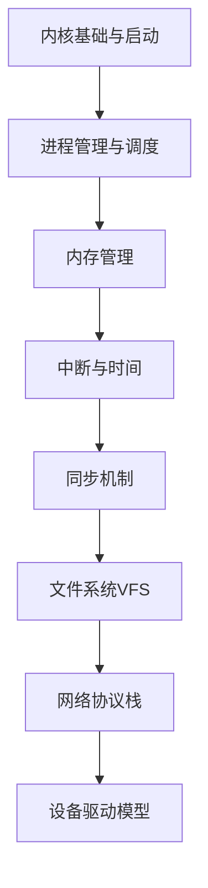

# Linux内核 学习指南

> **分类**：系统底层 ｜ **章节总数**：200 ｜ **技术栈**：Linux 6.x

## 领域概述

Linux内核是系统底层领域的重要技术方向，本系列从基础到高级逐步深入，涵盖10个核心模块：内核基础与启动、进程管理与调度、内存管理、中断与时间、同步机制等。每个知识点作为独立章节，包含原理讲解、实现要点、常见陷阱和最佳实践，配合源码分析和架构图，帮助读者建立完整的Linux内核知识体系。

本教程基于 **C** 与 **Linux 6.x** 生态编写，涵盖 kprobe, ftrace, perf 等主流工具与框架。每章独立成篇，文字精炼、逻辑清晰，适合系统学习与按需查阅。

## 你将学到什么

完成本系列后，你将能够：

- 系统理解 **Linux内核** 的核心概念与模块划分。
- 按难度递进掌握从入门到实战的完整知识路径。
- 在工程实践中做出合理的技术判断与问题排查。
- 通过章节索引快速定位所需知识点。

## 前置知识

- 编程基础
- 数据结构
- 计算机基础
- 系统底层基础概念

## 推荐学习路径

1. **内核基础与启动**
2. **进程管理与调度**
3. **内存管理**
4. **中断与时间**
5. **同步机制**
6. **文件系统VFS**
7. **网络协议栈**
8. **设备驱动模型**

## 模块体系

本领域按以下模块组织，难度由浅入深：

- **内核基础与启动**
- **进程管理与调度**
- **内存管理**
- **中断与时间**
- **同步机制**
- **文件系统VFS**
- **网络协议栈**
- **设备驱动模型**
- **系统调用与IPC**
- **性能调优与追踪**

## 难度分布

| 难度 | 章节数 | 占比 |
|------|--------|------|
| 入门 | 40 | 20% |
| 实战 | 40 | 20% |
| 进阶 | 60 | 30% |
| 高级 | 60 | 30% |

## 章节索引

点击章节标题进入对应教程：

### 内核基础与启动

- [内核基础与启动核心概念与原理](chapters/001-内核基础与启动核心概念与原理.md) ｜ 入门
- [内核基础与启动的实现机制详解](chapters/002-内核基础与启动的实现机制详解.md) ｜ 入门
- [内核基础与启动的关键技术点](chapters/003-内核基础与启动的关键技术点.md) ｜ 入门
- [内核基础与启动的源码级分析](chapters/004-内核基础与启动的源码级分析.md) ｜ 入门
- [内核基础与启动的配置与使用](chapters/005-内核基础与启动的配置与使用.md) ｜ 入门
- [内核基础与启动的常见问题与解决方案](chapters/006-内核基础与启动的常见问题与解决方案.md) ｜ 入门
- [内核基础与启动的性能优化技巧](chapters/007-内核基础与启动的性能优化技巧.md) ｜ 入门
- [内核基础与启动的最佳实践指南](chapters/008-内核基础与启动的最佳实践指南.md) ｜ 入门
- [内核基础与启动的高级应用场景](chapters/009-内核基础与启动的高级应用场景.md) ｜ 入门
- [内核基础与启动的实战案例分析](chapters/010-内核基础与启动的实战案例分析.md) ｜ 入门
- [内核基础与启动的设计思想与演进](chapters/011-内核基础与启动的设计思想与演进.md) ｜ 入门
- [内核基础与启动的底层原理剖析](chapters/012-内核基础与启动的底层原理剖析.md) ｜ 入门
- [内核基础与启动的调试与排错](chapters/013-内核基础与启动的调试与排错.md) ｜ 入门
- [内核基础与启动的安全注意事项](chapters/014-内核基础与启动的安全注意事项.md) ｜ 入门
- [内核基础与启动的对比与选型](chapters/015-内核基础与启动的对比与选型.md) ｜ 入门
- [深入理解：内核基础与启动在Linux内核中的应用](chapters/016-深入理解：内核基础与启动在Linux内核中的应用.md) ｜ 入门
- [实战指南：内核基础与启动在Linux内核中的应用](chapters/017-实战指南：内核基础与启动在Linux内核中的应用.md) ｜ 入门
- [原理剖析：内核基础与启动在Linux内核中的应用](chapters/018-原理剖析：内核基础与启动在Linux内核中的应用.md) ｜ 入门
- [性能调优：内核基础与启动在Linux内核中的应用](chapters/019-性能调优：内核基础与启动在Linux内核中的应用.md) ｜ 入门
- [源码解读：内核基础与启动在Linux内核中的应用](chapters/020-源码解读：内核基础与启动在Linux内核中的应用.md) ｜ 入门

### 进程管理与调度

- [进程管理与调度核心概念与原理](chapters/021-进程管理与调度核心概念与原理.md) ｜ 入门
- [进程管理与调度的实现机制详解](chapters/022-进程管理与调度的实现机制详解.md) ｜ 入门
- [进程管理与调度的关键技术点](chapters/023-进程管理与调度的关键技术点.md) ｜ 入门
- [进程管理与调度的源码级分析](chapters/024-进程管理与调度的源码级分析.md) ｜ 入门
- [进程管理与调度的配置与使用](chapters/025-进程管理与调度的配置与使用.md) ｜ 入门
- [进程管理与调度的常见问题与解决方案](chapters/026-进程管理与调度的常见问题与解决方案.md) ｜ 入门
- [进程管理与调度的性能优化技巧](chapters/027-进程管理与调度的性能优化技巧.md) ｜ 入门
- [进程管理与调度的最佳实践指南](chapters/028-进程管理与调度的最佳实践指南.md) ｜ 入门
- [进程管理与调度的高级应用场景](chapters/029-进程管理与调度的高级应用场景.md) ｜ 入门
- [进程管理与调度的实战案例分析](chapters/030-进程管理与调度的实战案例分析.md) ｜ 入门
- [进程管理与调度的设计思想与演进](chapters/031-进程管理与调度的设计思想与演进.md) ｜ 入门
- [进程管理与调度的底层原理剖析](chapters/032-进程管理与调度的底层原理剖析.md) ｜ 入门
- [进程管理与调度的调试与排错](chapters/033-进程管理与调度的调试与排错.md) ｜ 入门
- [进程管理与调度的安全注意事项](chapters/034-进程管理与调度的安全注意事项.md) ｜ 入门
- [进程管理与调度的对比与选型](chapters/035-进程管理与调度的对比与选型.md) ｜ 入门
- [深入理解：进程管理与调度在Linux内核中的应用](chapters/036-深入理解：进程管理与调度在Linux内核中的应用.md) ｜ 入门
- [实战指南：进程管理与调度在Linux内核中的应用](chapters/037-实战指南：进程管理与调度在Linux内核中的应用.md) ｜ 入门
- [原理剖析：进程管理与调度在Linux内核中的应用](chapters/038-原理剖析：进程管理与调度在Linux内核中的应用.md) ｜ 入门
- [性能调优：进程管理与调度在Linux内核中的应用](chapters/039-性能调优：进程管理与调度在Linux内核中的应用.md) ｜ 入门
- [源码解读：进程管理与调度在Linux内核中的应用](chapters/040-源码解读：进程管理与调度在Linux内核中的应用.md) ｜ 入门

### 内存管理

- [内存管理核心概念与原理](chapters/041-内存管理核心概念与原理.md) ｜ 进阶
- [内存管理的实现机制详解](chapters/042-内存管理的实现机制详解.md) ｜ 进阶
- [内存管理的关键技术点](chapters/043-内存管理的关键技术点.md) ｜ 进阶
- [内存管理的源码级分析](chapters/044-内存管理的源码级分析.md) ｜ 进阶
- [内存管理的配置与使用](chapters/045-内存管理的配置与使用.md) ｜ 进阶
- [内存管理的常见问题与解决方案](chapters/046-内存管理的常见问题与解决方案.md) ｜ 进阶
- [内存管理的性能优化技巧](chapters/047-内存管理的性能优化技巧.md) ｜ 进阶
- [内存管理的最佳实践指南](chapters/048-内存管理的最佳实践指南.md) ｜ 进阶
- [内存管理的高级应用场景](chapters/049-内存管理的高级应用场景.md) ｜ 进阶
- [内存管理的实战案例分析](chapters/050-内存管理的实战案例分析.md) ｜ 进阶
- [内存管理的设计思想与演进](chapters/051-内存管理的设计思想与演进.md) ｜ 进阶
- [内存管理的底层原理剖析](chapters/052-内存管理的底层原理剖析.md) ｜ 进阶
- [内存管理的调试与排错](chapters/053-内存管理的调试与排错.md) ｜ 进阶
- [内存管理的安全注意事项](chapters/054-内存管理的安全注意事项.md) ｜ 进阶
- [内存管理的对比与选型](chapters/055-内存管理的对比与选型.md) ｜ 进阶
- [深入理解：内存管理在Linux内核中的应用](chapters/056-深入理解：内存管理在Linux内核中的应用.md) ｜ 进阶
- [实战指南：内存管理在Linux内核中的应用](chapters/057-实战指南：内存管理在Linux内核中的应用.md) ｜ 进阶
- [原理剖析：内存管理在Linux内核中的应用](chapters/058-原理剖析：内存管理在Linux内核中的应用.md) ｜ 进阶
- [性能调优：内存管理在Linux内核中的应用](chapters/059-性能调优：内存管理在Linux内核中的应用.md) ｜ 进阶
- [源码解读：内存管理在Linux内核中的应用](chapters/060-源码解读：内存管理在Linux内核中的应用.md) ｜ 进阶

### 中断与时间

- [中断与时间核心概念与原理](chapters/061-中断与时间核心概念与原理.md) ｜ 进阶
- [中断与时间的实现机制详解](chapters/062-中断与时间的实现机制详解.md) ｜ 进阶
- [中断与时间的关键技术点](chapters/063-中断与时间的关键技术点.md) ｜ 进阶
- [中断与时间的源码级分析](chapters/064-中断与时间的源码级分析.md) ｜ 进阶
- [中断与时间的配置与使用](chapters/065-中断与时间的配置与使用.md) ｜ 进阶
- [中断与时间的常见问题与解决方案](chapters/066-中断与时间的常见问题与解决方案.md) ｜ 进阶
- [中断与时间的性能优化技巧](chapters/067-中断与时间的性能优化技巧.md) ｜ 进阶
- [中断与时间的最佳实践指南](chapters/068-中断与时间的最佳实践指南.md) ｜ 进阶
- [中断与时间的高级应用场景](chapters/069-中断与时间的高级应用场景.md) ｜ 进阶
- [中断与时间的实战案例分析](chapters/070-中断与时间的实战案例分析.md) ｜ 进阶
- [中断与时间的设计思想与演进](chapters/071-中断与时间的设计思想与演进.md) ｜ 进阶
- [中断与时间的底层原理剖析](chapters/072-中断与时间的底层原理剖析.md) ｜ 进阶
- [中断与时间的调试与排错](chapters/073-中断与时间的调试与排错.md) ｜ 进阶
- [中断与时间的安全注意事项](chapters/074-中断与时间的安全注意事项.md) ｜ 进阶
- [中断与时间的对比与选型](chapters/075-中断与时间的对比与选型.md) ｜ 进阶
- [深入理解：中断与时间在Linux内核中的应用](chapters/076-深入理解：中断与时间在Linux内核中的应用.md) ｜ 进阶
- [实战指南：中断与时间在Linux内核中的应用](chapters/077-实战指南：中断与时间在Linux内核中的应用.md) ｜ 进阶
- [原理剖析：中断与时间在Linux内核中的应用](chapters/078-原理剖析：中断与时间在Linux内核中的应用.md) ｜ 进阶
- [性能调优：中断与时间在Linux内核中的应用](chapters/079-性能调优：中断与时间在Linux内核中的应用.md) ｜ 进阶
- [源码解读：中断与时间在Linux内核中的应用](chapters/080-源码解读：中断与时间在Linux内核中的应用.md) ｜ 进阶

### 同步机制

- [同步机制核心概念与原理](chapters/081-同步机制核心概念与原理.md) ｜ 进阶
- [同步机制的实现机制详解](chapters/082-同步机制的实现机制详解.md) ｜ 进阶
- [同步机制的关键技术点](chapters/083-同步机制的关键技术点.md) ｜ 进阶
- [同步机制的源码级分析](chapters/084-同步机制的源码级分析.md) ｜ 进阶
- [同步机制的配置与使用](chapters/085-同步机制的配置与使用.md) ｜ 进阶
- [同步机制的常见问题与解决方案](chapters/086-同步机制的常见问题与解决方案.md) ｜ 进阶
- [同步机制的性能优化技巧](chapters/087-同步机制的性能优化技巧.md) ｜ 进阶
- [同步机制的最佳实践指南](chapters/088-同步机制的最佳实践指南.md) ｜ 进阶
- [同步机制的高级应用场景](chapters/089-同步机制的高级应用场景.md) ｜ 进阶
- [同步机制的实战案例分析](chapters/090-同步机制的实战案例分析.md) ｜ 进阶
- [同步机制的设计思想与演进](chapters/091-同步机制的设计思想与演进.md) ｜ 进阶
- [同步机制的底层原理剖析](chapters/092-同步机制的底层原理剖析.md) ｜ 进阶
- [同步机制的调试与排错](chapters/093-同步机制的调试与排错.md) ｜ 进阶
- [同步机制的安全注意事项](chapters/094-同步机制的安全注意事项.md) ｜ 进阶
- [同步机制的对比与选型](chapters/095-同步机制的对比与选型.md) ｜ 进阶
- [深入理解：同步机制在Linux内核中的应用](chapters/096-深入理解：同步机制在Linux内核中的应用.md) ｜ 进阶
- [实战指南：同步机制在Linux内核中的应用](chapters/097-实战指南：同步机制在Linux内核中的应用.md) ｜ 进阶
- [原理剖析：同步机制在Linux内核中的应用](chapters/098-原理剖析：同步机制在Linux内核中的应用.md) ｜ 进阶
- [性能调优：同步机制在Linux内核中的应用](chapters/099-性能调优：同步机制在Linux内核中的应用.md) ｜ 进阶
- [源码解读：同步机制在Linux内核中的应用](chapters/100-源码解读：同步机制在Linux内核中的应用.md) ｜ 进阶

### 文件系统VFS

- [文件系统VFS核心概念与原理](chapters/101-文件系统VFS核心概念与原理.md) ｜ 高级
- [文件系统VFS的实现机制详解](chapters/102-文件系统VFS的实现机制详解.md) ｜ 高级
- [文件系统VFS的关键技术点](chapters/103-文件系统VFS的关键技术点.md) ｜ 高级
- [文件系统VFS的源码级分析](chapters/104-文件系统VFS的源码级分析.md) ｜ 高级
- [文件系统VFS的配置与使用](chapters/105-文件系统VFS的配置与使用.md) ｜ 高级
- [文件系统VFS的常见问题与解决方案](chapters/106-文件系统VFS的常见问题与解决方案.md) ｜ 高级
- [文件系统VFS的性能优化技巧](chapters/107-文件系统VFS的性能优化技巧.md) ｜ 高级
- [文件系统VFS的最佳实践指南](chapters/108-文件系统VFS的最佳实践指南.md) ｜ 高级
- [文件系统VFS的高级应用场景](chapters/109-文件系统VFS的高级应用场景.md) ｜ 高级
- [文件系统VFS的实战案例分析](chapters/110-文件系统VFS的实战案例分析.md) ｜ 高级
- [文件系统VFS的设计思想与演进](chapters/111-文件系统VFS的设计思想与演进.md) ｜ 高级
- [文件系统VFS的底层原理剖析](chapters/112-文件系统VFS的底层原理剖析.md) ｜ 高级
- [文件系统VFS的调试与排错](chapters/113-文件系统VFS的调试与排错.md) ｜ 高级
- [文件系统VFS的安全注意事项](chapters/114-文件系统VFS的安全注意事项.md) ｜ 高级
- [文件系统VFS的对比与选型](chapters/115-文件系统VFS的对比与选型.md) ｜ 高级
- [深入理解：文件系统VFS在Linux内核中的应用](chapters/116-深入理解：文件系统VFS在Linux内核中的应用.md) ｜ 高级
- [实战指南：文件系统VFS在Linux内核中的应用](chapters/117-实战指南：文件系统VFS在Linux内核中的应用.md) ｜ 高级
- [原理剖析：文件系统VFS在Linux内核中的应用](chapters/118-原理剖析：文件系统VFS在Linux内核中的应用.md) ｜ 高级
- [性能调优：文件系统VFS在Linux内核中的应用](chapters/119-性能调优：文件系统VFS在Linux内核中的应用.md) ｜ 高级
- [源码解读：文件系统VFS在Linux内核中的应用](chapters/120-源码解读：文件系统VFS在Linux内核中的应用.md) ｜ 高级

### 网络协议栈

- [网络协议栈核心概念与原理](chapters/121-网络协议栈核心概念与原理.md) ｜ 高级
- [网络协议栈的实现机制详解](chapters/122-网络协议栈的实现机制详解.md) ｜ 高级
- [网络协议栈的关键技术点](chapters/123-网络协议栈的关键技术点.md) ｜ 高级
- [网络协议栈的源码级分析](chapters/124-网络协议栈的源码级分析.md) ｜ 高级
- [网络协议栈的配置与使用](chapters/125-网络协议栈的配置与使用.md) ｜ 高级
- [网络协议栈的常见问题与解决方案](chapters/126-网络协议栈的常见问题与解决方案.md) ｜ 高级
- [网络协议栈的性能优化技巧](chapters/127-网络协议栈的性能优化技巧.md) ｜ 高级
- [网络协议栈的最佳实践指南](chapters/128-网络协议栈的最佳实践指南.md) ｜ 高级
- [网络协议栈的高级应用场景](chapters/129-网络协议栈的高级应用场景.md) ｜ 高级
- [网络协议栈的实战案例分析](chapters/130-网络协议栈的实战案例分析.md) ｜ 高级
- [网络协议栈的设计思想与演进](chapters/131-网络协议栈的设计思想与演进.md) ｜ 高级
- [网络协议栈的底层原理剖析](chapters/132-网络协议栈的底层原理剖析.md) ｜ 高级
- [网络协议栈的调试与排错](chapters/133-网络协议栈的调试与排错.md) ｜ 高级
- [网络协议栈的安全注意事项](chapters/134-网络协议栈的安全注意事项.md) ｜ 高级
- [网络协议栈的对比与选型](chapters/135-网络协议栈的对比与选型.md) ｜ 高级
- [深入理解：网络协议栈在Linux内核中的应用](chapters/136-深入理解：网络协议栈在Linux内核中的应用.md) ｜ 高级
- [实战指南：网络协议栈在Linux内核中的应用](chapters/137-实战指南：网络协议栈在Linux内核中的应用.md) ｜ 高级
- [原理剖析：网络协议栈在Linux内核中的应用](chapters/138-原理剖析：网络协议栈在Linux内核中的应用.md) ｜ 高级
- [性能调优：网络协议栈在Linux内核中的应用](chapters/139-性能调优：网络协议栈在Linux内核中的应用.md) ｜ 高级
- [源码解读：网络协议栈在Linux内核中的应用](chapters/140-源码解读：网络协议栈在Linux内核中的应用.md) ｜ 高级

### 设备驱动模型

- [设备驱动模型核心概念与原理](chapters/141-设备驱动模型核心概念与原理.md) ｜ 高级
- [设备驱动模型的实现机制详解](chapters/142-设备驱动模型的实现机制详解.md) ｜ 高级
- [设备驱动模型的关键技术点](chapters/143-设备驱动模型的关键技术点.md) ｜ 高级
- [设备驱动模型的源码级分析](chapters/144-设备驱动模型的源码级分析.md) ｜ 高级
- [设备驱动模型的配置与使用](chapters/145-设备驱动模型的配置与使用.md) ｜ 高级
- [设备驱动模型的常见问题与解决方案](chapters/146-设备驱动模型的常见问题与解决方案.md) ｜ 高级
- [设备驱动模型的性能优化技巧](chapters/147-设备驱动模型的性能优化技巧.md) ｜ 高级
- [设备驱动模型的最佳实践指南](chapters/148-设备驱动模型的最佳实践指南.md) ｜ 高级
- [设备驱动模型的高级应用场景](chapters/149-设备驱动模型的高级应用场景.md) ｜ 高级
- [设备驱动模型的实战案例分析](chapters/150-设备驱动模型的实战案例分析.md) ｜ 高级
- [设备驱动模型的设计思想与演进](chapters/151-设备驱动模型的设计思想与演进.md) ｜ 高级
- [设备驱动模型的底层原理剖析](chapters/152-设备驱动模型的底层原理剖析.md) ｜ 高级
- [设备驱动模型的调试与排错](chapters/153-设备驱动模型的调试与排错.md) ｜ 高级
- [设备驱动模型的安全注意事项](chapters/154-设备驱动模型的安全注意事项.md) ｜ 高级
- [设备驱动模型的对比与选型](chapters/155-设备驱动模型的对比与选型.md) ｜ 高级
- [深入理解：设备驱动模型在Linux内核中的应用](chapters/156-深入理解：设备驱动模型在Linux内核中的应用.md) ｜ 高级
- [实战指南：设备驱动模型在Linux内核中的应用](chapters/157-实战指南：设备驱动模型在Linux内核中的应用.md) ｜ 高级
- [原理剖析：设备驱动模型在Linux内核中的应用](chapters/158-原理剖析：设备驱动模型在Linux内核中的应用.md) ｜ 高级
- [性能调优：设备驱动模型在Linux内核中的应用](chapters/159-性能调优：设备驱动模型在Linux内核中的应用.md) ｜ 高级
- [源码解读：设备驱动模型在Linux内核中的应用](chapters/160-源码解读：设备驱动模型在Linux内核中的应用.md) ｜ 高级

### 系统调用与IPC

- [系统调用与IPC核心概念与原理](chapters/161-系统调用与IPC核心概念与原理.md) ｜ 实战
- [系统调用与IPC的实现机制详解](chapters/162-系统调用与IPC的实现机制详解.md) ｜ 实战
- [系统调用与IPC的关键技术点](chapters/163-系统调用与IPC的关键技术点.md) ｜ 实战
- [系统调用与IPC的源码级分析](chapters/164-系统调用与IPC的源码级分析.md) ｜ 实战
- [系统调用与IPC的配置与使用](chapters/165-系统调用与IPC的配置与使用.md) ｜ 实战
- [系统调用与IPC的常见问题与解决方案](chapters/166-系统调用与IPC的常见问题与解决方案.md) ｜ 实战
- [系统调用与IPC的性能优化技巧](chapters/167-系统调用与IPC的性能优化技巧.md) ｜ 实战
- [系统调用与IPC的最佳实践指南](chapters/168-系统调用与IPC的最佳实践指南.md) ｜ 实战
- [系统调用与IPC的高级应用场景](chapters/169-系统调用与IPC的高级应用场景.md) ｜ 实战
- [系统调用与IPC的实战案例分析](chapters/170-系统调用与IPC的实战案例分析.md) ｜ 实战
- [系统调用与IPC的设计思想与演进](chapters/171-系统调用与IPC的设计思想与演进.md) ｜ 实战
- [系统调用与IPC的底层原理剖析](chapters/172-系统调用与IPC的底层原理剖析.md) ｜ 实战
- [系统调用与IPC的调试与排错](chapters/173-系统调用与IPC的调试与排错.md) ｜ 实战
- [系统调用与IPC的安全注意事项](chapters/174-系统调用与IPC的安全注意事项.md) ｜ 实战
- [系统调用与IPC的对比与选型](chapters/175-系统调用与IPC的对比与选型.md) ｜ 实战
- [深入理解：系统调用与IPC在Linux内核中的应用](chapters/176-深入理解：系统调用与IPC在Linux内核中的应用.md) ｜ 实战
- [实战指南：系统调用与IPC在Linux内核中的应用](chapters/177-实战指南：系统调用与IPC在Linux内核中的应用.md) ｜ 实战
- [原理剖析：系统调用与IPC在Linux内核中的应用](chapters/178-原理剖析：系统调用与IPC在Linux内核中的应用.md) ｜ 实战
- [性能调优：系统调用与IPC在Linux内核中的应用](chapters/179-性能调优：系统调用与IPC在Linux内核中的应用.md) ｜ 实战
- [源码解读：系统调用与IPC在Linux内核中的应用](chapters/180-源码解读：系统调用与IPC在Linux内核中的应用.md) ｜ 实战

### 性能调优与追踪

- [性能调优与追踪核心概念与原理](chapters/181-性能调优与追踪核心概念与原理.md) ｜ 实战
- [性能调优与追踪的实现机制详解](chapters/182-性能调优与追踪的实现机制详解.md) ｜ 实战
- [性能调优与追踪的关键技术点](chapters/183-性能调优与追踪的关键技术点.md) ｜ 实战
- [性能调优与追踪的源码级分析](chapters/184-性能调优与追踪的源码级分析.md) ｜ 实战
- [性能调优与追踪的配置与使用](chapters/185-性能调优与追踪的配置与使用.md) ｜ 实战
- [性能调优与追踪的常见问题与解决方案](chapters/186-性能调优与追踪的常见问题与解决方案.md) ｜ 实战
- [性能调优与追踪的性能优化技巧](chapters/187-性能调优与追踪的性能优化技巧.md) ｜ 实战
- [性能调优与追踪的最佳实践指南](chapters/188-性能调优与追踪的最佳实践指南.md) ｜ 实战
- [性能调优与追踪的高级应用场景](chapters/189-性能调优与追踪的高级应用场景.md) ｜ 实战
- [性能调优与追踪的实战案例分析](chapters/190-性能调优与追踪的实战案例分析.md) ｜ 实战
- [性能调优与追踪的设计思想与演进](chapters/191-性能调优与追踪的设计思想与演进.md) ｜ 实战
- [性能调优与追踪的底层原理剖析](chapters/192-性能调优与追踪的底层原理剖析.md) ｜ 实战
- [性能调优与追踪的调试与排错](chapters/193-性能调优与追踪的调试与排错.md) ｜ 实战
- [性能调优与追踪的安全注意事项](chapters/194-性能调优与追踪的安全注意事项.md) ｜ 实战
- [性能调优与追踪的对比与选型](chapters/195-性能调优与追踪的对比与选型.md) ｜ 实战
- [深入理解：性能调优与追踪在Linux内核中的应用](chapters/196-深入理解：性能调优与追踪在Linux内核中的应用.md) ｜ 实战
- [实战指南：性能调优与追踪在Linux内核中的应用](chapters/197-实战指南：性能调优与追踪在Linux内核中的应用.md) ｜ 实战
- [原理剖析：性能调优与追踪在Linux内核中的应用](chapters/198-原理剖析：性能调优与追踪在Linux内核中的应用.md) ｜ 实战
- [性能调优：性能调优与追踪在Linux内核中的应用](chapters/199-性能调优：性能调优与追踪在Linux内核中的应用.md) ｜ 实战
- [源码解读：性能调优与追踪在Linux内核中的应用](chapters/200-源码解读：性能调优与追踪在Linux内核中的应用.md) ｜ 实战

## 学习方法建议

1. **先读概述再读章节**：用本指南建立全局地图，避免迷失在细节中。
2. **按模块递进**：同一模块内章节有前后关联，顺序阅读效果更好。
3. **主动复述**：每章读完后，用三五句话概括「是什么、为什么、怎么用」。
4. **关联阅读**：利用章节底部的「延伸学习」在同模块内构建知识网络。
5. **对照官方文档**：本教程提供结构化视角，细节以官方文档为准。

---
*领域: Linux内核 ｜ 版本: 2.0 ｜ 共 200 章*