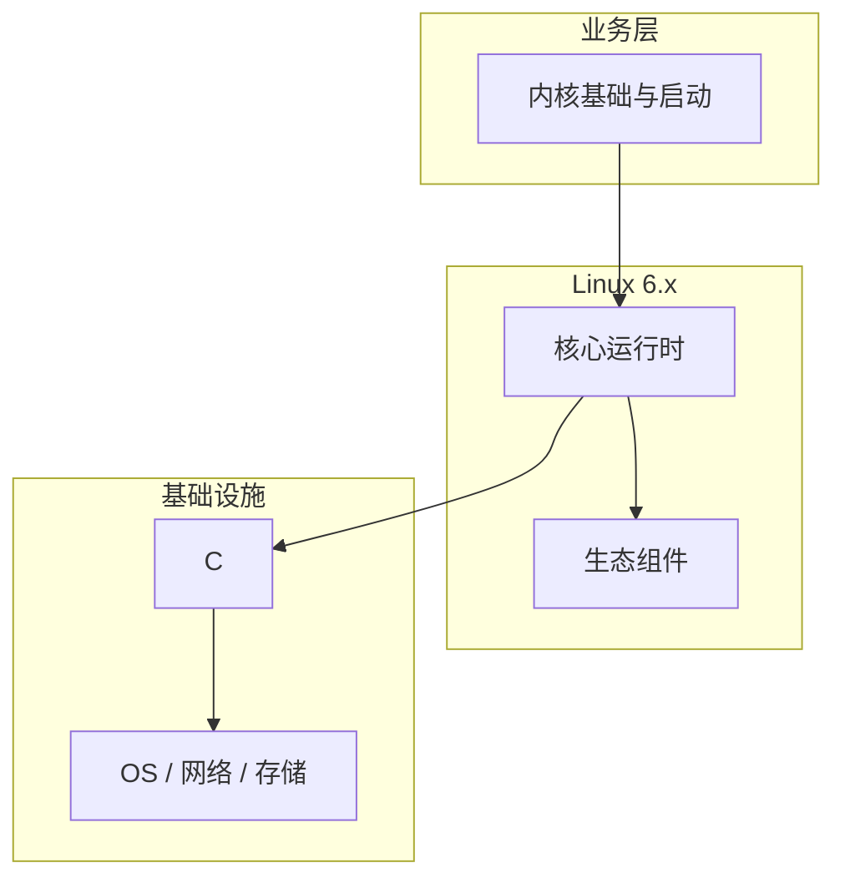

# 内核基础与启动的关键技术点

> **领域**：Linux内核 ｜ **模块**：内核基础与启动 ｜ **难度**：入门 ｜ **类型**：关键技术

## 导读

本章系统讲解 **Linux内核** 中 **内核基础与启动** 的相关知识（关键技术）。本章归纳 **内核基础与启动** 在生产环境中最常用、最易出错的关键技术点。内容基于主流框架与工程实践撰写，不依赖过时概念堆砌。

## 核心知识

Linux 内核是操作系统核心，负责硬件抽象、资源调度与安全隔离。启动链从固件移交控制权，经 GRUB 加载 vmlinuz 与 initramfs，完成子系统初始化后启动用户态 init。

### 核心知识

**1. start_kernel**

依次初始化内存、调度器、中断、VFS；kernel_init 线程最后 exec 用户空间 init 进程。

**2. 内核镜像**

vmlinuz 含压缩内核与解压桩；initramfs 提供早期用户态工具，在挂载真实根分区前加载必要驱动。

**3. boot_params**

GRUB 通过 cmdline 传入 root=、init= 等参数，内核 setup_arch 解析并影响设备枚举与调度策略。

**4. 设备树/ACPI**

ARM 用 DTB 描述硬件拓扑；x86 通过 ACPI 表获取 CPU、中断与电源管理信息。

## 架构与流程

## 技术详解

### 关键技术

排障时编辑 GRUB cmdline 加 init=/bin/sh；dmesg 查看驱动加载；dracut 重建 initramfs 补全 virtio 等驱动。

## 原理与实现

### 工作机制

BIOS/UEFI POST 后 GRUB 加载内核→setup_arch 架构初始化→mm_init 建立页表→trap_init 设置 IDT→各 initcall 注册驱动→挂载根文件系统→执行 /sbin/init。

### 内部实现

早期用 memblock 分配器，伙伴系统就绪后释放 bootmem。initramfs 由 cpio 解压至 rootfs，switch_root 切换到真实根。

## 操作流程与实践

### 操作流程

排障时编辑 GRUB cmdline 加 init=/bin/sh；dmesg 查看驱动加载；dracut 重建 initramfs 补全 virtio 等驱动。

### 配置要点

GRUB /etc/default/grub 设置 GRUB_CMDLINE_LINUX；make menuconfig 定制内核功能与 LOCALVERSION。

## 性能、安全与排查

### 性能优化

精简 initramfs 缩短启动；systemd-analyze blame 定位慢单元；nohz_full 减少空闲 CPU tick 干扰。

### 安全注意

Secure Boot 校验内核签名；lockdown 限制 /dev/mem；IMA/EVM 可度量启动链完整性。

### 调试排错

console=ttyS0 串口日志；initcall_debug 打印各 initcall 耗时；earlyprintk 调试极早阶段。

## 案例与选型

### 案例复盘

云主机换内核后无法启动：initramfs 缺 virtio_blk，dracut --force 重建后恢复。

### 方案对比

SysV init 串行脚本 vs systemd 并行单元依赖，后者显著缩短启动时间。

## 本章聚焦

**内核基础与启动** 的关键技术往往集中在默认配置与边界行为；生产问题多源于「以为懂了」的细节，应用 checklist 逐项验证。

### 常见误区与纠正

**initramfs 过旧**

内核升级后未 dracut --force，根文件系统驱动缺失导致 mount failed。

**cmdline 遗留排障参数**

nomodeset、acpi=off 等参数遗留在生产环境引发性能退化。

**内核模块版本不匹配**

uname -r 与 /lib/modules 不一致导致 insmod invalid module format。

### 最佳实践

1. 升级内核后重建 initramfs 并保留回退条目
2. cmdline 纳入配置管理
3. 阅读 kernel-parameters.txt 再改参数
4. 用 systemd-analyze 量化启动

## 巩固建议

建议结合 **Linux内核** 官方文档与小型实验，亲手验证 **内核基础与启动** 的默认行为与边界条件；将本章要点整理为检查清单或 ADR，便于评审与团队 onboarding。

### 本章小结

学完本章，你应能独立说明 **内核基础与启动** 在 Linux内核 中的角色，理解其核心机制，规避常见误区，并在项目中正确运用。

## 延伸学习

- 内核基础与启动核心概念与原理
- 内核基础与启动的实现机制详解
- 内核基础与启动的源码级分析
- 内核基础与启动的配置与使用
- 内核基础与启动的常见问题与解决方案

### 延伸阅读

- Linux Kernel Documentation: admin-guide/boot.rst
- GRUB Manual
- dracut 官方文档

---
*章节 ID: 003 ｜ 领域: Linux内核*