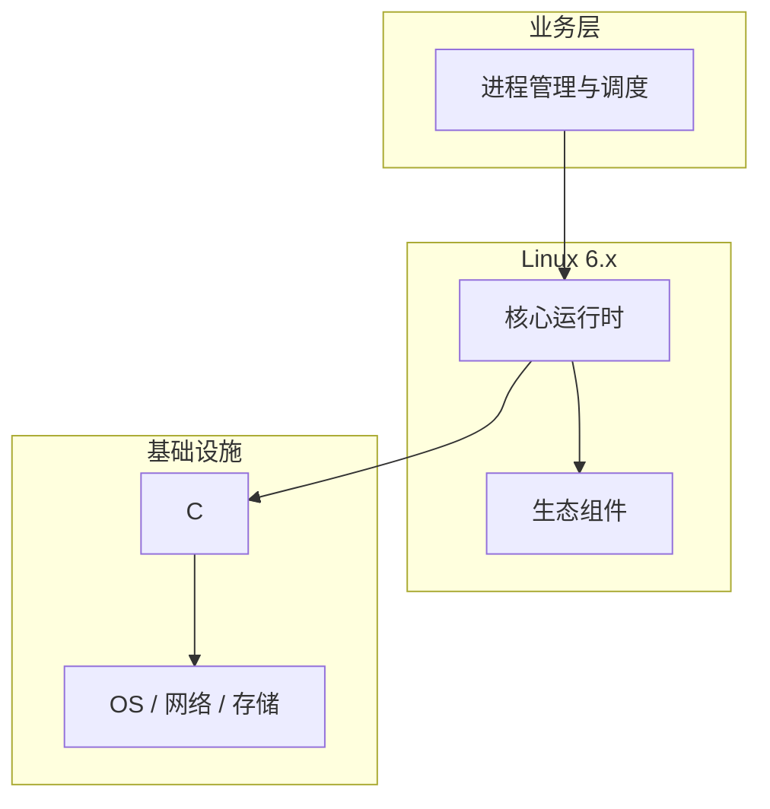

# 进程管理与调度的源码级分析

> **领域**：Linux内核 ｜ **模块**：进程管理与调度 ｜ **难度**：入门 ｜ **类型**：源码分析

## 导读

本章系统讲解 **Linux内核** 中 **进程管理与调度** 的相关知识（源码分析）。本章沿源码与调用链剖析 **进程管理与调度** 的实现，适合需要排障或二次开发的读者。内容基于主流框架与工程实践撰写，不依赖过时概念堆砌。

## 核心知识

进程是资源分配单位，线程是调度单位。Linux 用 task_struct 描述任务，CFS 按虚拟运行时间 vruntime 公平分配 CPU，上下文切换保存寄存器与内核栈。

### 核心知识

**1. 进程状态**

TASK_RUNNING、INTERRUPTIBLE、UNINTERRUPTIBLE；僵尸 EXIT_ZOMBIE 需父进程 wait 回收。

**2. task_struct**

进程控制块，含 pid、状态、调度类、mm_struct 内存描述符、文件表与信号处理信息。

**3. CFS 调度器**

红黑树按 vruntime 排序；nice 映射权重，高优先级任务获更多 CPU 份额。

**4. 上下文切换**

switch_to 保存/恢复寄存器；涉及 TLB 刷新与 cache 失效，有可观开销。

## 架构与流程

## 技术详解

### 源码与实现

每 tick 或抢占点检查 need_resched，pick_next_task 从 CFS 红黑树取 vruntime 最小者；SCHED_FIFO/RR 实时类优先于 CFS。

## 原理与实现

### 工作机制

每 tick 或抢占点检查 need_resched，pick_next_task 从 CFS 红黑树取 vruntime 最小者；SCHED_FIFO/RR 实时类优先于 CFS。

### 内部实现

schedule() 在 __schedule 切换 prev/next；多核通过 per-CPU runqueue 与负载均衡；写时复制延迟复制物理页。

## 操作流程与实践

### 操作流程

fork/clone 创建进程；sched_setscheduler 设策略；ps/top 监控；taskset 绑核；cgroups cpu.max 限配额。

### 配置要点

sysctl kernel.sched_*；cgroup v2 cpu.weight、cpu.max；sched_rt_runtime_us 限制 RT 带宽。

## 性能、安全与排查

### 性能优化

线程数宜与 CPU 核数匹配；减少不必要切换；CPU 密集与 I/O 密集任务分池避免 cache 颠簸。

### 安全注意

PR_SET_NO_NEW_PRIVS 与 seccomp 限制提权；hidepid 保护 /proc 进程信息；pid namespace 隔离视图。

### 调试排错

perf sched 记录切换；ftrace function_graph 跟踪 schedule；/proc/PID/stack 查 D 状态内核栈。

## 案例与选型

### 案例复盘

订单服务线程从 500 降至核数配合异步 I/O，CPU 利用率降而吞吐升。

### 方案对比

CFS 通用公平；SCHED_DEADLINE 适合周期实时任务；BFS 已退出主线。

## 本章聚焦

源码阅读 **进程管理与调度** 宜采用「由外向内」：先跟一次主路径请求，再展开分支与错误处理，避免陷入细节迷失主线。

### 常见误区与纠正

**线程爆炸**

每请求一线程导致数千 task，切换与内存开销压垮系统。

**僵尸堆积**

父进程未 wait，大量 defunct 占用 pid 槽位。

**D 状态误判**

UNINTERRUPTIBLE 常等磁盘非 CPU 满，盲目加核无效。

### 最佳实践

1. 线程池大小参考核数与阻塞比
2. 处理 SIGCHLD 或 SA_NOCLDWAIT
3. 设 TasksMax 上限
4. 关键任务评估 SCHED_FIFO

## 巩固建议

建议结合 **Linux内核** 官方文档与小型实验，亲手验证 **进程管理与调度** 的默认行为与边界条件；将本章要点整理为检查清单或 ADR，便于评审与团队 onboarding。

### 本章小结

学完本章，你应能独立说明 **进程管理与调度** 在 Linux内核 中的角色，理解其核心机制，规避常见误区，并在项目中正确运用。

## 延伸学习

- 进程管理与调度核心概念与原理
- 进程管理与调度的实现机制详解
- 进程管理与调度的关键技术点
- 进程管理与调度的配置与使用
- 进程管理与调度的常见问题与解决方案

### 延伸阅读

- Linux Kernel: scheduler/sched-design-CFS.rst
- man sched(7), clone(2)
- Brendan Gregg CPU 性能

---
*章节 ID: 024 ｜ 领域: Linux内核*